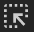

# Проверка сетки CSS  

В этой статье вы можете определить сетки CSS на веб-сайте и отладить проблемы макета сетки с помощью настраиваемых накладок сетки.  

Примеры, используемые в рисунках в этой статье, взяты из следующих веб-страниц.  

*   [Поле "Фрукты"][JecFyiDemoCssGridFruit]  
*   [Снэк-ок][JecFyiDemoCssGridSnack]  

## Перед началом работы  

CSS Grid — это мощная парадигма макета для Интернета.  Отличное место для начала изучения CSS Grid и многих функций — руководство по макету [сетки CSS][MdnCssGridLayout] на MDN.  

## Откройте для себя сетки CSS  

Если элемент HTML на вашей странице имеет или применяется к ней, рядом с ней в панели Elements отображается `display: grid` `display: inline-grid` `grid` значок. [][DevtoolsGuideChromiumOpen]  

:::image type="complex" source="../media/grid-discover-grid.msft.png" alt-text="Откройте сетку" lightbox="../media/grid-discover-grid.msft.png":::
   Откройте сетку  
:::image-end:::  

Выберите значок, чтобы отобразить накладку сетки на странице.  Наложение появляется над элементом, выложенным как сетка, чтобы отобразить положение линий и треков сетки:  

:::image type="complex" source="../media/grid-highlight-grid.msft.png" alt-text="Значок сетки toggle" lightbox="../media/grid-highlight-grid.msft.png":::
   Значок сетки toggle  
:::image-end:::  

Откройте области **макета.**  Когда сетки включены на странице, в области **Макета** содержится раздел **Grid,** содержащий несколько вариантов просмотра сетки.  

:::image type="complex" source="../media/grid-layout-pane.msft.png" alt-text="Области макета" lightbox="../media/grid-layout-pane.msft.png":::
   **Области** макета  
:::image-end:::  

Раздел **Grid** в области **Макет** содержит следующие 2 под раздела.  

*   Параметры отображения наложения  
*   Наложения сетки  

<!--todo: @zoher verify the details for each of the sub-sections.  -->  

## Параметры отображения наложения  

Параметры **отображения overlay состоят** из следующих 2 частей.  

*   Выберите один из следующих вариантов из меню отсев.  
    
    | Параметр Line | Сведения |  
    |:--- |:--- |  
    | **Скрыть метки строки** | Скрыть метки линий для каждой сетки наложения. |  
    | **Показать номера строк** | Отображение номеров линий для каждой сетки наложения \(выбрано по умолчанию\). |  
    | **Показать имена строк** | Отображение имен линий для каждой сетки при условии их наложения. |  
    
*  Выберите контрольный ящик далее следующие параметры.  
    
    | Параметр | Сведения |  
    |:--- |:--- |  
    | **Показать размеры трека**  | Отображение \(или скрыть\) размеров треков. |  
    | **Показать имена области** | Отображение \(или скрыть\) имен области, когда предоставляются имена. |  
    | **Расширение линий сетки** | Отображает \(или скрывает\) расширения размеров сетки вдоль каждой оси.  По умолчанию строки сетки показаны только внутри элемента с набором `display: grid` `display: inline-grid` CSS или на нем. |  
    
В следующих разделах представлены сведения для каждого из **параметров отображения overlay.**  

### Показать номера строк  

По умолчанию на накладке сетки отображаются номера положительных и отрицательных строк.  

Дополнительные сведения о отрицательных номерах в сетке наложения перейдите к размещению на основе [строки с CSS Grid][MdnLineBasedPlacementCssGrid].  

:::image type="complex" source="../media/grid-show-line-numbers.msft.png" alt-text="Отображение номеров строк" lightbox="../media/grid-show-line-numbers.msft.png":::
   Отображение номеров строк  
:::image-end:::  

### Скрыть метки строки  

Выберите **метки hide line,** чтобы скрыть номера строк.  

:::image type="complex" source="../media/grid-hide-line-labels.msft.png" alt-text="Скрыть метки строки" lightbox="../media/grid-hide-line-labels.msft.png":::
   Скрыть метки строки  
:::image-end:::  

### Показать имена строк  

Дополнительные сведения о именах строк в накладке сетки перейдите в [Макет с помощью именных линий сетки.][MdnLayoutUsingNamedGridLines]  

Выберите **имена строк Show,** чтобы просмотреть имена строк, а не числа.  В примере 4 строки имеют имена: `left` `middle1` , и `middle2` `right` .  

<!--In the demo, **orange** element spans from left to right, with `grid-column: left` and `grid-column: right` CSS.  Showing line names makes it easier to visualize the start and end position of the element.  -->  

:::image type="complex" source="../media/grid-show-line-names.msft.png" alt-text="Показать имена строк" lightbox="../media/grid-show-line-names.msft.png":::
   **Показать имена строк**  
:::image-end:::  

### Показать размеры трека  

Включить **контрольный ящик Размеров** трассы Show для просмотра размеров трассы сетки.  

DevTools отображает `[authored size]` и `[computed size]` на каждой метке строки.  

| Size | Сведения |  
|:--- |:--- |  
| **авторский размер** | Размер, определенный в таблице стилей \(опущен, если не определен\). |  
| **вычислительный размер** | Фактический размер на экране. |  

В демонстрации размеры `snack-box` столбцов определяются в `grid-template-columns:1fr 2fr;` CSS.  Поэтому метки строк столбцов отображают как авторские, так и вычислительные размеры.  

| Размер дорожки | Авторский размер | Вычислительный размер |  
|:--- |:--- |:--- |  
| **1fr** &#x2022; **96.66px** | 1fr | 96.66px |  
| **2fr** &#x2022; **193.32px** | 2fr | 193.32px |  

Метки строк отображают только вычисляемые размеры, так как в таблице стилей нет размеров строк.  

| Размер дорожки | Авторский размер | Вычислительный размер |  
|:--- |:--- |:--- |  
| **80px** | &nbsp;| 80px |  
| **80px** | &nbsp;| 80px |  

:::image type="complex" source="../media/grid-show-track-sizes.msft.png" alt-text="Показать размеры трека" lightbox="../media/grid-show-track-sizes.msft.png":::
   **Показать размеры трека**  
:::image-end:::  

### Показать имена области  

Чтобы просмотреть имена области, вкажите почтовый ящик **Имена области** Показать.  В примере в сетке 3 области: **верхняя,** **нижняя и** **нижняя 2.**  

:::image type="complex" source="../media/grid-show-area-names.msft.png" alt-text="Показать имена области" lightbox="../media/grid-show-area-names.msft.png":::
   **Показать имена области**  
:::image-end:::  

### Расширение линий сетки  

**Вдайте контрольный** ящик Extend grid lines для расширения линий сетки до края представления на каждой оси.  

:::image type="complex" source="../media/grid-extend-grid-lines.msft.png" alt-text="Расширение линий сетки" lightbox="../media/grid-extend-grid-lines.msft.png":::
   **Расширение линий сетки**  
:::image-end:::  

## Наложения сетки  

Раздел **Grid overlays** содержит список сетки, которые присутствуют на странице, каждая из которых имеет почтовый ящик, а также различные параметры.  

### Включить представления наложения нескольких сеток  

Чтобы отобразить сетку наложения для нескольких сеток, выберите контрольный ящик рядом с каждым именем сетки.  В примере включено 2 сетки, каждая из которых представлена разными цветами.  

*   `main`  
*   `div.snack-box`  
    
:::image type="complex" source="../media/grid-grid-overlays.msft.png" alt-text="Включить представления наложения нескольких сеток" lightbox="../media/grid-grid-overlays.msft.png":::
   Включить представления наложения нескольких сеток  
:::image-end:::  

### Настройка цвета наложения сетки  

Чтобы открыть выбор цвета и настроить цвет наложения сетки, выберите поле рядом с именем наложения сетки.  

:::image type="complex" source="../media/grid-grid-overlays-color.msft.png" alt-text="Настройка цвета наложения сетки" lightbox="../media/grid-grid-overlays-color.msft.png":::
   Настройка цвета наложения сетки  
:::image-end:::  

### Выделение сетки  

Чтобы выделить элемент HTML в средстве **Elements** и прокрутите его на веб-странице, выберите элемент Show в панели **Elements** \( Элемент Show в значке панели  \) .  

:::image type="complex" source="../media/grid-grid-overlays-highlight.msft.png" alt-text="Выделение сетки" lightbox="../media/grid-grid-overlays-highlight.msft.png":::
   Выделение сетки  
:::image-end:::  

## Взаимодействие с командой средств разработчика Microsoft Edge  

[!INCLUDE [contact DevTools team note](../includes/contact-devtools-team-note.md)]  

<!-- links -->  

[DevtoolsGuideChromiumOpen]: ../open/index.md "Откройте Microsoft Edge DevTools | Документы Майкрософт"  

[JecFyiDemoCssGridFruit]: https://jec.fyi/demo/css-grid-fruit "Сетка CSS | jec.fyi"  
[JecFyiDemoCssGridSnack]: https://jec.fyi/demo/css-grid-snack "Сетка CSS | jec.fyi"  

[MdnCssGridLayout]: https://developer.mozilla.org/docs/Web/CSS/CSS_Grid_Layout "Макет сетки CSS | MDN"  
[MdnLayoutUsingNamedGridLines]: https://developer.mozilla.org/docs/Web/CSS/CSS_Grid_Layout/Layout_using_Named_Grid_Lines "Макет с использованием именных линий сетки | MDN"  
[MdnLineBasedPlacementCssGrid]: https://developer.mozilla.org/docs/Web/CSS/CSS_Grid_Layout/Line-based_Placement_with_CSS_Grid "Размещение на основе строки с CSS Grid | MDN"  

> [!NOTE]
> Некоторые части этой страницы представляют собой измененные материалы, созданные и [предоставленные корпорацией Google][GoogleSitePolicies]. Их использование регулируется условиями, описанными в [лицензии Creative Commons Attribution 4.0 International License][CCA4IL].  
> Исходная страница находится [здесь](https://developers.google.com/web/tools/chrome-devtools/css/grid). Ее автор — [Jecelyn Yeen][JecelynYeen] (Джеслин Йен) \(советник по разработке, Chrome DevTools\).  

[![Лицензия Creative Commons][CCby4Image]][CCA4IL]  
Эта работа предоставляется в рамках международной лицензии [Creative Commons Attribution 4.0 International License][CCA4IL].  

[CCA4IL]: https://creativecommons.org/licenses/by/4.0  
[CCby4Image]: https://i.creativecommons.org/l/by/4.0/88x31.png  
[GoogleSitePolicies]: https://developers.google.com/terms/site-policies  
[JecelynYeen]: https://developers.google.com/web/resources/contributors/jecelynyeen  
