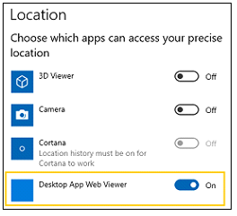

# <span data-ttu-id="4fd10-104">Руководство разработчика Microsoft Edge</span><span class="sxs-lookup"><span data-stu-id="4fd10-104">Microsoft Edge Developer Guide</span></span>

> [!TIP]
> <span data-ttu-id="4fd10-105">Мы сотрудничаем с другими браузерами и веб-сообществом, внедряя веб-документы [MDN](https://developer.mozilla.org/) в качестве точного места для полезной, непреднастояющей документации браузера для текущих и новых веб-технологий на основе стандартов. [](https://blogs.windows.com/msedgedev/2017/10/18/documenting-web-together-mdn-web-docs/)</span><span class="sxs-lookup"><span data-stu-id="4fd10-105">We've [partnered](https://blogs.windows.com/msedgedev/2017/10/18/documenting-web-together-mdn-web-docs/) with other browsers and the web community in adopting [MDN Web Docs](https://developer.mozilla.org/) as the definitive place for useful, unbiased, browser-agnostic documentation for current and emerging standards-based web technologies.</span></span> <span data-ttu-id="4fd10-106">Подробные сведения о поддержке API EdgeHTML можно найти непосредственно на каждой странице библиотеки [веб-ссылок MDN.](https://developer.mozilla.org/docs/Web)</span><span class="sxs-lookup"><span data-stu-id="4fd10-106">You can find details about EdgeHTML API support directly in each page of the [MDN web reference library](https://developer.mozilla.org/docs/Web).</span></span> <span data-ttu-id="4fd10-107">Последние функции, [](https://developer.microsoft.com/microsoft-edge/platform/status/?q=edge%3AShipped%20edge%3APrefixed%20edge%3A'Preview%20Release) поддерживаемые в Microsoft Edge, можно получить в статусе платформы Microsoft Edge.</span><span class="sxs-lookup"><span data-stu-id="4fd10-107">Visit Microsoft Edge's [Platform status](https://developer.microsoft.com/microsoft-edge/platform/status/?q=edge%3AShipped%20edge%3APrefixed%20edge%3A'Preview%20Release) for the latest features supported in Microsoft Edge.</span></span> 

## <span data-ttu-id="4fd10-108">Новые возможности EdgeHTML 18</span><span class="sxs-lookup"><span data-stu-id="4fd10-108">What's new in EdgeHTML 18</span></span>

<span data-ttu-id="4fd10-109">EdgeHTML 18 включает следующие новые и обновленные функции, включенные в текущий выпуск платформы Microsoft Edge с обновлением Windows 10 за октябрь 2018 г. (сборка 17763, 10 октября [2018](/windows/uwp/whats-new/windows-10-build-17763) г.).</span><span class="sxs-lookup"><span data-stu-id="4fd10-109">EdgeHTML 18 includes the following new and updated features shipped in the current release of the Microsoft Edge platform, as of the [Windows 10 October 2018 Update](/windows/uwp/whats-new/windows-10-build-17763) (10/2018, Build 17763).</span></span> <span data-ttu-id="4fd10-110">Изменения в конкретных сборках [Windows Insider](https://insider.windows.com/) Preview см. в записях microsoft [Edge Changelog](https://developer.microsoft.com/microsoft-edge/platform/changelog/) и [What's New in EdgeHTML.](./whats-new.md)</span><span class="sxs-lookup"><span data-stu-id="4fd10-110">For changes in specific [Windows Insider](https://insider.windows.com/) Preview builds, see the [Microsoft Edge Changelog](https://developer.microsoft.com/microsoft-edge/platform/changelog/) and [What's New in EdgeHTML](./whats-new.md).</span></span>

<span data-ttu-id="4fd10-111">Ниже приводится permalink для следующего списка изменений: [https://aka.ms/devguide_edgehtml_18](./whats-new.md) .</span><span class="sxs-lookup"><span data-stu-id="4fd10-111">Here's the permalink for the following list of changes: [https://aka.ms/devguide_edgehtml_18](./whats-new.md).</span></span>

## <span data-ttu-id="4fd10-112">Новые и обновленные функции</span><span class="sxs-lookup"><span data-stu-id="4fd10-112">New and updated features</span></span>

### <span data-ttu-id="4fd10-113">Политики автозапуска</span><span class="sxs-lookup"><span data-stu-id="4fd10-113">Autoplay policies</span></span>

<span data-ttu-id="4fd10-114">С обновлением Windows 10 за октябрь 2018 г. Microsoft Edge предоставляет клиентам возможность персонализировать свои предпочтения браузера на веб-сайтах, которые автоматически воспроизведение мультимедиа со звуком, чтобы свести к минимуму отвлекающие факторы в Интернете и сэкономить пропускную способность.</span><span class="sxs-lookup"><span data-stu-id="4fd10-114">With the Windows 10 October 2018 Update, Microsoft Edge provides customers with the ability to personalize their browsing preferences on websites that autoplay media with sound in order to minimize distractions on the web and conserve bandwidth.</span></span> <span data-ttu-id="4fd10-115">Пользователи могут настраивать поведение мультимедиа с помощью глобальных и индивидуальных элементов управления автоза воспроизведением.</span><span class="sxs-lookup"><span data-stu-id="4fd10-115">Users can customize media behavior with both global and per-site autoplay controls.</span></span> <span data-ttu-id="4fd10-116">Кроме того, Microsoft Edge автоматически подавляет автозапок мультимедиа на фоновых вкладок.</span><span class="sxs-lookup"><span data-stu-id="4fd10-116">Additionally, Microsoft Edge automatically suppresses autoplay of media in background tabs.</span></span>

<span data-ttu-id="4fd10-117">Подробные [сведения](./browser-features/autoplay-policies.md) и практические руководства по обеспечению хорошего взаимодействия с пользователем с мультимедиа, который находится на сайте, можно найти в руководстве по политикам автозахва.</span><span class="sxs-lookup"><span data-stu-id="4fd10-117">Check out the [Autoplay policies](./browser-features/autoplay-policies.md) guide for details and best practices to ensure a good user experience with media hosted on your site.</span></span>

### <span data-ttu-id="4fd10-118">Улучшения для chakra</span><span class="sxs-lookup"><span data-stu-id="4fd10-118">Chakra improvements</span></span>

<span data-ttu-id="4fd10-119">EdgeHTML 18 включает обновления ядра JavaScript для Chakra для поддержки новых функций ES и WASM в дополнение к улучшениям производительности и производительности.</span><span class="sxs-lookup"><span data-stu-id="4fd10-119">EdgeHTML 18 includes updates to the Chakra JavaScript engine to support new ES and WASM features in addition to performance and interoperability improvements.</span></span> <span data-ttu-id="4fd10-120">Подробные сведения можно узнать в заметках о выпуске [ChakraCore 1.11.](https://github.com/Microsoft/ChakraCore/wiki/Roadmap#chakracore-111)</span><span class="sxs-lookup"><span data-stu-id="4fd10-120">Check out the [ChakraCore 1.11 Release Notes](https://github.com/Microsoft/ChakraCore/wiki/Roadmap#chakracore-111) for details.</span></span>

### <span data-ttu-id="4fd10-121">Обновления CSS</span><span class="sxs-lookup"><span data-stu-id="4fd10-121">CSS updates</span></span>

<span data-ttu-id="4fd10-122">Мы добавили дополнительный прогресс в экспериментальной реализации маскировки [CSS](https://developer.mozilla.org/docs/Web/CSS/CSS_Masking) (за флагом "Включить [](https://developer.mozilla.org/docs/Web/CSS/mask-position)маску *CSS"),* а также добавили поддержку композитных масок, [](https://developer.mozilla.org/docs/Web/CSS/mask-composite)положения маски и повторения [маски.](https://developer.mozilla.org/docs/Web/CSS/mask-repeat)</span><span class="sxs-lookup"><span data-stu-id="4fd10-122">We've made further progress on our experimental [CSS Masking](https://developer.mozilla.org/docs/Web/CSS/CSS_Masking) implementation (behind the *Enable CSS Masking* flag) with added support for [mask-composite](https://developer.mozilla.org/docs/Web/CSS/mask-composite), [mask-position](https://developer.mozilla.org/docs/Web/CSS/mask-position), and [mask-repeat](https://developer.mozilla.org/docs/Web/CSS/mask-repeat).</span></span> <span data-ttu-id="4fd10-123">Для обеспечения совместимости сайтов Microsoft Edge также поддерживает следующие свойства *-webkit-properties:* -webkit-mask, -webkit-mask-composite, -webkit-mask-image, -webkit-mask-position, -webkit-mask-position-x, -webkit-mask-position-y, -webkit-mask-repeat, -webkit-mask-size.</span><span class="sxs-lookup"><span data-stu-id="4fd10-123">For site compatibility, Microsoft Edge also supports the following *-webkit-* properties: -webkit-mask, -webkit-mask-composite, -webkit-mask-image, -webkit-mask-position, -webkit-mask-position-x, -webkit-mask-position-y, -webkit-mask-repeat, -webkit-mask-size.</span></span>

<span data-ttu-id="4fd10-124">Кроме того, Microsoft Edge [](https://developer.mozilla.org/docs/Web/CSS/overflow-wrap
) теперь поддерживает переполнение и [](https://developer.mozilla.org/docs/Web/CSS/overscroll-behavior) частичную поддержку поведения переполнения `auto` (и `contain` значений).</span><span class="sxs-lookup"><span data-stu-id="4fd10-124">Additionally, Microsoft Edge now has support for [overflow-wrap](https://developer.mozilla.org/docs/Web/CSS/overflow-wrap
) and partial support for [overscroll-behavior](https://developer.mozilla.org/docs/Web/CSS/overscroll-behavior) (`auto` and `contain` values).</span></span>

### <span data-ttu-id="4fd10-125">Средства разработчика</span><span class="sxs-lookup"><span data-stu-id="4fd10-125">Developer Tools</span></span>

<span data-ttu-id="4fd10-126">Последнее обновление Microsoft Edge DevTools добавляет ряд удобных функций как в пользовательский интерфейс, так и на первый план, включая новые выделенные панели для сотрудников службы и хранилища, средства поиска исходных файлов в отладке, а также новые домены протокола Edge DevTools для отладки стилей и макетов и консольных API.</span><span class="sxs-lookup"><span data-stu-id="4fd10-126">The latest update to Microsoft Edge DevTools adds a number of conveniences both to the UI and under the hood, including new dedicated panels for Service Workers and Storage, source file search tools in the Debugger, and new Edge DevTools Protocol domains for style/layout debugging and console APIs.</span></span>

<span data-ttu-id="4fd10-127">[DevTools в последнем обновлении Windows 10 (EdgeHTML 18)](../devtools-guide/whats-new.md) имеет все сведения.</span><span class="sxs-lookup"><span data-stu-id="4fd10-127">[DevTools in the latest Windows 10 update (EdgeHTML 18)](../devtools-guide/whats-new.md) has all the details.</span></span>

### <span data-ttu-id="4fd10-128">Прослушивание ваших отзывов</span><span class="sxs-lookup"><span data-stu-id="4fd10-128">Listening to your feedback</span></span>

<span data-ttu-id="4fd10-129">Мы прослушиваем ваши отзывы и реализовали поддержку нескольких запрашиваемого API в EdgeHTML 18, включая метод, используемый для настройки пользовательского изображения при перетаскивание, а также свойство API синхронизации ресурсов производительности, которое можно использовать для возврата хронометра непосредственно перед тем, как браузер начнет процесс рукопожатия для защиты текущего [`DataTransfer.setDragImage()`](https://developer.mozilla.org/docs/Web/API/DataTransfer/setDragImage) [`secureConnectionStart`](https://developer.mozilla.org/docs/Web/API/PerformanceResourceTiming/secureConnectionStart) подключения.</span><span class="sxs-lookup"><span data-stu-id="4fd10-129">We listen to your feedback and have implemented support for several requested APIs in EdgeHTML 18, including the [`DataTransfer.setDragImage()`](https://developer.mozilla.org/docs/Web/API/DataTransfer/setDragImage) method used to set a custom image when dragging and dropping, and [`secureConnectionStart`](https://developer.mozilla.org/docs/Web/API/PerformanceResourceTiming/secureConnectionStart), a property of the Performance Resource Timing API, which can be used for returning a timestamp immediately before the browser starts the handshake process to secure the current connection.</span></span> 

<span data-ttu-id="4fd10-130">Кроме того, никто не поддерживает перечисленные атрибуты коллекции, поэтому мы добавили поддержку для возврата имен атрибутов элемента в качестве массива строк, а также для перегона [`Element.getAttributeNames`](https://developer.mozilla.org/docs/Web/API/Element/getAttributeNames) boolean атрибута (удаление, если присутствует [`Element.toggleAttribute`](https://developer.mozilla.org/docs/Web/API/Element/toggleAttribute) и добавление, если нет).</span><span class="sxs-lookup"><span data-stu-id="4fd10-130">In addition, no one likes enumerating the attributes collection, so we've added support for [`Element.getAttributeNames`](https://developer.mozilla.org/docs/Web/API/Element/getAttributeNames) to return the attribute names of the element as an Array of strings, as well as, [`Element.toggleAttribute`](https://developer.mozilla.org/docs/Web/API/Element/toggleAttribute) to toggle a boolean attribute (removing if present and adding if not).</span></span>

### <span data-ttu-id="4fd10-131">Прогрессивные веб-приложения</span><span class="sxs-lookup"><span data-stu-id="4fd10-131">Progressive Web Apps</span></span>

#### <span data-ttu-id="4fd10-132">Фоновый сценарий жизненного времени</span><span class="sxs-lookup"><span data-stu-id="4fd10-132">Lifetime background script</span></span>

<span data-ttu-id="4fd10-133">Приложения JavaScript для Windows 10 \*\* (веб-приложения, запущенные в процессеWWAHost.exe) теперь поддерживают необязательный фоновый сценарий для каждого приложения, который запускается до активации любых представлений и запускается в течение всего процесса.</span><span class="sxs-lookup"><span data-stu-id="4fd10-133">Windows 10 JavaScript apps (web apps running in a *WWAHost.exe* process) now support an optional per-application background script that starts before any views are activated and runs for the duration of the process.</span></span> <span data-ttu-id="4fd10-134">Благодаря этому можно отслеживать и изменять навигацию, отслеживать состояние навигации, отслеживать ошибки навигации и запускать код перед активацией представлений.</span><span class="sxs-lookup"><span data-stu-id="4fd10-134">With this, you can monitor and modify navigations, track state across navigations, monitor navigation errors, and run code before views are activated.</span></span> 

<span data-ttu-id="4fd10-135">Если указано в манифесте приложения, каждое из представлений приложения (windows) предоставляется сценарию как экземпляры нового класса, предоставляя те же события, свойства и методы, что и общее [`StartPage`](/uwp/schemas/appxpackage/appxmanifestschema2010-v2/element-application) [](/uwp/schemas/appxpackage/appx-package-manifest) [`WebUIView`](/uwp/api/windows.ui.webui.webuiview) (Win32) [WebView.](/uwp/api/windows.web.ui.iwebviewcontrol)</span><span class="sxs-lookup"><span data-stu-id="4fd10-135">When specified as the [`StartPage`](/uwp/schemas/appxpackage/appxmanifestschema2010-v2/element-application) in your [app manifest](/uwp/schemas/appxpackage/appx-package-manifest), each of the app's views (windows) are exposed to the script as instances of the new [`WebUIView`](/uwp/api/windows.ui.webui.webuiview) class, providing the same events, properties, and methods as a general (Win32) [WebView](/uwp/api/windows.web.ui.iwebviewcontrol).</span></span> <span data-ttu-id="4fd10-136">Ваш сценарий может прослушивать событие [`NewWebUIViewCreated`](/uwp/api/windows.ui.webui.newwebuiviewcreatedeventargs) для перехвата управления навигацией для нового представления:</span><span class="sxs-lookup"><span data-stu-id="4fd10-136">Your script can listen for the [`NewWebUIViewCreated`](/uwp/api/windows.ui.webui.newwebuiviewcreatedeventargs) event to intercept control of the navigation for a new view:</span></span>

```JavaScript
Windows.UI.WebUI.WebUIApplication.addEventListener("newwebuiviewcreated", newWebUIViewCreatedEventHandler);
```

 <span data-ttu-id="4fd10-137">Любая активация приложения с помощью фонового сценария будет зависеть от самого `StartPage` сценария для навигации.</span><span class="sxs-lookup"><span data-stu-id="4fd10-137">Any app activation with the background script as the `StartPage` will rely on the script itself for navigation.</span></span>

#### <span data-ttu-id="4fd10-138">Масштабирование текста</span><span class="sxs-lookup"><span data-stu-id="4fd10-138">Text scaling</span></span>

<span data-ttu-id="4fd10-139">В обновлении Windows 10 за октябрь [\*\*](/windows/uwp/design/input/text-scaling#user-experience) 2018 г. вводится параметр "Увеличить размер текста" для улучшения доступности конечных пользователей, и pwAs, установленные в Windows (в дополнение к UWP и большинству классических приложений), теперь поддерживают эту функцию автоматически.</span><span class="sxs-lookup"><span data-stu-id="4fd10-139">The Windows 10 October 2018 Update introduces the [*Make text bigger*](/windows/uwp/design/input/text-scaling#user-experience) setting for improved end-user accessibility, and PWAs installed on Windows (in addition UWP and most desktop apps) now support this feature automatically.</span></span> <span data-ttu-id="4fd10-140">Для элементов управления PWAs и WebView текстовое масштабирование работает так же, как и масштабирование DPI.</span><span class="sxs-lookup"><span data-stu-id="4fd10-140">For PWAs and WebView controls, text scale works the same way as DPI scaling.</span></span> <span data-ttu-id="4fd10-141">Если пользователь изменяет и текстовую шкалу, и масштаб DPI, результатом будет продукт этих двух.</span><span class="sxs-lookup"><span data-stu-id="4fd10-141">If a user changes both text scale and DPI scale, the result is the product of the two.</span></span>

 <span data-ttu-id="4fd10-142">Рекомендации по проектированию можно получить в руководстве [по](/windows/uwp/design/input/text-scaling) масштабируемости текста UWP в *Центре разработки для Windows.*</span><span class="sxs-lookup"><span data-stu-id="4fd10-142">For design guidance, check out the [Text scaling](/windows/uwp/design/input/text-scaling) UWP guide on *Windows Dev Center*.</span></span>

### <span data-ttu-id="4fd10-143">Обновления для рабочих служб</span><span class="sxs-lookup"><span data-stu-id="4fd10-143">Service Worker updates</span></span> 

<span data-ttu-id="4fd10-144">Чтобы узнать, что такое сотрудники-службы и как они работают, ознакомьтесь со сводой [API]( https://developer.mozilla.org/docs/Web/API/Service_Worker_API) рабочих служб, написанной нашими партнерами на сайте MDN.</span><span class="sxs-lookup"><span data-stu-id="4fd10-144">For a refresher on what Service Workers are and how they work, check out the [Service Worker API]( https://developer.mozilla.org/docs/Web/API/Service_Worker_API) summary written by our partners over at MDN.</span></span>  <span data-ttu-id="4fd10-145">В EdgeHTML 18 было несколько обновлений для сотрудников служб, поддерживающих Microsoft Edge.</span><span class="sxs-lookup"><span data-stu-id="4fd10-145">There were several updates to Microsoft Edge supporting Service Workers in EdgeHTML 18.</span></span> <span data-ttu-id="4fd10-146">Позволяет сотруднику службы использовать обещание ответа, а также возвращает ИД клиента, который текущий рабочий `fetchEvent` [`preloadResponse`]( https://developer.mozilla.org/docs/Web/API/FetchEvent) [`resultingClientId`]( https://developer.mozilla.org/docs/Web/API/FetchEvent/clientId) службы контролирует.</span><span class="sxs-lookup"><span data-stu-id="4fd10-146">The `fetchEvent` enables the Service Worker to use [`preloadResponse`]( https://developer.mozilla.org/docs/Web/API/FetchEvent) to promise a response, and the [`resultingClientId`]( https://developer.mozilla.org/docs/Web/API/FetchEvent/clientId) to return the ID of the Client that the current service worker is controlling.</span></span>  
<span data-ttu-id="4fd10-147">Интерфейс предоставляет методы для управления предварительной загрузкой ресурсов, что позволяет одновременно делать запрос во время загрузки рабочим процессом службы, избегая [`NavigationPreloadManager`]( https://developer.mozilla.org/docs/Web/API/NavigationPreloadManager) задержки времени.</span><span class="sxs-lookup"><span data-stu-id="4fd10-147">The [`NavigationPreloadManager`]( https://developer.mozilla.org/docs/Web/API/NavigationPreloadManager) interface provides methods for managing the preloading of resources, allowing you to make a request in parallel while a service worker is booting-up, avoiding any time delay.</span></span> <span data-ttu-id="4fd10-148">Ознакомьтесь со списком методов и свойств предварительной загрузки рабочих служб, которые поддерживаются [свойствами API.](#new-apis-in-edgehtml-18)</span><span class="sxs-lookup"><span data-stu-id="4fd10-148">Check out the [newly supported API properties](#new-apis-in-edgehtml-18) for the list of Service Worker preload methods and properties.</span></span> 

### <span data-ttu-id="4fd10-149">Проверка подлинности в Интернете</span><span class="sxs-lookup"><span data-stu-id="4fd10-149">Web Authentication</span></span>

<span data-ttu-id="4fd10-150">Теперь Microsoft Edge включает неподдерживаемую поддержку для нового [API](https://blogs.windows.com/msedgedev/2018/07/30/introducing-web-authentication-microsoft-edge/) веб-проверки подлинности [(например, WebAuthN).](https://w3c.github.io/webauthn/)</span><span class="sxs-lookup"><span data-stu-id="4fd10-150">Microsoft Edge now includes [unprefixed support for the new Web Authentication API](https://blogs.windows.com/msedgedev/2018/07/30/introducing-web-authentication-microsoft-edge/) (aka [WebAuthN](https://w3c.github.io/webauthn/)).</span></span> <span data-ttu-id="4fd10-151">Веб-проверка подлинности предоставляет открытое, масштабируемое и совмещаемое решение для упрощения проверки подлинности, обеспечивая более надежную и безопасную работу пользователей, заменяя пароли более надежными аппаратными учетными данными.</span><span class="sxs-lookup"><span data-stu-id="4fd10-151">Web Authentication provides an open, scalable, and interoperable solution to simplify authentication, enabling better and more secure user experiences by replacing passwords with stronger hardware-bound credentials.</span></span> <span data-ttu-id="4fd10-152">Реализация в Microsoft Edge позволяет [](https://www.microsoft.com/windows/windows-hello) пользователям в дополнение к внешним аутентификаторам, таким [](https://fidoalliance.org) как ключи безопасности FIDO2 или ключи безопасности FIDO U2F, в дополнение к внешним аутентификаторам, таким как ключи безопасности FIDO2 или КЛАВИШи безопасности FIDO U2F, безопасно войти на веб-сайты.</span><span class="sxs-lookup"><span data-stu-id="4fd10-152">The implementation in Microsoft Edge allows the use of [Windows Hello](https://www.microsoft.com/windows/windows-hello) enabling users to sign in with their face, fingerprint, or PIN, in addition to [external authenticators](https://fidoalliance.org) like FIDO2 Security Keys or FIDO U2F Security Keys, to securely authenticate to websites.</span></span>

<span data-ttu-id="4fd10-153">Дополнительные сведения можно найти в записи блога "Знакомство с [веб-проверкой](https://blogs.windows.com/msedgedev/2018/07/30/introducing-web-authentication-microsoft-edge)подлинности в Microsoft Edge".</span><span class="sxs-lookup"><span data-stu-id="4fd10-153">For more information, head over to the blog post [Introducing Web Authentication in Microsoft Edge](https://blogs.windows.com/msedgedev/2018/07/30/introducing-web-authentication-microsoft-edge).</span></span>

### <span data-ttu-id="4fd10-154">WebDriver</span><span class="sxs-lookup"><span data-stu-id="4fd10-154">WebDriver</span></span>

<span data-ttu-id="4fd10-155">WebDriver теперь является функцией [Windows](/windows-hardware/manufacture/desktop/features-on-demand-v2--capabilities) по запросу (FoD), что упрощает автоматизацию тестирования в Microsoft Edge и получения нужной версии для вашего устройства.</span><span class="sxs-lookup"><span data-stu-id="4fd10-155">WebDriver is now a [Windows Feature on Demand](/windows-hardware/manufacture/desktop/features-on-demand-v2--capabilities) (FoD) making it easier than ever to automate testing in Microsoft Edge and get the right version for your device.</span></span> <span data-ttu-id="4fd10-156">При установке [WebDriver](https://www.w3.org/TR/webdriver) вам больше не нужно будет вручную соответствовать сборке, ветвьм и ветвям. Веб-диск будет автоматически обновляться в зависимости от новых обновлений Windows 10.</span><span class="sxs-lookup"><span data-stu-id="4fd10-156">You will no longer need to match the build/branch/flavor manually when installing WebDriver, your [WebDriver](https://www.w3.org/TR/webdriver) will automatically update to match any new Windows 10 updates.</span></span> 

<span data-ttu-id="4fd10-157">Чтобы установить WebDriver, включив режим разработчика, или установить его как автономный, переходить к функциям > Apps > Apps & > Manage optional features.</span><span class="sxs-lookup"><span data-stu-id="4fd10-157">You can install WebDriver by turning on Developer Mode, or install it as a standalone by going to Settings > Apps > Apps & features > Manage optional features.</span></span> <span data-ttu-id="4fd10-158">Дополнительные сведения можно узнать в объявлении [WebDriver на сайте блога Windows.](https://blogs.windows.com/msedgedev/2018/06/14/webdriver-w3c-recommendation-feature-on-demand)</span><span class="sxs-lookup"><span data-stu-id="4fd10-158">For more information, check out the [WebDriver announcement on the Windows Blog site](https://blogs.windows.com/msedgedev/2018/06/14/webdriver-w3c-recommendation-feature-on-demand).</span></span>

### <span data-ttu-id="4fd10-159">Свойства веб-уведомлений</span><span class="sxs-lookup"><span data-stu-id="4fd10-159">Web Notification properties</span></span>
<span data-ttu-id="4fd10-160">Теперь для веб-уведомлений поддерживаются четыре новых свойства: , и , улучшена возможность создания уведомлений в Интернете, совместимых с существующими системами уведомлений, в то же время независимо от [`actions`](https://developer.mozilla.org/docs/Web/API/notification/actions) [`badge`](https://developer.mozilla.org/docs/Web/API/notification/badge) [`image`](https://developer.mozilla.org/docs/Web/API/notification/image) `maxActions` платформы.</span><span class="sxs-lookup"><span data-stu-id="4fd10-160">Four new properties are now supported for web notifications: [`actions`](https://developer.mozilla.org/docs/Web/API/notification/actions), [`badge`](https://developer.mozilla.org/docs/Web/API/notification/badge), [`image`](https://developer.mozilla.org/docs/Web/API/notification/image), and `maxActions`, improving our ability to create notifications on the web that are compatible with existing notification systems, while remaining platform-independent.</span></span>

### <span data-ttu-id="4fd10-161">Веб-представление</span><span class="sxs-lookup"><span data-stu-id="4fd10-161">WebView</span></span>

#### <span data-ttu-id="4fd10-162">Служебные сценарии</span><span class="sxs-lookup"><span data-stu-id="4fd10-162">Service workers</span></span>
<span data-ttu-id="4fd10-163">[Службы](https://developer.mozilla.org/docs/Web/API/Service_Worker_API) теперь поддерживаются в веб-оке управления, в дополнение к браузеру Microsoft Edge и приложениям JavaScript для Windows 10.</span><span class="sxs-lookup"><span data-stu-id="4fd10-163">[Service workers](https://developer.mozilla.org/docs/Web/API/Service_Worker_API) are now supported in the WebView control, in addition to the Microsoft Edge browser and Windows 10 JavaScript apps.</span></span> <span data-ttu-id="4fd10-164">Все варианты веб-приложения Microsoft Edge[(PWA,](../hosting/webview/index.md) [UWP,](/uwp/api/Windows.UI.Xaml.Controls.WebView) [Win32)](/windows/communitytoolkit/controls/wpf-winforms/webview)поддерживают сотрудников службы, однако следует помнить, что [API Push](https://developer.mozilla.org/docs/Web/API/Push_API) еще не доступен для версий UWP и Win32.</span><span class="sxs-lookup"><span data-stu-id="4fd10-164">All flavors of the Microsoft Edge webview ([PWA](../hosting/webview/index.md), [UWP](/uwp/api/Windows.UI.Xaml.Controls.WebView), [Win32](/windows/communitytoolkit/controls/wpf-winforms/webview)) support service workers, however please be aware that the [Push API](https://developer.mozilla.org/docs/Web/API/Push_API) is not yet available for the UWP and Win32 versions.</span></span>

<span data-ttu-id="4fd10-165">Для архитектур приложений x64 требуются нейтральные *пакеты* (любой ЦП) или *пакеты x64,* так как рабочие процессы WoW64 не поддерживаются.</span><span class="sxs-lookup"><span data-stu-id="4fd10-165">x64 app architectures require *Neutral* (Any CPU) or *x64* packages, as service workers are not supported in WoW64 processes.</span></span> <span data-ttu-id="4fd10-166">(Чтобы сэкономить место на диске, версия требуемого DLL WoW не включена в Windows.)</span><span class="sxs-lookup"><span data-stu-id="4fd10-166">(To conserve disk space, the WoW version of the required DLLs are not natively included in Windows.)</span></span>

#### <span data-ttu-id="4fd10-167">Обновления Win32 WebView</span><span class="sxs-lookup"><span data-stu-id="4fd10-167">Win32 WebView updates</span></span>

<span data-ttu-id="4fd10-168">В edgeHTML [WebViewControl](/windows/communitytoolkit/controls/wpf-winforms/webview) для классических приложений Для Windows (Win32) было обновлено несколько новых функций, в том числе возможность внедрять сценарий при загрузке страницы до запуска любых других сценариев на странице ( ) и знать, когда определенный [`AddInitializeScript`](/uwp/api/windows.web.ui.interop.webviewcontrol.addinitializescript) WebViewControl получает или теряет фокус ( [`GotFocus`](/uwp/api/windows.web.ui.interop.webviewcontrol.gotfocus) / [`LostFocus`](/uwp/api/windows.web.ui.interop.webviewcontrol.lostfocus) ).</span><span class="sxs-lookup"><span data-stu-id="4fd10-168">The EdgeHTML [WebViewControl](/windows/communitytoolkit/controls/wpf-winforms/webview) for Windows desktop (Win32) apps has been updated with several new features, including the ability to inject script upon page load before any other scripts on the page are run ([`AddInitializeScript`](/uwp/api/windows.web.ui.interop.webviewcontrol.addinitializescript)) and know when a particular WebViewControl receives or loses focus ([`GotFocus`](/uwp/api/windows.web.ui.interop.webviewcontrol.gotfocus)/[`LostFocus`](/uwp/api/windows.web.ui.interop.webviewcontrol.lostfocus)).</span></span>

<span data-ttu-id="4fd10-169">Кроме того, теперь можно создать новый WebViewControl в качестве открытого [`window.open`](https://developer.mozilla.org/docs/Web/API/Window/open) окна.</span><span class="sxs-lookup"><span data-stu-id="4fd10-169">Additionally, you can now create a new WebViewControl as the opened window from [`window.open`](https://developer.mozilla.org/docs/Web/API/Window/open).</span></span> <span data-ttu-id="4fd10-170">Это событие по-прежнему сообщает приложению, когда сценарий внутри WebViewControl вызывает window.open, как всегда, но с EdgeHTML 18 включает возможность отсрочки ( ) для того, чтобы установить [`NewWindowRequested`](/uwp/api/windows.web.ui.iwebviewcontrol.newwindowrequested) [`NewWindowRequestedEventArgs`](/uwp/api/windows.web.ui.webviewcontrolnewwindowrequestedeventargs) новый WebViewControl ( ) в качестве целевого для [`GetDeferral`](/uwp/api/windows.web.ui.webviewcontrolnewwindowrequestedeventargs.getdeferral) [`NewWindow`](/uwp/api/windows.web.ui.webviewcontrolnewwindowrequestedeventargs.newwindow) window.open:</span><span class="sxs-lookup"><span data-stu-id="4fd10-170">The [`NewWindowRequested`](/uwp/api/windows.web.ui.iwebviewcontrol.newwindowrequested) event still notifies an app when script inside the WebViewControl calls window.open as it always has, but with EdgeHTML 18 its [`NewWindowRequestedEventArgs`](/uwp/api/windows.web.ui.webviewcontrolnewwindowrequestedeventargs) include the ability to take a deferral ([`GetDeferral`](/uwp/api/windows.web.ui.webviewcontrolnewwindowrequestedeventargs.getdeferral)) in order to set a new WebViewControl ([`NewWindow`](/uwp/api/windows.web.ui.webviewcontrolnewwindowrequestedeventargs.newwindow)) as the target for the window.open:</span></span>

```csharp
WebViewControlProcess wvProc;
WebViewControl webView;

void OnWebViewControlNewWindowRequested(WebViewControl sender, WebViewControlNewWindowRequestedEventArgs args)
{

    if (args.Uri.Domain == "mydomain.com")
    {
        using deferral = args.GetDeferral();
        args.NewWindow = await wvProc.CreateWebViewControlAsync(
            parentWindow, targetWebViewBounds);
        deferral.Complete();
    }
    else
    {
        // Prevent WebView from launching in the default browser.
        args.Handled = true;
    }
}

String htmlContent = "<html><script>window.open('http://mydomain.com')</script><body></body></html>";

webView.NavigateToString(htmlContent);
```  

<span data-ttu-id="4fd10-171">Наконец, power users might notice the appearance of the *Desktop App Web Viewer* (previously named *Win32WebViewHost),* an internal system app representing the Win32 WebView, in the following places:</span><span class="sxs-lookup"><span data-stu-id="4fd10-171">Lastly, power users might notice the appearance of the *Desktop App Web Viewer* (previously named *Win32WebViewHost*), an internal system app representing the Win32 WebView, in the following places:</span></span>
- <span data-ttu-id="4fd10-172">В центре *действий Windows 10.*</span><span class="sxs-lookup"><span data-stu-id="4fd10-172">In the *Windows 10 Action Center*.</span></span> <span data-ttu-id="4fd10-173">Источник этих уведомлений должен быть понятен из Веб-просмотр, который был в приложении Win32.</span><span class="sxs-lookup"><span data-stu-id="4fd10-173">The source of these notifications should be understood as from a WebView hosted from a Win32 app.</span></span>
- <span data-ttu-id="4fd10-174">В пользовательском интерфейсе параметров доступа к устройству (*Settings->Privacy->Camera/Location/Microphone).*</span><span class="sxs-lookup"><span data-stu-id="4fd10-174">In the device access settings UI (*Settings->Privacy->Camera/Location/Microphone*).</span></span> <span data-ttu-id="4fd10-175">Отключение любого из этих параметров отключает доступ из всех веб-просмотров, установленных в приложениях Win32.</span><span class="sxs-lookup"><span data-stu-id="4fd10-175">Disabling any of these settings denies access from all WebViews hosted in Win32 apps.</span></span>



## <span data-ttu-id="4fd10-177">Неподготовленные функции</span><span class="sxs-lookup"><span data-stu-id="4fd10-177">Deprecated features</span></span>

### <span data-ttu-id="4fd10-178">Фильтр XSS теперь не замесан</span><span class="sxs-lookup"><span data-stu-id="4fd10-178">XSS Filter now retired</span></span>

<span data-ttu-id="4fd10-179">С помощью EdgeHTML 18 мы удаляем фильтр XSS в Microsoft Edge.</span><span class="sxs-lookup"><span data-stu-id="4fd10-179">With EdgeHTML 18, we are retiring the XSS filter in Microsoft Edge.</span></span> <span data-ttu-id="4fd10-180">Наши клиенты остаются защищенными благодаря современным стандартам, таким как политика безопасности контента [(CSP),](https://developer.mozilla.org/docs/Web/HTTP/CSP)которые предоставляют более мощные, мощные, мощные и безопасные механизмы для защиты от атак путем вливания содержимого с высокой совместимостью в современных браузерах.</span><span class="sxs-lookup"><span data-stu-id="4fd10-180">Our customers remain protected thanks to modern standards like [Content Security Policy (CSP)](https://developer.mozilla.org/docs/Web/HTTP/CSP), which provide more powerful, performant, and secure mechanisms to protect against content injection attacks, with high compatibility across modern browsers.</span></span>

## <span data-ttu-id="4fd10-181">Новые API в EdgeHTML 18</span><span class="sxs-lookup"><span data-stu-id="4fd10-181">New APIs in EdgeHTML 18</span></span>

<span data-ttu-id="4fd10-182">Полный список новых API в EdgeHTML 18.</span><span class="sxs-lookup"><span data-stu-id="4fd10-182">Check out the full list of new APIs in EdgeHTML 18.</span></span> <span data-ttu-id="4fd10-183">Они перечислены в формате [имя интерфейса]. [имя API].</span><span class="sxs-lookup"><span data-stu-id="4fd10-183">They are listed in the format of [interface name].[api name].</span></span>

> [!NOTE] 
> <span data-ttu-id="4fd10-184">Несмотря на то что в модели DOM 2016 2013 2013 2013 2013 2013 2013 2013 2013 2013 2013, возможно, все еще находятся на стадии разработки и скрыты за экспериментальным флагом.</span><span class="sxs-lookup"><span data-stu-id="4fd10-184">Although the following APIs are exposed in the DOM, the end-to-end behavior of some might still be in development and hidden behind an experimental flag.</span></span> <span data-ttu-id="4fd10-185">Официальное слово о поддержке функций можно найти в статусе платформы [Microsoft Edge.](https://developer.microsoft.com/microsoft-edge/platform/status/)</span><span class="sxs-lookup"><span data-stu-id="4fd10-185">Refer to  [Microsoft Edge platform status](https://developer.microsoft.com/microsoft-edge/platform/status/) for the official word on feature support.</span></span>

<iframe height='580' scrolling='no' title='<span data-ttu-id="4fd10-186">Новые API в EdgeHTML 18</span><span class="sxs-lookup"><span data-stu-id="4fd10-186">New APIs in EdgeHTML 18</span></span>' src='//codepen.io/MSEdgeDev/embed/5d7be9404d82575162b486e79d0dd58f
/?height=608&theme-id=23401&default-tab=result&embed-version=2' frameborder='no' allowtransparency='true' allowfullscreen='true' style='width: 100%;'><span data-ttu-id="4fd10-187">См. API-код для новых перьев в <a href='https://codepen.io/MSEdgeDev/pen/5d7be9404d82575162b486e79d0dd58f'> EdgeHTML 18 от </a> MSEdgeDev ( <a href='https://codepen.io/MSEdgeDev'> </a> @MSEdgeDev) на <a href='https://codepen.io'> </a> CodePen.</span><span class="sxs-lookup"><span data-stu-id="4fd10-187">See the Pen <a href='https://codepen.io/MSEdgeDev/pen/5d7be9404d82575162b486e79d0dd58f'>New APIs in EdgeHTML 18</a> by MSEdgeDev (<a href='https://codepen.io/MSEdgeDev'>@MSEdgeDev</a>) on <a href='https://codepen.io'>CodePen</a>.</span></span></iframe>

## <span data-ttu-id="4fd10-188">Предыдущие выпуски EdgeHTML</span><span class="sxs-lookup"><span data-stu-id="4fd10-188">Previous EdgeHTML releases</span></span>

[<span data-ttu-id="4fd10-189">EdgeHTML 13 / Сборка Windows 10586 (11/2015)</span><span class="sxs-lookup"><span data-stu-id="4fd10-189">EdgeHTML 13 / Windows build 10586 (11/2015)</span></span>](./whats-new/edgehtml-13.md)

[<span data-ttu-id="4fd10-190">EdgeHTML 14 / Сборка Windows 14393 (8/2016)</span><span class="sxs-lookup"><span data-stu-id="4fd10-190">EdgeHTML 14 / Windows build 14393 (8/2016)</span></span>](./whats-new/edgehtml-14.md)

[<span data-ttu-id="4fd10-191">EdgeHTML 15 / Сборка Windows 15063 (4/2017)</span><span class="sxs-lookup"><span data-stu-id="4fd10-191">EdgeHTML 15 / Windows build 15063 (4/2017)</span></span>](./whats-new/edgehtml-15.md)

[<span data-ttu-id="4fd10-192">EdgeHTML 16 / Сборка Windows 16299 (10/2017)</span><span class="sxs-lookup"><span data-stu-id="4fd10-192">EdgeHTML 16 / Windows build 16299 (10/2017)</span></span>](./whats-new/edgehtml-16.md)

[<span data-ttu-id="4fd10-193">EdgeHTML 17 / Сборка Windows 17134 (04/2018)</span><span class="sxs-lookup"><span data-stu-id="4fd10-193">EdgeHTML 17 / Windows build 17134 (04/2018)</span></span>](./whats-new/edgehtml-17.md)
