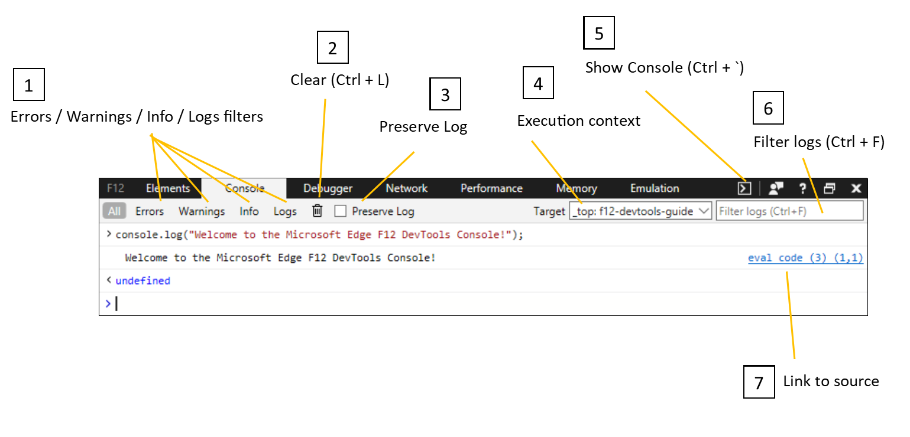

# Консоль

Средство разработчика консоли в Microsoft Edge записи в журнал сведений, связанных с веб-страницей, таких как JavaScript, сетевые запросы и ошибки безопасности. Консоль можно использовать для интерактивной отладки и тестирования. 

Чтобы открыть консоль в Microsoft Edge, нажмите клавишу F12, чтобы открыть окно средства разработчика (или щелкните страницу правой кнопкой мыши и выберите элемент **Inspect).** Затем выберите **вкладку "Консоль"** в верхней части окна. 

Вы также можете использовать консоль для связи с запущенной веб-страницей и из нее. Консоль можно использовать для:

- Публикация [стандартных кодов ошибок и состояния](./console/error-and-status-codes.md) и информационных сообщений при запуске кода.
- Создавать пользовательские журналы отлаки из вызовов [API](./console/console-api.md) консоли, которые вы включаете в свой код.
- Предоставление [командной строки](./console/command-line.md) и интерактивного древовидного представления для проверки текущих возвращаемых значений ключевых переменных и функций.

## Части консоли

На следующем рисунке показаны основные части консоли:

1. **Ошибки**  /  **Предупреждения**  /  **Сведения**  /  **Журнал кнопок:** фильтровать выходные данные консоли по указанному типу. Вы можете выбрать несколько кнопок, удерживая клавишу **CTRL.** Кнопка **"Все"** очищает все фильтры.

2. **Кнопка "Очистить"** **(CTRL+L):** кнопка **"Очистить"** очищает текущий экран консоли.

3. **Сохраняйте** журнал: **** при выборе этого окне выходные данные консоли сохраняются при обновлении страницы, закрытии и повторном закрытии DevTools. История консоли очищается только при закрытии вкладки или при очистке консоли вручную.

4. **Target**: Используйте **целевое** меню для переключения на другой контекст выполнения, например на странице или `<iframe>` в запущенном расширении. По умолчанию выбран кадр верхнего уровня страницы. При наведении курсор на выбранный кадр отображается tooltip, которая отображает полный URL-адрес для этого ресурса.

5. **Показать консоль**  /  **Скрытие** кнопки консоли (**CTRL):** помимо панели консоли можно использовать консоль в нижней части любой другой панели +  **&grave;** DevTools, нажав кнопку **"Показать**консоль скрытие  /  **консоли".** Кнопка не действует, если DevTools открыт на панели консоли.
 
6. **Журналы фильтров** (**CTRL+F).** Вы также можете фильтровать журналы, используя определенную текстовую строку в поле поиска.

7. **Debugger**: Select any blue source link to open the DevTools Debugger to that particular line of code for further inspection.

## Ярлыки

Действие                                            | Установленное напрямую доверие               
:-------------------------------------------------| :----------------------
Запуск DevTools с консоли в фокусе             | **CTRL**  +  **Shift**  +  **J** 
Переход на консоль                                 | **CTRL**  +  **2**           
Показать или скрыть консоль на другой вкладке DevTools       | **CTRL**  +  **&grave;** (такт назад)  
Execute (одностровая команда)                     | **Ввод**                
Разрыв строки без выполнения (многостроковая команда) | **Shift**  +  **Ввод** или **ввод с CTRL**  +  ****      
Очистка консоли всех сообщений                 | **CTRL**  +  **L**           
Журналы фильтра (установите фокус на поле поиска)             | **CTRL**  +  **F**           
Принятие предложения автоматического завершения (когда в фокусе) | **Ввод** или **вкладка**       
Предыдущее/следующее предложение автоматического завершения          | **Клавиша со стрелкой вверх** / **Клавиша со стрелкой вниз**   
