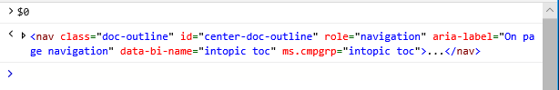
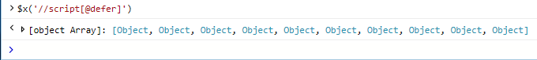
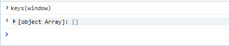
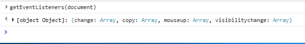

# Командная строка консоли

Используйте командную строку консоли для просмотра [*и изменения*](/visualstudio/ide/javascript-intellisense) значений на странице и выполнения кода отлаки во время выполнения, при этом используйте преимущества Visual Studio IntelliSense автоматического выполнения кода. 

Просто введите любой допустимый JavaScript в командной строке и нажмите `Enter` для выполнения. Для многостроального ввода используйте `Shift+Enter` для добавления разрыва строки. Используйте клавиши со стрелками для навигации по предыдущим командам консоли, которые вы ввели во время текущего `Up` `Down` сеанса DevTools. Помимо стандартного JavaScript и [консольного API](./console-api.md)консоль также поддерживает следующие команды:

 - [Выбор объектов DOM](#dom-selectors)
 - [Проверка свойств объекта](#object-inspection)
 - [Поиск всех прослушивателей событий для заданного объекта](#event-listeners)

Сценарий, введенный в командной строке, выполняется в глобальной области выбранного в данный момент окна, если страница не приостановлена в точке останова.  Команды консоли, которые введены во время приостановки страницы, будут выполняться в локальной области текущей функции в стеке вызовов. 

Над областью **** вывода консоли имеется контекст целевого выполнения. Выбором по умолчанию является документ верхнего уровня, **_top.** Любые iframes в документе или запущенных расширениях также отображаются в качестве параметров, что позволяет поочередно запускать команды в этих области.

## Селекторы DOM
Эти селекторы консоли предоставляют простые ярлыки для быстрого доступа к объектам в DOM:

### $(*Строка селектора CSS)*
Возвращает первый элемент в документе, соответствующий указанной строке [селектора CSS](https://developer.mozilla.org/docs/Learn/CSS/Introduction_to_CSS/Selectors)  (или разделенной запятой группой селекторов). Shorthand for [document.querySelector()](https://developer.mozilla.org/docs/Web/API/Document/querySelector).

Пример. Откройте консоль и введите, чтобы вернуть объект div на `$('#main')` `id='main'` этой странице.

### $$(*строка селектора CSS)*
Возвращает массив элементов в документе, соответствующий указанной строке [селектора CSS](https://developer.mozilla.org/docs/Learn/CSS/Introduction_to_CSS/Selectors)  (или разделенной запятой группой селекторов). Shorthand for [document.querySelectorAll()](https://developer.mozilla.org/docs/Web/API/Document/querySelectorAll).

Пример. Откройте консоль и введите, чтобы вернуть все объекты div на `$$('.container')` `class='container'` этой странице.

### 0, 1, 2 ,...
Возвращает последние элементы, выбранные [****](../elements.md) на панели элементов, где представляет текущий выбранный элемент, был выбранным элементом до этого и так `$0` `$1` далее.

Пример. Откройте DevTools **** на вкладке "Элементы", нажмите, чтобы активировать элемент Select, и щелкните мышью некоторые области на `CTRL + B` этой странице. **** Теперь откройте консоль и `$0` введите, чтобы вернуть элемент, который вы только что нажали.

### $x( выражение*XPath)*
Возвращает массив элементов, совпав с указанным выражением [XPath.](https://developer.mozilla.org/docs/Introduction_to_using_XPath_in_JavaScript) 

Пример. Откройте консоль и введите, чтобы вернуть все элементы на этой странице, содержащие `$x('//script[@defer]')` `<script>` `defer` атрибут.

## Проверка объектов

Эти команды предоставляют быстрые способы проверки свойств объекта. Указанный объект должен быть определен либо в глобальном пространстве имен, либо в текущей области отладки.

### dir(*object*)
Возвращает список свойств древового представления для указанного объекта.

Пример. Откройте консоль и введите, чтобы увидеть свойства объекта `dir(document)` документа, представляющего эту страницу.

### keys(*object*)
Возвращает массив имен свойств, прикрепленных к указанному объекту.

Пример. Откройте консоль и введите, чтобы вернуть все свойства, `keys(window)` определенные в объекте глобального окна.

### *values(object*)
Возвращает массив значений свойств, прикрепленных к указанному объекту.

Пример. Откройте консоль и введите, чтобы вернуть значения всех свойств `values(window)` (ключей), определенных в объекте глобального окна.

## Прослушиватели событий

Эта команда позволяет проверить прослушиватели событий, зарегистрированные в заданном объекте. Указанный объект должен быть определен либо в глобальном пространстве имен, либо в текущей области отладки.

### getEventListeners(*object*)
Возвращает объект, содержащий ключ для каждого зарегистрированного типа события в заданный объект. Значение каждого ключа — это массив прослушивателей событий и связанных с ними данных. 

Пример. Откройте консоль и введите, чтобы увидеть все прослушиватели событий, зарегистрированные в `getEventListeners(document)` объекте документа этой страницы.

