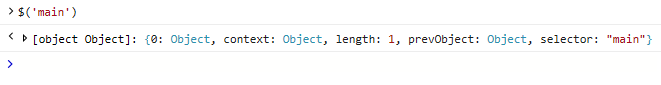
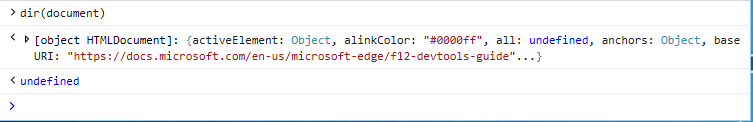

# Командная строка консолиConsole command line

Используйте командную строку консоли для просмотра [*и изменения*](/visualstudio/ide/javascript-intellisense) значений на странице и выполнения кода отлаки во время выполнения, при этом используйте преимущества Visual Studio IntelliSense автоматического выполнения кода.Use the Console command line to view and change values on a page and execute debug code on the fly, all while taking advantage of Visual Studio [*IntelliSense*](/visualstudio/ide/javascript-intellisense) auto code completion. 

Просто введите любой допустимый JavaScript в командной строке и нажмите `Enter` для выполнения.Simply enter any valid JavaScript at the command line prompt and press `Enter` to execute. Для многостроального ввода используйте `Shift+Enter` для добавления разрыва строки.For multi-line input use `Shift+Enter` to add a line-break. Используйте клавиши со стрелками для навигации по предыдущим командам консоли, которые вы ввели во время текущего `Up` `Down` сеанса DevTools.Use the `Up` and `Down` arrow keys to navigate through previous console commands you entered during the current  DevTools session. Помимо стандартного JavaScript и [консольного API](./console-api.md)консоль также поддерживает следующие команды:In addition to standard JavaScript and the [Console API](./console-api.md), the Console also supports the following commands for:

 - [Выбор объектов DOMSelecting DOM objects](#dom-selectors)
 - [Проверка свойств объектаInspecting object properties](#object-inspection)
 - [Поиск всех прослушивателей событий для заданного объектаFinding all the event listeners on a given object](#event-listeners)

Сценарий, введенный в командной строке, выполняется в глобальной области выбранного в данный момент окна, если страница не приостановлена в точке останова. Script entered in the command line executes in the [global scope](/scripting/javascript/advanced/variable-scope-javascript) of the currently selected window, unless the page is paused at a breakpoint. Команды консоли, которые введены во время приостановки страницы, будут выполняться в локальной области текущей функции в стеке вызовов. Console commands entered while the page is paused will execute in the [local scope](/scripting/javascript/advanced/variable-scope-javascript) of the current function within the call stack.

Над областью \*\*\*\* вывода консоли имеется контекст целевого выполнения.The Console has a **Target** execution context drop-down just above the Console output area. Выбором по умолчанию является документ верхнего уровня, **_top.**The default selection is the top-level document, **_top**. Любые iframes в документе или запущенных расширениях также отображаются в качестве параметров, что позволяет поочередно запускать команды в этих области.Any iframes in the document or running extensions will also appear as options, allowing you to alternately run commands within those scopes.

## Селекторы DOMDOM selectors
Эти селекторы консоли предоставляют простые ярлыки для быстрого доступа к объектам в DOM:These console selectors provide simple shorthands for quickly accessing objects within the DOM:

### $(*Строка селектора CSS)*$(*CSS selector string*)
Возвращает первый элемент в документе, соответствующий указанной строке [селектора CSS](https://developer.mozilla.org/docs/Learn/CSS/Introduction_to_CSS/Selectors)  (или разделенной запятой группой селекторов).Returns the first element within the document matching the specified [CSS selector](https://developer.mozilla.org/docs/Learn/CSS/Introduction_to_CSS/Selectors)  (or comma-separated group of selectors) string. Shorthand for [document.querySelector()](https://developer.mozilla.org/docs/Web/API/Document/querySelector).Shorthand for [document.querySelector()](https://developer.mozilla.org/docs/Web/API/Document/querySelector).

Пример. Откройте консоль и введите, чтобы вернуть объект div на `$('#main')` `id='main'` этой странице.Example: Open the console and type `$('#main')` to return the div object with `id='main'` on this page.

### $$(*строка селектора CSS)*$$(*CSS selector string*)
Возвращает массив элементов в документе, соответствующий указанной строке [селектора CSS](https://developer.mozilla.org/docs/Learn/CSS/Introduction_to_CSS/Selectors)  (или разделенной запятой группой селекторов).Returns an array of elements within the document matching the specified [CSS selector](https://developer.mozilla.org/docs/Learn/CSS/Introduction_to_CSS/Selectors)  (or comma-separated group of selectors) string. Shorthand for [document.querySelectorAll()](https://developer.mozilla.org/docs/Web/API/Document/querySelectorAll).Shorthand for [document.querySelectorAll()](https://developer.mozilla.org/docs/Web/API/Document/querySelectorAll).

Пример. Откройте консоль и введите, чтобы вернуть все объекты div на `$$('.container')` `class='container'` этой странице.Example: Open the console and type `$$('.container')` to return all the div objects with `class='container'` on this page.

### 0, 1, 2 ,...$0, $1, $2,...
Возвращает последние элементы, выбранные [\*\*\*\*](../elements.md) на панели элементов, где представляет текущий выбранный элемент, был выбранным элементом до этого и так `$0` `$1` далее.Returns the last elements selected in the [**Elements**](../elements.md) panel, where `$0` represents the currently selected item, `$1` was the selected item before that, and so on.

Пример. Откройте DevTools \*\*\*\* на вкладке "Элементы", нажмите, чтобы активировать элемент Select, и щелкните мышью некоторые области на `CTRL + B` этой странице. \*\*\*\*Example: Open  DevTools to the **Elements** tab, press `CTRL + B` to activate the **Select element** tool and click some area on this page with your mouse. Теперь откройте консоль и `$0` введите, чтобы вернуть элемент, который вы только что нажали.Now open the Console and type `$0` to return the element you just clicked.

### $x( выражение*XPath)*$x(*XPath expression*)
Возвращает массив элементов, совпав с указанным выражением [XPath.](https://developer.mozilla.org/docs/Introduction_to_using_XPath_in_JavaScript)Returns an array of elements matched by the specified [XPath](https://developer.mozilla.org/docs/Introduction_to_using_XPath_in_JavaScript) expression. 

Пример. Откройте консоль и введите, чтобы вернуть все элементы на этой странице, содержащие `$x('//script[@defer]')` `<script>` `defer` атрибут.Example: Open the console and type `$x('//script[@defer]')` to return all the `<script>` elements on this page that contain a `defer` attribute.

## Проверка объектовObject inspection

Эти команды предоставляют быстрые способы проверки свойств объекта.These commands provide quick ways to inspect the properties of an object. Указанный объект должен быть определен либо в глобальном пространстве имен, либо в текущей области отладки.The specified object must either be defined in the global namespace or the current scope of the debugger.

### dir(*object*)dir(*object*)
Возвращает список свойств древового представления для указанного объекта.Returns a tree view list of properties for the specified object.

Пример. Откройте консоль и введите, чтобы увидеть свойства объекта `dir(document)` документа, представляющего эту страницу.Example: Open the console and type `dir(document)` to see the object properties for the document object representing this page.

### keys(*object*)keys(*object*)
Возвращает массив имен свойств, прикрепленных к указанному объекту.Returns an array of property names attached to the specified object.

Пример. Откройте консоль и введите, чтобы вернуть все свойства, `keys(window)` определенные в объекте глобального окна.Example: Open the console and type `keys(window)` to return all of the properties defined on the global window object.

### *values(object*)values(*object*)
Возвращает массив значений свойств, прикрепленных к указанному объекту.Returns an array of property values attached to the specified object.

Пример. Откройте консоль и введите, чтобы вернуть значения всех свойств `values(window)` (ключей), определенных в объекте глобального окна.Example: Open the console and type `values(window)` to return the values of all the properties (keys) defined on the global window object.

## Прослушиватели событийEvent listeners

Эта команда позволяет проверить прослушиватели событий, зарегистрированные в заданном объекте.This command allows you to inspect the event listeners registered to a given object. Указанный объект должен быть определен либо в глобальном пространстве имен, либо в текущей области отладки.The specified object must either be defined in the global namespace or the current scope of the  debugger.

### getEventListeners(*object*)getEventListeners(*object*)
Возвращает объект, содержащий ключ для каждого зарегистрированного типа события в заданный объект.Returns an object containing a key for each registered event type on the given object. Значение каждого ключа — это массив прослушивателей событий и связанных с ними данных.The value of each key is an array of event listeners and their related info. 

Пример. Откройте консоль и введите, чтобы увидеть все прослушиватели событий, зарегистрированные в `getEventListeners(document)` объекте документа этой страницы.Example: Open the console and type `getEventListeners(document)` to see all the event listeners registered on the document object of this page.

