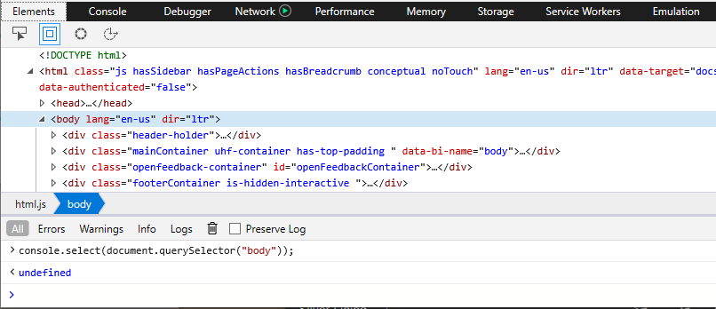
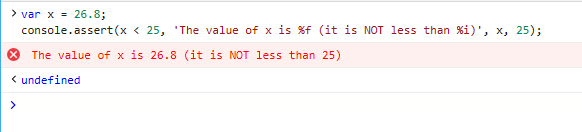

# <span data-ttu-id="c0975-104">API консоли</span><span class="sxs-lookup"><span data-stu-id="c0975-104">Console API</span></span>

<span data-ttu-id="c0975-105">Консольный *API* предоставляет командную строку и программный доступ к консоли DevTools через глобальный объект, что `console` позволяет:</span><span class="sxs-lookup"><span data-stu-id="c0975-105">The *Console API* provides command-line and programmatic access to the  DevTools Console through the global `console` object, allowing you to:</span></span>

 - <span data-ttu-id="c0975-106">[Запись пользовательских сообщений из](#logging-custom-messages) кода</span><span class="sxs-lookup"><span data-stu-id="c0975-106">[Log custom messages](#logging-custom-messages) from you code</span></span>
 - <span data-ttu-id="c0975-107">[Проверка объектов и элементов и](#inspecting-objects-and-elements) запись их данных в журнал</span><span class="sxs-lookup"><span data-stu-id="c0975-107">[Inspect objects and elements](#inspecting-objects-and-elements) and log their information</span></span>
 - <span data-ttu-id="c0975-108">[Тестирование и измерение кода путем](#testing-and-measuring) установки утверждений, времени и счетчиков</span><span class="sxs-lookup"><span data-stu-id="c0975-108">[Test and measure your code](#testing-and-measuring) by setting assertions, timers and counters</span></span>
 - <span data-ttu-id="c0975-109">[Снимите моментальные снимки кучи,](#taking-heap-snapshots) чтобы оценить потребление памяти работающим кодом и выявить утечки памяти</span><span class="sxs-lookup"><span data-stu-id="c0975-109">[Take snapshots of the heap](#taking-heap-snapshots) to assess the memory consumption of your running code and identify memory leaks</span></span>
 - <span data-ttu-id="c0975-110">[Трассировка стеков вызовов,](#tracing-callstacks) чтобы понять, откуда будет вызываться код</span><span class="sxs-lookup"><span data-stu-id="c0975-110">[Trace your callstacks](#tracing-callstacks) to understand where your code is being called from</span></span> 
 - <span data-ttu-id="c0975-111">[Упорядочить выходные данные журнала,](#organizing-log-output) чтобы упростить отладку</span><span class="sxs-lookup"><span data-stu-id="c0975-111">[Organize your log output](#organizing-log-output) to streamline your debugging</span></span>

<span data-ttu-id="c0975-112">Ниже следующую команду и параметры форматирования поддерживаются в Microsoft Edge.</span><span class="sxs-lookup"><span data-stu-id="c0975-112">The following are the commands and formatting parameters currently supported by Microsoft Edge.</span></span> <span data-ttu-id="c0975-113">Они работают аналогично в основных браузерах.</span><span class="sxs-lookup"><span data-stu-id="c0975-113">They work similarly on major browsers.</span></span>

## <span data-ttu-id="c0975-114">Ведение журнала настраиваемой почты</span><span class="sxs-lookup"><span data-stu-id="c0975-114">Logging custom messages</span></span>

<span data-ttu-id="c0975-115">Код может отправлять на консоль несколько типов настраиваемого сообщения, в том числе:</span><span class="sxs-lookup"><span data-stu-id="c0975-115">Your code can send several types of custom messages to the console, including:</span></span>

<span data-ttu-id="c0975-116">Тип сообщения</span><span class="sxs-lookup"><span data-stu-id="c0975-116">Message type</span></span>  | &nbsp;   |
:------------------- | :------ |
<span data-ttu-id="c0975-117">[**error()**](https://developer.mozilla.org/docs/Web/API/Console/error) and [ **exception()**](https://developer.mozilla.org/docs/Web/API/Console/error)</span><span class="sxs-lookup"><span data-stu-id="c0975-117">[**error()**](https://developer.mozilla.org/docs/Web/API/Console/error) and [**exception()**](https://developer.mozilla.org/docs/Web/API/Console/error)</span></span>| <span data-ttu-id="c0975-118">Критические ошибки и сбои</span><span class="sxs-lookup"><span data-stu-id="c0975-118">Critical errors and failures</span></span>
[**<span data-ttu-id="c0975-119">warn()</span><span class="sxs-lookup"><span data-stu-id="c0975-119">warn()</span></span>**](https://developer.mozilla.org/docs/Web/API/Console/warn) | <span data-ttu-id="c0975-120">Возможные ошибки или неожиданное поведение</span><span class="sxs-lookup"><span data-stu-id="c0975-120">Possible errors or unexpected behavior</span></span> 
[**<span data-ttu-id="c0975-121">info()</span><span class="sxs-lookup"><span data-stu-id="c0975-121">info()</span></span>**](https://developer.mozilla.org/docs/Web/API/Console/info) | <span data-ttu-id="c0975-122">Полезная, но некритиданная информация</span><span class="sxs-lookup"><span data-stu-id="c0975-122">Useful, but non-critical information</span></span>
<span data-ttu-id="c0975-123">[**log()**](https://developer.mozilla.org/docs/Web/API/Console/log) и [ **debug()**](https://developer.mozilla.org/docs/Web/API/Console/log)</span><span class="sxs-lookup"><span data-stu-id="c0975-123">[**log()**](https://developer.mozilla.org/docs/Web/API/Console/log) and [**debug()**](https://developer.mozilla.org/docs/Web/API/Console/log)</span></span> | <span data-ttu-id="c0975-124">Общая отладка (без создания значка системного оповещения в консоли)</span><span class="sxs-lookup"><span data-stu-id="c0975-124">General debugging (without generating a system alert icon in the console)</span></span>

   
<span data-ttu-id="c0975-125">Вы можете групповать и фильтровать их вместе с другими сообщениями, созданными в Microsoft Edge на панели консоли.</span><span class="sxs-lookup"><span data-stu-id="c0975-125">You can group and filter these along with the other messages generated from Microsoft Edge from the  Console panel.</span></span> <span data-ttu-id="c0975-126">Для всех пользовательских методов сообщения требуется параметр строки (message) и необязательный параметр подстановки формата.</span><span class="sxs-lookup"><span data-stu-id="c0975-126">All custom message methods require a string (message) parameter and optional format substitution parameters.</span></span> <span data-ttu-id="c0975-127">Microsoft Edge поддерживает следующие параметры форматирования:</span><span class="sxs-lookup"><span data-stu-id="c0975-127">Microsoft Edge supports the following formatting options:</span></span>

<span data-ttu-id="c0975-128">Параметр Format</span><span class="sxs-lookup"><span data-stu-id="c0975-128">Format parameter</span></span> | &nbsp;
:------------------- | :--- |
**<span data-ttu-id="c0975-129">%b</span><span class="sxs-lookup"><span data-stu-id="c0975-129">%b</span></span>** | <span data-ttu-id="c0975-130">Двоичный</span><span class="sxs-lookup"><span data-stu-id="c0975-130">Binary</span></span>
**<span data-ttu-id="c0975-131">%c</span><span class="sxs-lookup"><span data-stu-id="c0975-131">%c</span></span>** | <span data-ttu-id="c0975-132">Стиль inline CSS (см. пример ниже)</span><span class="sxs-lookup"><span data-stu-id="c0975-132">Inline CSS style (see example below)</span></span>
<span data-ttu-id="c0975-133">**%d,** **%i**</span><span class="sxs-lookup"><span data-stu-id="c0975-133">**%d**, **%i**</span></span> | <span data-ttu-id="c0975-134">целое число</span><span class="sxs-lookup"><span data-stu-id="c0975-134">Integer</span></span> 
**<span data-ttu-id="c0975-135">%f</span><span class="sxs-lookup"><span data-stu-id="c0975-135">%f</span></span>** | <span data-ttu-id="c0975-136">Плавающий</span><span class="sxs-lookup"><span data-stu-id="c0975-136">Float</span></span>  
**<span data-ttu-id="c0975-137">%s</span><span class="sxs-lookup"><span data-stu-id="c0975-137">%s</span></span>** | <span data-ttu-id="c0975-138">Строка</span><span class="sxs-lookup"><span data-stu-id="c0975-138">String</span></span> 
**<span data-ttu-id="c0975-139">%x</span><span class="sxs-lookup"><span data-stu-id="c0975-139">%x</span></span>** | <span data-ttu-id="c0975-140">Hexadecimal</span><span class="sxs-lookup"><span data-stu-id="c0975-140">Hexadecimal</span></span> 
**<span data-ttu-id="c0975-141">%e</span><span class="sxs-lookup"><span data-stu-id="c0975-141">%e</span></span>** | <span data-ttu-id="c0975-142">Exponent</span><span class="sxs-lookup"><span data-stu-id="c0975-142">Exponent</span></span> 

<span data-ttu-id="c0975-143">Например, вот как включить строковые и integer переменные в сообщение журнала:</span><span class="sxs-lookup"><span data-stu-id="c0975-143">For example, here's how you would include string and integer variables in your log message:</span></span>

```javascript
var myText = 'pieces';
var myVal = 5;
console.log("The number of %s is %d.", myText, myVal);
```

>`The number of pieces is 5.`

<span data-ttu-id="c0975-144">Вот как можно добавить эффект зеленого выделения в сообщение журнала со входными CSS ( `%c` ):</span><span class="sxs-lookup"><span data-stu-id="c0975-144">And here's how you might add a green highlight effect to a log message with inline CSS (`%c`):</span></span>

```javascript
console.log("%cHighlight this log message in green", "background-color: #10ff00; text-transform: uppercase;");
```


## <span data-ttu-id="c0975-146">Проверка объектов и элементов</span><span class="sxs-lookup"><span data-stu-id="c0975-146">Inspecting objects and elements</span></span>

<span data-ttu-id="c0975-147">Проверяемые объекты отображаются в консоли в свернутом представлении дерева с расширяемыми узлами.</span><span class="sxs-lookup"><span data-stu-id="c0975-147">Inspectable objects appear in the console in a collapsed tree view with expandable nodes.</span></span> <span data-ttu-id="c0975-148">Консоль определяет, отправляется ли узел DOM (например, div) или объект JavaScript (например, событие), и отображает их как обнаруженный тип автоматически.</span><span class="sxs-lookup"><span data-stu-id="c0975-148">The console detects whether you are sending a DOM node (like a div) or a JavaScript object (like an event) and displays them as the detected type automatically.</span></span>

<span data-ttu-id="c0975-149">Вы также можете принудительно использовать определенные выходные данные:</span><span class="sxs-lookup"><span data-stu-id="c0975-149">You can also force a specific output:</span></span>

<span data-ttu-id="c0975-150">Команда</span><span class="sxs-lookup"><span data-stu-id="c0975-150">Command</span></span> | &nbsp;
:------------------- | :--- |
[**<span data-ttu-id="c0975-151">dir()</span><span class="sxs-lookup"><span data-stu-id="c0975-151">dir()</span></span>**](https://developer.mozilla.org/docs/Web/API/Console/dir) | <span data-ttu-id="c0975-152">Отображает как проверяемый объект JavaScript</span><span class="sxs-lookup"><span data-stu-id="c0975-152">Displays as inspectable JavaScript object</span></span>
[**<span data-ttu-id="c0975-153">dirxml()</span><span class="sxs-lookup"><span data-stu-id="c0975-153">dirxml()</span></span>**](https://developer.mozilla.org/docs/Web/API/Console/dirxml) | <span data-ttu-id="c0975-154">Отображает как проверяемый узел DOM</span><span class="sxs-lookup"><span data-stu-id="c0975-154">Displays as inspectable DOM node</span></span>

<span data-ttu-id="c0975-155">Например, попробуйте открыть консоль и сравнить следующие выходные данные для `<div id='main'>` элемента на этой странице:</span><span class="sxs-lookup"><span data-stu-id="c0975-155">For example, try opening the console and compare the following outputs for the `<div id='main'>` element on this page:</span></span>

```javascript
console.dir(document.querySelector('#main'));
console.dirxml(document.querySelector('#main'));
```


### <span data-ttu-id="c0975-157">Выбор элемента на панели **элементов**</span><span class="sxs-lookup"><span data-stu-id="c0975-157">Selecting an element in the **Elements** panel</span></span>

<span data-ttu-id="c0975-158">Вы можете выбрать элемент в контексте дерева HTML страницы непосредственно из консоли для немедленной отладки макета и стиля.</span><span class="sxs-lookup"><span data-stu-id="c0975-158">You can select an element within the HTML tree context of the page directly from the console for immediate layout and style debugging.</span></span>

<span data-ttu-id="c0975-159">Команда</span><span class="sxs-lookup"><span data-stu-id="c0975-159">Command</span></span> | &nbsp;
:------------------- | :--- |
**<span data-ttu-id="c0975-160">select()</span><span class="sxs-lookup"><span data-stu-id="c0975-160">select()</span></span>** | <span data-ttu-id="c0975-161">Переключается на панель **"Элементы"** и устанавливает фокус на указанном элементе.</span><span class="sxs-lookup"><span data-stu-id="c0975-161">Switches to the **Elements** panel and sets focus to the specified element.</span></span>

<span data-ttu-id="c0975-162">Например, если вы откроете консоль на этой странице и введите:</span><span class="sxs-lookup"><span data-stu-id="c0975-162">For example, if you open the console on this page and type:</span></span>

```javascript
console.select(document.querySelector("body"));
```

<span data-ttu-id="c0975-163">DevTools переключается на панель **"Элементы"** (если она еще не является текущей) и фокус в представлении дерева [*HTML*](../elements.md#html-tree-view) устанавливается на указанный элемент.</span><span class="sxs-lookup"><span data-stu-id="c0975-163">The DevTools will switch to the **Elements** panel (if its not already the current) and set focus in the [*HTML tree view*](../elements.md#html-tree-view) to the specified element.</span></span>



## <span data-ttu-id="c0975-165">Тестирование и измерение</span><span class="sxs-lookup"><span data-stu-id="c0975-165">Testing and measuring</span></span>

### <span data-ttu-id="c0975-166">Тестирование кода</span><span class="sxs-lookup"><span data-stu-id="c0975-166">Testing your code</span></span>

<span data-ttu-id="c0975-167">Добавьте тестовые утверждения API консоли в код для тестирования и отладки кода при его запуске в браузере.</span><span class="sxs-lookup"><span data-stu-id="c0975-167">Add Console API test assertions to your code for unit testing and debugging your code as it runs in the browser.</span></span>

<span data-ttu-id="c0975-168">Команда</span><span class="sxs-lookup"><span data-stu-id="c0975-168">Command</span></span> | &nbsp;
:------------ | :-------------
[**<span data-ttu-id="c0975-169">assert()</span><span class="sxs-lookup"><span data-stu-id="c0975-169">assert()</span></span>**](https://developer.mozilla.org/docs/Web/API/Console/assert) | <span data-ttu-id="c0975-170">Занося в журнал сообщение об ошибке консоли, если предоставленное выражение имеет *ложное состояние.*</span><span class="sxs-lookup"><span data-stu-id="c0975-170">Logs a console error message if the provided expression evaluates to *false*.</span></span>

<span data-ttu-id="c0975-171">В дополнение к логическому выражению, которое вы передаете в качестве проверяемого утверждения, вы можете добавить необязательные параметры форматирования и сообщения форматирования так же, как и другие настраиваемые сообщения [консоли.](#logging-custom-messages)</span><span class="sxs-lookup"><span data-stu-id="c0975-171">In addition to the logical expression you supply as the testable assertion, you can add an optional message and formatting parameters as you would use with other [custom console messages](#logging-custom-messages).</span></span> <span data-ttu-id="c0975-172">Например:</span><span class="sxs-lookup"><span data-stu-id="c0975-172">For example:</span></span>

```javascript
var x = 26.8;
console.assert(x < 25, 'The value of x is %f (it is NOT less than %i)', x, 25);
```



### <span data-ttu-id="c0975-174">Подсчет выполнения в коде</span><span class="sxs-lookup"><span data-stu-id="c0975-174">Counting executions in your code</span></span>

<span data-ttu-id="c0975-175">Вы можете установить счетчики в коде, чтобы отслеживать, сколько раз выполняется окружающий код.</span><span class="sxs-lookup"><span data-stu-id="c0975-175">You can set counters in your code to keep track of how many times the surrounding code gets executed.</span></span> <span data-ttu-id="c0975-176">Счетчики параметров помогают убедиться, что код работает ожидаемым образом, и помогут вам диагностировать узкие места производительности.</span><span class="sxs-lookup"><span data-stu-id="c0975-176">Setting counters can help ensure your code is running as expected and assist you in diagnosing performance bottlenecks.</span></span>

<span data-ttu-id="c0975-177">Команда</span><span class="sxs-lookup"><span data-stu-id="c0975-177">Command</span></span> | &nbsp;
:------------ | :-------------
[**<span data-ttu-id="c0975-178">count()</span><span class="sxs-lookup"><span data-stu-id="c0975-178">count()</span></span>**](https://developer.mozilla.org/docs/Web/API/Console/count) | <span data-ttu-id="c0975-179">Добавит и занося в журнал количество *()* для заданной метки.</span><span class="sxs-lookup"><span data-stu-id="c0975-179">Increments and logs the number of times *count()* for the given label has been executed.</span></span>
[**<span data-ttu-id="c0975-180">countReset()</span><span class="sxs-lookup"><span data-stu-id="c0975-180">countReset()</span></span>**](https://developer.mozilla.org/docs/Web/API/Console/countReset) | <span data-ttu-id="c0975-181">Сбрасывает значение счетчика до нуля для заданной метки счетчика.</span><span class="sxs-lookup"><span data-stu-id="c0975-181">Resets the count to zero for the given counter label.</span></span>

<span data-ttu-id="c0975-182">Например, выполнят следующие строки в консоли:</span><span class="sxs-lookup"><span data-stu-id="c0975-182">For example, executing the following lines in console:</span></span>

```javascript
console.count('My Counter');
console.count('My Counter');
console.countReset('My Counter');
console.count('My Counter');
```

 <span data-ttu-id="c0975-183">.</span><span class="sxs-lookup"><span data-stu-id="c0975-183">.</span></span> <span data-ttu-id="c0975-184">.</span><span class="sxs-lookup"><span data-stu-id="c0975-184">.</span></span> <span data-ttu-id="c0975-185">.</span><span class="sxs-lookup"><span data-stu-id="c0975-185">.</span></span> <span data-ttu-id="c0975-186">приведет к:</span><span class="sxs-lookup"><span data-stu-id="c0975-186">will result in:</span></span>
> <span data-ttu-id="c0975-187">Счетчик: 1</span><span class="sxs-lookup"><span data-stu-id="c0975-187">My Counter: 1</span></span>

### <span data-ttu-id="c0975-188">Синхронизация кода</span><span class="sxs-lookup"><span data-stu-id="c0975-188">Timing your code</span></span>

<span data-ttu-id="c0975-189">Инструментарий кода с меткой timers для измерения времени, необходимого для выполнения заданной операции.</span><span class="sxs-lookup"><span data-stu-id="c0975-189">Instrument your code with labeled timers to measure how long it takes to complete a given operation.</span></span>

<span data-ttu-id="c0975-190">Команда</span><span class="sxs-lookup"><span data-stu-id="c0975-190">Command</span></span> | &nbsp;
:------------ | :-------------
[**<span data-ttu-id="c0975-191">time()</span><span class="sxs-lookup"><span data-stu-id="c0975-191">time()</span></span>**](https://developer.mozilla.org/docs/Web/API/Console/time) | <span data-ttu-id="c0975-192">Запускает timer с заданной меткой.</span><span class="sxs-lookup"><span data-stu-id="c0975-192">Starts a timer with the given label.</span></span>
[**<span data-ttu-id="c0975-193">timeEnd()</span><span class="sxs-lookup"><span data-stu-id="c0975-193">timeEnd()</span></span>**](https://developer.mozilla.org/docs/Web/API/Console/timeEnd) | <span data-ttu-id="c0975-194">Завершает время, заданную меткой, и сообщает время (в миллисекунах).</span><span class="sxs-lookup"><span data-stu-id="c0975-194">Ends the timer with the given label and reports the time elapsed (in milliseconds).</span></span>
[**<span data-ttu-id="c0975-195">timeStamp()</span><span class="sxs-lookup"><span data-stu-id="c0975-195">timeStamp()</span></span>**](https://developer.mozilla.org/docs/Web/API/Console/timeStamp) | <span data-ttu-id="c0975-196">Сообщает текущее системный период (в миллисекунах).</span><span class="sxs-lookup"><span data-stu-id="c0975-196">Reports the current system time (in milliseconds).</span></span>

<span data-ttu-id="c0975-197">Например, попробуйте выполнение следующих строк в консоли:</span><span class="sxs-lookup"><span data-stu-id="c0975-197">For example, try executing the following lines in console:</span></span>

```javascript
console.time('My Timer');
console.timeEnd('My Timer');
```

### <span data-ttu-id="c0975-198">Моментальные снимки кучи</span><span class="sxs-lookup"><span data-stu-id="c0975-198">Taking heap snapshots</span></span>

<span data-ttu-id="c0975-199">Снимите моментальные снимки кучи, чтобы оценить потребление памяти запущенным кодом и выявить утечки памяти.</span><span class="sxs-lookup"><span data-stu-id="c0975-199">Take snapshots of the heap to assess the memory consumption of your running code and identify memory leaks.</span></span>

<span data-ttu-id="c0975-200">Команда</span><span class="sxs-lookup"><span data-stu-id="c0975-200">Command</span></span> | &nbsp;
:------------ | :-------------
**<span data-ttu-id="c0975-201">takeHeapSnapshot()</span><span class="sxs-lookup"><span data-stu-id="c0975-201">takeHeapSnapshot()</span></span>** | <span data-ttu-id="c0975-202">Захватывает сведения о текущей куче JavaScript и выделенных объектах.</span><span class="sxs-lookup"><span data-stu-id="c0975-202">Captures details about the current JavaScript heap and its allocated objects.</span></span>

<span data-ttu-id="c0975-203">Для создания моментальных [снимков](../memory.md#toolbar) кучи должен быть запущен профилер памяти DevTools.</span><span class="sxs-lookup"><span data-stu-id="c0975-203">The  DevTools [memory profiler](../memory.md#toolbar) must be running in order to take heap snapshots.</span></span> <span data-ttu-id="c0975-204">Каждый моментальный снимок будет [\*\*](../memory.md#snapshot-summary) отображаться как плитка в сводке "Моментальный снимок" панели [**памяти**](../memory.md) для дальнейшей проверки.</span><span class="sxs-lookup"><span data-stu-id="c0975-204">Each snapshot will appear as a tile in the [*Snapshot summary*](../memory.md#snapshot-summary) of the [**Memory**](../memory.md) panel for further inspection.</span></span>

## <span data-ttu-id="c0975-205">Трассировка скатов вызовов</span><span class="sxs-lookup"><span data-stu-id="c0975-205">Tracing callstacks</span></span>

<span data-ttu-id="c0975-206">Понимание того, откуда происходит ваш код, какой код запущен и сколько времени занимает выполнение, может быть полезно при анализе замедления или непредвиденного поведения.</span><span class="sxs-lookup"><span data-stu-id="c0975-206">Understanding where your code is being called from, what code is running, and how long that execution takes can be useful in analyzing slowness or unexpected behavior.</span></span> <span data-ttu-id="c0975-207">Трассировка стека показывает путь выполнения, который был достигнут кодом, от запроса на трассировку вверх по пути.</span><span class="sxs-lookup"><span data-stu-id="c0975-207">A stack trace shows you the execution path your code took to reach it, from the trace request upward through the path.</span></span> 

<span data-ttu-id="c0975-208">Команда</span><span class="sxs-lookup"><span data-stu-id="c0975-208">Command</span></span> | &nbsp;
:------------ | :-------------
[**<span data-ttu-id="c0975-209">trace()</span><span class="sxs-lookup"><span data-stu-id="c0975-209">trace()</span></span>**](https://developer.mozilla.org/docs/Web/API/Console/trace) | <span data-ttu-id="c0975-210">Выводит трассировку текущего ска выполнения сценария.</span><span class="sxs-lookup"><span data-stu-id="c0975-210">Outputs a trace of the current script execution callstack.</span></span>

<span data-ttu-id="c0975-211">Например, для запуска следующего кода в консоли:</span><span class="sxs-lookup"><span data-stu-id="c0975-211">For example, running the following code in the console:</span></span>

```javascript
function a(){
  c();
}
function b(){
  c();
}
function c(){
  console.trace()
}
function d(){
  b();
}

a();
d();
```

<span data-ttu-id="c0975-212">.</span><span class="sxs-lookup"><span data-stu-id="c0975-212">.</span></span> <span data-ttu-id="c0975-213">.</span><span class="sxs-lookup"><span data-stu-id="c0975-213">.</span></span> <span data-ttu-id="c0975-214">.</span><span class="sxs-lookup"><span data-stu-id="c0975-214">.</span></span> <span data-ttu-id="c0975-215">выводит следующие трассировки стека:</span><span class="sxs-lookup"><span data-stu-id="c0975-215">will output the following stack traces:</span></span>
> <span data-ttu-id="c0975-216">console.trace() at c (eval code:8:3) at a (eval code:2:3) at eval code (eval code:14:1)</span><span class="sxs-lookup"><span data-stu-id="c0975-216">console.trace() at c (eval code:8:3) at a (eval code:2:3) at eval code (eval code:14:1)</span></span>
> 
> <span data-ttu-id="c0975-217">console.trace() at c (eval code:8:3) at b (eval code:5:3) at d (eval code:11:3) at eval code (eval code:15:1)</span><span class="sxs-lookup"><span data-stu-id="c0975-217">console.trace() at c (eval code:8:3) at b (eval code:5:3) at d (eval code:11:3) at eval code (eval code:15:1)</span></span>

## <span data-ttu-id="c0975-218">Организация выходных данных журнала</span><span class="sxs-lookup"><span data-stu-id="c0975-218">Organizing log output</span></span>

<span data-ttu-id="c0975-219">Чтобы просто очистить все предыдущие выходные данные консоли, используйте *console.clear()* `CTRL + L` (или).</span><span class="sxs-lookup"><span data-stu-id="c0975-219">To simply clear all previous console output, use *console.clear()* (or `CTRL + L`).</span></span> <span data-ttu-id="c0975-220">Это не очищает стег из истории команд консоли (вы по-прежнему можете обходить его с помощью клавиш со стрелками вверх и вниз).</span><span class="sxs-lookup"><span data-stu-id="c0975-220">This does not clear the backstack of your console command history (you can still traverse it with the up and down arrow keys).</span></span>

<span data-ttu-id="c0975-221">Команда</span><span class="sxs-lookup"><span data-stu-id="c0975-221">Command</span></span> | &nbsp;
:------------ | :-------------
[**<span data-ttu-id="c0975-222">clear()</span><span class="sxs-lookup"><span data-stu-id="c0975-222">clear()</span></span>**](https://developer.mozilla.org/docs/Web/API/Console/clear) | <span data-ttu-id="c0975-223">Очищает все предыдущие выходные данные консоли.</span><span class="sxs-lookup"><span data-stu-id="c0975-223">Clears all previous console output.</span></span>

<span data-ttu-id="c0975-224">Если код выводит большое количество консольных сообщений, вы можете визуально упорядоизировать их в вложенные блоки с помощью следующих команд:</span><span class="sxs-lookup"><span data-stu-id="c0975-224">If your code outputs a lot of console messages, you can visually organize them into nested blocks with the following commands:</span></span>

 <span data-ttu-id="c0975-225">Команда</span><span class="sxs-lookup"><span data-stu-id="c0975-225">Command</span></span> | &nbsp;
:------------ | :-------------
[**<span data-ttu-id="c0975-226">group()</span><span class="sxs-lookup"><span data-stu-id="c0975-226">group()</span></span>**](https://developer.mozilla.org/docs/Web/API/Console/group) | <span data-ttu-id="c0975-227">Запускает новый уровень вложенности для вывода консоли с указанной (необязательно) меткой.</span><span class="sxs-lookup"><span data-stu-id="c0975-227">Starts a new level of nesting for console output with the specified (optional) label.</span></span>
[**<span data-ttu-id="c0975-228">groupCollapsed()</span><span class="sxs-lookup"><span data-stu-id="c0975-228">groupCollapsed()</span></span>**](https://developer.mozilla.org/docs/Web/API/Console/groupCollapsed) | <span data-ttu-id="c0975-229">Запускает новый уровень вложенности для вывода консоли с указанной (необязательной) меткой, однако по умолчанию управление группировкой свернуто и должно быть расширено (щелкнув стрелку) для отображения вывода потомка.</span><span class="sxs-lookup"><span data-stu-id="c0975-229">Starts a new level of nesting for console output with the specified (optional) label, however the grouping control is collapsed by default and must be expanded (by clicking on the arrow control) to display the child output.</span></span>
[**<span data-ttu-id="c0975-230">groupEnd()</span><span class="sxs-lookup"><span data-stu-id="c0975-230">groupEnd()</span></span>**](https://developer.mozilla.org/docs/Web/API/Console/groupEnd) | <span data-ttu-id="c0975-231">Завершает вложенную группу для указанной метки.</span><span class="sxs-lookup"><span data-stu-id="c0975-231">Ends the nesting group for the specified label.</span></span>

<span data-ttu-id="c0975-232">Например, попробуйте ввести следующие команды в консоли:</span><span class="sxs-lookup"><span data-stu-id="c0975-232">For example, try entering the following commands in the console:</span></span>

```javascript
console.groupCollapsed('Group 1');
console.log('In Group 1');
console.groupCollapsed('Group 1.1');
console.log('In Group 1.1');
console.groupEnd('Group 1.1');
console.groupEnd('Group 1');
console.log('No longer in a group');
```

<span data-ttu-id="c0975-233">.</span><span class="sxs-lookup"><span data-stu-id="c0975-233">.</span></span> <span data-ttu-id="c0975-234">.</span><span class="sxs-lookup"><span data-stu-id="c0975-234">.</span></span> <span data-ttu-id="c0975-235">.</span><span class="sxs-lookup"><span data-stu-id="c0975-235">.</span></span> <span data-ttu-id="c0975-236">а затем разйдите элементы управления *"Группа 1"* и *"Группа 1.1",* чтобы увидеть, как вложены комментарии журнала:</span><span class="sxs-lookup"><span data-stu-id="c0975-236">and then expand the *Group 1* and *Group 1.1* controls to see how the log comments are nested:</span></span>


<span data-ttu-id="c0975-238">Иногда проще визуализировать объект JavaScript или массив в табулярной форме, а не в плоском списке.</span><span class="sxs-lookup"><span data-stu-id="c0975-238">Sometimes its easier to visualize a JavaScript object or array in tabular form, rather than a flat list.</span></span> <span data-ttu-id="c0975-239">Для этого можно использовать команду *console.table():*</span><span class="sxs-lookup"><span data-stu-id="c0975-239">For that, you can use the *console.table()* command:</span></span>

<span data-ttu-id="c0975-240">Команда</span><span class="sxs-lookup"><span data-stu-id="c0975-240">Command</span></span> | &nbsp;
:------------ | :-------------
[**<span data-ttu-id="c0975-241">table()</span><span class="sxs-lookup"><span data-stu-id="c0975-241">table()</span></span>**](https://developer.mozilla.org/docs/Web/API/Console/table) | <span data-ttu-id="c0975-242">Выводит предоставленный массив или объект в консоль в табулярной форме.</span><span class="sxs-lookup"><span data-stu-id="c0975-242">Outputs the supplied array or object to the console in tabular form.</span></span>

<span data-ttu-id="c0975-243">Например, следующий массив объектов:</span><span class="sxs-lookup"><span data-stu-id="c0975-243">For example, the following object array:</span></span>

```javascript
var orders = [{'Size':'XL', 'Quantity':1},{'Size':'M', 'Quantity':3}, {'Size':'L', 'Quantity':2}];
console.table(orders);
```

<span data-ttu-id="c0975-244">.</span><span class="sxs-lookup"><span data-stu-id="c0975-244">.</span></span> <span data-ttu-id="c0975-245">.</span><span class="sxs-lookup"><span data-stu-id="c0975-245">.</span></span> <span data-ttu-id="c0975-246">.</span><span class="sxs-lookup"><span data-stu-id="c0975-246">.</span></span> <span data-ttu-id="c0975-247">будет отрисовыно как эта таблица в консоли:</span><span class="sxs-lookup"><span data-stu-id="c0975-247">will render as this table in the console:</span></span>


