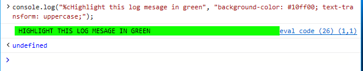
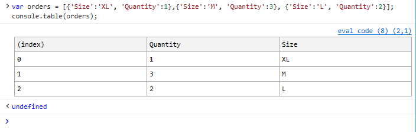

# API консоли

Консольный *API* предоставляет командную строку и программный доступ к консоли DevTools через глобальный объект, что `console` позволяет:

 - [Запись пользовательских сообщений из](#logging-custom-messages) кода
 - [Проверка объектов и элементов и](#inspecting-objects-and-elements) запись их данных в журнал
 - [Тестирование и измерение кода путем](#testing-and-measuring) установки утверждений, времени и счетчиков
 - [Снимите моментальные снимки кучи,](#taking-heap-snapshots) чтобы оценить потребление памяти работающим кодом и выявить утечки памяти
 - [Трассировка стеков вызовов,](#tracing-callstacks) чтобы понять, откуда будет вызываться код 
 - [Упорядочить выходные данные журнала,](#organizing-log-output) чтобы упростить отладку

Ниже следующую команду и параметры форматирования поддерживаются в Microsoft Edge. Они работают аналогично в основных браузерах.

## Ведение журнала настраиваемой почты

Код может отправлять на консоль несколько типов настраиваемого сообщения, в том числе:

Тип сообщения  | &nbsp;   |
:------------------- | :------ |
[**error()**](https://developer.mozilla.org/docs/Web/API/Console/error) and [ **exception()**](https://developer.mozilla.org/docs/Web/API/Console/error)| Критические ошибки и сбои
[**warn()**](https://developer.mozilla.org/docs/Web/API/Console/warn) | Возможные ошибки или неожиданное поведение 
[**info()**](https://developer.mozilla.org/docs/Web/API/Console/info) | Полезная, но некритиданная информация
[**log()**](https://developer.mozilla.org/docs/Web/API/Console/log) и [ **debug()**](https://developer.mozilla.org/docs/Web/API/Console/log) | Общая отладка (без создания значка системного оповещения в консоли)

   
Вы можете групповать и фильтровать их вместе с другими сообщениями, созданными в Microsoft Edge на панели консоли. Для всех пользовательских методов сообщения требуется параметр строки (message) и необязательный параметр подстановки формата. Microsoft Edge поддерживает следующие параметры форматирования:

Параметр Format | &nbsp;
:------------------- | :--- |
**%b** | Двоичный
**%c** | Стиль inline CSS (см. пример ниже)
**%d,** **%i** | целое число 
**%f** | Плавающий  
**%s** | Строка 
**%x** | Hexadecimal 
**%e** | Exponent 

Например, вот как включить строковые и integer переменные в сообщение журнала:

```javascript
var myText = 'pieces';
var myVal = 5;
console.log("The number of %s is %d.", myText, myVal);
```

>`The number of pieces is 5.`

Вот как можно добавить эффект зеленого выделения в сообщение журнала со входными CSS ( `%c` ):

```javascript
console.log("%cHighlight this log message in green", "background-color: #10ff00; text-transform: uppercase;");
```



## Проверка объектов и элементов

Проверяемые объекты отображаются в консоли в свернутом представлении дерева с расширяемыми узлами. Консоль определяет, отправляется ли узел DOM (например, div) или объект JavaScript (например, событие), и отображает их как обнаруженный тип автоматически.

Вы также можете принудительно использовать определенные выходные данные:

Команда | &nbsp;
:------------------- | :--- |
[**dir()**](https://developer.mozilla.org/docs/Web/API/Console/dir) | Отображает как проверяемый объект JavaScript
[**dirxml()**](https://developer.mozilla.org/docs/Web/API/Console/dirxml) | Отображает как проверяемый узел DOM

Например, попробуйте открыть консоль и сравнить следующие выходные данные для `<div id='main'>` элемента на этой странице:

```javascript
console.dir(document.querySelector('#main'));
console.dirxml(document.querySelector('#main'));
```


### Выбор элемента на панели **элементов**

Вы можете выбрать элемент в контексте дерева HTML страницы непосредственно из консоли для немедленной отладки макета и стиля.

Команда | &nbsp;
:------------------- | :--- |
**select()** | Переключается на панель **"Элементы"** и устанавливает фокус на указанном элементе.

Например, если вы откроете консоль на этой странице и введите:

```javascript
console.select(document.querySelector("body"));
```

DevTools переключается на панель **"Элементы"** (если она еще не является текущей) и фокус в представлении дерева [*HTML*](../elements.md#html-tree-view) устанавливается на указанный элемент.


## Тестирование и измерение

### Тестирование кода

Добавьте тестовые утверждения API консоли в код для тестирования и отладки кода при его запуске в браузере.

Команда | &nbsp;
:------------ | :-------------
[**assert()**](https://developer.mozilla.org/docs/Web/API/Console/assert) | Занося в журнал сообщение об ошибке консоли, если предоставленное выражение имеет *ложное состояние.*

В дополнение к логическому выражению, которое вы передаете в качестве проверяемого утверждения, вы можете добавить необязательные параметры форматирования и сообщения форматирования так же, как и другие настраиваемые сообщения [консоли.](#logging-custom-messages) Например:

```javascript
var x = 26.8;
console.assert(x < 25, 'The value of x is %f (it is NOT less than %i)', x, 25);
```


### Подсчет выполнения в коде

Вы можете установить счетчики в коде, чтобы отслеживать, сколько раз выполняется окружающий код. Счетчики параметров помогают убедиться, что код работает ожидаемым образом, и помогут вам диагностировать узкие места производительности.

Команда | &nbsp;
:------------ | :-------------
[**count()**](https://developer.mozilla.org/docs/Web/API/Console/count) | Добавит и занося в журнал количество *()* для заданной метки.
[**countReset()**](https://developer.mozilla.org/docs/Web/API/Console/countReset) | Сбрасывает значение счетчика до нуля для заданной метки счетчика.

Например, выполнят следующие строки в консоли:

```javascript
console.count('My Counter');
console.count('My Counter');
console.countReset('My Counter');
console.count('My Counter');
```

 . . . приведет к:
> Счетчик: 1

### Синхронизация кода

Инструментарий кода с меткой timers для измерения времени, необходимого для выполнения заданной операции.

Команда | &nbsp;
:------------ | :-------------
[**time()**](https://developer.mozilla.org/docs/Web/API/Console/time) | Запускает timer с заданной меткой.
[**timeEnd()**](https://developer.mozilla.org/docs/Web/API/Console/timeEnd) | Завершает время, заданную меткой, и сообщает время (в миллисекунах).
[**timeStamp()**](https://developer.mozilla.org/docs/Web/API/Console/timeStamp) | Сообщает текущее системный период (в миллисекунах).

Например, попробуйте выполнение следующих строк в консоли:

```javascript
console.time('My Timer');
console.timeEnd('My Timer');
```

### Моментальные снимки кучи

Снимите моментальные снимки кучи, чтобы оценить потребление памяти запущенным кодом и выявить утечки памяти.

Команда | &nbsp;
:------------ | :-------------
**takeHeapSnapshot()** | Захватывает сведения о текущей куче JavaScript и выделенных объектах.

Для создания моментальных [снимков](../memory.md#toolbar) кучи должен быть запущен профилер памяти DevTools. Каждый моментальный снимок будет [**](../memory.md#snapshot-summary) отображаться как плитка в сводке "Моментальный снимок" панели [**памяти**](../memory.md) для дальнейшей проверки.

## Трассировка скатов вызовов

Понимание того, откуда происходит ваш код, какой код запущен и сколько времени занимает выполнение, может быть полезно при анализе замедления или непредвиденного поведения. Трассировка стека показывает путь выполнения, который был достигнут кодом, от запроса на трассировку вверх по пути. 

Команда | &nbsp;
:------------ | :-------------
[**trace()**](https://developer.mozilla.org/docs/Web/API/Console/trace) | Выводит трассировку текущего ска выполнения сценария.

Например, для запуска следующего кода в консоли:

```javascript
function a(){
  c();
}
function b(){
  c();
}
function c(){
  console.trace()
}
function d(){
  b();
}

a();
d();
```

. . . выводит следующие трассировки стека:
> console.trace() at c (eval code:8:3) at a (eval code:2:3) at eval code (eval code:14:1)
> 
> console.trace() at c (eval code:8:3) at b (eval code:5:3) at d (eval code:11:3) at eval code (eval code:15:1)

## Организация выходных данных журнала

Чтобы просто очистить все предыдущие выходные данные консоли, используйте *console.clear()* `CTRL + L` (или). Это не очищает стег из истории команд консоли (вы по-прежнему можете обходить его с помощью клавиш со стрелками вверх и вниз).

Команда | &nbsp;
:------------ | :-------------
[**clear()**](https://developer.mozilla.org/docs/Web/API/Console/clear) | Очищает все предыдущие выходные данные консоли.

Если код выводит большое количество консольных сообщений, вы можете визуально упорядоизировать их в вложенные блоки с помощью следующих команд:

 Команда | &nbsp;
:------------ | :-------------
[**group()**](https://developer.mozilla.org/docs/Web/API/Console/group) | Запускает новый уровень вложенности для вывода консоли с указанной (необязательно) меткой.
[**groupCollapsed()**](https://developer.mozilla.org/docs/Web/API/Console/groupCollapsed) | Запускает новый уровень вложенности для вывода консоли с указанной (необязательной) меткой, однако по умолчанию управление группировкой свернуто и должно быть расширено (щелкнув стрелку) для отображения вывода потомка.
[**groupEnd()**](https://developer.mozilla.org/docs/Web/API/Console/groupEnd) | Завершает вложенную группу для указанной метки.

Например, попробуйте ввести следующие команды в консоли:

```javascript
console.groupCollapsed('Group 1');
console.log('In Group 1');
console.groupCollapsed('Group 1.1');
console.log('In Group 1.1');
console.groupEnd('Group 1.1');
console.groupEnd('Group 1');
console.log('No longer in a group');
```

. . . а затем разйдите элементы управления *"Группа 1"* и *"Группа 1.1",* чтобы увидеть, как вложены комментарии журнала:


Иногда проще визуализировать объект JavaScript или массив в табулярной форме, а не в плоском списке. Для этого можно использовать команду *console.table():*

Команда | &nbsp;
:------------ | :-------------
[**table()**](https://developer.mozilla.org/docs/Web/API/Console/table) | Выводит предоставленный массив или объект в консоль в табулярной форме.

Например, следующий массив объектов:

```javascript
var orders = [{'Size':'XL', 'Quantity':1},{'Size':'M', 'Quantity':3}, {'Size':'L', 'Quantity':2}];
console.table(orders);
```

. . . будет отрисовыно как эта таблица в консоли:


