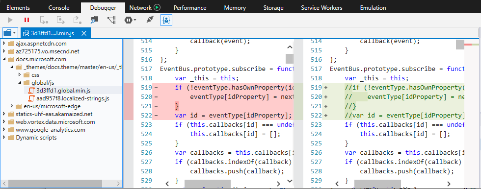
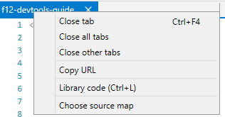

# <span data-ttu-id="0393e-104">Отладка — DevTools (EdgeHTML)</span><span class="sxs-lookup"><span data-stu-id="0393e-104">Debugger - DevTools (EdgeHTML)</span></span>

<span data-ttu-id="0393e-105">**Отладка** используется для пошагового кода, назначения часов и точек останова, редактирования кода в режиме онлайн и проверки кэшей.</span><span class="sxs-lookup"><span data-stu-id="0393e-105">Use the **Debugger** to step through code, set watches and breakpoints, live edit your code and inspect your caches.</span></span> <span data-ttu-id="0393e-106">Протестировать код и устранить неполадки с помощью:</span><span class="sxs-lookup"><span data-stu-id="0393e-106">Test and troubleshoot your code by:</span></span>

- <span data-ttu-id="0393e-107">[Просмотр и](#resource-picker) поиск [кода](#file-search) из загруженных исходных файлов</span><span class="sxs-lookup"><span data-stu-id="0393e-107">[Browsing](#resource-picker) and [searching](#file-search) code from your loaded source files</span></span>
- <span data-ttu-id="0393e-108">[Управление потоком выполнения](#toolbar) при выполнении кода</span><span class="sxs-lookup"><span data-stu-id="0393e-108">[Controlling the execution flow](#toolbar) as you step through your code</span></span>
- <span data-ttu-id="0393e-109">[Управление ресурсами хранилища страниц,](./storage.md#cache-manager)включая службы и [кэш,](./service-workers.md) [файлы cookie и](./storage.md#cookies-list) [веб-хранилище](./storage.md#local-and-session-storage-managers)</span><span class="sxs-lookup"><span data-stu-id="0393e-109">[Managing page storage resources](./storage.md#cache-manager), including the [service workers and cache](./service-workers.md), [cookies](./storage.md#cookies-list) and [web storage](./storage.md#local-and-session-storage-managers)</span></span>  
- <span data-ttu-id="0393e-110">[Установка точек останова и редактирование кода](#debug-window) в режиме онлайн при его запуске</span><span class="sxs-lookup"><span data-stu-id="0393e-110">[Setting breakpoints and live editing](#debug-window) your code as it runs</span></span>
- <span data-ttu-id="0393e-111">[Отслеживание и редактирование локальных переменных](#watches) во время отлаживки</span><span class="sxs-lookup"><span data-stu-id="0393e-111">[Tracking and editing local variables](#watches) as you debug</span></span>
- <span data-ttu-id="0393e-112">[Скрытие или отображение асинхронного кода](#call-stack) и кода библиотеки из стека вызовов при необходимости</span><span class="sxs-lookup"><span data-stu-id="0393e-112">[Hiding or showing asynchronous code and library code](#call-stack) from your callstack as needed</span></span>
- <span data-ttu-id="0393e-113">[Добавление специализированных точек останова](#breakpoints) для XmlHttpRequests, событий и [модификаций DOM](#dom-breakpoints)</span><span class="sxs-lookup"><span data-stu-id="0393e-113">[Adding specialized breakpoints](#breakpoints) for XmlHttpRequests, events and [DOM mutations](#dom-breakpoints)</span></span>


<span data-ttu-id="0393e-115">Сеанс отладки можно начать тремя способами.</span><span class="sxs-lookup"><span data-stu-id="0393e-115">There are three ways to begin a debugging session.</span></span>

1. **<span data-ttu-id="0393e-116">Установите точку останова.</span><span class="sxs-lookup"><span data-stu-id="0393e-116">Set a breakpoint.</span></span>** <span data-ttu-id="0393e-117">Когда код достигнет его, вы введите отладок и сможете пошагово обходить код.</span><span class="sxs-lookup"><span data-stu-id="0393e-117">When the execution of your code reaches it, you'll enter the debugger and be able to step through your code.</span></span>
2. **<span data-ttu-id="0393e-118">Инициировать разрыв кода.</span><span class="sxs-lookup"><span data-stu-id="0393e-118">Initiate a break in code.</span></span>** <span data-ttu-id="0393e-119">Нажмите [**кнопку "Разрыв"**](#toolbar) *(значок* приостановки) панели инструментов или `Ctrl+Shift+B` .</span><span class="sxs-lookup"><span data-stu-id="0393e-119">Click the [**Break**](#toolbar) (*pause* icon) toolbar button or `Ctrl+Shift+B`.</span></span> <span data-ttu-id="0393e-120">Отладка будет разорвана при следующем выполнении.</span><span class="sxs-lookup"><span data-stu-id="0393e-120">The debugger will break on the next statement of execution.</span></span>
3. **<span data-ttu-id="0393e-121">Настройка поведения исключения.</span><span class="sxs-lookup"><span data-stu-id="0393e-121">Set exception behavior.</span></span>** <span data-ttu-id="0393e-122">Используйте меню [**"Изменение поведения исключения"**](#toolbar) () для взлома отлада, когда код `Ctrl+Shift+E` вырывать исключение.</span><span class="sxs-lookup"><span data-stu-id="0393e-122">Use the [**Change exception behavior**](#toolbar) menu (`Ctrl+Shift+E`) to break into the debugger when your code throws an exception.</span></span> <span data-ttu-id="0393e-123">По умолчанию для отладка исключений установлено значение *"Никогда*не разрывать", но они регистрируются в консоли.</span><span class="sxs-lookup"><span data-stu-id="0393e-123">By default, the debugger is set to *Never break on exceptions*, but they are logged to the console.</span></span>

## <span data-ttu-id="0393e-124">Выбор ресурсов</span><span class="sxs-lookup"><span data-stu-id="0393e-124">Resource picker</span></span>

<span data-ttu-id="0393e-125">Часто первым этапом отладки является настройка точек останова в коде для устранения неполадок.</span><span class="sxs-lookup"><span data-stu-id="0393e-125">Often the first step in debugging is to set breakpoints in the code you're looking to troubleshoot.</span></span> <span data-ttu-id="0393e-126">В области "Выбор ресурсов" можно найти все \*\* файлы кода, загруженные страницей, включая *HTML-, CSS-* и *JS-файлы.*</span><span class="sxs-lookup"><span data-stu-id="0393e-126">You can find all the code files currently loaded by the page from the *Resource picker* pane, including *.html, .css* and *.js* files.</span></span>

 <span data-ttu-id="0393e-127">Если щелкнуть запись файла, откроется вкладка для этого файла в окне "Отладка" и полужирным шрифтом будет указан текст имени файла (как указано на рисунке выше). [](#debug-window) \*\*</span><span class="sxs-lookup"><span data-stu-id="0393e-127">Clicking on a file entry will open a tab for that file in the [Debug window](#debug-window) and bold the text of the file name to indicate this (as *devtools-guide* file name is in the illustration above).</span></span> <span data-ttu-id="0393e-128">Затем можно установить точки останова в этом файле в [окне отлаки.](#debug-window)</span><span class="sxs-lookup"><span data-stu-id="0393e-128">You can then set breakpoints within that file from the [Debug window](#debug-window).</span></span>


<span data-ttu-id="0393e-130">В \*\* контекстном меню "Выбор ресурсов" можно также пометить файл как код библиотеки **(** ), что дает возможность пропустить этот код в отладщике и скрыть его в области стека `Ctrl+L` вызовов. [ \*\*\*\* ](#call-stack) [](#debug-window)</span><span class="sxs-lookup"><span data-stu-id="0393e-130">From the *Resource picker* context menu, you can also mark a file as **library code** (`Ctrl+L`), giving you the option to [skip over that code in the debugger](#debug-window) and [hide it from the **Call stack** pane](#call-stack).</span></span> <span data-ttu-id="0393e-131">Если нажать кнопку (или) снова, файл снова будет переходить к предыдущему значению в качестве кода кода `Ctrl+L` или *кода библиотеки.* \*\*</span><span class="sxs-lookup"><span data-stu-id="0393e-131">Clicking (or `Ctrl+L`) again will toggle the file back to its previous value as *my code* or *library code*.</span></span>

### <span data-ttu-id="0393e-132">Поиск файлов</span><span class="sxs-lookup"><span data-stu-id="0393e-132">File search</span></span>

<span data-ttu-id="0393e-133">Используйте команду *"Найти в файлах"* () при использовании определенной строки кода, который вы пытаетесь найти `Ctrl` + `Shift` + `F` в источнике.</span><span class="sxs-lookup"><span data-stu-id="0393e-133">Use the *Find in files* command (`Ctrl`+`Shift`+`F`) when you have a specific string of code you're trying to find in the source.</span></span> <span data-ttu-id="0393e-134">Панель инструментов предоставляет различные варианты поиска, включая регулярные выражения.</span><span class="sxs-lookup"><span data-stu-id="0393e-134">The toolbar provides different search options, including regular expressions.</span></span> <span data-ttu-id="0393e-135">Если щелкнуть результат поиска, окно отлаки будет фокусироваться на указанном файле и строке. \*\*</span><span class="sxs-lookup"><span data-stu-id="0393e-135">Clicking on a search result will focus the *Debug window* on the specified file and line.</span></span>


## <span data-ttu-id="0393e-137">Окно отлаки</span><span class="sxs-lookup"><span data-stu-id="0393e-137">Debug window</span></span>

<span data-ttu-id="0393e-138">В *окне "Отлаживка"* вы можете установить точки останова, пошаговое написание кода и отредактировать сценарий в режиме онлайн во время отлаживки.</span><span class="sxs-lookup"><span data-stu-id="0393e-138">The *Debug window* is where you set your breakpoints, step through code, and live edit your script as you debug.</span></span> <span data-ttu-id="0393e-139">Щелкните слева от любой команды сценария, чтобы добавить (или удалить) **точку останова.**</span><span class="sxs-lookup"><span data-stu-id="0393e-139">Click to the left of any script command to add (or remove) a **Breakpoint**.</span></span> <span data-ttu-id="0393e-140">Используйте контекстное меню щелчка правой кнопкой \*\* мыши или в области точек останова, чтобы добавить условие в точку останова, заявив логическое выражение, которое приводит к разрыву отладки, если в этом расположении он имеет true. [\*\*\*\*](#breakpoints) \*\*</span><span class="sxs-lookup"><span data-stu-id="0393e-140">Use the right-click context menu or [**Breakpoints**](#breakpoints) pane to *Add a condition* to the breakpoint by supplying a logical expression that causes the debugger to break if it evaluates *True* at that location.</span></span>


<span data-ttu-id="0393e-142">Другие функции окна отлаки включают элементы управления для:</span><span class="sxs-lookup"><span data-stu-id="0393e-142">Other features of the debug window include controls for:</span></span>

### <span data-ttu-id="0393e-143">1. Редактирование кода</span><span class="sxs-lookup"><span data-stu-id="0393e-143">1. Code editing</span></span>

<span data-ttu-id="0393e-144">Вы можете редактировать JavaScript в режиме онлайн во время сеанса отладки.</span><span class="sxs-lookup"><span data-stu-id="0393e-144">You can edit your JavaScript live during a debugging session.</span></span> <span data-ttu-id="0393e-145">После внесения изменений нажмите кнопку "Сохранить" (), чтобы проверить изменения при следующем запуске <strong> </strong> этого раздела `Ctrl+S` кода.</span><span class="sxs-lookup"><span data-stu-id="0393e-145">Once you make your changes, click <strong>Save</strong> (`Ctrl+S`) to test your changes next time that section of code runs.</span></span> <span data-ttu-id="0393e-146">Если у вас есть несъемные изменения в коде, перед именем файла на вкладке *"Отбивка"* появится звездочка (\*).</span><span class="sxs-lookup"><span data-stu-id="0393e-146">If you have unsaved code changes, an asterisk (\*) will appear before the file name in the *Debug window* tab.</span></span>

<span data-ttu-id="0393e-147">Нажмите **кнопку "Сравнить документ с исходным",** чтобы просмотреть изменения.</span><span class="sxs-lookup"><span data-stu-id="0393e-147">Click the **Compare document to original** button to view the diff of what you changed.</span></span>



<span data-ttu-id="0393e-149">Помните о следующих ограничениях:</span><span class="sxs-lookup"><span data-stu-id="0393e-149">Please be aware of the following constraints:</span></span>

- <span data-ttu-id="0393e-150">Редактирование сценариев работает только во внешних *JS-файлах* (и не `<script>` внедрено в *HTML)*</span><span class="sxs-lookup"><span data-stu-id="0393e-150">Script editing only works in external *.js* files (and not embedded `<script>` within *.html*)</span></span>
- <span data-ttu-id="0393e-151">Изменения сохраняются в памяти и очищаются при повторной загрузке документа, поэтому вы не сможете запускать изменения в обработке, например `DOMContentLoaded`</span><span class="sxs-lookup"><span data-stu-id="0393e-151">Edits are saved in memory and flushed when the document is reloaded, thus you won't be able to run edits inside a `DOMContentLoaded` handler, for example</span></span>
- <span data-ttu-id="0393e-152">В настоящее время не существует \*\*\*\* способа (например, сохранить как) сохранить изменения на диске из DevTools</span><span class="sxs-lookup"><span data-stu-id="0393e-152">Currently there's no way (such as a **Save As** option) to save your edits to disk from the DevTools</span></span>

### <span data-ttu-id="0393e-153">2. Форматирование кода</span><span class="sxs-lookup"><span data-stu-id="0393e-153">2. Code formatting</span></span>

<span data-ttu-id="0393e-154">Используйте эти элементы управления, чтобы отформализировать минифицированный код для лучшей удобочитаемости во время отлаки:</span><span class="sxs-lookup"><span data-stu-id="0393e-154">Use these controls to format minified code for better readability as you debug:</span></span>

#### <span data-ttu-id="0393e-155">Pretty print ( `Ctrl+Shift+P` )</span><span class="sxs-lookup"><span data-stu-id="0393e-155">Pretty print (`Ctrl+Shift+P`)</span></span> 
<span data-ttu-id="0393e-156">Добавляет разрывы строки и выравнивание фигурных скобок в соответствии с соглашениями JavaScript.</span><span class="sxs-lookup"><span data-stu-id="0393e-156">Adds line breaks and curly brace alignment per JavaScript conventions.</span></span> <span data-ttu-id="0393e-157">Даже сжатый код, который был более учитаем с помощью этого параметра, может иметь имена функций, селекторов и переменных, которые значительно отличаются от исходного кода.</span><span class="sxs-lookup"><span data-stu-id="0393e-157">Even compressed code that's been made more readable with this option may have function, selector, and variable names that are much different than in your original source code.</span></span> <span data-ttu-id="0393e-158">В таких случаях может быть доступен параметр [*"Toggle source maps".*](#source-maps)</span><span class="sxs-lookup"><span data-stu-id="0393e-158">In these cases, the [*Toggle source maps*](#source-maps) option might be available.</span></span>

#### <span data-ttu-id="0393e-159">Перенос в Word ( `Alt+W` )</span><span class="sxs-lookup"><span data-stu-id="0393e-159">Word wrap (`Alt+W`)</span></span>
<span data-ttu-id="0393e-160">Настраивает код в зависимости от текущих полей окна отлажиивания (избавляя от необходимости горизонтальной прокрутки).</span><span class="sxs-lookup"><span data-stu-id="0393e-160">Adjusts code to fit within the current margins of the debug window (eliminating the need for horizontal scrolling).</span></span>

### <span data-ttu-id="0393e-161">3. Области кода</span><span class="sxs-lookup"><span data-stu-id="0393e-161">3. Code scoping</span></span>

<span data-ttu-id="0393e-162">Вы можете направить отладку на игнорирование определенных файлов с помощью кнопки **"Пометить** как код `Ctrl+L` библиотеки" ().</span><span class="sxs-lookup"><span data-stu-id="0393e-162">You can direct the debugger to ignore certain files with the **Mark as library code** (`Ctrl+L`) button.</span></span> <span data-ttu-id="0393e-163">По умолчанию [\*\*\*\*](#toolbar) кнопка "Отладка" только на панели инструментов кода находится в режиме "Отладка", то есть отладка будет пропускать все файлы, которые вы пометите как код библиотеки, и они не будут отображаться в стеке вызовов \*\* отладки. [](#call-stack)</span><span class="sxs-lookup"><span data-stu-id="0393e-163">By default, the [**Debug just my code**](#toolbar) toolbar button is on, meaning that the debugger will skip over any files that you mark as *library code* and they will not appear in the debugger [call stack](#call-stack).</span></span> <span data-ttu-id="0393e-164">При нажатии кнопки **(пометить как мой код)** этот `Ctrl+L` флаг будет удаляться.</span><span class="sxs-lookup"><span data-stu-id="0393e-164">Depressing the button (**Mark as my code**, `Ctrl+L`) will remove this flag.</span></span>

<span data-ttu-id="0393e-165">Для отслеживания библиотек во время сеансов отладки можно редактировать эти файлы для сохранения списка по умолчанию или добавлять поддиапные знаки для домена или типа файла:</span><span class="sxs-lookup"><span data-stu-id="0393e-165">For keeping track of libraries across debugging sessions, you can edit these files to maintain a default list or add wildcards for a domain or file type:</span></span>

```JavaScript
%APPDATA%\..\LocalLow\Microsoft\F12\header\MyCode.json and %APPDATA%\..\Local\Microsoft\F12\header\MyCode.json
```

#### <span data-ttu-id="0393e-166">Исходные карты</span><span class="sxs-lookup"><span data-stu-id="0393e-166">Source maps</span></span>

<span data-ttu-id="0393e-167">Вы увидите кнопку **"Toggle source maps"** *для* кода, написанного на языке, который компилирует в JavaScript или CSS и предоставляет исходную карту (промежуточное сопоставление файлов с исходным источником).</span><span class="sxs-lookup"><span data-stu-id="0393e-167">You will see the **Toggle source maps** button enabled for code written in a language that compiles to JavaScript or CSS and that provides a *source map* (an intermediate file mapping to the original source).</span></span> <span data-ttu-id="0393e-168">Этот параметр направляет отладку представить исходный источник для отладки (а не скомпилировать файл, который фактически работает в браузере). \*\*</span><span class="sxs-lookup"><span data-stu-id="0393e-168">This option directs the debugger to present the original source to use for debugging (rather than the compiled file that's *actually* running in the browser).</span></span>

<span data-ttu-id="0393e-169">DevTools проверит, содержит ли компилятор, который вызвал файл JavaScript, комментарий с именем файла карты.</span><span class="sxs-lookup"><span data-stu-id="0393e-169">The DevTools will check if the compiler that generated the JavaScript file included a comment with the name of the map file.</span></span> <span data-ttu-id="0393e-170">Например, если компилятор \*\* myfile.js\*myfile.min.js, \*он также может создать файл карты, *myfile.min.js.map* и включить комментарий в сжатом файле, например:</span><span class="sxs-lookup"><span data-stu-id="0393e-170">For example, if a compiler compressed *myfile.js* to *myfile.min.js*, it might also generate a map file, *myfile.min.js.map* and include a comment in the compressed file like this:</span></span>

```JavaScript
//# sourceMappingURL=myfile.min.js.map
```



<span data-ttu-id="0393e-172">Если DevTools не может найти карту автоматически, вы можете выбрать для этого файла исходный файл.</span><span class="sxs-lookup"><span data-stu-id="0393e-172">If the DevTools can't find the map automatically, you can choose a source map for that file.</span></span> <span data-ttu-id="0393e-173">Щелкните правой кнопкой мыши вкладку файла, чтобы выбрать **вариант "Выбор карты источника".**</span><span class="sxs-lookup"><span data-stu-id="0393e-173">Right-click the file's tab to find the **Choose source map** option.</span></span> 

## <span data-ttu-id="0393e-174">панель инструментов;</span><span class="sxs-lookup"><span data-stu-id="0393e-174">Toolbar</span></span>

<span data-ttu-id="0393e-175">Используйте панель инструментов *отладки,* чтобы контролировать пошаговую отладку или игнорирование кода.</span><span class="sxs-lookup"><span data-stu-id="0393e-175">Use the debugger *Toolbar* to control how you step through code, and what code to step through or ignore.</span></span> <span data-ttu-id="0393e-176">Здесь вы также можете искать определенные строки в файлах кода в полном тексте.</span><span class="sxs-lookup"><span data-stu-id="0393e-176">From here you can also do a full text search across your code files for specific strings.</span></span>


### <span data-ttu-id="0393e-178">1. Continue ( `F5` ) / Break ( `Ctrl+Shift+B` )</span><span class="sxs-lookup"><span data-stu-id="0393e-178">1. Continue (`F5`) / Break (`Ctrl+Shift+B`)</span></span>
 <span data-ttu-id="0393e-179">**Продолжить** ( `F5` ) продолжает выполнение кода до следующей точки останова.</span><span class="sxs-lookup"><span data-stu-id="0393e-179">**Continue** (`F5`) continues code execution to the next breakpoint.</span></span> <span data-ttu-id="0393e-180">Удерживая `F5` вниз, вы будете повторять разрывы до тех пор, пока вы не отпустите его.</span><span class="sxs-lookup"><span data-stu-id="0393e-180">Holding down `F5` will repeatedly move past breaks until you release it.</span></span> 

 <span data-ttu-id="0393e-181">**Разрыв** `Ctrl+Shift+B` () вряжится в отладок после запуска следующего заявления.</span><span class="sxs-lookup"><span data-stu-id="0393e-181">**Break** (`Ctrl+Shift+B`) will break into the debugger after running the next statement.</span></span>

### <span data-ttu-id="0393e-182">2. Пошаговая функция ( `F11` , `Ctrl+F10` , `Shift+F11` )</span><span class="sxs-lookup"><span data-stu-id="0393e-182">2. Step functions (`F11`, `Ctrl+F10`, `Shift+F11`)</span></span>
 <span data-ttu-id="0393e-183">**Пошаговая** `F11` по</span><span class="sxs-lookup"><span data-stu-id="0393e-183">**Step into** (`F11`) steps into the function being called.</span></span> 

 <span data-ttu-id="0393e-184">**Пошаговая** `Ctrl+F10` по</span><span class="sxs-lookup"><span data-stu-id="0393e-184">**Step over** (`Ctrl+F10`) steps over the function being called.</span></span> 

 <span data-ttu-id="0393e-185">**Шаг ()** выход из текущей `Shift+F11` функции и в вызываемую функцию.</span><span class="sxs-lookup"><span data-stu-id="0393e-185">**Step out** (`Shift+F11`) steps out of the current function and into the calling function.</span></span> 

 <span data-ttu-id="0393e-186">Если отладка не используется при работе с этими командами, отладив его, отладив следующий шаг, он будет перенаступить к следующему.</span><span class="sxs-lookup"><span data-stu-id="0393e-186">The debugger will step to the next statement if it is not at a function when these commands are used.</span></span>

### <span data-ttu-id="0393e-187">3. Break on new worker ( `Ctrl+Shift+W` )</span><span class="sxs-lookup"><span data-stu-id="0393e-187">3. Break on new worker (`Ctrl+Shift+W`)</span></span>
 <span data-ttu-id="0393e-188">Разрывает создание нового [веб-рабочего.](https://developer.mozilla.org/docs/Web/API/Web_Workers_API/Using_web_workers)</span><span class="sxs-lookup"><span data-stu-id="0393e-188">Breaks on the creation of a new [web worker](https://developer.mozilla.org/docs/Web/API/Web_Workers_API/Using_web_workers).</span></span>

### <span data-ttu-id="0393e-189">4. Управление исключениями</span><span class="sxs-lookup"><span data-stu-id="0393e-189">4. Exception control</span></span>
<span data-ttu-id="0393e-190">**Изменение поведения исключения** ( ) открывает параметры, чтобы изменить реакцию отладка `Ctrl+Shift+E` на исключения.</span><span class="sxs-lookup"><span data-stu-id="0393e-190">**Change exception behavior** (`Ctrl+Shift+E`) opens options to change how the debugger reacts to exceptions.</span></span> <span data-ttu-id="0393e-191">По умолчанию отладитель игнорирует исключения и занося их в [**консоль.**](./console.md)</span><span class="sxs-lookup"><span data-stu-id="0393e-191">By default exceptions are ignored by the debugger and logged to the [**Console**](./console.md).</span></span> <span data-ttu-id="0393e-192">Вы можете сделать перерыв для всех исключений или только *тех,* которые не обрабатываются с помощью заявлений в коде ( приорвать `try...catch` *необработаные исключения).*</span><span class="sxs-lookup"><span data-stu-id="0393e-192">You can choose to *Break on all exceptions*, or just those not being handled by `try...catch` statements in your code (*Break on unhandled exceptions*).</span></span>

### <span data-ttu-id="0393e-193">5. Просмотр результатов поиска</span><span class="sxs-lookup"><span data-stu-id="0393e-193">5. View search results</span></span>
<span data-ttu-id="0393e-194">(В настоящее время отключено.) **Отображение и скрытие результатов** приводит к перетащите отображение результатов поиска [*"Найти в*](#6-find-in-files-ctrlf) файлах".</span><span class="sxs-lookup"><span data-stu-id="0393e-194">(Currently disabled.) **Show/Hide results** toggles the display of [*Find in files*](#6-find-in-files-ctrlf) search results.</span></span>

### <span data-ttu-id="0393e-195">6. Поиск в файлах ( `Ctrl+F` )</span><span class="sxs-lookup"><span data-stu-id="0393e-195">6. Find in files (`Ctrl+F`)</span></span>
 <span data-ttu-id="0393e-196">**Поиск в файлах** ( ) выполняет текстовый поиск по всем `Ctrl+F` загруженным файлам в [*оке*](#resource-picker)выбор ресурсов.</span><span class="sxs-lookup"><span data-stu-id="0393e-196">**Find in files** (`Ctrl+F`) runs a text search through all the loaded files within the [*Resource picker*](#resource-picker).</span></span> <span data-ttu-id="0393e-197">Если текст найден, открывается первый файл, совпадающий со строкой поиска.</span><span class="sxs-lookup"><span data-stu-id="0393e-197">If the text is found, it opens the first file matching the search string.</span></span> <span data-ttu-id="0393e-198">`Enter`Нажатие `F3` или перенажатие к следующему совпадению.</span><span class="sxs-lookup"><span data-stu-id="0393e-198">Pressing `Enter` or `F3` takes you to the next match.</span></span>

### <span data-ttu-id="0393e-199">7. Отлаговка только кода ( `Ctrl+J` )</span><span class="sxs-lookup"><span data-stu-id="0393e-199">7. Debug just my code (`Ctrl+J`)</span></span>
 <span data-ttu-id="0393e-200">**Отладка** только моего кода ( ) действует как переключек, чтобы включить или исключить все файлы, которые были помечены как код библиотеки при пошаговом `Ctrl+J` [](#3-code-scoping) отладке.</span><span class="sxs-lookup"><span data-stu-id="0393e-200">**Debug just my code** (`Ctrl+J`) acts as a toggle to include or exclude all the files that have been marked as [library code](#3-code-scoping) as you step through the debugger.</span></span>

### <span data-ttu-id="0393e-201">8. Подключение отладки</span><span class="sxs-lookup"><span data-stu-id="0393e-201">8. Debugger connection</span></span>
<span data-ttu-id="0393e-202">**Отладка отключения** и подключения является, по сути, переключателем включаемой или выключенной отладки.</span><span class="sxs-lookup"><span data-stu-id="0393e-202">**Disconnect/Connect debugger** is essentially the on/off switch for the debugger.</span></span>

## <span data-ttu-id="0393e-203">Часы</span><span class="sxs-lookup"><span data-stu-id="0393e-203">Watches</span></span>

<span data-ttu-id="0393e-204">Используйте \*\*\*\* область "Часы", чтобы просмотреть каталог всех объектов и переменных **(locals),** как в локальной, так и в глобальной области, доступной для утверждения, который находится в фокусе текущего разрыва в отладке.</span><span class="sxs-lookup"><span data-stu-id="0393e-204">Use the **Watches** pane to browse a catalog of all objects and variables (**Locals**), both in the local and global scope, available to the statement that is the focus of the current break in the debugger.</span></span>


<span data-ttu-id="0393e-206">Вы можете отслеживать значения определенных переменных при их впуске и выходе из области, добавляя часы **(** Добавить часы ) и изменяя любые редактируемые значения, дважды щелкнув его или выбрав "Изменить значение" в контекстном `Ctrl+W` меню. \*\*\*\* \*\*</span><span class="sxs-lookup"><span data-stu-id="0393e-206">You can track the value of specific variables as they pass in and out of scope by adding a watch (**Add watch**, `Ctrl+W`) and modify any editable values by double-clicking on it or by selecting **Edit value** from the *Context menu*.</span></span> <span data-ttu-id="0393e-207">Удалите свои часы с помощью кнопки **"Удалить"** `Ctrl+D` () / **"Удалить все** кнопки" или из контекстного меню.</span><span class="sxs-lookup"><span data-stu-id="0393e-207">Clear your watches using the **Delete** (`Ctrl+D`) / **Delete all** buttons or from the context menu.</span></span> 

## <span data-ttu-id="0393e-208">Сведения</span><span class="sxs-lookup"><span data-stu-id="0393e-208">Details</span></span>

<span data-ttu-id="0393e-209">В *области* сведений есть вкладки [**«Callstack,**](#call-stack) [**Breakpoints и**](#breakpoints) [**DOM breakpoints».**](#dom-breakpoints)</span><span class="sxs-lookup"><span data-stu-id="0393e-209">The *Details* pane includes the [**Callstack**](#call-stack), [**Breakpoints**](#breakpoints) and [**DOM breakpoints**](#dom-breakpoints) tabs.</span></span>

### <span data-ttu-id="0393e-210">Стек вызовов</span><span class="sxs-lookup"><span data-stu-id="0393e-210">Call stack</span></span>

<span data-ttu-id="0393e-211">На **вкладке стека** вызовов показана цепочка функций, которая привела к текущей точке выполнения.</span><span class="sxs-lookup"><span data-stu-id="0393e-211">The **Call stack** tab shows the chain of functions that led to the current point of execution.</span></span> <span data-ttu-id="0393e-212">Текущая функция отображается вверху, а вызывающая функция отображается под ней в обратном порядке.</span><span class="sxs-lookup"><span data-stu-id="0393e-212">The current function appears at the top, and the calling functions appear below it in reverse order.</span></span>


<span data-ttu-id="0393e-214">Кнопка **"Показать/скрыть кадры** библиотеки" () отнимет выходные данные кода библиотеки `Ctrl+Shift+J` из стека вызовов. [](#3-code-scoping)</span><span class="sxs-lookup"><span data-stu-id="0393e-214">The **Show/Hide library frames** button (`Ctrl+Shift+J`) toggles the output of [library code](#3-code-scoping) from the call stack.</span></span> <span data-ttu-id="0393e-215">Используйте параметр **"Код** библиотеки" () в контекстном меню правой кнопкой мыши, чтобы пометить (или отметить) источник выбранного кадра в качестве `Ctrl+L` кода \*\* библиотеки.</span><span class="sxs-lookup"><span data-stu-id="0393e-215">Use the **Library code** option (`Ctrl+L`) from the right-click *Context menu* to mark (or unmark) the source of the selected frame as library code.</span></span> 

<span data-ttu-id="0393e-216">Кнопка **"Показать/скрыть асинхронные кадры"** подавляет отображение корней для вызовов асинхронных функций.</span><span class="sxs-lookup"><span data-stu-id="0393e-216">The **Show/Hide async frames** button toggles the display of roots for asynchronous function calls.</span></span>

### <span data-ttu-id="0393e-217">Точки останова</span><span class="sxs-lookup"><span data-stu-id="0393e-217">Breakpoints</span></span>

<span data-ttu-id="0393e-218">На **вкладке "Точки** останова" можно управлять точками останова и трассировками событий, включая настройку условий, их отключение и удаление.</span><span class="sxs-lookup"><span data-stu-id="0393e-218">From the **Breakpoints** tab, you can manage you breakpoints and event tracepoints, including setting conditions, disabling and deleting them.</span></span>


<span data-ttu-id="0393e-220">Вот сводка по различным типам точек останова, которые можно использовать для отладки.</span><span class="sxs-lookup"><span data-stu-id="0393e-220">Here's a summary of the different types of breakpoints you can use for debugging.</span></span>

<span data-ttu-id="0393e-221">Тип точки останова</span><span class="sxs-lookup"><span data-stu-id="0393e-221">Breakpoint type</span></span> | <span data-ttu-id="0393e-222">Описание</span><span class="sxs-lookup"><span data-stu-id="0393e-222">Description</span></span> | <span data-ttu-id="0393e-223">Настройка</span><span class="sxs-lookup"><span data-stu-id="0393e-223">How to set it</span></span>
:------------ | :------------ | :--------
**<span data-ttu-id="0393e-224">Точка останова</span><span class="sxs-lookup"><span data-stu-id="0393e-224">Breakpoint</span></span>** | <span data-ttu-id="0393e-225">Врывается в отладок сразу перед выполнением указанной строки кода.</span><span class="sxs-lookup"><span data-stu-id="0393e-225">Breaks into the debugger just before the specified line of code is executed.</span></span> <span data-ttu-id="0393e-226">Обычные точки останова проще всего установить, если в строке имеется по одному заявлению.</span><span class="sxs-lookup"><span data-stu-id="0393e-226">Regular breakpoints are easiest to set if you have one statement per line.</span></span> | <span data-ttu-id="0393e-227">В [окне "Отлаживка"](#debug-window)щелкните в левом поле рядом с любым номером строки в коде.</span><span class="sxs-lookup"><span data-stu-id="0393e-227">From the [Debug window](#debug-window), click in the left margin next to any line number in the code.</span></span> <span data-ttu-id="0393e-228">Появится красная точка, и установлена точка останова.</span><span class="sxs-lookup"><span data-stu-id="0393e-228">A red dot appears and the breakpoint is set.</span></span> <span data-ttu-id="0393e-229">Вы можете перейти к источнику любой точки останова, щелкнув ее синий текст.</span><span class="sxs-lookup"><span data-stu-id="0393e-229">You can jump into the source of any breakpoint by clicking on its blue text.</span></span>
**<span data-ttu-id="0393e-230">Условная точка останова</span><span class="sxs-lookup"><span data-stu-id="0393e-230">Conditional breakpoint</span></span>** | <span data-ttu-id="0393e-231">Разрывается, если указанное условие оценивается как *истинное.*</span><span class="sxs-lookup"><span data-stu-id="0393e-231">Breaks if the specified condition evaluates to *true*.</span></span> <span data-ttu-id="0393e-232">По сути, это `if(condition)`  необходимо для взлома отлада.</span><span class="sxs-lookup"><span data-stu-id="0393e-232">This is essentially an `if(condition)`  for breaking into the debugger.</span></span>  | <span data-ttu-id="0393e-233">На вкладке ["Точки](#breakpoints) останова" наведите курсор на существующую точку останова и нажмите кнопку "карандаш"*(* Добавить условие к этой точке останова), щелкните правой кнопкой мыши существующую точку останова и выберите **"Условие"...** в контекстном меню.</span><span class="sxs-lookup"><span data-stu-id="0393e-233">From the [Breakpoints](#breakpoints) tab, hover over an existing breakpoint and click the "pencil" button (*Add a condition to this breakpoint*), right-click an existing breakpoint and select **Condition...** from the context menu.</span></span> <span data-ttu-id="0393e-234">Укажите условие "if" для оценки в расположении точки останова.</span><span class="sxs-lookup"><span data-stu-id="0393e-234">Specify the "if" condition to be evaluated at the breakpoint location.</span></span> 
<span data-ttu-id="0393e-235">**Точка останова XMLHttpRequest** (условие w/optional)</span><span class="sxs-lookup"><span data-stu-id="0393e-235">**XMLHttpRequest breakpoint** (w/optional condition)</span></span> | <span data-ttu-id="0393e-236">Разрывается при выполнении запроса XMLHttpRequest (XHR).</span><span class="sxs-lookup"><span data-stu-id="0393e-236">Breaks whenever a XMLHttpRequest (XHR) request has been fulfilled.</span></span> <span data-ttu-id="0393e-237">Вы можете проверить объект XHR `response` из области [**"Часы".**](#watches)</span><span class="sxs-lookup"><span data-stu-id="0393e-237">You can inspect the XHR `response` object from the [**Watches**](#watches) pane.</span></span> | <span data-ttu-id="0393e-238">На [вкладке "Точки останова"](#breakpoints) нажмите кнопку точки останова *XMLHttpRequest* (круг со стрелками вверх или вниз).</span><span class="sxs-lookup"><span data-stu-id="0393e-238">From the [Breakpoints](#breakpoints) tab, click the *XMLHttpRequest breakpoint* button (circle with up/down arrows).</span></span> <span data-ttu-id="0393e-239">Его можно превратить в *условную точку останова,* как описано выше.</span><span class="sxs-lookup"><span data-stu-id="0393e-239">You can turn it into a *Conditional breakpoint* as described above.</span></span>
**<span data-ttu-id="0393e-240">Точка трассировки событий</span><span class="sxs-lookup"><span data-stu-id="0393e-240">Event tracepoint</span></span>** | <span data-ttu-id="0393e-241">Вызовы [`console.log()`](./console/console-api.md#logging-custom-messages) с указанной строкой в ответ на определенное событие.</span><span class="sxs-lookup"><span data-stu-id="0393e-241">Calls [`console.log()`](./console/console-api.md#logging-custom-messages) with a specified string in response to a specific event.</span></span> <span data-ttu-id="0393e-242">Используйте его для временных консолей ведения журнала, которые не нужно сохранять непосредственно в коде обработера событий.</span><span class="sxs-lookup"><span data-stu-id="0393e-242">Use this for temporary console logging statements that you don't want to save directly in your event handler code.</span></span> | <span data-ttu-id="0393e-243">На [вкладке "Точки останова"](#breakpoints) нажмите кнопку *трассировки* событий (диагонали с шариком).</span><span class="sxs-lookup"><span data-stu-id="0393e-243">From the [Breakpoints](#breakpoints) tab, click the *Event tracepoint* button (diamond with lightning bolt).</span></span> <span data-ttu-id="0393e-244">Выберите тип **события** для триггера и **выписку trace** для ведения журнала.</span><span class="sxs-lookup"><span data-stu-id="0393e-244">Select an **Event** type for the trigger and a **Trace** statement for logging.</span></span>
<span data-ttu-id="0393e-245">**Точка останова события** (необязательное условие)</span><span class="sxs-lookup"><span data-stu-id="0393e-245">**Event breakpoint** (w/optional condition)</span></span> | <span data-ttu-id="0393e-246">Разрывается каждый раз, когда заданное событие и произошло.</span><span class="sxs-lookup"><span data-stu-id="0393e-246">Breaks whenever a specified event is fired.</span></span> | <span data-ttu-id="0393e-247">На [вкладке "Точки останова"](#breakpoints) нажмите *кнопку* точки останова события (круг с шариком).</span><span class="sxs-lookup"><span data-stu-id="0393e-247">From the [Breakpoints](#breakpoints) tab, click the *Event breakpoint* button (circle with lightning bolt).</span></span> <span data-ttu-id="0393e-248">Выберите тип **события** для триггера и при желании укажите **условие.**</span><span class="sxs-lookup"><span data-stu-id="0393e-248">Select an **Event** type for the trigger and optionally, specify a **Condition** statement.</span></span> 
**<span data-ttu-id="0393e-249">Точка останова DOM</span><span class="sxs-lookup"><span data-stu-id="0393e-249">DOM breakpoint</span></span>** | <span data-ttu-id="0393e-250">Разрывается при изменении указанного элемента на странице, например при изменении его подпотека, изменении его атрибутов или отсоедине от DOM.</span><span class="sxs-lookup"><span data-stu-id="0393e-250">Breaks whenever a specified element on the page is mutated, such as when its subtree is modified, its attributes change, or when it is detached from the DOM.</span></span> | <span data-ttu-id="0393e-251">На [вкладке "Элементы"](./elements/dom-breakpoints.md) щелкните правой кнопкой мыши исходный элемент и выберите один из параметров *точек останова DOM.*</span><span class="sxs-lookup"><span data-stu-id="0393e-251">From the [Elements](./elements/dom-breakpoints.md) tab, right-click on a source element and select from the *DOM Breakpoints* options.</span></span> <span data-ttu-id="0393e-252">Используйте [**вкладку "Точки останова DOM"**](#dom-breakpoints) на панели отладки или элементов для управления точками останова. \*\* \*\*</span><span class="sxs-lookup"><span data-stu-id="0393e-252">Use the [**DOM breakpoints**](#dom-breakpoints) tab in either the *Debugger* or *Elements* panels to manage your breakpoints.</span></span> 

<span data-ttu-id="0393e-253">Условные точки останова и точки трассировки имеют доступ ко всем локальным и глобальным переменным, которые в настоящее время находятся в области действия, когда они врезаются в отладок.</span><span class="sxs-lookup"><span data-stu-id="0393e-253">Conditional breakpoints and tracepoints have access to all the local and global variables currently in scope when they break into the debugger.</span></span>

### <span data-ttu-id="0393e-254">Точки останова DOM</span><span class="sxs-lookup"><span data-stu-id="0393e-254">DOM breakpoints</span></span>

<span data-ttu-id="0393e-255">Управляйте точками останова изменения doM на вкладке "Точки останова **DOM",** включая отключение, удаление и переназначение.</span><span class="sxs-lookup"><span data-stu-id="0393e-255">Manage your DOM mutation breakpoints from the **DOM breakpoints** tab, including disabling, deleting and rebinding them.</span></span>  <span data-ttu-id="0393e-256">[Точки останова DOM можно установить из](./elements/dom-breakpoints.md) *древового представления HTML* на панели **элементов.**</span><span class="sxs-lookup"><span data-stu-id="0393e-256">[DOM breakpoints can be set](./elements/dom-breakpoints.md) from the *HTML tree view* in the **Elements** panel.</span></span>


<span data-ttu-id="0393e-258">Вкладка "Точки останова \*\*\*\* *DOM"* в отладке предоставляет эквивалентные функции вкладке *DOM breakpoints*\* на **панели элементов.**</span><span class="sxs-lookup"><span data-stu-id="0393e-258">The *DOM breakpoints* tab in the **Debugger** provides equivalent functionality to the *DOM breakpoints*\* tab on the **Elements** panel.</span></span>

<span data-ttu-id="0393e-259">Ниже подробно о различных типах точек останова [DOM.](./elements/dom-breakpoints.md)</span><span class="sxs-lookup"><span data-stu-id="0393e-259">Here's more on the different types of [DOM breakpoints](./elements/dom-breakpoints.md).</span></span>

## <span data-ttu-id="0393e-260">Ярлыки</span><span class="sxs-lookup"><span data-stu-id="0393e-260">Shortcuts</span></span>

### <span data-ttu-id="0393e-261">Ярлыки на панели инструментов</span><span class="sxs-lookup"><span data-stu-id="0393e-261">Toolbar shortcuts</span></span>

<span data-ttu-id="0393e-262">Действие</span><span class="sxs-lookup"><span data-stu-id="0393e-262">Action</span></span> | <span data-ttu-id="0393e-263">Установленное напрямую доверие</span><span class="sxs-lookup"><span data-stu-id="0393e-263">Shortcut</span></span>
:------------ | :-------------
<span data-ttu-id="0393e-264">Поиск</span><span class="sxs-lookup"><span data-stu-id="0393e-264">Find</span></span> | `Ctrl` + `F`
<span data-ttu-id="0393e-265">Продолжить (с точки останова)</span><span class="sxs-lookup"><span data-stu-id="0393e-265">Continue (from breakpoint)</span></span> | `F5` <span data-ttu-id="0393e-266">или</span><span class="sxs-lookup"><span data-stu-id="0393e-266">or</span></span> `F8`
<span data-ttu-id="0393e-267">Быстрое продолжение</span><span class="sxs-lookup"><span data-stu-id="0393e-267">Fast continue</span></span> | <span data-ttu-id="0393e-268">`F5`Удержание или</span><span class="sxs-lookup"><span data-stu-id="0393e-268">Hold `F5` or</span></span> `F8`
<span data-ttu-id="0393e-269">Продолжить и обновить</span><span class="sxs-lookup"><span data-stu-id="0393e-269">Continue and refresh</span></span> | `Ctrl` + `Shift` + `F5`
<span data-ttu-id="0393e-270">Break</span><span class="sxs-lookup"><span data-stu-id="0393e-270">Break</span></span> | `Ctrl` + `Shift` + `B`
<span data-ttu-id="0393e-271">Пошаговая</span><span class="sxs-lookup"><span data-stu-id="0393e-271">Step into</span></span> | `F11`
<span data-ttu-id="0393e-272">Пошаговая пошаго</span><span class="sxs-lookup"><span data-stu-id="0393e-272">Step over</span></span> | `F10`
<span data-ttu-id="0393e-273">Шаг с выходом</span><span class="sxs-lookup"><span data-stu-id="0393e-273">Step out</span></span> | `Shift` + `F11`
<span data-ttu-id="0393e-274">Приорваться к новому сотруднику</span><span class="sxs-lookup"><span data-stu-id="0393e-274">Break on new worker</span></span> | `Ctrl` + `Shift` + `W`
<span data-ttu-id="0393e-275">Изменение поведения исключения (меню "Открытие")</span><span class="sxs-lookup"><span data-stu-id="0393e-275">Change exception behavior (opens menu)</span></span> | `Ctrl` + `Shift` + `E`
<span data-ttu-id="0393e-276">Отлагивание только кода</span><span class="sxs-lookup"><span data-stu-id="0393e-276">Debug just my code</span></span> | `Ctrl` + `J`

### <span data-ttu-id="0393e-277">Ярлыки для выборки ресурсов</span><span class="sxs-lookup"><span data-stu-id="0393e-277">Resource picker shortcuts</span></span>

<span data-ttu-id="0393e-278">Действие</span><span class="sxs-lookup"><span data-stu-id="0393e-278">Action</span></span> | <span data-ttu-id="0393e-279">Установленное напрямую доверие</span><span class="sxs-lookup"><span data-stu-id="0393e-279">Shortcut</span></span>
:------------ | :-------------
<span data-ttu-id="0393e-280">Пометить как мой код или код библиотеки</span><span class="sxs-lookup"><span data-stu-id="0393e-280">Mark as my code / library code</span></span> | `Ctrl` + `L`
<span data-ttu-id="0393e-281">Открыть файл</span><span class="sxs-lookup"><span data-stu-id="0393e-281">Open file</span></span> | `Ctrl`<span data-ttu-id="0393e-282"> + `O`, `Ctrl` + </span><span class="sxs-lookup"><span data-stu-id="0393e-282"> + `O`, `Ctrl` + </span></span>`P`
<span data-ttu-id="0393e-283">Поиск во всех файлах</span><span class="sxs-lookup"><span data-stu-id="0393e-283">Search all files</span></span> | `Ctrl` + `Shift` + `F`

### <span data-ttu-id="0393e-284">Ярлыки окна отлаживки</span><span class="sxs-lookup"><span data-stu-id="0393e-284">Debug window shortcuts</span></span>

<span data-ttu-id="0393e-285">Действие</span><span class="sxs-lookup"><span data-stu-id="0393e-285">Action</span></span> | <span data-ttu-id="0393e-286">Установленное напрямую доверие</span><span class="sxs-lookup"><span data-stu-id="0393e-286">Shortcut</span></span>
:------------ | :-------------
<span data-ttu-id="0393e-287">Удаление точки останова</span><span class="sxs-lookup"><span data-stu-id="0393e-287">Remove breakpoint</span></span> | `F9`
<span data-ttu-id="0393e-288">Отключение точки останова</span><span class="sxs-lookup"><span data-stu-id="0393e-288">Disable breakpoint</span></span> | `Ctrl` + `F9`
<span data-ttu-id="0393e-289">Условная точка останова...</span><span class="sxs-lookup"><span data-stu-id="0393e-289">Conditional breakpoint...</span></span> | `Alt` + `F9`
<span data-ttu-id="0393e-290">Копировать</span><span class="sxs-lookup"><span data-stu-id="0393e-290">Copy</span></span> | `Ctrl` + `C`
<span data-ttu-id="0393e-291">Сохранить</span><span class="sxs-lookup"><span data-stu-id="0393e-291">Save</span></span> | `Ctrl` + `S`
<span data-ttu-id="0393e-292">Перейдите к строке...</span><span class="sxs-lookup"><span data-stu-id="0393e-292">Go to line...</span></span> | `Ctrl` + `G`
<span data-ttu-id="0393e-293">Показать следующий шаг</span><span class="sxs-lookup"><span data-stu-id="0393e-293">Show next statement</span></span> | `Alt` + `Num` + `*`
<span data-ttu-id="0393e-294">Запуск курсора</span><span class="sxs-lookup"><span data-stu-id="0393e-294">Run to cursor</span></span> | `Ctrl` + `F10`
<span data-ttu-id="0393e-295">Set next statement</span><span class="sxs-lookup"><span data-stu-id="0393e-295">Set next statement</span></span> | `Ctrl` + `Shift` + `F10`
<span data-ttu-id="0393e-296">Показать в оке "Выбор файлов"</span><span class="sxs-lookup"><span data-stu-id="0393e-296">Show in file picker</span></span> | `Ctrl` + `Alt` + `P`
<span data-ttu-id="0393e-297">Перейти к определению в файле</span><span class="sxs-lookup"><span data-stu-id="0393e-297">Go to definition in file</span></span> | `Ctrl`+`D`
<span data-ttu-id="0393e-298">Поиск ссылок в файле</span><span class="sxs-lookup"><span data-stu-id="0393e-298">Find references in file</span></span> | `Ctrl` + `Shift` + `D`
<span data-ttu-id="0393e-299">Очень хорошая печать</span><span class="sxs-lookup"><span data-stu-id="0393e-299">Pretty print</span></span> | `Ctrl` + `Shift` + `P`
<span data-ttu-id="0393e-300">Перенос в Word</span><span class="sxs-lookup"><span data-stu-id="0393e-300">Word wrap</span></span> | `Alt` + `W`
<span data-ttu-id="0393e-301">Пометить как мой код или код библиотеки</span><span class="sxs-lookup"><span data-stu-id="0393e-301">Mark as my code/library code</span></span> | `Ctrl` + `L`
<span data-ttu-id="0393e-302">Отключать и включать вкладки в редакторе.</span><span class="sxs-lookup"><span data-stu-id="0393e-302">Disable/Enable tabs in the editor.</span></span> <span data-ttu-id="0393e-303">**Примечание.** Если вы используете клавиатуру для навигации в отладке, вы не сможете вывести вкладку из редактора, пока не отключит вкладку</span><span class="sxs-lookup"><span data-stu-id="0393e-303">**Note:** if you're using the keyboard to navigate in the Debugger, you won't be able to tab out of the editor until you disable tabbing</span></span> | `Ctrl` + `M`

### <span data-ttu-id="0393e-304">Ярлыки для области "Часы"</span><span class="sxs-lookup"><span data-stu-id="0393e-304">Shortcuts for Watches pane</span></span>

<span data-ttu-id="0393e-305">Действие</span><span class="sxs-lookup"><span data-stu-id="0393e-305">Action</span></span> | <span data-ttu-id="0393e-306">Установленное напрямую доверие</span><span class="sxs-lookup"><span data-stu-id="0393e-306">Shortcut</span></span>
:------------ | :-------------
<span data-ttu-id="0393e-307">Добавление часов</span><span class="sxs-lookup"><span data-stu-id="0393e-307">Add watch</span></span> | `Ctrl` + `W`
<span data-ttu-id="0393e-308">Удаление часов</span><span class="sxs-lookup"><span data-stu-id="0393e-308">Delete watch</span></span> | `Ctrl` + `D`

### <span data-ttu-id="0393e-309">Ярлыки для области сведений</span><span class="sxs-lookup"><span data-stu-id="0393e-309">Shortcuts for Details pane</span></span>

| <span data-ttu-id="0393e-310">Действие</span><span class="sxs-lookup"><span data-stu-id="0393e-310">Action</span></span>                             | <span data-ttu-id="0393e-311">Установленное напрямую доверие</span><span class="sxs-lookup"><span data-stu-id="0393e-311">Shortcut</span></span>                 |
|:-----------------------------------|:-------------------------|
| <span data-ttu-id="0393e-312">Показать или скрыть кадры из кода библиотеки</span><span class="sxs-lookup"><span data-stu-id="0393e-312">Show/Hide frames from library code</span></span> | `Ctrl` + `Shift` + `J`   |
| <span data-ttu-id="0393e-313">Включить все точки останова</span><span class="sxs-lookup"><span data-stu-id="0393e-313">Enable all breakpoints</span></span>             | `Ctrl` + `Shift` + `F11` |
