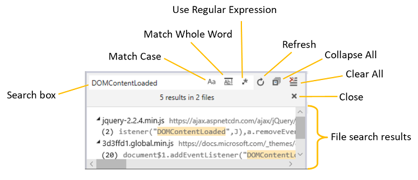
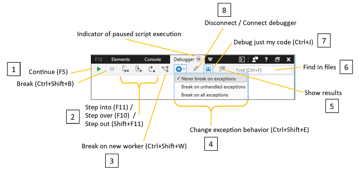
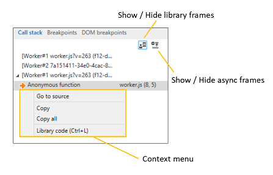
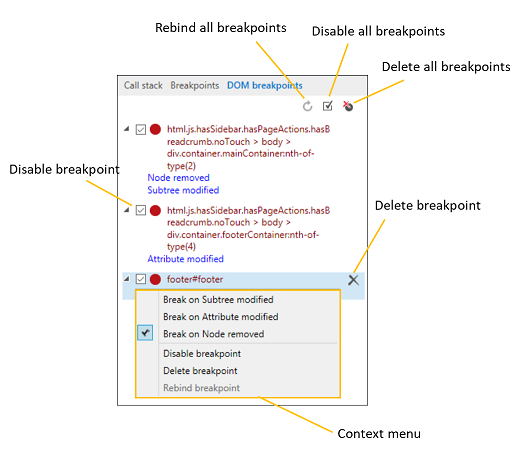

# Отладка — DevTools (EdgeHTML)

**Отладка** используется для пошагового кода, назначения часов и точек останова, редактирования кода в режиме онлайн и проверки кэшей. Протестировать код и устранить неполадки с помощью:

- [Просмотр и](#resource-picker) поиск [кода](#file-search) из загруженных исходных файлов
- [Управление потоком выполнения](#toolbar) при выполнении кода
- [Управление ресурсами хранилища страниц,](./storage.md#cache-manager)включая службы и [кэш,](./service-workers.md) [файлы cookie и](./storage.md#cookies-list) [веб-хранилище](./storage.md#local-and-session-storage-managers)  
- [Установка точек останова и редактирование кода](#debug-window) в режиме онлайн при его запуске
- [Отслеживание и редактирование локальных переменных](#watches) во время отлаживки
- [Скрытие или отображение асинхронного кода](#call-stack) и кода библиотеки из стека вызовов при необходимости
- [Добавление специализированных точек останова](#breakpoints) для XmlHttpRequests, событий и [модификаций DOM](#dom-breakpoints)


Сеанс отладки можно начать тремя способами.

1. **Установите точку останова.** Когда код достигнет его, вы введите отладок и сможете пошагово обходить код.
2. **Инициировать разрыв кода.** Нажмите [**кнопку "Разрыв"**](#toolbar) *(значок* приостановки) панели инструментов или `Ctrl+Shift+B` . Отладка будет разорвана при следующем выполнении.
3. **Настройка поведения исключения.** Используйте меню [**"Изменение поведения исключения"**](#toolbar) () для взлома отлада, когда код `Ctrl+Shift+E` вырывать исключение. По умолчанию для отладка исключений установлено значение *"Никогда*не разрывать", но они регистрируются в консоли.

## Выбор ресурсов

Часто первым этапом отладки является настройка точек останова в коде для устранения неполадок. В области "Выбор ресурсов" можно найти все ** файлы кода, загруженные страницей, включая *HTML-, CSS-* и *JS-файлы.*

 Если щелкнуть запись файла, откроется вкладка для этого файла в окне "Отладка" и полужирным шрифтом будет указан текст имени файла (как указано на рисунке выше). [](#debug-window) ** Затем можно установить точки останова в этом файле в [окне отлаки.](#debug-window)


В ** контекстном меню "Выбор ресурсов" можно также пометить файл как код библиотеки **(** ), что дает возможность пропустить этот код в отладщике и скрыть его в области стека `Ctrl+L` вызовов. [ **** ](#call-stack) [](#debug-window) Если нажать кнопку (или) снова, файл снова будет переходить к предыдущему значению в качестве кода кода `Ctrl+L` или *кода библиотеки.* **

### Поиск файлов

Используйте команду *"Найти в файлах"* () при использовании определенной строки кода, который вы пытаетесь найти `Ctrl` + `Shift` + `F` в источнике. Панель инструментов предоставляет различные варианты поиска, включая регулярные выражения. Если щелкнуть результат поиска, окно отлаки будет фокусироваться на указанном файле и строке. **



## Окно отлаки

В *окне "Отлаживка"* вы можете установить точки останова, пошаговое написание кода и отредактировать сценарий в режиме онлайн во время отлаживки. Щелкните слева от любой команды сценария, чтобы добавить (или удалить) **точку останова.** Используйте контекстное меню щелчка правой кнопкой ** мыши или в области точек останова, чтобы добавить условие в точку останова, заявив логическое выражение, которое приводит к разрыву отладки, если в этом расположении он имеет true. [****](#breakpoints) **


Другие функции окна отлаки включают элементы управления для:

### 1. Редактирование кода

Вы можете редактировать JavaScript в режиме онлайн во время сеанса отладки. После внесения изменений нажмите кнопку "Сохранить" (), чтобы проверить изменения при следующем запуске <strong> </strong> этого раздела `Ctrl+S` кода. Если у вас есть несъемные изменения в коде, перед именем файла на вкладке *"Отбивка"* появится звездочка (\*).

Нажмите **кнопку "Сравнить документ с исходным",** чтобы просмотреть изменения.


Помните о следующих ограничениях:

- Редактирование сценариев работает только во внешних *JS-файлах* (и не `<script>` внедрено в *HTML)*
- Изменения сохраняются в памяти и очищаются при повторной загрузке документа, поэтому вы не сможете запускать изменения в обработке, например `DOMContentLoaded`
- В настоящее время не существует **** способа (например, сохранить как) сохранить изменения на диске из DevTools

### 2. Форматирование кода

Используйте эти элементы управления, чтобы отформализировать минифицированный код для лучшей удобочитаемости во время отлаки:

#### Pretty print ( `Ctrl+Shift+P` ) 
Добавляет разрывы строки и выравнивание фигурных скобок в соответствии с соглашениями JavaScript. Даже сжатый код, который был более учитаем с помощью этого параметра, может иметь имена функций, селекторов и переменных, которые значительно отличаются от исходного кода. В таких случаях может быть доступен параметр [*"Toggle source maps".*](#source-maps)

#### Перенос в Word ( `Alt+W` )
Настраивает код в зависимости от текущих полей окна отлажиивания (избавляя от необходимости горизонтальной прокрутки).

### 3. Области кода

Вы можете направить отладку на игнорирование определенных файлов с помощью кнопки **"Пометить** как код `Ctrl+L` библиотеки" (). По умолчанию [****](#toolbar) кнопка "Отладка" только на панели инструментов кода находится в режиме "Отладка", то есть отладка будет пропускать все файлы, которые вы пометите как код библиотеки, и они не будут отображаться в стеке вызовов ** отладки. [](#call-stack) При нажатии кнопки **(пометить как мой код)** этот `Ctrl+L` флаг будет удаляться.

Для отслеживания библиотек во время сеансов отладки можно редактировать эти файлы для сохранения списка по умолчанию или добавлять поддиапные знаки для домена или типа файла:

```JavaScript
%APPDATA%\..\LocalLow\Microsoft\F12\header\MyCode.json and %APPDATA%\..\Local\Microsoft\F12\header\MyCode.json
```

#### Исходные карты

Вы увидите кнопку **"Toggle source maps"** *для* кода, написанного на языке, который компилирует в JavaScript или CSS и предоставляет исходную карту (промежуточное сопоставление файлов с исходным источником). Этот параметр направляет отладку представить исходный источник для отладки (а не скомпилировать файл, который фактически работает в браузере). **

DevTools проверит, содержит ли компилятор, который вызвал файл JavaScript, комментарий с именем файла карты. Например, если компилятор ** myfile.js*myfile.min.js, *он также может создать файл карты, *myfile.min.js.map* и включить комментарий в сжатом файле, например:

```JavaScript
//# sourceMappingURL=myfile.min.js.map
```


Если DevTools не может найти карту автоматически, вы можете выбрать для этого файла исходный файл. Щелкните правой кнопкой мыши вкладку файла, чтобы выбрать **вариант "Выбор карты источника".** 

## панель инструментов;

Используйте панель инструментов *отладки,* чтобы контролировать пошаговую отладку или игнорирование кода. Здесь вы также можете искать определенные строки в файлах кода в полном тексте.



### 1. Continue ( `F5` ) / Break ( `Ctrl+Shift+B` )
 **Продолжить** ( `F5` ) продолжает выполнение кода до следующей точки останова. Удерживая `F5` вниз, вы будете повторять разрывы до тех пор, пока вы не отпустите его. 

 **Разрыв** `Ctrl+Shift+B` () вряжится в отладок после запуска следующего заявления.

### 2. Пошаговая функция ( `F11` , `Ctrl+F10` , `Shift+F11` )
 **Пошаговая** `F11` по 

 **Пошаговая** `Ctrl+F10` по 

 **Шаг ()** выход из текущей `Shift+F11` функции и в вызываемую функцию. 

 Если отладка не используется при работе с этими командами, отладив его, отладив следующий шаг, он будет перенаступить к следующему.

### 3. Break on new worker ( `Ctrl+Shift+W` )
 Разрывает создание нового [веб-рабочего.](https://developer.mozilla.org/docs/Web/API/Web_Workers_API/Using_web_workers)

### 4. Управление исключениями
**Изменение поведения исключения** ( ) открывает параметры, чтобы изменить реакцию отладка `Ctrl+Shift+E` на исключения. По умолчанию отладитель игнорирует исключения и занося их в [**консоль.**](./console.md) Вы можете сделать перерыв для всех исключений или только *тех,* которые не обрабатываются с помощью заявлений в коде ( приорвать `try...catch` *необработаные исключения).*

### 5. Просмотр результатов поиска
(В настоящее время отключено.) **Отображение и скрытие результатов** приводит к перетащите отображение результатов поиска [*"Найти в*](#6-find-in-files-ctrlf) файлах".

### 6. Поиск в файлах ( `Ctrl+F` )
 **Поиск в файлах** ( ) выполняет текстовый поиск по всем `Ctrl+F` загруженным файлам в [*оке*](#resource-picker)выбор ресурсов. Если текст найден, открывается первый файл, совпадающий со строкой поиска. `Enter`Нажатие `F3` или перенажатие к следующему совпадению.

### 7. Отлаговка только кода ( `Ctrl+J` )
 **Отладка** только моего кода ( ) действует как переключек, чтобы включить или исключить все файлы, которые были помечены как код библиотеки при пошаговом `Ctrl+J` [](#3-code-scoping) отладке.

### 8. Подключение отладки
**Отладка отключения** и подключения является, по сути, переключателем включаемой или выключенной отладки.

## Часы

Используйте **** область "Часы", чтобы просмотреть каталог всех объектов и переменных **(locals),** как в локальной, так и в глобальной области, доступной для утверждения, который находится в фокусе текущего разрыва в отладке.


Вы можете отслеживать значения определенных переменных при их впуске и выходе из области, добавляя часы **(** Добавить часы ) и изменяя любые редактируемые значения, дважды щелкнув его или выбрав "Изменить значение" в контекстном `Ctrl+W` меню. **** ** Удалите свои часы с помощью кнопки **"Удалить"** `Ctrl+D` () / **"Удалить все** кнопки" или из контекстного меню. 

## Сведения

В *области* сведений есть вкладки [**«Callstack,**](#call-stack) [**Breakpoints и**](#breakpoints) [**DOM breakpoints».**](#dom-breakpoints)

### Стек вызовов

На **вкладке стека** вызовов показана цепочка функций, которая привела к текущей точке выполнения. Текущая функция отображается вверху, а вызывающая функция отображается под ней в обратном порядке.



Кнопка **"Показать/скрыть кадры** библиотеки" () отнимет выходные данные кода библиотеки `Ctrl+Shift+J` из стека вызовов. [](#3-code-scoping) Используйте параметр **"Код** библиотеки" () в контекстном меню правой кнопкой мыши, чтобы пометить (или отметить) источник выбранного кадра в качестве `Ctrl+L` кода ** библиотеки. 

Кнопка **"Показать/скрыть асинхронные кадры"** подавляет отображение корней для вызовов асинхронных функций.

### Точки останова

На **вкладке "Точки** останова" можно управлять точками останова и трассировками событий, включая настройку условий, их отключение и удаление.


Вот сводка по различным типам точек останова, которые можно использовать для отладки.

Тип точки останова | Описание | Настройка
:------------ | :------------ | :--------
**Точка останова** | Врывается в отладок сразу перед выполнением указанной строки кода. Обычные точки останова проще всего установить, если в строке имеется по одному заявлению. | В [окне "Отлаживка"](#debug-window)щелкните в левом поле рядом с любым номером строки в коде. Появится красная точка, и установлена точка останова. Вы можете перейти к источнику любой точки останова, щелкнув ее синий текст.
**Условная точка останова** | Разрывается, если указанное условие оценивается как *истинное.* По сути, это `if(condition)`  необходимо для взлома отлада.  | На вкладке ["Точки](#breakpoints) останова" наведите курсор на существующую точку останова и нажмите кнопку "карандаш"*(* Добавить условие к этой точке останова), щелкните правой кнопкой мыши существующую точку останова и выберите **"Условие"...** в контекстном меню. Укажите условие "if" для оценки в расположении точки останова. 
**Точка останова XMLHttpRequest** (условие w/optional) | Разрывается при выполнении запроса XMLHttpRequest (XHR). Вы можете проверить объект XHR `response` из области [**"Часы".**](#watches) | На [вкладке "Точки останова"](#breakpoints) нажмите кнопку точки останова *XMLHttpRequest* (круг со стрелками вверх или вниз). Его можно превратить в *условную точку останова,* как описано выше.
**Точка трассировки событий** | Вызовы [`console.log()`](./console/console-api.md#logging-custom-messages) с указанной строкой в ответ на определенное событие. Используйте его для временных консолей ведения журнала, которые не нужно сохранять непосредственно в коде обработера событий. | На [вкладке "Точки останова"](#breakpoints) нажмите кнопку *трассировки* событий (диагонали с шариком). Выберите тип **события** для триггера и **выписку trace** для ведения журнала.
**Точка останова события** (необязательное условие) | Разрывается каждый раз, когда заданное событие и произошло. | На [вкладке "Точки останова"](#breakpoints) нажмите *кнопку* точки останова события (круг с шариком). Выберите тип **события** для триггера и при желании укажите **условие.** 
**Точка останова DOM** | Разрывается при изменении указанного элемента на странице, например при изменении его подпотека, изменении его атрибутов или отсоедине от DOM. | На [вкладке "Элементы"](./elements/dom-breakpoints.md) щелкните правой кнопкой мыши исходный элемент и выберите один из параметров *точек останова DOM.* Используйте [**вкладку "Точки останова DOM"**](#dom-breakpoints) на панели отладки или элементов для управления точками останова. ** ** 

Условные точки останова и точки трассировки имеют доступ ко всем локальным и глобальным переменным, которые в настоящее время находятся в области действия, когда они врезаются в отладок.

### Точки останова DOM

Управляйте точками останова изменения doM на вкладке "Точки останова **DOM",** включая отключение, удаление и переназначение.  [Точки останова DOM можно установить из](./elements/dom-breakpoints.md) *древового представления HTML* на панели **элементов.**



Вкладка "Точки останова **** *DOM"* в отладке предоставляет эквивалентные функции вкладке *DOM breakpoints** на **панели элементов.**

Ниже подробно о различных типах точек останова [DOM.](./elements/dom-breakpoints.md)

## Ярлыки

### Ярлыки на панели инструментов

Действие | Установленное напрямую доверие
:------------ | :-------------
Поиск | `Ctrl` + `F`
Продолжить (с точки останова) | `F5` или `F8`
Быстрое продолжение | `F5`Удержание или `F8`
Продолжить и обновить | `Ctrl` + `Shift` + `F5`
Break | `Ctrl` + `Shift` + `B`
Пошаговая | `F11`
Пошаговая пошаго | `F10`
Шаг с выходом | `Shift` + `F11`
Приорваться к новому сотруднику | `Ctrl` + `Shift` + `W`
Изменение поведения исключения (меню "Открытие") | `Ctrl` + `Shift` + `E`
Отлагивание только кода | `Ctrl` + `J`

### Ярлыки для выборки ресурсов

Действие | Установленное напрямую доверие
:------------ | :-------------
Пометить как мой код или код библиотеки | `Ctrl` + `L`
Открыть файл | `Ctrl` + `O`, `Ctrl` + `P`
Поиск во всех файлах | `Ctrl` + `Shift` + `F`

### Ярлыки окна отлаживки

Действие | Установленное напрямую доверие
:------------ | :-------------
Удаление точки останова | `F9`
Отключение точки останова | `Ctrl` + `F9`
Условная точка останова... | `Alt` + `F9`
Копировать | `Ctrl` + `C`
Сохранить | `Ctrl` + `S`
Перейдите к строке... | `Ctrl` + `G`
Показать следующий шаг | `Alt` + `Num` + `*`
Запуск курсора | `Ctrl` + `F10`
Set next statement | `Ctrl` + `Shift` + `F10`
Показать в оке "Выбор файлов" | `Ctrl` + `Alt` + `P`
Перейти к определению в файле | `Ctrl`+`D`
Поиск ссылок в файле | `Ctrl` + `Shift` + `D`
Очень хорошая печать | `Ctrl` + `Shift` + `P`
Перенос в Word | `Alt` + `W`
Пометить как мой код или код библиотеки | `Ctrl` + `L`
Отключать и включать вкладки в редакторе. **Примечание.** Если вы используете клавиатуру для навигации в отладке, вы не сможете вывести вкладку из редактора, пока не отключит вкладку | `Ctrl` + `M`

### Ярлыки для области "Часы"

Действие | Установленное напрямую доверие
:------------ | :-------------
Добавление часов | `Ctrl` + `W`
Удаление часов | `Ctrl` + `D`

### Ярлыки для области сведений

| Действие                             | Установленное напрямую доверие                 |
|:-----------------------------------|:-------------------------|
| Показать или скрыть кадры из кода библиотеки | `Ctrl` + `Shift` + `J`   |
| Включить все точки останова             | `Ctrl` + `Shift` + `F11` |
