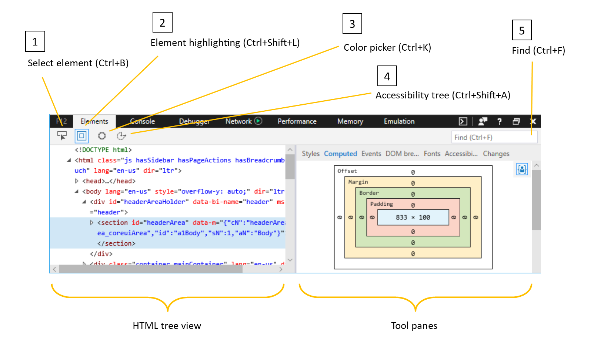
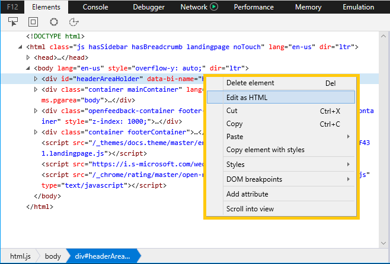
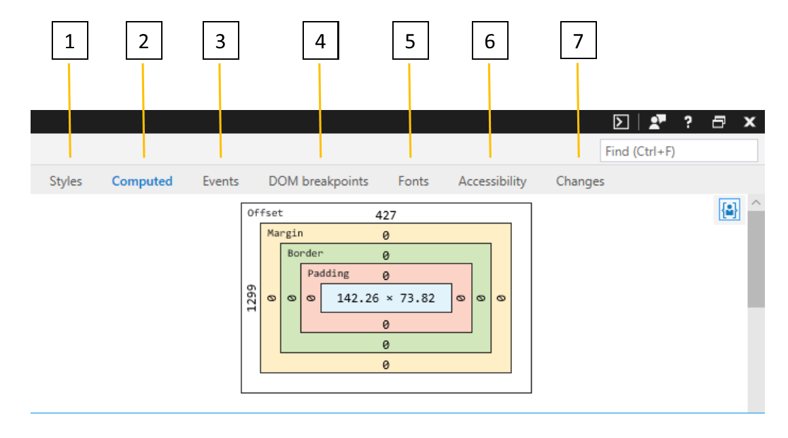

# ЭлементыElements

Панель **элементов** позволяет:The **Elements** panel helps you to:

* [Определение и редактирование элементов в дереве HTML](#html-tree-view) текущей страницы[Identify and edit elements in the HTML tree](#html-tree-view) of the current page
* [Проверка и изменение CSS](./elements/styles.md) на странице, включая псевдо-состояния и псевдоэлементы[Inspect and modify CSS](./elements/styles.md) on the page, including pseudo-states and pseudo-elements
* [Понимание каскада стилей](./elements/computed.md) и макета CSS, происходящих на странице[Understand the CSS layout and style cascade](./elements/computed.md) happening on the page
* [Отслеживание мошеннических обработчиков событий](./elements/events.md) для их отлаки[Track down rogue event handlers](./elements/events.md) so you can debug them
* Установите точки останова отладки для [неожиданных визуальных изменений,](./elements/dom-breakpoints.md) чтобы перейти в код, вызывающий их[Set debugging breakpoints for unexpected visual changes](./elements/dom-breakpoints.md) to jump into the code causing them
* [Получите подробные сведения о шрифтах,](./elements/fonts.md) используемых на странице, и о том, откуда они загружаются[Get detailed information about the fonts used on the page](./elements/fonts.md) and where they're loading from
* [Просмотр страницы с точки](./elements/accessibility.md) зрения чтения с экрана для проверки и проверки доступности[View your page from a screen reader's point of view](./elements/accessibility.md) to verify and test accessibility 
* [Просмотр хода изменений CSS,](./elements/changes.md) которые вы внося при отлачивии пользовательского интерфейса страницы[Review a running diff of the CSS changes](./elements/changes.md) you make as you debug the UI of your page

## Представление дерева HTMLHTML tree view

1. Используйте элемент **Select** () для поиска элемента в представлении дерева `Ctrl+B` **HTML,** щелкнув его на странице.Use the **Select element** (`Ctrl+B`) tool to locate an element in the **HTML tree view** by clicking on it in the page.

2. Используйте средство **выделения элементов** () для поиска элемента на странице путем наведении на него курсор в `Ctrl+Shift+L` **представлении дерева HTML.**Use the **Element highlighting** (`Ctrl+Shift+L`) tool to locate an element on the page by hovering over it in the **HTML tree view**.

3. Откройте средство **"Выбор цвета"** (), чтобы увидеть список цветов, `Ctrl+K` которые используются на текущей странице.Open the **Color picker** (`Ctrl+K`) tool to see a list of the colors in use on the current page. Щелчок цвета в списке предоставит дополнительные сведения (hue, Saturation, Lightness, Alpha).Clicking on a color on the list will provide further details (Hue, Saturation, Lightness, Alpha). Элемент *управления "Выбор* цвета" также открывается при нажатии \*\*\*\* цветного квадрата рядом со значением цвета в области стилей, что позволяет изменить цвет элемента страницы и сразу же увидеть результаты.The *Color picker* also opens when you click on the colored square next to a color value in the **Styles** pane, allowing you to edit the color of a page element and immediately see the results.

4. Кнопка **"Дерево** доступности" () откроет дерево доступности, в котором показана структура страницы, как это может показаться специальным технологиям, таким как экранный диктор `Ctrl+Shift+A` [Windows.](https://support.microsoft.com/help/22798/windows-10-narrator-get-started) The **Accessibility tree** (`Ctrl+Shift+A`) button will open the [Accessibility tree](./elements/accessibility.md) pane showing the structure of your page as it would appear to an assistive technology, such as the [Windows Narrator](https://support.microsoft.com/help/22798/windows-10-narrator-get-started) screenreader.

5. Вы также можете **найти** () элемент в представлении дерева HTML, выполнив поиск его имени `Ctrl+F` тега, атрибутов или текстового содержимого.You can also **Find** (`Ctrl+F`) an element in the HTML tree view by searching for its tag name, attributes, or text content.

### Элементы редактированияEditing elements

Вы можете изменить элемент, щелкнув его правой кнопкой мыши в представлении дерева HTML и выбрав "Изменить как **HTML"** в контекстное меню.You can edit an element by right-clicking on it within the HTML tree view and selecting **Edit as HTML** from the context menu. Контекстное меню также предоставляет параметры для удаления, вырезания, копирования, вики- и настройки псевдо-классов CSS (*:active,* *:focus,* *:hover*, *:visited)* и добавления атрибутов.The context menu also provides options to delete, cut, copy, paste, set CSS pseudo-classes (*:active*, *:focus*, *:hover*, *:visited*) and add attributes. Другой способ изменить атрибут и(или) его значение — дважды щелкнуть его в представлении дерева HTML.Another way to edit an attribute and/or its value is to double-click it from the HTML tree view.

> [!NOTE]
> Редактирование дерева HTML не влияет на базовую разметку источника.Editing the HTML tree does not affect the underlying source markup. Обновление страницы позволит отостановить изменения и отрисовки только макета, определяемой источником страницы.Refreshing the page will revert your changes and render only the layout determined by the page source. Вы можете **скопировать** измененный HTML-код в буфер обмена, щелкнув правой кнопкой мыши нужный элемент (или глобальный элемент, если требуется вся страница), чтобы открыть `html` контекстное меню.You can **Copy** your modified HTML to the clipboard by right-clicking the desired element (or the global `html` element, if you want the entire page) to open up the context menu. (**Также** доступны **параметры вырезания** и в paste.(**Cut** and **Paste** options are also available).

В области [стилей](./elements/styles.md) можно также добавлять, удалять и редактировать псевдо-состояния CSS и псевдоэлементы.From the [Styles](./elements/styles.md) pane you can also add/delete/edit CSS pseudo-states and pseudo-elements.

## Области инструментовTool Panes

Выбрав интересующие вас элементы страницы, вы можете использовать области инструментов для дальнейшего просмотра его различных стилей и свойств доступности, просмотра прослушивателей событий и назначения точек останова изменения doM.Once you have selected a page element of interest, you can use the tool panes to further inspect its different styles and accessibility properties, view its event listeners, and set DOM mutation breakpoints.

1. [**Стили**](./elements/styles.md): в настоящее время примененные стили, уорганизованные в таблицу стилей[**Styles**](./elements/styles.md): Currently applied styles organized by stylesheet

2. [**Computed**](./elements/computed.md): в настоящее время примененные стили, у организованы по атрибутам CSS[**Computed**](./elements/computed.md): Currently applied styles organized by CSS attributes

3. [**События:**](./elements/events.md)прослушиватели событий, зарегистрированные в текущем элементе и предках[**Events**](./elements/events.md): Event listeners registered on the current element and ancestor elements

4. [**Точки останова DOM:**](./elements/dom-breakpoints.md)точки останова при снобизме doM[**DOM breakpoints**](./elements/dom-breakpoints.md): DOM Mutation Breakpoints 

5. [**Fonts**](./elements/fonts.md): currently applied fonts for a selected element[**Fonts**](./elements/fonts.md): Currently applied fonts for a selected element

6. [**Accessibility**](./elements/accessibility.md): Accessibility properties[**Accessibility**](./elements/accessibility.md):  Accessibility properties

7. [**Изменения:**](./elements/changes.md)изменения CSS, внесенные во время сеанса диагностики[**Changes**](./elements/changes.md): CSS changes made during diagnostic session  

## ЯрлыкиShortcuts

| ДействиеAction               | Установленное напрямую довериеShortcut               |
|:---------------------|:-----------------------|
| Панель элементовElements panel       | `Ctrl` + `1`           |
| Выделение элементовElement highlighting | `Ctrl` + `Shift` + `L` |
| Элемент SelectSelect element       | `Ctrl` + `B`           |
| ПалитраColor picker         | `Ctrl` + `K`           |
| Дерево доступностиAccessibility tree   | `Ctrl` + `Shift` + `A` |
