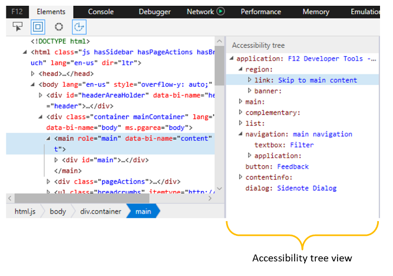

# Accessibility — DevTools (EdgeHTML)  

Просмотр доступных свойств, присвоенных выбранному элементу. Наведите на любое из имен свойств описание того, как оно используется вспомогательными технологиями. Можно также щелкнуть правой кнопкой мыши любое свойство, чтобы скопировать его значение в буфер обмена.

Полезно открыть дерево доступности для перемещения по странице, как это было бы для чтения с экрана, а затем с помощью области "Accessibility" проверить сведения о свойствах, которые могут быть интересны.  ****

## Дерево доступности  

На **** древостройке "Доступность" показана структура страницы, которая будет отображаться для вспомогательных возможностей, таких как экранное устройство с экранным [диктором Windows.](https://support.microsoft.com/help/22798/windows-10-narrator-get-started)

При щелчке по узлу в древовом представлении он также выбирается в [**дереве HTML**](../elements.md#html-tree-view)и наоборот. Выбор доступного элемента из *htmL-представлений* или дерева доступности также позволит получить дополнительные сведения о свойствах доступности в области инструментов ** "Accessibility". **** 

<!--  Here are further resources on [Accessibility with Microsoft Edge](../../accessibility.md).  -->  
