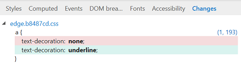

# ИзмененияChanges
Просмотр изменений CSS, внесенных во время сеанса  диагностики DevTools (из области редактирования стилей и вычислений  CSS).View the CSS changes you made during your DevTools diagnostic session (from the [Styles](./styles.md) and [Computed](./computed.md) CSS editing panes). Как и в других средствах, удаленные строки отображаются красным цветом, а добавленные строки — зеленым.Similar to the conventions of other diffing tools, deleted lines appear in red and added lines are green.

Вы также можете (из контекстного меню щелчка правой кнопкой мыши) скопировать изменения в буфер обмена, отыскать изменения или перейти к их исходным расположениям.You can also (from the right-click context menu) copy  your changes to the clipboard, revert your changes, or jump to their source location.
