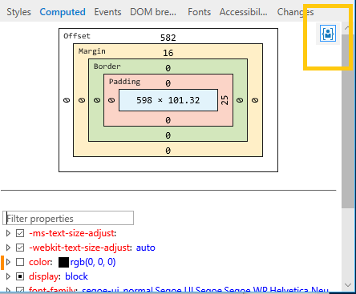

# Вычислено

См. схему модели поля (ширина, заполнение, граница, поля и значения смещения) выбранного элемента. Если включить средство **** выделения элементов ( ), те же цветные области на схеме (для ширины, заполнения и т. д.), которые будут наложены на отрисовку элемента при его выборе на `Ctrl+Shift+L` странице. Можно изменить любое значение на схеме, щелкнув его. 

Под схемой модели полей находится фильтруемый и редактируемый список вычисляемых свойств стиля. Отключение активного свойства активирует следующее свойство в каскаде, если оно существует. Изменения можно просмотреть в [**области**](./changes.md) "Изменения".

Кнопка **"Отображать только стили** пользователя" по умолчанию находится в режиме "Отображать стили". При нажатии кнопки ** в список вычисленных стилей будут включены стили из таблицы стилей Microsoft Edge по умолчанию.

