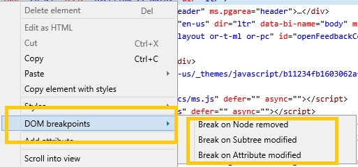
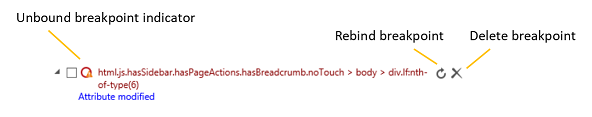

# Точки останова DOM

Управляйте точками останова изменения doM на этой области, включая их отключение, удаление и переназначение.

Вы можете использовать точки останова модификации DOM, чтобы вламывать отладить каждый раз, когда изменяется выбранный узел элемента. Это полезно для отслеживания кода, который вызывает визуальные сбои в пользовательском интерфейсе без необходимости устанавливать отдельные точки останова для каждого API DOM 450+ в *EdgeHTML,* которые могут вызывать такие изменения. 

Чтобы установить точку останова DOM, щелкните **** правой кнопкой мыши любой элемент в *HTML-представлении HTML* панели элементов, чтобы открыть контекстное меню.

Можно установить любую из следующих точек останова:

 - **Break on Node removed**: Break into the debugger when the selected element is removed from the document (DOM tree).

 - **Break on Subtree modified**: Break into the debugger when any of the descendants of the selected element are changed (added, removed, or their subtrees are modified). Это не будет нарушать при изменениях атрибутов (см. следующий вариант).

 - **Break on Attribute modified**: Break into the debugger when an attribute of the selected element is added, removed or changed in value.

Затем в области "точки останова **DOM"** отображится выбранный элемент (путем создания селектора, описывающий его расположение в DOM) и типы установленных точек останова (узел*удален, подtree изменен,* изменен атрибут). Здесь вы также можете переназначать, ** отключать или удалять точки останова по отдельности (из контекстного меню rt-click) или одновременно (с помощью кнопок). ** **

## Сохраняемость точки останова

Точки останова хранятся (и устанавливаются на уровне URL-адреса страницы, в пределах каждой из них) как часть параметров DevTools. Когда страница будет перезагружена или инструменты будут закрыты и повторно открыты, DevTools попытается перенагрузить точки останова для связанных с ними элементов.

Точки останова, которые не могут быть автоматически переназначаемы, обозначены значком предупреждения в круге точки останова. Для этого можно дождаться переназначаемого элемента вручную (с помощью кнопки «Rebind **breakpoint»** или параметра контекстного меню), когда соответствующий элемент **** появится в DOM (а значок точки останова больше не отображает индикатор предупреждения) или полностью удалит точку останова.

Помимо этой области точек останова *DOM,* вы также можете управлять точками останова [DOM](../debugger.md#dom-breakpoints) в **отладке.**

## Текущие ограничения

Помните о следующих ограничениях отладки точек останова DOM в Edge DevTools:

- Edge DevTools в настоящее время не поддерживает повторное переназначение точек останова внутри [ `<iframe>` s](https://developer.mozilla.org/docs/Web/HTML/Element/iframe). Если установить точку останова в iframe и закрыть Edge DevTools или обновить страницу, точка останова будет потеряна.

- Если ваш сценарий сталкивается с синхронно выполненной точкой останова перед выполнением DOM, вы не сможете установить точку останова DOM, пока отладка [`readyState`](https://developer.mozilla.org/docs/Web/API/Document/readyState) приостановлена. Как правило, эту ситуацию можно исправить, установив [`defer`](https://developer.mozilla.org/docs/Web/HTML/Element/script#Attributes) атрибуты [`async`](https://developer.mozilla.org/docs/Web/HTML/Element/script#Attributes) или скрипт.

- Для синхронных сценариев при вызывается автоматическое переназначение точек [`window.onload`](https://developer.mozilla.org/docs/Web/API/GlobalEventHandlers/onload) останова. В этом случае мы можем пропустить точки останова привязки, которые будут запускаться при первоначальном создании DOM на основе скриптов. Для асинхронных сценариев мы запускаем попытку переназначаем перед выполнением первого сценария, поэтому точки останова могут быть переназначены и активизированы по мере желаний.
