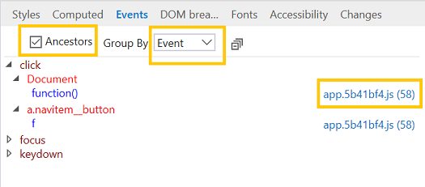

# МероприятияEvents 

Просматривайте прослушиватели событий, зарегистрированные в выбранном элементе, и (при желании, с помощью перегона) своих предков.View the event listeners registered on the selected element and (optionally, using the checkbox toggle) its ancestors. Это полезно для отслеживания прослушивателей мошеннических событий.This is useful for tracking down rogue event listeners. 

Прослушиватели событий можно сгруппить по **событиям** или **элементам.**You can group the event listeners by either **Event** or **Element**. Если щелкнуть синюю гиперссылки рядом с именем обработика событий, отладник откроется в расположении этой функции.Clicking the blue hyperlink next to the event handler name will open the debugger to the location of that function.

