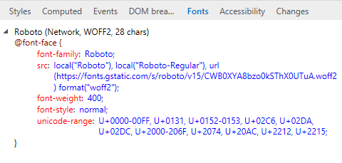

# ШрифтыFonts

Просмотр сведений о правилах CSS, в том числе о том, где загружаются шрифты (локальные или сетевые) и о том, сколько символов на `@font-face` странице их использует.\*\* \*\*View information about your CSS `@font-face` rules, including where fonts are being loaded (*Local* or *Network*) and how many characters on the page are using them.

Для шрифтов, загруженных из сети, DevTools отобразит правило, которое импортирует его вместе с псевдонимом и типом шрифта.For fonts loaded from the network, DevTools will display the rule that imported it along with alias and font type.

