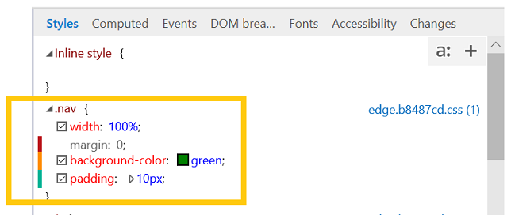

# Стили

Просмотр и редактирование примененных стилей, организованных по таблицам стилей.  При внесении изменений в свойства цветная индикаторная полоска будет отображаться для измененных (желтых), добавленных (зеленый) и удаленных (красных) свойств.

Вы можете отобразить панель псевдоуголий, нажав кнопку **"a:".** Определите новое правило стиля, нажав кнопку "" или щелкнув правой кнопкой мыши в области стилей, чтобы **+** открыть контекстное **** меню.

## Редактирование псевдоэлементов

С помощью области стилей можно добавлять, редактировать и удалять псевдоэлементы и псевдоуголи. Чтобы применить псевдовыгодную CSS к ** выбранному элементу, откройте панель псевдоучетов **(а:** кнопка) и внесите нужный класс в пометку.

Чтобы добавить псевдоэлемент, нажмите кнопку (Новое правило стиля) и отредактируете его так же, как **+** и в обычной таблице стилей.**

Псевдоэлементы группировать под собственными заголовками в *области* стилей.
