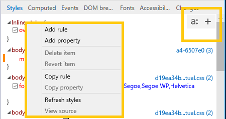
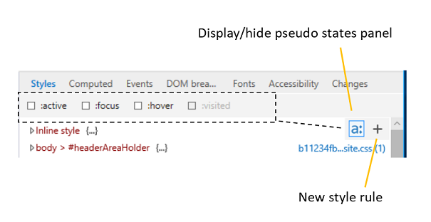
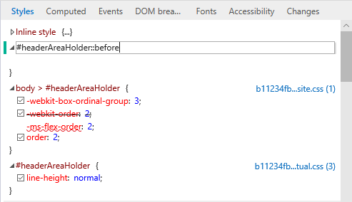

# СтилиStyles

Просмотр и редактирование примененных стилей, организованных по таблицам стилей.View and edit the currently applied styles, organized by stylesheet.  При внесении изменений в свойства цветная индикаторная полоска будет отображаться для измененных (желтых), добавленных (зеленый) и удаленных (красных) свойств.As you make changes to your properties, a colored indicator bar will appear for changed (yellow), added (green), and deleted (red) properties.

Вы можете отобразить панель псевдоуголий, нажав кнопку **"a:".**You can display the pseudo states panel by clicking the "**a:**" button. Определите новое правило стиля, нажав кнопку "" или щелкнув правой кнопкой мыши в области стилей, чтобы **+** открыть контекстное \*\*\*\* меню.Define a new style rule by clicking the "**+**" button or right-clicking anywhere in the **Styles** pane to open the context menu.

## Редактирование псевдоэлементовEditing pseudo elements

С помощью области стилей можно добавлять, редактировать и удалять псевдоэлементы и псевдоуголи.Use the Styles pane to add, edit, and delete pseudo elements and pseudo states. Чтобы применить псевдовыгодную CSS к \*\* выбранному элементу, откройте панель псевдоучетов **(а:** кнопка) и внесите нужный класс в пометку.To apply a CSS pseudo state to the selected element, open the *Pseudo states panel* (**a:** button) and tick the desired class.

Чтобы добавить псевдоэлемент, нажмите кнопку (Новое правило стиля) и отредактируете его так же, как **+** и в обычной таблице стилей.\*\*To add a pseudo element, click the **+** (*New style rule*) button and edit as you would a regular stylesheet.

Псевдоэлементы группировать под собственными заголовками в *области* стилей.Pseudo elements are grouped under their own headings in the *Styles* pane.
