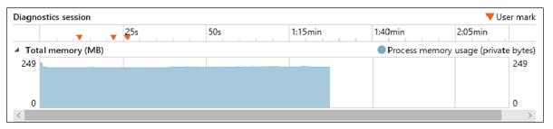
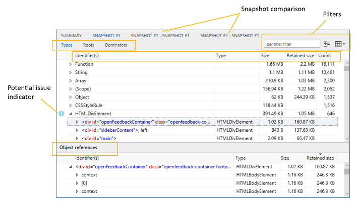
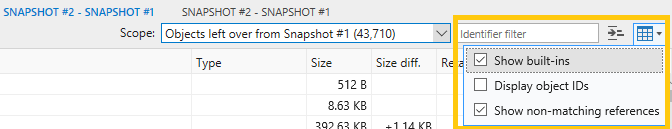

# Память

Используйте панель **"Память",** чтобы оценить использование системных ресурсов и сравнить моментальные снимки кучи в разных состояниях выполнения кода. С его помощью вы можете:

- [График использования памяти страницы](#memory-usage-timeline) в режиме реального времени и снимки кучи
- [Определение потенциальных проблем с](#snapshot-summary) памятью в коде, таких как сохраненные объекты, не подключенные к DOM
- [Просмотр данных об использовании памяти](#snapshot-details) по типу объекта, подсчету экземпляров, размеру и ссылкам, чтобы изолировать проблемы
- [Применение фильтров данных моментальных](#filters) снимков для уменьшения шума неанимаемых сведений
- [Определение стоимости памяти определенного](#object-references) объекта и ссылок, которые его содержат
- [Diff the heap at different phases of your investigation](#snapshot-comparison) to track down the source of memory leaks and other problems

## панель инструментов;

1. **Запуск/остановка сеанса профилирование (CTRL+E):** включение профиля позволяет отслеживать использование памяти и делать моментальные снимки кучи.
2. **Импорт сеанса профилирование (CTRL+O):** загрузка сохраненного сеанса диагностики памяти DevTools.
3. **Экспортировать сеанс профилирование (CTRL+S):** сохраните текущий сеанс диагностики на диск.
4. **Снимок кучи (CTRL+SHIFT+T):** запись текущих выделений памяти на заданный момент времени.

## Временная шкала использования памяти

Проблемы с памятью могут стать главной причиной проблем с производительностью, из-за чего страница со временем становится все более неотвеченной и запаздыванием.

Первым шагом при анализе использования памяти страницы  является запуск сеанса профилирование, чтобы сделать моментальные снимки кучи до или после него при повторном анализе действий, вызывающих большой объем памяти или предположительное утечку памяти.

При запуске профиля памяти вы увидите график памяти процесса, который позволяет со временем наблюдать за общим частным рабочим набором (объемом памяти, потребляемой страницей). На графике памяти показано прямое представление памяти процесса вкладки, которая включает личные данные, тивную память и куч JavaScript. 

 На графике показана тенденция развития памяти для страницы, которая позволяет оценить  целесообразность создания снимка кучи для дальнейшего сравнения, например периоды непредвиденное хранение памяти.

### Performance.mark()

Вы можете **** добавить на временную шкалу настраиваемые пометки пользователя, чтобы определить ключевые события во время сеанса анализа, вызывая метод из кода или консоли [`Performance.mark()`](https://developer.mozilla.org/docs/Web/API/Performance/mark) DevTools. [****](./console.md)

### Console.takeheapSnapshot()

Иногда необходимо делать моментальные снимки в конкретные моменты времени, например непосредственно перед большим перемехаком DOM. В таких случаях снимки можно сделать программным [`Console.takeHeapSnapshot()`](./console/console-api.md#taking-heap-snapshots) путем.

## Сводка по моментальных снимкам

[При снимке](#toolbar) создается итоговая плитка, которая указывает размер кучи JavaScript на момент создания снимка, а также количество выделенных объектов и снимок экрана страницы. Вы можете продолжать делать моментальные снимки в любое время при запуске пользовательского сценария, требующего анализа. Моментальные снимки создают дополнительные плитки, каждый из которых показывает разницу в памяти JavaScript от предыдущего снимка.

Если щелкнуть значения на плитке сводки, переключимся на области с подробными [сведениями о моментальных снимках.](#snapshot-details) Потенциальные [проблемы с памятью обозначены](#snapshot-details) синим информационным значком ("i").

## Сведения о моментальных снимках

Данные в области *моментальных* снимков показывают объекты, созданные страницей, а также память, выделенную платформами JavaScript, которые вы можете использовать.

Эти три вкладки представляют различные представления данных:

#### Типы

Показывает количество экземпляров и общий размер объектов в куче, сгруппных по типу объекта. По умолчанию они сортироваться по подсчету экземпляров.

При выборе объекта в ** верхней области  типов таблица "Ссылки на объекты" в нижней области будет перечислять все объекты, которые указывают на этот объект.

#### Корневая

Показывает иерархическое представление ссылок на детей, чтобы описать, как объекты коренится в глобальном объекте, предотвращая их сбор мусора.

По умолчанию эти узлы сортироваться по столбце сохраненного размера с наибольшим значением в верхней части.

#### Предикторы

Отображает список объектов в куче, которые имеют исключительные ссылки на другие объекты. Обилители сортировать по сохраненным размерам, чтобы указать объекты, потребляющие больше всего памяти, которые потенциально проще освободить.

Вот как интерпретировать столбцы в представлениях *"Типы",* "Корневая *корня" и "Объехатели":*

Столбец | Описание
:------------ | :-------------
Идентификаторы | Имя, которое лучше всего идентифицирует объект. Например, для элементов HTML сведения моментального снимка показывают значение атрибута ID, если он используется.
Тип | Тип объекта (например, *HTMLDivElement).*
Size | Размер объекта, не включая размер объектов, на которые ссылается ссылка.
Сохраненный размер | Размер объекта плюс размер всех объектов-детей, у которых нет других родительских объектов. Для практических целей это объем памяти, который сохраняется объектом, поэтому при удалении объекта необходимо освободить указанный объем памяти.
Количество | Количество экземпляров объектов. Это значение отображается только в представлении "Типы".

При выборе объекта в верхней области *"Объекторы"* в таблице ссылок на объекты в нижней области будут перечисляться все объекты, которые указывают на этот объект. 

### Фильтры

Вы можете дополнительно настроить данные в таблице с помощью следующих данных:

1. **Фильтр идентификаторов:** фильтрация данных путем поиска определенного идентификатора объекта
2. **Группировать по**объектору: в представлении объектов верхнего уровня показываются только объекты с исключительными ссылками на другие объекты (это представление по умолчанию на вкладке ** *"Обзорчики").*
3. **Встроенные фильтры и ID:** по умолчанию встроенные объекты [JavaScript](https://developer.mozilla.org/docs/Web/JavaScript/Reference/Global_Objects) включены в список. Перечисление ИД объектов может быть полезно, если существует несколько анонимных объектов, которые необходимо различать.

Представления *"Типы",* "Корневая корня" и "Обилители" имеют собственный фильтр, поэтому фильтр не сохраняется при переключении на другое представление. **

### Ссылки на объекты

В [**представлениях "Типы**](#types) и [**обилители"**](#dominators) нижняя области содержит список ссылок на объекты, в котором отображаются общие ссылки. **** При выборе объекта в верхней области в этом списке отображаются все объекты, которые указывают на этот объект, другими словами, объекты, которые по-настоящему живы для выбранного объекта.

Циклальные ссылки показаны со звездочкой (*) и информационной tooltip и не могут быть расширены. В противном случае они не помешали бы вам ходить вверх по эталонным деревам и определять объекты, которые сохраняют память.

Чтобы быстро определить эквивалентные [**](#filters) объекты, отметьте параметр фильтра идентификаторов объектов отображения, чтобы отобразить идентификаторы объектов рядом с именами объектов в столбце *идентификаторов.* Объекты с одинаковым ИД являются общими ссылками.

### Сравнение моментальных снимков

Если щелкнуть [вкладку](#snapshot-details) сравнения моментальных снимков или ссылку сравнения на плитке сводки моментальных снимков, между двумя снимками будет отметен разрыв данных.  В области сравнения представления *"Объекторы",* [**](#snapshot-details) "Типы" и "Корневая" предоставляют те же моментальные снимки, что и для отдельных моментальных снимков, с такими дополнительными значениями: **

Столбец | Описание
:------------ | :-------------
DIFF размера. | Разница между размером объекта в текущем снимке и его размером в предыдущем снимке, не включая размер объектов, на которые ссылается ссылка.
DIFF сохраненного размера. | Разница между сохраненным размером объекта в текущем снимке и его сохраненным размером в предыдущем снимке. Сохраненный размер включает размер объекта плюс размер всех его родительских объектов, у которых нет других родительских объектов. В практических целях сохраненный размер — это объем памяти, который сохраняется объектом, поэтому при удалении объекта необходимо освободить указанный объем памяти.

Для фильтрации **** разнонаправленной информации между моментальными снимками можно использовать выпадаемую область:

- <strong>Объекты, остались в моментальных снимках # : показывает разницу между объектами, добавленными в куче и удаляемой из кучи из базового снимка в <number></strong> предыдущий моментальный снимок. Например, если сводка моментальных снимков показывает <em> +205 / -195 в числе объектов, этот фильтр отображает десять объектов, которые были добавлены, но </em> не удалены.

- <strong>Объекты, добавленные между моментальный снимок # и # : показывает все объекты, добавленные к <number> <number></strong> куче из предыдущего снимка.

- <strong>Все объекты в моментальный снимок # : показывает все объекты в куче (другими словами, неотрисованное <number></strong> <em> </em> представление).

По умолчанию фильтр *"Показать не* совпадающие ссылки" применяется к представлению сравнения, чтобы указать ссылки на объекты, не совпадающие с текущим фильтром области. Вы можете отключить его из меню в выпаданом меню:

## Ярлыки

 Действие | Установленное напрямую доверие
:------------ | :-------------
Запуск и остановка сеанса профилирование  | `Ctrl` + `E`
Импорт сеанса профилирование | `Ctrl` + `O`
Экспорт сеанса профилирование | `Ctrl` + `S`
Снимок кучи | `Ctrl` + `Shift` + `T`

## Известные проблемы

### Ошибка при запуске сеанса профилирования

Если вы видите это **** сообщение об ошибке: при запуске сеанса профилирования в средстве "Память" произошла ошибка, выполните следующие действия для обходного решения.

1. Нажмите `Windows Key`  +  `R` .

2. В диалоговом окке "Выполнить" **введите services.msc**.

3. Найдите стандартную службу сборщика Microsoft **(R) Diagnostics Hub** и щелкните ее правой кнопкой мыши.

4. Перезапустите стандартную службу сборщика Microsoft **(R) Diagnostics Hub.**

5. Закроем Инструменты разработчика Microsoft Edge и вкладку. Откройте новую вкладку, перейдите на страницу и нажмите `F12` .

6. Теперь вы сможете начать профилирование. 

По-прежнему возникают проблемы? Отправьте нам свой отзыв с помощью **значка отправки отзыва!** 

