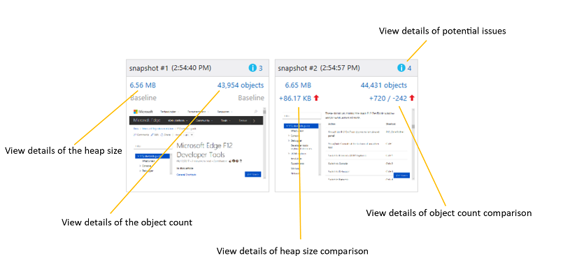
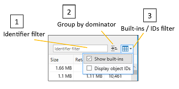
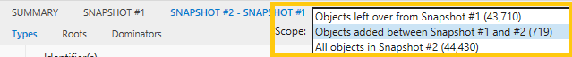

# ПамятьMemory

Используйте панель **"Память",** чтобы оценить использование системных ресурсов и сравнить моментальные снимки кучи в разных состояниях выполнения кода.Use the **Memory** panel to measure your use of system resources and compare heap snapshots at different states of code execution. С его помощью вы можете:With it, you can:

- [График использования памяти страницы](#memory-usage-timeline) в режиме реального времени и снимки кучи[Graph the memory consumption of your page in real time](#memory-usage-timeline) and take snapshots of the heap
- [Определение потенциальных проблем с](#snapshot-summary) памятью в коде, таких как сохраненные объекты, не подключенные к DOM[Identify potential memory issues](#snapshot-summary) in your code, such as retained objects not attached to the DOM
- [Просмотр данных об использовании памяти](#snapshot-details) по типу объекта, подсчету экземпляров, размеру и ссылкам, чтобы изолировать проблемы[Review memory usage data](#snapshot-details) by object type, instance count, size, and references to help isolate issues
- [Применение фильтров данных моментальных](#filters) снимков для уменьшения шума неанимаемых сведений[Apply snapshot data filters](#filters) to reduce the noise of non-actionable information
- [Определение стоимости памяти определенного](#object-references) объекта и ссылок, которые его содержат[Identify the memory cost of a specific object](#object-references) and the references keeping it alive
- [Diff the heap at different phases of your investigation](#snapshot-comparison) to track down the source of memory leaks and other problems[Diff the heap at different phases of your investigation](#snapshot-comparison) to track down the source of memory leaks and other problems

## панель инструментов;Toolbar

1. **Запуск/остановка сеанса профилирование (CTRL+E):** включение профиля позволяет отслеживать использование памяти и делать моментальные снимки кучи.**Start/Stop profiling session (Ctrl+E)**: Turning on the profiler enables you to track memory usage and take snapshots of the heap.
2. **Импорт сеанса профилирование (CTRL+O):** загрузка сохраненного сеанса диагностики памяти DevTools.**Import profiling session (Ctrl+O)**: Load a saved  DevTools memory diagnostic session.
3. **Экспортировать сеанс профилирование (CTRL+S):** сохраните текущий сеанс диагностики на диск.**Export profiling session (Ctrl+S)**: Save the current diagnostic session to disk.
4. **Снимок кучи (CTRL+SHIFT+T):** запись текущих выделений памяти на заданный момент времени.**Take heap snapshot (Ctrl+Shift+T)**: Record current memory allocations for a given point of time.

## Временная шкала использования памятиMemory usage timeline

Проблемы с памятью могут стать главной причиной проблем с производительностью, из-за чего страница со временем становится все более неотвеченной и запаздыванием.Memory problems can be a major culprit of performance issues, causing your page to become increasingly unresponsive and laggy over time.

Первым шагом при анализе использования памяти страницы  является запуск сеанса профилирование, чтобы сделать моментальные снимки кучи до или после него при повторном анализе действий, вызывающих большой объем памяти или предположительное утечку памяти.The first step to analyzing the memory usage of your page is to [start a profiling session](#toolbar) in order to take before/after snapshots of the heap as you repro the steps causing memory bloat or a suspected memory leak.

При запуске профиля памяти вы увидите график памяти процесса, который позволяет со временем наблюдать за общим частным рабочим набором (объемом памяти, потребляемой страницей).When you start the memory profiler, you will see a process memory graph that allows you to observe the overall private working set (the amount of memory consumed by the page) over time. На графике памяти показано прямое представление памяти процесса вкладки, которая включает личные данные, тивную память и куч JavaScript.The memory graph shows you a live view of the tab's process memory, which includes private bytes, native memory, and the JavaScript heap. 

 На графике показана тенденция развития памяти для страницы, которая позволяет оценить  целесообразность создания снимка кучи для дальнейшего сравнения, например периоды непредвиденное хранение памяти.The graph gives you an indication of the memory trend for the page which enables you to judge when it is appropriate to [take a heap snapshot](#toolbar) for later comparison, such as when you see periods of unexpected memory retention.

### Performance.mark()Performance.mark()

Вы можете \*\*\*\* добавить на временную шкалу настраиваемые пометки пользователя, чтобы определить ключевые события во время сеанса анализа, вызывая метод из кода или консоли [`Performance.mark()`](https://developer.mozilla.org/docs/Web/API/Performance/mark) DevTools. [\*\*\*\*](./console.md)You can add custom **User marks** to the timeline to help identify  key events during the course of your analysis session by calling the [`Performance.mark()`](https://developer.mozilla.org/docs/Web/API/Performance/mark) method from within your code or the  DevTools [**Console**](./console.md).

### Console.takeheapSnapshot()Console.takeheapSnapshot()

Иногда необходимо делать моментальные снимки в конкретные моменты времени, например непосредственно перед большим перемехаком DOM.Sometimes you need to take snapshots at very specific points in time, such as immediately before a large mutation of the DOM. В таких случаях снимки можно сделать программным [`Console.takeHeapSnapshot()`](./console/console-api.md#taking-heap-snapshots) путем.In these cases,you can take snapshots programmatically with [`Console.takeHeapSnapshot()`](./console/console-api.md#taking-heap-snapshots).

## Сводка по моментальных снимкамSnapshot summary

[При снимке](#toolbar) создается итоговая плитка, которая указывает размер кучи JavaScript на момент создания снимка, а также количество выделенных объектов и снимок экрана страницы.[Taking a snapshot](#toolbar) will generate a summary tile that indicates the size of the JavaScript heap at the time the snapshot was taken, along with the number of objects allocated and a screenshot of the page. Вы можете продолжать делать моментальные снимки в любое время при запуске пользовательского сценария, требующего анализа.You can continue to take snapshots at any time as you run through the user scenario requiring analysis. Моментальные снимки создают дополнительные плитки, каждый из которых показывает разницу в памяти JavaScript от предыдущего снимка.The snapshots generate additional tiles, each of which indicates the difference in JavaScript memory from the previous snapshot.

Если щелкнуть значения на плитке сводки, переключимся на области с подробными [сведениями о моментальных снимках.](#snapshot-details)Clicking on the values in the summary tile will switch to the pane showing [details of the snapshot data](#snapshot-details). Потенциальные [проблемы с памятью обозначены](#snapshot-details) синим информационным значком ("i").Potential [memory issues are indicated](#snapshot-details) with a blue informational ("i") icon.

## Сведения о моментальных снимкахSnapshot details

Данные в области *моментальных* снимков показывают объекты, созданные страницей, а также память, выделенную платформами JavaScript, которые вы можете использовать.The data in the *Snapshot* pane shows the objects created by your page along with any memory allocated by JavaScript frameworks you may be consuming.

Эти три вкладки представляют различные представления данных:The three tabs represent different views of the data:

#### ТипыTypes

Показывает количество экземпляров и общий размер объектов в куче, сгруппных по типу объекта.Shows the instance count and total size of objects on the heap, grouped by object type. По умолчанию они сортироваться по подсчету экземпляров.By default, these are sorted by instance count.

При выборе объекта в \*\* верхней области  типов таблица "Ссылки на объекты" в нижней области будет перечислять все объекты, которые указывают на этот объект.When you select an object in the upper *Types* pane, the [Object references](#object-references) table in the lower pane will list all the objects that point to that object.

#### КорневаяRoots

Показывает иерархическое представление ссылок на детей, чтобы описать, как объекты коренится в глобальном объекте, предотвращая их сбор мусора.Shows a hierarchical view of child references to describe how objects are rooted to the global object, thus preventing them from being garbage-collected.

По умолчанию эти узлы сортироваться по столбце сохраненного размера с наибольшим значением в верхней части.By default, the child nodes are sorted by the retained size column, with the largest at the top.

#### ПредикторыDominators

Отображает список объектов в куче, которые имеют исключительные ссылки на другие объекты.Shows a list of objects on the heap that have exclusive references to other objects. Обилители сортировать по сохраненным размерам, чтобы указать объекты, потребляющие больше всего памяти, которые потенциально проще освободить.Dominators are sorted by retained size to indicate the objects consuming the most memory that are potentially easiest to free.

Вот как интерпретировать столбцы в представлениях *"Типы",* "Корневая *корня" и "Объехатели":*Here's how to interpret the columns in the *Types, Roots* and *Dominators* views:

СтолбецColumn | ОписаниеDescription
:------------ | :-------------
ИдентификаторыIdentifier(s) | Имя, которое лучше всего идентифицирует объект.Name that best identifies the object. Например, для элементов HTML сведения моментального снимка показывают значение атрибута ID, если он используется.For example, for HTML elements the snapshot details show the ID attribute value, if one is used.
ТипType | Тип объекта (например, *HTMLDivElement).*Object type (for example, *HTMLDivElement*).
SizeSize | Размер объекта, не включая размер объектов, на которые ссылается ссылка.Object size, not including the size of any referenced objects.
Сохраненный размерRetained size | Размер объекта плюс размер всех объектов-детей, у которых нет других родительских объектов.Object size plus the size of all child objects that have no other parents. Для практических целей это объем памяти, который сохраняется объектом, поэтому при удалении объекта необходимо освободить указанный объем памяти.For practical purposes, this is the amount of memory retained by the object, so if you delete the object you reclaim the specified amount of memory.
КоличествоCount | Количество экземпляров объектов.Number of object instances. Это значение отображается только в представлении "Типы".This value appears only in the Types view.

При выборе объекта в верхней области *"Объекторы"* в таблице ссылок на объекты в нижней области будут перечисляться все объекты, которые указывают на этот объект. When you select an object in the upper *Dominators* pane, the [Object references](#object-references) table in the lower pane will list all the objects that point to that object.

### ФильтрыFilters

Вы можете дополнительно настроить данные в таблице с помощью следующих данных:You can further adjust data in the table with the following:

1. **Фильтр идентификаторов:** фильтрация данных путем поиска определенного идентификатора объекта**Identifier filter**: Filter out data by searching for a particular object identifier
2. **Группировать по**объектору: в представлении объектов верхнего уровня показываются только объекты с исключительными ссылками на другие объекты (это представление по умолчанию на вкладке \*\* *"Обзорчики").***Group by dominator**: Only objects with *exclusive* references to other objects are shown in the top-level view of objects (this is the default view in the *Dominators* tab).
3. **Встроенные фильтры и ID:** по умолчанию встроенные объекты [JavaScript](https://developer.mozilla.org/docs/Web/JavaScript/Reference/Global_Objects) включены в список.**Built-ins / IDs filter**: By default, [JavaScript built-in objects](https://developer.mozilla.org/docs/Web/JavaScript/Reference/Global_Objects) are included in the list. Перечисление ИД объектов может быть полезно, если существует несколько анонимных объектов, которые необходимо различать.Listing object IDs can be useful if there are multiple anonymous objects which need to be differentiated.

Представления *"Типы",* "Корневая корня" и "Обилители" имеют собственный фильтр, поэтому фильтр не сохраняется при переключении на другое представление. \*\*The *Types, Roots* and *Dominators* views each has its own filter, so the filter isn't preserved when you switch to another view.

### Ссылки на объектыObject references

В [**представлениях "Типы**](#types) и [**обилители"**](#dominators) нижняя области содержит список ссылок на объекты, в котором отображаются общие ссылки. \*\*\*\*In the [**Types**](#types) and [**Dominators**](#dominators) views, the lower pane contains an **Object references** list that displays shared references. При выборе объекта в верхней области в этом списке отображаются все объекты, которые указывают на этот объект, другими словами, объекты, которые по-настоящему живы для выбранного объекта.When you choose an object in the upper pane, this list displays all objects that point to that object--in other words, the objects that are keeping the selected object alive.

Циклальные ссылки показаны со звездочкой (\*) и информационной tooltip и не могут быть расширены.Circular references are shown with an asterisk (\*) and informational tooltip, and cannot be expanded. В противном случае они не помешали бы вам ходить вверх по эталонным деревам и определять объекты, которые сохраняют память.Otherwise, they would prevent you from walking up the reference tree and identifying objects that are retaining memory.

Чтобы быстро определить эквивалентные [\*\*](#filters) объекты, отметьте параметр фильтра идентификаторов объектов отображения, чтобы отобразить идентификаторы объектов рядом с именами объектов в столбце *идентификаторов.*To quickly identify equivalent objects, tick the [*Display object IDs*](#filters) filter option to display object IDs next to object names in the *Identifier(s)* column. Объекты с одинаковым ИД являются общими ссылками.Objects that have the same ID are shared references.

### Сравнение моментальных снимковSnapshot comparison

Если щелкнуть [вкладку](#snapshot-details) сравнения моментальных снимков или ссылку сравнения на плитке сводки моментальных снимков, между двумя снимками будет отметен разрыв данных. Clicking on a [snapshot comparison tab](#snapshot-details) or comparison link on the [snapshot summary tile](#snapshot-summary)  will show a diff of information between the two snapshots. В области сравнения представления *"Объекторы",* [\*\*](#snapshot-details) "Типы" и "Корневая" предоставляют те же моментальные снимки, что и для отдельных моментальных снимков, с такими дополнительными значениями: \*\*In the comparison pane, the *Dominators, Types* and *Roots* views provide the same [*snapshot details*](#snapshot-details) you would see for a single snapshots, with these additional values:

СтолбецColumn | ОписаниеDescription
:------------ | :-------------
DIFF размера.Size diff. | Разница между размером объекта в текущем снимке и его размером в предыдущем снимке, не включая размер объектов, на которые ссылается ссылка.Difference between the size of the object in the current snapshot and its size in the previous snapshot, not including the size of any referenced objects.
DIFF сохраненного размера.Retained size diff. | Разница между сохраненным размером объекта в текущем снимке и его сохраненным размером в предыдущем снимке.Difference between the retained size of the object in the current snapshot and its retained size in the previous snapshot. Сохраненный размер включает размер объекта плюс размер всех его родительских объектов, у которых нет других родительских объектов.The retained size includes the object size plus the size of all its child objects that have no other parents. В практических целях сохраненный размер — это объем памяти, который сохраняется объектом, поэтому при удалении объекта необходимо освободить указанный объем памяти.For practical purposes, the retained size is the amount of memory retained by the object, so if you delete the object you reclaim the specified amount of memory.

Для фильтрации \*\*\*\* разнонаправленной информации между моментальными снимками можно использовать выпадаемую область:You can use the **Scope** dropdown to filter differential info between snapshots:

- <strong>Объекты, остались в моментальных снимках # : показывает разницу между объектами, добавленными в куче и удаляемой из кучи из базового снимка в <number></strong> предыдущий моментальный снимок.Objects left over from Snapshot #<number></strong>: Shows the diff between the objects added to the heap and removed from the heap from the baseline snapshot to the previous snapshot. Например, если сводка моментальных снимков показывает <em> +205 / -195 в числе объектов, этот фильтр отображает десять объектов, которые были добавлены, но </em> не удалены.For example, if the snapshot summary shows <em>+205 / -195</em> in the object count, this filter will show you the ten objects that were added but not removed.

- <strong>Объекты, добавленные между моментальный снимок # и # : показывает все объекты, добавленные к <number> <number></strong> куче из предыдущего снимка.Objects added between Snapshot #<number> and #<number></strong>: Shows all objects added to the heap from the previous snapshot.

- <strong>Все объекты в моментальный снимок # : показывает все объекты в куче (другими словами, неотрисованное <number></strong> <em> </em> представление).All objects in Snapshot #<number></strong>: Shows all objects on the heap (in other words, an <em>unfiltered</em> view).

По умолчанию фильтр *"Показать не* совпадающие ссылки" применяется к представлению сравнения, чтобы указать ссылки на объекты, не совпадающие с текущим фильтром области.By default, the *Show non-matching references* filter is applied to the comparison view to indicate object references that don't match the current Scope filter. Вы можете отключить его из меню в выпаданом меню:You can turn it off from the dropdown menu:

## ЯрлыкиShortcuts

 ДействиеAction | Установленное напрямую довериеShortcut
:------------ | :-------------
Запуск и остановка сеанса профилированиеStart / Stop profiling session  | `Ctrl` + `E`
Импорт сеанса профилированиеImport profiling session | `Ctrl` + `O`
Экспорт сеанса профилированиеExport profiling session | `Ctrl` + `S`
Снимок кучиTake heap snapshot | `Ctrl` + `Shift` + `T`

## Известные проблемыKnown Issues

### Ошибка при запуске сеанса профилированияAn error occurred while starting the profiling session

Если вы видите это \*\*\*\* сообщение об ошибке: при запуске сеанса профилирования в средстве "Память" произошла ошибка, выполните следующие действия для обходного решения.If you see this error message: **An error occurred while starting the profiling session** in the Memory tool, follow these steps for a workaround.

1. Нажмите `Windows Key`  +  `R` .Press `Windows Key` + `R`.

2. В диалоговом окке "Выполнить" **введите services.msc**.In the Run dialog, enter **services.msc**.

3. Найдите стандартную службу сборщика Microsoft **(R) Diagnostics Hub** и щелкните ее правой кнопкой мыши.Locate the **Microsoft (R) Diagnostics Hub Standard Collector Service** and right-click it.

4. Перезапустите стандартную службу сборщика Microsoft **(R) Diagnostics Hub.**Restart the **Microsoft (R) Diagnostics Hub Standard Collector Service**.

5. Закроем Инструменты разработчика Microsoft Edge и вкладку. Откройте новую вкладку, перейдите на страницу и нажмите `F12` .Close the Microsoft Edge Developer Tools and the tab. Open a new tab, navigate to your page, and press `F12`.

6. Теперь вы сможете начать профилирование.You should now be able to begin profiling. 

По-прежнему возникают проблемы?Still running into problems? Отправьте нам свой отзыв с помощью **значка отправки отзыва!**Please send us your feedback using the **Send feedback** icon! 

