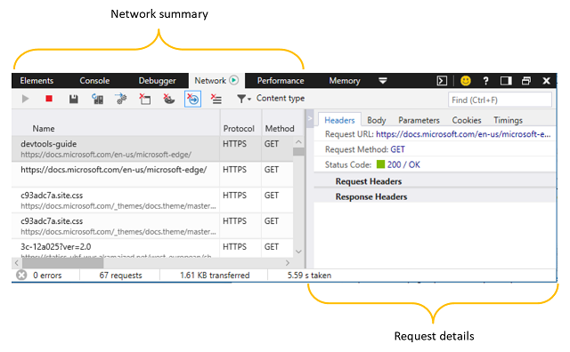
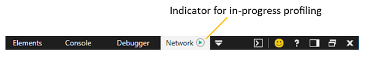
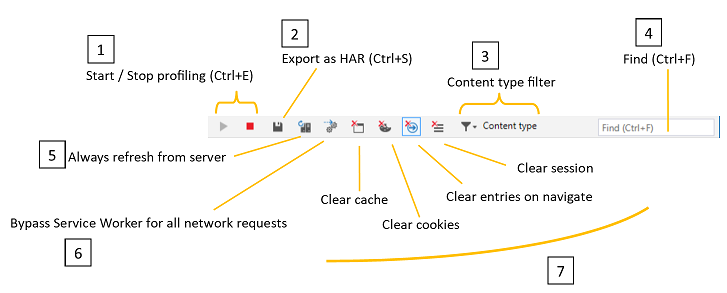

# Network

Используйте панель **"Сеть",** чтобы отслеживать, проверять и профилировать запросы и ответы, отправленные по сети. С его помощью вы можете:

 - [Просмотр записи всех запросов ресурсов,](#network-summary) сделанных страницей
 - [Измерение времени загрузки сайта для](#summary-bar) новых и возвращающих пользователей 
 - [Проверьте заглавные и теле сообщения, параметры](#request-details) и файлы cookie, которые обмениваются между вашей страницей и сетью
 - [Определение сетевых событий, вызывающих узкие места](#timings) во время загрузки сайта

## Сводка по сети

Когда вы открываете DevTools, профилирование сети по умолчанию включено. Весь сетевой трафик с активной вкладки браузера регистрируется в сводном списке сети, даже если вы работаете на панели DevTools, которая отличается от *"Сеть".*

### панель инструментов;

Панель инструментов предоставляет элементы управления для профилирование и фильтрации сетевой активности страницы. 

1. **Запуск и остановка сеанса**профилирование: по умолчанию профилирование сети включено, и сетевой трафик будет регистрироваться в списке [**сетевых профилей.**](#network-request-list) Вы можете отключить захват сети с помощью кнопки **"Остановить"** `Ctrl+E` ().

2. **Экспорт в формате HAR:** вы можете сохранить текущий сеанс профилирование сети () в формате `Ctrl+S` JSON [HTTP Archive (HAR).](https://dvcs.w3.org/hg/webperf/raw-file/tip/specs/HAR/Overview.html) 

3. **Фильтр типов контента:** фильтрация списка сетевых запросов по определенным запросам содержимого ( документы, таблицы стилей,*изображения, сценарии, мультимедиа, шрифты, XHR, Другие).* По умолчанию показаны все типы контента.

4. **Find**: Filter ( `Ctrl+F` ) the network request list by entry names (resource paths) containing a specified search string.

5. **Всегда обновляются с сервера:** при нажатии этой кнопки ресурсы страниц будут принудительно загружаться из сети, а не из кэша браузера. Вы можете обновить страницу из сети один раз, нажав кнопку `Ctrl+F5` .

6. **Обход рабочих служб для всех сетевых запросов:** отключите зарегистрированных сотрудников службы в качестве сетевых прокси-прокси. 

7. Очистка кнопок

   - **Очистка кэша:** удаляет все ресурсы, хранимые в кэше браузера (и эмулирует первый раз загрузку страницы).
   - **Очистка файлов cookie:** удаляет все файлы cookie для данного домена (и эмулирует первый раз на сайте).
   - **Очистка записей при навигации:** записанный трафик очищается при навигации по странице. Этот режим включен по умолчанию.
   - **Clear session**: Clear session clears all network request entries from the **Network summary** list.

### Список сетевых запросов

Весь сетевой трафик записи в список (до тех пор, пока не будет очищен при навигации, вручную очищен или DevTools не будет закрыт). Если щелкнуть любую запись, откроется более [подробное представление запроса.](#request-details)

Список сетевых запросов включает следующие сведения: 

Столбец | Описание 
:------------ | :------------- 
**Name** | Имя и URL-путь запроса
**Протокол** |  Тип протокола для запроса *(например, HTTPS, HTTP/2)*
**Метод** |    [Метод HTTP,](https://developer.mozilla.org/docs/Web/HTTP/Methods) используемый для запроса
**Результат** |    [Код состояния http-ответа](https://developer.mozilla.org/docs/Web/HTTP/Status)
**Тип содержимого** |  Тип запрашиваемого мультимедиа[(тип MIME)](https://en.wikipedia.org/wiki/Media_type)
**Получено** | Размер ответа, доставленного сервером (не вычисляется для кэшных ответов)
**Время** |  Время загрузки ответа сервера (не вычисляется для кэшных ответов)
**Инициатор** | Подсистема, отвечаемая за инициации запроса *(например, Parser, Redirect, Script, Other)*
**Информация о сроках** | Визуальная временная шкала для сетевых событий запроса (таких как *"Ожидание", "Разрешение(DNS"), "Подключение(TCP"), "SSL", "Отправка", "Ожидание" (TTFB), "Загрузка").* Наведении курсор на диаграмму обеспечивает более детализированное распределение времени [сетевой сети).](#timings)

### Сводка

Панель в нижней **** части панели "Сеть" суммирует общее количество ошибок, запросов, передачи данных и времени загрузки HTTP в течение сеанса профилирования сети (то есть, так как были открыты devTools и записывают сетевой трафик).

**По иному времени** это время между началом сеанса профилированием и моментом последнего скачивания ресурса из сети. Ресурсы, извлеченные из кэша браузера, не накапливают время на это число. 

Время загрузки **DOM** означает время между началом сеанса профилированием и [событием DOMContentLoaded,](https://developer.mozilla.org/docs/Web/Events/DOMContentLoaded) чтобы указать, что структура документа страницы загружена и различна (хотя не обязательно любые таблицы стилей, изображения или подкадры).

**Время загрузки** страницы означает время между началом сеанса  профилирование и событием загрузки, чтобы указать, что документ страницы (и все его ресурсы) полностью загружен.

## Сведения о запросе

Если щелкнуть любую [****](#network-summary) запись в сводке [****](#request-details) по сети, откроется области сведений о запросах с дополнительными сведениями на каждой из следующих вкладок.

### Заголовки
Отображает [http-заготки,](https://developer.mozilla.org/docs/Web/HTTP/Headers) отправленные и полученные с сервера. Щелкните правой кнопкой мыши любую запись в загонах, чтобы скопировать ее `Ctrl+C` () в буфер обмена. Вы также можете выбрать несколько записей, удерживая `Shift` клавишу или выбрав все ( `Ctrl+A` ).

### Body
Отображает данные тела (если они доступны) для полезной нагрузки запроса и ответа.

Содержимое изображения отображается с данными о размерах и измерениях.

Текстовое содержимое отображается в редакторе (только для чтения) **** с возможностью формата минифицированного содержимого с помощью "Очень печать" и/или **переноса в Word** для упростить чтение.

### Параметры
Отображает параметры строки запроса для запросов GET. Хотя параметры запросов POST отправляются в загонах, запросы GET включают их в URL-адрес. Они разбиты здесь для упростить чтение.

Щелкните правой кнопкой мыши любую строку, чтобы скопировать ее `Ctrl+C` () в буфер обмена. Вы также можете выбрать несколько записей, удерживая `Shift` клавишу или выбрав все ( `Ctrl+A` ).

### Файлы cookie
Отображает файлы cookie, отправленные или полученные в качестве пар "ключ-значение".

Щелкните правой кнопкой мыши любую строку, чтобы скопировать ее `Ctrl+C` () в буфер обмена. Вы также можете выбрать несколько записей, удерживая клавишу или выбрав `Shift` все ( `Ctrl+A` ).

Вы можете очистить сохраненные файлы cookie для заданного домена с панели [инструментов](#network-summary) (кнопка **"Очистить файлы cookie").** 

### Сроки

Вкладка **"Синхронизация"** предоставляет временную шкалу сетевых событий, участвующих в загрузке выбранного ресурса. Это аналогично сведениям, найденным в столбце "Временная шкала" списка сетевых [запросов,](#network-request-list)но также включают события, ведущие к отправлению запроса по сети, такие как время, затраченное на ожидание (ожидание) в очереди запросов, разрешение DNS и установление подключения TCP. ** ** 

Отмечены перенаправления к другим ресурсам, и при нажатии ссылки будет установлен фокус на этом ресурсе в области сведений о [сетевых запросах.](#request details)

На повторное загрузку из кэша не влияет задержка сети, поэтому ** диаграмма "Синхронизация сети" не будет отображаться.

Ниже дано несколько сетевых событий для данного ресурса в хронологическом порядке.

#### Приостановлено

Время, затраченное на ожидание доступного сетевого подключения в очереди запросов. Для HTTP 1.0/1.1 Microsoft Edge допускает до шести (6) одновременных подключений TCP на имя хоста. 

#### Разрешение (DNS)

Время, затраченное на поиск IP-адреса для имени хоста ресурса в DNS[(система доменных имен).](https://en.wikipedia.org/wiki/Domain_Name_System)

#### Подключение (TCP)

Время, затраченное на установление подключения по протоколу TCP ([Transmission Control Protocol).](https://en.wikipedia.org/wiki/Transmission_Control_Protocol)

#### SSL

Время, затраченное на согласование подключения SSL[(слоя secure Sockets Layer)](https://en.wikipedia.org/wiki/Transport_Layer_Security)к прокси-серверу для хоста. 

#### Отправка

Время, затраченное на отправку запроса ресурса.

#### Ожидание (TTFB)

Время, затраченное на ожидание первого byte ответа от хост-сервера ("время до первого byte", или *TTFB).*

#### Загрузка

Время, затраченное на чтение ответа с сервера.

## Ярлыки

| Действие                         | Установленное напрямую доверие     |
|:-------------------------------|:-------------|
| Запуск и остановка сеанса профилирование | `Ctrl` + `E` |
| Экспорт в качестве HAR                  | `Ctrl` + `S` |
| Поиск                           | `Ctrl` + `F` |
| Копировать                           | `Ctrl` + `C` |

## Известные проблемы

### Не удалось запустить агент сбора данных сети.

Если вы видите это **** сообщение об ошибке: агенту сетевой коллекции не удалось запуститься в средстве Network, выполните следующие действия для обходного решения.

1. Нажмите `Windows Key`  +  `R` .

2. В диалоговом окке "Выполнить" **введите services.msc**.

3. Найдите стандартную службу сборщика Microsoft **(R) Diagnostics Hub** и щелкните ее правой кнопкой мыши.

4. Перезапустите стандартную службу сборщика Microsoft **(R) Diagnostics Hub.**

5. Закроем Инструменты разработчика Microsoft Edge и вкладку. Откройте новую вкладку, перейдите на страницу и нажмите `F12` .

6. Теперь рядом с сетью **** должен отсутт уже значок воспроизведения и сетевые запросы для веб-страницы.

По-прежнему возникают проблемы? Отправьте нам свой отзыв с помощью **значка отправки отзыва!** 

### Агенту сетевой коллекции не удалось остановиться.

Если вы видите это **** сообщение об ошибке: агенту сетевой коллекции не удалось остановиться в средстве Network, выполните следующие действия для обходного решения.

1. Нажмите `Windows Key`  +  `R` .

2. В диалоговом окке "Выполнить" **введите services.msc**.

3. Найдите стандартную службу сборщика Microsoft **(R) Diagnostics Hub** и щелкните ее правой кнопкой мыши.

4. Перезапустите стандартную службу сборщика Microsoft **(R) Diagnostics Hub.**

5. Закроем Инструменты разработчика Microsoft Edge и вкладку. Откройте новую вкладку, перейдите на страницу и нажмите `F12` .

6. Теперь рядом с сетью **** должен отсутт уже значок воспроизведения и сетевые запросы для веб-страницы.

По-прежнему возникают проблемы? Отправьте нам свой отзыв с помощью **значка отправки отзыва!** 

