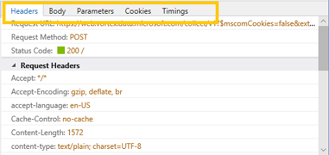
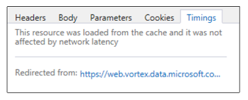

# NetworkNetwork

Используйте панель **"Сеть",** чтобы отслеживать, проверять и профилировать запросы и ответы, отправленные по сети.Use the **Network** panel to monitor, inspect and profile the requests and responses sent over the wire. С его помощью вы можете:With it, you can:

 - [Просмотр записи всех запросов ресурсов,](#network-summary) сделанных страницей[Browse a record of all the resource requests](#network-summary) made by the page
 - [Измерение времени загрузки сайта для](#summary-bar) новых и возвращающих пользователей[Measure the load time of your site](#summary-bar) for new and returning users 
 - [Проверьте заглавные и теле сообщения, параметры](#request-details) и файлы cookie, которые обмениваются между вашей страницей и сетью[Inspect the headers, message bodies, parameters, and cookies](#request-details) exchanged between your page and the network
 - [Определение сетевых событий, вызывающих узкие места](#timings) во время загрузки сайта[Identify the network events causing bottlenecks](#timings) in the load time of your site

## Сводка по сетиNetwork summary

Когда вы открываете DevTools, профилирование сети по умолчанию включено.When you open  DevTools, network profiling is turned on by default. Весь сетевой трафик с активной вкладки браузера регистрируется в сводном списке сети, даже если вы работаете на панели DevTools, которая отличается от *"Сеть".*All the network traffic from your active browser tab is recorded in the network summary list, even while you are working in a different  DevTools panel than *Network*.

### панель инструментов;Toolbar

Панель инструментов предоставляет элементы управления для профилирование и фильтрации сетевой активности страницы.The toolbar provides controls for profiling and filtering the network activity of your page. 

1. **Запуск и остановка сеанса**профилирование: по умолчанию профилирование сети включено, и сетевой трафик будет регистрироваться в списке [**сетевых профилей.**](#network-request-list)**Start / Stop profiling session**: By default, network profiling is turned on, and network traffic will be logged in the [**Network profiler**](#network-request-list) list. Вы можете отключить захват сети с помощью кнопки **"Остановить"** `Ctrl+E` ().You can turn off network capture with the **Stop** (`Ctrl+E`) button.

2. **Экспорт в формате HAR:** вы можете сохранить текущий сеанс профилирование сети () в формате `Ctrl+S` JSON [HTTP Archive (HAR).](https://dvcs.w3.org/hg/webperf/raw-file/tip/specs/HAR/Overview.html)**Export as HAR**: You can save the current network profiling session (`Ctrl+S`) as a JSON-formatted [HTTP Archive (HAR)](https://dvcs.w3.org/hg/webperf/raw-file/tip/specs/HAR/Overview.html) file. 

3. **Фильтр типов контента:** фильтрация списка сетевых запросов по определенным запросам содержимого ( документы, таблицы стилей,*изображения, сценарии, мультимедиа, шрифты, XHR, Другие).***Content type filter**: Filter the network request list by specific content requests (*Documents, Style sheets, Images, Scripts, Media, Fonts, XHR, Other*). По умолчанию показаны все типы контента.By default all content types are shown.

4. **Find**: Filter ( `Ctrl+F` ) the network request list by entry names (resource paths) containing a specified search string.**Find**: Filter (`Ctrl+F`) the network request list by entry names (resource paths) containing a specified search string.

5. **Всегда обновляются с сервера:** при нажатии этой кнопки ресурсы страниц будут принудительно загружаться из сети, а не из кэша браузера.**Always refresh from server**: Depressing this button will force page resources to load from the network rather than the browser cache. Вы можете обновить страницу из сети один раз, нажав кнопку `Ctrl+F5` .You can refresh the page from  network a single time by pressing `Ctrl+F5`.

6. **Обход рабочих служб для всех сетевых запросов:** отключите зарегистрированных сотрудников службы в качестве сетевых прокси-прокси.**Bypass Service Worker for all network requests**: Disable your registered service workers as network proxies. 

7. Очистка кнопокClear buttons

   - **Очистка кэша:** удаляет все ресурсы, хранимые в кэше браузера (и эмулирует первый раз загрузку страницы).**Clear cache**: Removes all resources stored in the browser cache (and emulates a first-time experience loading the page).
   - **Очистка файлов cookie:** удаляет все файлы cookie для данного домена (и эмулирует первый раз на сайте).**Clear cookies**: Removes all cookies for the given domain (and emulates a first-time experience of the site).
   - **Очистка записей при навигации:** записанный трафик очищается при навигации по странице.**Clear entries on navigate**: Recorded traffic is cleared upon page navigation. Этот режим включен по умолчанию.This is turned on by default.
   - **Clear session**: Clear session clears all network request entries from the **Network summary** list.**Clear session**: Clears all network request entries from the **Network summary** list.

### Список сетевых запросовNetwork request list

Весь сетевой трафик записи в список (до тех пор, пока не будет очищен при навигации, вручную очищен или DevTools не будет закрыт).All network traffic is recorded to a list (until cleared upon navigation, manually cleared, or  DevTools are closed). Если щелкнуть любую запись, откроется более [подробное представление запроса.](#request-details)Clicking on any entry will open a more [detailed view of the request](#request-details).

Список сетевых запросов включает следующие сведения:The network request list includes the following info: 

СтолбецColumn | ОписаниеDescription 
:------------ | :------------- 
**NameName** | Имя и URL-путь запросаName and URL path of the request
**ПротоколProtocol** |  Тип протокола для запроса *(например, HTTPS, HTTP/2)*Type of protocol for the request (such as *HTTPS, HTTP/2*)
**МетодMethod** |    [Метод HTTP,](https://developer.mozilla.org/docs/Web/HTTP/Methods) используемый для запроса[HTTP method](https://developer.mozilla.org/docs/Web/HTTP/Methods) used for the request
**РезультатResult** |    [Код состояния http-ответа](https://developer.mozilla.org/docs/Web/HTTP/Status)[HTTP response status](https://developer.mozilla.org/docs/Web/HTTP/Status)  code
**Тип содержимогоContent type** |  Тип запрашиваемого мультимедиа[(тип MIME)](https://en.wikipedia.org/wiki/Media_type)Type of media requested ([MIME type](https://en.wikipedia.org/wiki/Media_type))
**ПолученоReceived** | Размер ответа, доставленного сервером (не вычисляется для кэшных ответов)Size of the response as delivered by the server (not calculated for cached responses)
**ВремяTime** |  Время загрузки ответа сервера (не вычисляется для кэшных ответов)Time to load the server response (not calculated for cached responses)
**ИнициаторInitiator** | Подсистема, отвечаемая за инициации запроса *(например, Parser, Redirect, Script, Other)*Subsystem responsible for initiating the request (such as *Parser, Redirect, Script, Other*)
**Информация о срокахTimeline** | Визуальная временная шкала для сетевых событий запроса (таких как *"Ожидание", "Разрешение(DNS"), "Подключение(TCP"), "SSL", "Отправка", "Ожидание" (TTFB), "Загрузка").*Visual timeline for the network events of the request (such as *Stalled, Resolving(DNS), Connecting(TCP), SSL, Sending, Waiting(TTFB), Downloading*). Наведении курсор на диаграмму обеспечивает более детализированное распределение времени [сетевой сети).](#timings)Hovering over the chart provides the more granular breakdown of network [network timings](#timings)).

### СводкаSummary bar

Панель в нижней \*\*\*\* части панели "Сеть" суммирует общее количество ошибок, запросов, передачи данных и времени загрузки HTTP в течение сеанса профилирования сети (то есть, так как были открыты devTools и записывают сетевой трафик).The bar at the bottom of **Network** panel summarizes the total number of HTTP network errors, requests, data transfered, and load times during the network profiling session (i.e., since  DevTools were opened and recording network traffic).

**По иному времени** это время между началом сеанса профилированием и моментом последнего скачивания ресурса из сети.**Elapsed time** means the time between the start of the profiling session and when the last resource was downloaded from the network. Ресурсы, извлеченные из кэша браузера, не накапливают время на это число.Resources fetched from the browser cache do not accrue time to this number. 

Время загрузки **DOM** означает время между началом сеанса профилированием и [событием DOMContentLoaded,](https://developer.mozilla.org/docs/Web/Events/DOMContentLoaded) чтобы указать, что структура документа страницы загружена и различна (хотя не обязательно любые таблицы стилей, изображения или подкадры).**DOM load time** means the time between the start of the profiling session and when the [DOMContentLoaded](https://developer.mozilla.org/docs/Web/Events/DOMContentLoaded) event was fired to indicate that the structure of the page document has been loaded and parsed (though not necessarily any stylesheets, images or subframes).

**Время загрузки** страницы означает время между началом сеанса  профилирование и событием загрузки, чтобы указать, что документ страницы (и все его ресурсы) полностью загружен.**Page load time** time means the time between the start of the profiling session and when the [load](https://developer.mozilla.org/docs/Web/Events/load) event was fired to indicate that the page document (and all its resources) has been fully loaded.

## Сведения о запросеRequest details

Если щелкнуть любую [\*\*\*\*](#network-summary) запись в сводке [\*\*\*\*](#request-details) по сети, откроется области сведений о запросах с дополнительными сведениями на каждой из следующих вкладок.Clicking on any entry in the [**Network summary**](#network-summary) list will open the [**Request details**](#request-details) pane with further information in each of the following tabs.

### ЗаголовкиHeaders
Отображает [http-заготки,](https://developer.mozilla.org/docs/Web/HTTP/Headers) отправленные и полученные с сервера.Displays the [HTTP headers](https://developer.mozilla.org/docs/Web/HTTP/Headers) sent to and received from the server. Щелкните правой кнопкой мыши любую запись в загонах, чтобы скопировать ее `Ctrl+C` () в буфер обмена.Right-click on any header entry to copy it (`Ctrl+C`) to the clipboard. Вы также можете выбрать несколько записей, удерживая `Shift` клавишу или выбрав все ( `Ctrl+A` ).You can also multi-select entries by holding down the `Shift` key or select all (`Ctrl+A`).

### BodyBody
Отображает данные тела (если они доступны) для полезной нагрузки запроса и ответа.Displays the body data (if available) of the request and response payloads.

Содержимое изображения отображается с данными о размерах и измерениях.Image content is displayed with dimensions and size data.

Текстовое содержимое отображается в редакторе (только для чтения) \*\*\*\* с возможностью формата минифицированного содержимого с помощью "Очень печать" и/или **переноса в Word** для упростить чтение.Text content appears in a (read-only) editor with options to format minified content with **Pretty print** and/or **Word wrap** for easier readability.

### ПараметрыParameters
Отображает параметры строки запроса для запросов GET.Displays query string parameters for GET requests. Хотя параметры запросов POST отправляются в загонах, запросы GET включают их в URL-адрес.While the parameters of POST requests are sent in the headers, GET requests include them in the URL. Они разбиты здесь для упростить чтение.They're broken out here for easier reading.

Щелкните правой кнопкой мыши любую строку, чтобы скопировать ее `Ctrl+C` () в буфер обмена.Right-click on any row to copy it (`Ctrl+C`) to the clipboard. Вы также можете выбрать несколько записей, удерживая `Shift` клавишу или выбрав все ( `Ctrl+A` ).You can also multi-select entries by holding down the `Shift` key or select all (`Ctrl+A`).

### Файлы cookieCookies
Отображает файлы cookie, отправленные или полученные в качестве пар "ключ-значение".Displays cookies that are sent or received as key/value pairs.

Щелкните правой кнопкой мыши любую строку, чтобы скопировать ее `Ctrl+C` () в буфер обмена.Right-click on any row to copy it (`Ctrl+C`) to the clipboard. Вы также можете выбрать несколько записей, удерживая клавишу или выбрав `Shift` все ( `Ctrl+A` ).You can also multi-select entries by holding down the `Shift` key or select all (`Ctrl+A`).

Вы можете очистить сохраненные файлы cookie для заданного домена с панели [инструментов](#network-summary) (кнопка **"Очистить файлы cookie").**You can clear the stored cookies for the given domain from the [Toolbar](#network-summary) (**Clear cookies** button). 

### СрокиTimings

Вкладка **"Синхронизация"** предоставляет временную шкалу сетевых событий, участвующих в загрузке выбранного ресурса.The **Timings** tab provides a timeline of network events involved in the loading of the selected resource. Это аналогично сведениям, найденным в столбце "Временная шкала" списка сетевых [запросов,](#network-request-list)но также включают события, ведущие к отправлению запроса по сети, такие как время, затраченное на ожидание (ожидание) в очереди запросов, разрешение DNS и установление подключения TCP. \*\* \*\*This is similar to the information found in the *Timeline* column of the [Network request list](#network-request-list), but also includes the events leading up to the request being sent over the wire, such as time spent waiting (*Stalled*) in the request queue, DNS resolution, and establishing the TCP connection. 

Отмечены перенаправления к другим ресурсам, и при нажатии ссылки будет установлен фокус на этом ресурсе в области сведений о [сетевых запросах.](#request details)Redirections to/from other resources are noted, and clicking on the link will set focus to that resource in the network [request details](#request details) pane.

На повторное загрузку из кэша не влияет задержка сети, поэтому \*\* диаграмма "Синхронизация сети" не будет отображаться.Resouces loaded from the cache are not affected by network latency, so no network *Timings* chart will display.

Ниже дано несколько сетевых событий для данного ресурса в хронологическом порядке.Here are the different network events you might see for a given resource, in chronological order:

#### ПриостановленоStalled

Время, затраченное на ожидание доступного сетевого подключения в очереди запросов.Time spent waiting for an available network connection in the request queue. Для HTTP 1.0/1.1 Microsoft Edge допускает до шести (6) одновременных подключений TCP на имя хоста.For HTTP 1.0/1.1, Microsoft Edge allows a maximum of six (6) simultaneous TCP connections per hostname. 

#### Разрешение (DNS)Resolving (DNS)

Время, затраченное на поиск IP-адреса для имени хоста ресурса в DNS[(система доменных имен).](https://en.wikipedia.org/wiki/Domain_Name_System)Time spent looking up the IP address for the hostname of the resource in the DNS ([Domain Name System](https://en.wikipedia.org/wiki/Domain_Name_System)).

#### Подключение (TCP)Connecting (TCP)

Время, затраченное на установление подключения по протоколу TCP ([Transmission Control Protocol).](https://en.wikipedia.org/wiki/Transmission_Control_Protocol)Time spent establishing the TCP ([Transmission Control Protocol](https://en.wikipedia.org/wiki/Transmission_Control_Protocol)) connection.

#### SSLSSL

Время, затраченное на согласование подключения SSL[(слоя secure Sockets Layer)](https://en.wikipedia.org/wiki/Transport_Layer_Security)к прокси-серверу для хоста. Time spent negotiating a SSL ([Secure Sockets Layer](https://en.wikipedia.org/wiki/Transport_Layer_Security))  connection with the [proxy server](https://en.wikipedia.org/wiki/Proxy_server) for the host.

#### ОтправкаSending

Время, затраченное на отправку запроса ресурса.Time spent sending the resource request.

#### Ожидание (TTFB)Waiting (TTFB)

Время, затраченное на ожидание первого byte ответа от хост-сервера ("время до первого byte", или *TTFB).*Time spent waiting for the first byte of the response from the host server ("time to first byte", or *TTFB*).

#### ЗагрузкаDownloading

Время, затраченное на чтение ответа с сервера.Time spent reading the response from the server.

## ЯрлыкиShortcuts

| ДействиеAction                         | Установленное напрямую довериеShortcut     |
|:-------------------------------|:-------------|
| Запуск и остановка сеанса профилированиеStart / Stop profiling session | `Ctrl` + `E` |
| Экспорт в качестве HARExport as HAR                  | `Ctrl` + `S` |
| ПоискFind                           | `Ctrl` + `F` |
| КопироватьCopy                           | `Ctrl` + `C` |

## Известные проблемыKnown Issues

### Не удалось запустить агент сбора данных сети.The network collection agent failed to start.

Если вы видите это \*\*\*\* сообщение об ошибке: агенту сетевой коллекции не удалось запуститься в средстве Network, выполните следующие действия для обходного решения.If you see this error message: **The network collection agent failed to start** in the Network tool, follow these steps for a workaround.

1. Нажмите `Windows Key`  +  `R` .Press `Windows Key` + `R`.

2. В диалоговом окке "Выполнить" **введите services.msc**.In the Run dialog, enter **services.msc**.

3. Найдите стандартную службу сборщика Microsoft **(R) Diagnostics Hub** и щелкните ее правой кнопкой мыши.Locate the **Microsoft (R) Diagnostics Hub Standard Collector Service** and right-click it.

4. Перезапустите стандартную службу сборщика Microsoft **(R) Diagnostics Hub.**Restart the **Microsoft (R) Diagnostics Hub Standard Collector Service**.

5. Закроем Инструменты разработчика Microsoft Edge и вкладку. Откройте новую вкладку, перейдите на страницу и нажмите `F12` .Close the Microsoft Edge Developer Tools and the tab. Open a new tab, navigate to your page, and press `F12`.

6. Теперь рядом с сетью \*\*\*\* должен отсутт уже значок воспроизведения и сетевые запросы для веб-страницы.You should now see a Play badge next to **Network** and the network requests for your webpage.

По-прежнему возникают проблемы?Still running into problems? Отправьте нам свой отзыв с помощью **значка отправки отзыва!**Please send us your feedback using the **Send feedback** icon! 

### Агенту сетевой коллекции не удалось остановиться.The network collection agent failed to stop.

Если вы видите это \*\*\*\* сообщение об ошибке: агенту сетевой коллекции не удалось остановиться в средстве Network, выполните следующие действия для обходного решения.If you see this error message: **The network collection agent failed to stop** in the Network tool, follow these steps for a workaround.

1. Нажмите `Windows Key`  +  `R` .Press `Windows Key` + `R`.

2. В диалоговом окке "Выполнить" **введите services.msc**.In the Run dialog, enter **services.msc**.

3. Найдите стандартную службу сборщика Microsoft **(R) Diagnostics Hub** и щелкните ее правой кнопкой мыши.Locate the **Microsoft (R) Diagnostics Hub Standard Collector Service** and right-click it.

4. Перезапустите стандартную службу сборщика Microsoft **(R) Diagnostics Hub.**Restart the **Microsoft (R) Diagnostics Hub Standard Collector Service**.

5. Закроем Инструменты разработчика Microsoft Edge и вкладку. Откройте новую вкладку, перейдите на страницу и нажмите `F12` .Close the Microsoft Edge Developer Tools and the tab. Open a new tab, navigate to your page, and press `F12`.

6. Теперь рядом с сетью \*\*\*\* должен отсутт уже значок воспроизведения и сетевые запросы для веб-страницы.You should now see a Play badge next to **Network** and the network requests for your webpage.

По-прежнему возникают проблемы?Still running into problems? Отправьте нам свой отзыв с помощью **значка отправки отзыва!**Please send us your feedback using the **Send feedback** icon! 

