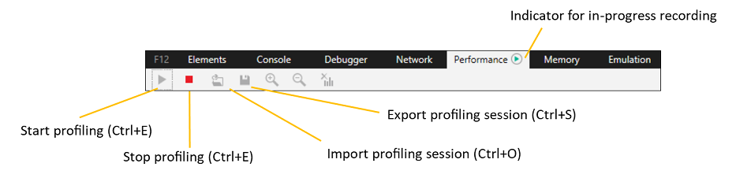

# ПроизводительностьPerformance

Панель **производительности** предлагает инструменты для профилирование и анализа отклика пользовательского интерфейса во время взаимодействия с пользователем.The **Performance** panel offers tools for profiling and analyzing the responsiveness of your UI during the course of user interaction. С его помощью вы можете:With it, you can:

 - [Измерение времени выполнения](#recording-a-profile) различных компонентов страницы[Measure execution times](#recording-a-profile) of the various components of your page 
 - [Подробнее о том, где](#timeline-ruler) вы проводите больше всего циклов ЦП для запуска страницы и итоговых визуальных эффектов для пользователей[Drill down to where you're spending the most CPU cycles](#timeline-ruler) to run your page and the resulting visual effect for your users
 - [Пошаговая разбивка процессов,](#timeline-details) потребляющих время выполнения страницы[Get a step-by-step breakdown of the processes](#timeline-details) consuming page execution time 
 - [Почитайте стеки вызовов JavaScript,](#javascript-call-stacks) чтобы определить дорогостоящие операции, например операции, требующие пересчета макета[Walk your JavaScript call stacks](#javascript-call-stacks) to identify costly operations, such as those requiring layout recalculations 

## Запись профиляRecording a profile

Первым этапом анализа производительности страницы является захват профиля при выполнении определенного пользовательского сценария, например этапы повторного анализа ошибки производительности, которые вы пытаетесь исправить, или типичный вариант использования, который вы хотите оптимизировать для улучшения пользовательского интерфейса.The first step to analyzing the performance of your page is to capture a profile as you perform a particular user scenario, such as the repro steps of a performance bug you're trying to fix, or a typical use case you want to optimize for a better user experience. 

### панель инструментов;Toolbar

Используйте кнопки **остановки**запуска на панели инструментов (или) для запуска и завершения  /  \*\*\*\* `Ctrl+E` трассировки производительности.Use the **Start** / **Stop** buttons on the toolbar (or `Ctrl+E`) to initiate and conclude your performance trace. На вкладке "Производительность" \*\*\*\* на вкладке "Производительность" будет показан зеленый индикатор, который указывает, что запись идет.A green indicator will apear on the **Performance** tab to indicate a recording is in progress. 

После остановки профиля создается отчет о производительности.A performance report will generate upon stopping the profile. Вы можете сохранить его на диск () и `Ctrl+S` перезагрузить `Ctrl+O` () в DevTools позже.You can choose to save it to disk (`Ctrl+S`) and reload (`Ctrl+O`) in  DevTools at a later time.  Сеансы диагностики DevTools сохраняются с *расширением .diagsession.*DevTools diagnostic sessions are saved with the *.diagsession* extension.

Вот что нужно помнить при записи профиля:Here are some things to keep in mind when recording a profile:

- Выполните меньше всего действий, необходимых для захвата сценария, который вы пытаетесь проанализировать.Perform the fewest actions you need to capture the scenario you're trying to analyze. Лишние действия со страницей будут создавать дополнительные данные и засорять результаты.Extraneous actions with the page will produce extra data and clutter your results.

- Профилер автоматически помещает в отчете основные события жизненного цикла приложения, такие как навигация страницы, [DOMContentLoaded](https://developer.mozilla.org/docs/Web/Events/DOMContentLoaded)и загрузка [страницы.](https://developer.mozilla.org/docs/Web/Events/load)The profiler will automatically mark major app lifecycle events in the report, such as page navigation, [DOMContentLoaded](https://developer.mozilla.org/docs/Web/Events/DOMContentLoaded), and page [load](https://developer.mozilla.org/docs/Web/Events/load). Вы можете добавить настраиваемые маркеры, вызывая метод [Performance.mark()](https://developer.mozilla.org/docs/Web/API/Performance/mark) из кода или консоли.You can add custom markers by calling the [Performance.mark()](https://developer.mozilla.org/docs/Web/API/Performance/mark) method from within your code or the console. 

- Если время загрузки начальной страницы важно для анализа, обязательно очищайте  кэш браузера (с панели сети), чтобы гарантировать загрузку всех ресурсов страницы из сети.If initial page load times are important to your analysis, make sure to clear your browser cache (from the [Network](./network.md) panel) to ensure all page resources are loading from the network.

- Иногда бывает полезно записать несколько сеансов и/или пример одного сценария на разных компьютерах, чтобы лучше понять проблему производительности в подмыве.Sometimes it helps to record multiple sessions and/or sample the same scenario across different machines to better understand the performance issue in the wild.

## Линейка временной шкалыTimeline ruler

Временная шкала работает в качестве скользящей линейки.The timeline works as a sliding ruler. Используйте его, чтобы ограничить область отчета определенными временными рамками (или диапазоном событий), которые могут быть интересны.Use it to limit the scope of the report to the particular timeframe (or span of events) of interest. Перетащите \*\*\*\* элементы управления черным слайдом, чтобы ограничить диапазон времени, который вы  хотите изучить и отфильтровать из отчетов временной шкалы и стеков вызовов [JavaScript](#javascript-call-stacks) в нижней области сведений. \*\*Drag the black **slide controls** to limit the time range you wish to investigate and filter out extraneous profiling data from the [Timeline](#timeline-details) and [JavaScript call stacks](#javascript-call-stacks) reports in the lower *Details pane*. 

На линейке вы увидите два типа маркеров:You will see two types of markers on the ruler:

 - **Отметки жизненного** цикла приложения на временной шкале (например, навигация по страницам, [DOMContentLoaded](https://developer.mozilla.org/docs/Web/Events/DOMContentLoaded)и загрузка [страницы)](https://developer.mozilla.org/docs/Web/Events/load)регистрируются автоматически при записи профиля.**App lifecycle marks** on the timeline (such as page navigation, [DOMContentLoaded](https://developer.mozilla.org/docs/Web/Events/DOMContentLoaded), and page [load](https://developer.mozilla.org/docs/Web/Events/load)) are automatically logged as you record a profile.

 - **Метки** пользователей — это настраиваемые маркеры, которые можно добавить с помощью вызовов метода [\*\*\*\*](./console.md) [Performance.mark()](https://developer.mozilla.org/docs/Web/API/Performance/mark) из кода или консоли DevTools.**User marks** are custom markers you can choose to add  with calls to the [Performance.mark()](https://developer.mozilla.org/docs/Web/API/Performance/mark) method from within your code or the  DevTools [**Console**](./console.md). С помощью *метода* [Performance.measure()](https://developer.mozilla.org/docs/Web/API/Performance/measure) можно сгруппить пометки начала и окончания в одном именовом виде. \*\*You can group *start* and *end* marks together as a single, named measure with the [Performance.measure()](https://developer.mozilla.org/docs/Web/API/Performance/measure) method. 

Выбрав диапазон времени, вы можете увеличить масштаб на панели инструментов \*\*\*\* или \*\*\*\* сбросить масштаб и очистить выбор, чтобы вернуться в полное представление трассировки производительности (без выбранного диапазона времени). \*\*\*\*Once you have selected a time range, you can further **Zoom in** from the toolbar, or **Reset zoom** and **Clear selection** to return to the full view of the performance trace (with no time range selected). Эти элементы управления также доступны в контекстное меню щелчка правой кнопкой мыши.These controls are also available from the right-click context menu.

### Использование ЦПCPU utilization

График использования ЦП **на** временной шкале % описывает ресурсы обработки, потребляемых различными подсистемами браузера, которые необходимы для запуска страницы, разбиваемой по категориям:The **CPU utilization %** timeline graph describes the processing resources consumed by the various browser subsystems required to run the page, broken out by category:

#### ЗагрузкаLoading
Указывает время, затраченное на искомые ресурсы приложения и разчет HTML и CSS.Indicates time spent retrieving app resources and parsing HTML and CSS. Это могут быть сетевые запросы.This can include network requests. На временной шкале регистрируются следующие связанные [события:](#timeline-details)The following associated events are logged in the [Timeline](#timeline-details):

СобытиеEvent | ОписаниеDescription
:------------ | :-------------
CssParsingCssParsing  | Было выявилось новое содержимое CSS, необходимое для различета.New CSS content was encountered that needed to be parsed.
HtmlParsingHtmlParsing | Было выявилось новое HTML-содержимое, которое необходимо было разлить в узлы и вставить в DOM.New HTML content was encountered that needed to be parsed into nodes and inserted into the DOM.
HttpRequestHttpRequest | В DOM или XMLHttpRequest был создан удаленный ресурс, для создания которой требовался HTTP-запрос.A remote resource was encountered in the DOM or an XMLHttpRequest was created that required an HTTP request to be made.
HtmlSpeculativeDownloadingHtmlSpeculativeDownloading | В HTML-содержимом страницы был поиск необходимых ресурсов, чтобы http-запросы для них можно было запланировали как можно быстрее.The page's HTML content was being searched for required resources so that the HTTP requests for them could be scheduled as quickly as possible.

#### СценарииScripting
Указывает время, затраченное на разбиение и выполнение JavaScript.Indicates time spent parsing and executing JavaScript. Это относится к событиям DOM, timers, оценке сценариев и вызовам кадров анимации.This includes DOM events, timers, script evaluation, and animation frame callbacks. На временной шкале регистрируются следующие связанные [события:](#timeline-details)The following associated events are logged in the [Timeline](#timeline-details):

СобытиеEvent | ОписаниеDescription
:------------ | :-------------
DomEventDomEvent | Событие сгорело с объектом DOM.An event was fired on a DOM object.
EvaluatingScriptEvaluatingScript | В DOM был выполнен новый элемент, который необходимо было `<script>` выполнять и выполнять.A new `<script>` element was encountered in the DOM and needed to be parsed and executed.
EventHandlerEventHandler | Зарегистрированный прослушиватель событий активируется в ответ на событие DOM.A registered event listener was triggered in response to a DOM event being fired.
КадрFrame | Во время подготовки нового кадра активируется зарегистрированный вызов, чтобы он мог вносить визуальные изменения.While a new frame was being prepared a registered callback was triggered so that it could contribute visual changes.
ИзмерениеMeasure | С помощью этого метода измерялся сценарий для конкретного `performance.measure()` приложения.An app-specific scenario was measured using the `performance.measure()` method.
MediaQueryListenerMediaQueryListener | Зарегистрированный запрос мультимедиа был признан недействительным, что привело к выполнению связанных прослушиватель.A registered media query was invalidated which resulted in the execution of its associated listener(s).
КаблобссерверMutationObserver | Один или несколько наблюдаемых элементов DOM были изменены, что привело к выполнению связанного с Ним вызова.One or more observed DOM elements were modified which resulted in the execution of a MutationObserver's associated callback.
TimerFiredTimerFired | Время выполнения запланированного времени, которое привело к выполнению связанного с ним вызова.A scheduled timer elapsed which resulted in the execution of its associated callback.
WindowsRuntimeAsyncCallbackWindowsRuntimeAsyncCallback | Объектом времени runtime Windows была завершена а также астиная операция, которая инициирует `Promise` вызов.An async operation was completed by a Windows Runtime object which triggered a `Promise` callback.
WindowsRuntimeEventWindowsRuntimeEvent | Событие сработало на объекте времени работы Windows, в результате чего активируется зарегистрированный прослушиватель.An event was fired on a Windows Runtime object which triggered a registered listener.

#### GCGC
Указывает время, затраченное на сбор памяти для объектов, которые больше не используются.Indicates time spent collecting memory for objects that are no longer in use. На временной шкале регистрируются следующие связанные [события:](#timeline-details)The following associated events are logged in the [Timeline](#timeline-details):

СобытиеEvent | ОписаниеDescription
:------------ | :-------------
Сборка мусораGarbageCollection | В среде запуска JavaScript был аудит текущего использования памяти приложением, чтобы определить, на какие объекты больше не ссылается и которые могут быть собраны.The JavaScript runtime audited the app's current memory usage in order to determine which objects aren't being referenced anymore and could therefore be collected.

#### СтильStyling
Указывает время, затраченное на вычисление представления элементов и макета.Indicates time spent calculating element presentation and layout. На временной шкале регистрируются следующие связанные [события:](#timeline-details)The following associated events are logged in the [Timeline](#timeline-details):

СобытиеEvent | ОписаниеDescription
:------------ | :-------------
AlignedBeatAlignedBeat | Ожидающих визуальных изменений, внесенных в DOM, были обработаны, чтобы можно было обновить отображение приложения.Pending visual changes that were made to the DOM were processed so that the app's display could be updated.
CssCalculationCssCalculation | Были внесены изменения в МОДЕЛЬ DOM или добавлен новый контент CSS, что требует пересчета свойств стиля всех затронутых элементов.Changes were made to the DOM or new CSS content was added, requiring the style properties of all affected elements to be recalculated.
МакетLayout | В doM были внесены изменения, которые требовали вычисления размера и/или положения всех затронутых элементов.Changes were made to the DOM that required the size and/or position of all affected elements to be computed.

#### ОтрисовкаRendering
Указывает время, затраченное на рисование экрана.Indicates time spent in painting the screen. На временной шкале регистрируются следующие связанные [события:](#timeline-details)The following associated events are logged in the [Timeline](#timeline-details):

СобытиеEvent | ОписаниеDescription
:------------ | :-------------
PaintPaint | В doM были внесены визуальные изменения, которые требовали перерисовки всех затронутых частей страницы.Visual changes were made to the DOM that required all affected portions of the page to be redrawn.
RenderLayerRenderLayer | Были внесены визуальные изменения в независимо отрисоваванный фрагмент DOM (называемого слоем), который требовал перерисовки соответствующей части страницы.Visual changes were made to an independently rendered fragment of the DOM (called a layer) which required its respective portion of the page to be redrawn.

#### Декодирования изображенийImage decoding
Указывает время, затраченное на расшифровку и декодирования изображений.Indicates time spent decompressing and decoding images. На временной шкале регистрируются следующие связанные [события:](#timeline-details)The following associated events are logged in the [Timeline](#timeline-details):

СобытиеEvent | ОписаниеDescription
:------------ | :-------------
ImageDecodedImageDecoded | Изображение было включено в DOM, и его необходимо было расшифровки из исходного формата в растровую карту.An image was included into the DOM and needed be to decompressed from its original format into a bitmap.

### Визуальная пропускная способностьVisual throughput

На графике пропускной способности визуального \*\* представления **(FPS)** показана предполагаемая частота кадров в секунду (FPS) в ходе сценария профилирования, где идеальной скоростью отображения является 60 кадров в секунду.The **Visual throughput (FPS)** graph shows the estimated *frames per second* (FPS) during the course of the profiling scenario, where 60 FPS is the ideal display rate. Dips in the frame rate indicate performance bottlenecks and a frame rate of zero means that frames are getting dropped entirely.Dips in the frame rate indicate performance bottlenecks and a frame rate of zero means that frames are getting dropped entirely.

## Сведения о временной шкалеTimeline details

Используйте нижнюю часть области сведений, чтобы получить полную информацию о том, что произошло на странице.Use the lowermost details pane to get the full breakdown of what happened on the page. Вкладка **"Сведения** временной шкалы" содержит разбивку событий, произошедших в различных подсистемах браузера.The **Timeline details** tab provides a breakdown of events that occurred within the various browser subsystems.

1. **Управление сортировкой списка событийEvent list sort control**

    Используйте управление **сортировкой по** выпадающим спискам, чтобы переключить порядок списка событий между *временем начала* или *длительностью (включительно).* Use the **Sort by** dropdown control to toggle the [Event list](#event-list) order between *Start time* or *Duration (inclusive*). Это также изменяет представление сведений выбранной [временной шкалы.](#selected-timeline-details)This also changes the view of the [Selected timeline details](#selected-timeline-details).

2. **Группировка событий по кадруGroup events by frame**

    Используйте \*\*\*\* события верхнего уровня группы по кадрам для группировки событий верхнего уровня *(разметка HTML,* событие DOM и т. д.) в соответствующую единицу работы (или кадр) в периоды времени, в течение которых происходили анимации или визуальные обновления.Use the **Group top level events by frames** toggle to group top-level events (*HTML parsing, Layout, DOM event,* etc.) into their corresponding unit of work (or "frame") during periods of time where animations/visual updates were occurring. Кадры обрабатываются как другие события, поэтому их можно отсортировать или отфильтровать, а также предоставить сводку по времени инклюзивности при нажатии в списке [событий.](#event-list) \*\*The frames are treated like other events, so they can be sorted/filtered and provide an *Inclusive time* summary when clicked in the [Event list](#event-list).

3. **Элементы управления фильтром списка событийEvent list filter controls**

    Используйте меню **"События фильтра"** для настройки типов событий, показанных в сведениях временной [шкалы.](#timeline-details)Use the **Filter events** menu to configure the types of events shown in the [timeline details](#timeline-details). 

     

    Доступны следующие фильтры:The following filters are available:

   - **Декодирования изображений**: показать события, произошедшие в фоновом потоке (например, декодирования изображений, GC).**Image decoding**: Show events which occurred on a background thread (e.g. Image decoding, GC). 
   - **Сетевой трафик**: показывать HTTP-запросы, привязанные к сети.**Network traffic**: Show HTTP requests which were network-bound.
   - **Действие пользовательского**интерфейса: показывать события, произошедшие в потоке пользовательского интерфейса и/или потоке отрисовки (например, обработчики событий DOM, Layout).**UI activity**: Show events which occurred on the UI thread and/or render thread (e.g. DOM event handlers, Layout).
   - **Меры пользователя:** показывать настраиваемые события, которые указывают на вызовы метода performance.measure().**User measures**: Show custom events which indicate calls to the performance.measure() method.

     Можно дополнительно фильтровать события верхнего уровня по их продолжительности включительно.You can further filter top-level events by their inclusive duration.

### Список событийEvent list

Список *событий предоставляет хронологический* список событий подсистем браузера, произошедших в течение выбранного периода времени. The *Event list* gives you a chronological list of [browser subsystem events](#cpu-utilization) that occurred during the selected span of time. 

Щелкните любую запись, чтобы заполнить диаграмму сведений о выбранном **событии** для этого элемента.Click on any entry to populate the **Selected event details** chart for that item. Записи с вложенными событиями и функциями будут \*\* отображаться включительно **(время,** затраченное на выполнение функции и любых других вызываемой функции) и монопольное **(время,** затраченное только в теле самой вызывающей функции) на диаграмме.Entries with nested events / functions will show their **inclusive** (time spent executing the function *and* any other functions it called) and **exclusive** (time spent only within the body of the calling function itself) times displayed in the chart.

Щелкните правой кнопкой мыши любую запись, чтобы открыть контекстное меню, чтобы отфильтровать временную шкалу, чтобы отфильтровать только это событие, и просмотреть исходный код, отвечающий за событие, на панели отладки [**(или**](./debugger.md) панели элементов, если применимо). [\*\*\*\*](./elements.md)Right-click on any entry to open the context menu to filter the timeline to only that event and view the source code responsible for the event in the [**Debugger**](./debugger.md) (or [**Elements**](./elements.md) panel, if applicable).

### Сведения о выбранной временной шкалеSelected timeline details

Сведения *о выбранной временной шкале* предоставляют подробный график инклюзивного и монопольного времени событий в течение выбранного периода времени.The *Selected timeline details* provides a detailed bar graph of inclusive/exclusive event times during the selected time span. При сортировке по *длительности (включительно)* с помощью управления сортировкой списка событий наиболее длительные события визуально выделяются на этой диаграмме. \*\*\*\*When you sort by *Duration (inclusive)* using the **Event list sort control**, the longest running events will visually stand out in this chart. 

### Сведения о выбранном событииSelected event details

Этот отчет содержит дополнительные сведения о выбранном событии, включая время *начала,* тип исполняемого потока (например, \*\* Загрузка, *пользовательский* *интерфейс,* отрисовка) и другие контекстные сведения, специфичные для конкретного типа события.This report provides further information about the selected event, including *Start time*, the executing thread type (for example, *Download*, *UI*, *Render*), and other contextual details specific to the specific event type. Например, типы *прослушиватель событий* предоставляют ссылки отладщика на функцию *callback* и *стек вызовов Scheduling.*For example, *Event listener* types provide debugger links to the *Callback function* and *Scheduling call stack*.

## Стеки вызовов JavaScriptJavaScript call stacks

Вкладка стека вызовов **JavaScript** предоставляет сведения об использовании ЦП и временные рамки для функций скрипта, которые выполняются в течение выбранного диапазона времени:The **JavaScript call stacks** tab provides CPU usage information and timings for the script functions that ran during the selected time range:

 СтолбецColumn | ОписаниеDescription
:------------ | :-------------
Имя функцииFunction name | Имя браузера или пользовательской функции.Name of browser or user-defined function.
Инклюзивный ЦП (%)Inclusive CPU (%) | Процент выбранных действий ЦП в этой функции и в функциях, которые вызваны этой функцией.Percentage of selected CPU activity in this function and in functions called by this function.
Монопольный ЦП (%)Exclusive CPU (%) | Процент выбранных действий ЦП в этой функции, за исключением действий в функциях, называемых этой функцией.Percentage of selected CPU activity in this function, excluding activity in functions called by this function.
Инклюзивный ЦП (мс)Inclusive CPU (ms) | Время ЦП, затраченное на выполнение кода в этой функции и в функциях, называемых этой функцией.CPU time spent executing code in this function and in functions called by this function.
Монопольный ЦП (мс)Exclusive CPU (ms) | Время, затраченное ЦП на выполнение кода в этой функции, за исключением времени в функциях, которые эта функция вызвала.CPU time spent executing code in this function, excluding time in functions called by this function.
URL-адресURL | URL-адреса, в которых возникла рамка стека.URL(s) where stack frame occurred. Вызовы функций из браузера (веб-API на основе стандартов) помечены как *[DOM]*.Function calls originating from the browser (standards-based web APIs) are labeled as *[DOM]*.

## ЯрлыкиShortcuts

| ДействиеAction                         | Установленное напрямую довериеShortcut     |
|:-------------------------------|:-------------|
| Запуск и остановка сеанса профилированиеStart / Stop profiling session | `Ctrl` + `E` |
| Импорт сеанса профилированиеImport profiling session       | `Ctrl` + `O` |
| Экспорт сеанса профилированиеExport profiling session       | `Ctrl` + `S` |

## Известные проблемыKnown Issues

### Ошибка при запуске сеанса профилированияAn error occurred while starting the profiling session

Если вы видите это \*\*\*\* сообщение об ошибке: ошибка при запуске сеанса профилирования в средстве "Производительность", выполните следующие действия для обходного решения.If you see this error message: **An error occurred while starting the profiling session** in the Performance tool, follow these steps for a workaround.

1. Нажмите `Windows Key`  +  `R` .Press `Windows Key` + `R`.

2. В диалоговом окке "Выполнить" **введите services.msc**.In the Run dialog, enter **services.msc**.

3. Найдите стандартную службу сборщика Microsoft **(R) Diagnostics Hub** и щелкните ее правой кнопкой мыши.Locate the **Microsoft (R) Diagnostics Hub Standard Collector Service** and right-click it.

4. Перезапустите стандартную службу сборщика Microsoft **(R) Diagnostics Hub.**Restart the **Microsoft (R) Diagnostics Hub Standard Collector Service**.

5. Закроем Инструменты разработчика Microsoft Edge и вкладку. Откройте новую вкладку, перейдите на страницу и нажмите `F12` .Close the Microsoft Edge Developer Tools and the tab. Open a new tab, navigate to your page, and press `F12`.

6. Теперь вы сможете начать профилирование.You should now be able to begin profiling.

По-прежнему возникают проблемы?Still running into problems? Отправьте нам свой отзыв с помощью **значка отправки отзыва!**Please send us your feedback using the **Send feedback** icon! 

### При остановке сеанса профилирования произошла ошибка.An error occurred while stopping the profiling session.

Если вы видите это \*\*\*\* сообщение об ошибке: при остановке сеанса профилирования в средстве производительности произошла ошибка, выполните следующие действия для обходного решения.If you see this error message: **An error occurred while stopping the profiling session** in the Performance tool, follow these steps for a workaround.

1. Нажмите `Windows Key`  +  `R` .Press `Windows Key` + `R`.

2. В диалоговом окке "Выполнить" **введите services.msc**.In the Run dialog, enter **services.msc**.

3. Найдите стандартную службу сборщика Microsoft **(R) Diagnostics Hub** и щелкните ее правой кнопкой мыши.Locate the **Microsoft (R) Diagnostics Hub Standard Collector Service** and right-click it.

4. Перезапустите стандартную службу сборщика Microsoft **(R) Diagnostics Hub.**Restart the **Microsoft (R) Diagnostics Hub Standard Collector Service**.

5. Закроем Инструменты разработчика Microsoft Edge и вкладку. Откройте новую вкладку, перейдите на страницу и нажмите `F12` .Close the Microsoft Edge Developer Tools and the tab. Open a new tab, navigate to your page, and press `F12`.

6. Теперь вы сможете начать профилирование.You should now be able to begin profiling.

По-прежнему возникают проблемы?Still running into problems? Отправьте нам свой отзыв с помощью **значка отправки отзыва!**Please send us your feedback using the **Send feedback** icon! 

