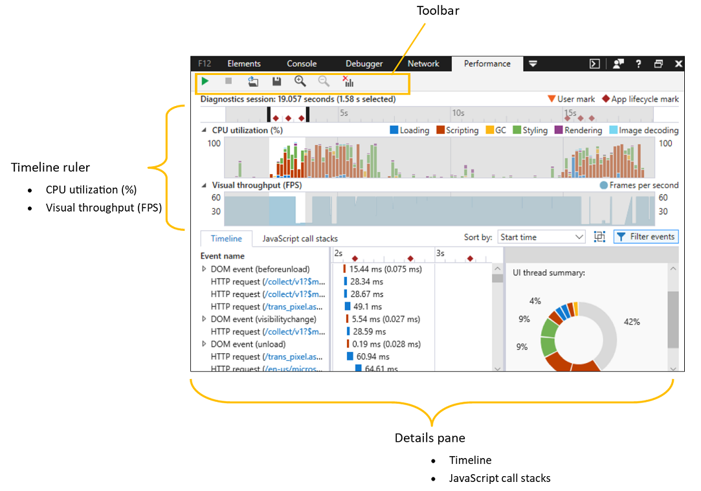
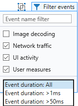
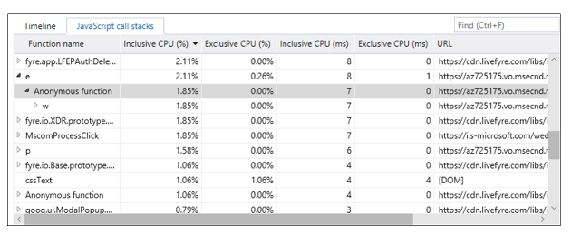

# Производительность

Панель **производительности** предлагает инструменты для профилирование и анализа отклика пользовательского интерфейса во время взаимодействия с пользователем. С его помощью вы можете:

 - [Измерение времени выполнения](#recording-a-profile) различных компонентов страницы 
 - [Подробнее о том, где](#timeline-ruler) вы проводите больше всего циклов ЦП для запуска страницы и итоговых визуальных эффектов для пользователей
 - [Пошаговая разбивка процессов,](#timeline-details) потребляющих время выполнения страницы 
 - [Почитайте стеки вызовов JavaScript,](#javascript-call-stacks) чтобы определить дорогостоящие операции, например операции, требующие пересчета макета 

## Запись профиля

Первым этапом анализа производительности страницы является захват профиля при выполнении определенного пользовательского сценария, например этапы повторного анализа ошибки производительности, которые вы пытаетесь исправить, или типичный вариант использования, который вы хотите оптимизировать для улучшения пользовательского интерфейса. 

### панель инструментов;

Используйте кнопки **остановки**запуска на панели инструментов (или) для запуска и завершения  /  **** `Ctrl+E` трассировки производительности. На вкладке "Производительность" **** на вкладке "Производительность" будет показан зеленый индикатор, который указывает, что запись идет. 

После остановки профиля создается отчет о производительности. Вы можете сохранить его на диск () и `Ctrl+S` перезагрузить `Ctrl+O` () в DevTools позже.  Сеансы диагностики DevTools сохраняются с *расширением .diagsession.*

Вот что нужно помнить при записи профиля:

- Выполните меньше всего действий, необходимых для захвата сценария, который вы пытаетесь проанализировать. Лишние действия со страницей будут создавать дополнительные данные и засорять результаты.

- Профилер автоматически помещает в отчете основные события жизненного цикла приложения, такие как навигация страницы, [DOMContentLoaded](https://developer.mozilla.org/docs/Web/Events/DOMContentLoaded)и загрузка [страницы.](https://developer.mozilla.org/docs/Web/Events/load) Вы можете добавить настраиваемые маркеры, вызывая метод [Performance.mark()](https://developer.mozilla.org/docs/Web/API/Performance/mark) из кода или консоли. 

- Если время загрузки начальной страницы важно для анализа, обязательно очищайте  кэш браузера (с панели сети), чтобы гарантировать загрузку всех ресурсов страницы из сети.

- Иногда бывает полезно записать несколько сеансов и/или пример одного сценария на разных компьютерах, чтобы лучше понять проблему производительности в подмыве.

## Линейка временной шкалы

Временная шкала работает в качестве скользящей линейки. Используйте его, чтобы ограничить область отчета определенными временными рамками (или диапазоном событий), которые могут быть интересны. Перетащите **** элементы управления черным слайдом, чтобы ограничить диапазон времени, который вы  хотите изучить и отфильтровать из отчетов временной шкалы и стеков вызовов [JavaScript](#javascript-call-stacks) в нижней области сведений. ** 

На линейке вы увидите два типа маркеров:

 - **Отметки жизненного** цикла приложения на временной шкале (например, навигация по страницам, [DOMContentLoaded](https://developer.mozilla.org/docs/Web/Events/DOMContentLoaded)и загрузка [страницы)](https://developer.mozilla.org/docs/Web/Events/load)регистрируются автоматически при записи профиля.

 - **Метки** пользователей — это настраиваемые маркеры, которые можно добавить с помощью вызовов метода [****](./console.md) [Performance.mark()](https://developer.mozilla.org/docs/Web/API/Performance/mark) из кода или консоли DevTools. С помощью *метода* [Performance.measure()](https://developer.mozilla.org/docs/Web/API/Performance/measure) можно сгруппить пометки начала и окончания в одном именовом виде. ** 

Выбрав диапазон времени, вы можете увеличить масштаб на панели инструментов **** или **** сбросить масштаб и очистить выбор, чтобы вернуться в полное представление трассировки производительности (без выбранного диапазона времени). **** Эти элементы управления также доступны в контекстное меню щелчка правой кнопкой мыши.

### Использование ЦП

График использования ЦП **на** временной шкале % описывает ресурсы обработки, потребляемых различными подсистемами браузера, которые необходимы для запуска страницы, разбиваемой по категориям:

#### Загрузка
Указывает время, затраченное на искомые ресурсы приложения и разчет HTML и CSS. Это могут быть сетевые запросы. На временной шкале регистрируются следующие связанные [события:](#timeline-details)

Событие | Описание
:------------ | :-------------
CssParsing  | Было выявилось новое содержимое CSS, необходимое для различета.
HtmlParsing | Было выявилось новое HTML-содержимое, которое необходимо было разлить в узлы и вставить в DOM.
HttpRequest | В DOM или XMLHttpRequest был создан удаленный ресурс, для создания которой требовался HTTP-запрос.
HtmlSpeculativeDownloading | В HTML-содержимом страницы был поиск необходимых ресурсов, чтобы http-запросы для них можно было запланировали как можно быстрее.

#### Сценарии
Указывает время, затраченное на разбиение и выполнение JavaScript. Это относится к событиям DOM, timers, оценке сценариев и вызовам кадров анимации. На временной шкале регистрируются следующие связанные [события:](#timeline-details)

Событие | Описание
:------------ | :-------------
DomEvent | Событие сгорело с объектом DOM.
EvaluatingScript | В DOM был выполнен новый элемент, который необходимо было `<script>` выполнять и выполнять.
EventHandler | Зарегистрированный прослушиватель событий активируется в ответ на событие DOM.
Кадр | Во время подготовки нового кадра активируется зарегистрированный вызов, чтобы он мог вносить визуальные изменения.
Измерение | С помощью этого метода измерялся сценарий для конкретного `performance.measure()` приложения.
MediaQueryListener | Зарегистрированный запрос мультимедиа был признан недействительным, что привело к выполнению связанных прослушиватель.
Каблобссервер | Один или несколько наблюдаемых элементов DOM были изменены, что привело к выполнению связанного с Ним вызова.
TimerFired | Время выполнения запланированного времени, которое привело к выполнению связанного с ним вызова.
WindowsRuntimeAsyncCallback | Объектом времени runtime Windows была завершена а также астиная операция, которая инициирует `Promise` вызов.
WindowsRuntimeEvent | Событие сработало на объекте времени работы Windows, в результате чего активируется зарегистрированный прослушиватель.

#### GC
Указывает время, затраченное на сбор памяти для объектов, которые больше не используются. На временной шкале регистрируются следующие связанные [события:](#timeline-details)

Событие | Описание
:------------ | :-------------
Сборка мусора | В среде запуска JavaScript был аудит текущего использования памяти приложением, чтобы определить, на какие объекты больше не ссылается и которые могут быть собраны.

#### Стиль
Указывает время, затраченное на вычисление представления элементов и макета. На временной шкале регистрируются следующие связанные [события:](#timeline-details)

Событие | Описание
:------------ | :-------------
AlignedBeat | Ожидающих визуальных изменений, внесенных в DOM, были обработаны, чтобы можно было обновить отображение приложения.
CssCalculation | Были внесены изменения в МОДЕЛЬ DOM или добавлен новый контент CSS, что требует пересчета свойств стиля всех затронутых элементов.
Макет | В doM были внесены изменения, которые требовали вычисления размера и/или положения всех затронутых элементов.

#### Отрисовка
Указывает время, затраченное на рисование экрана. На временной шкале регистрируются следующие связанные [события:](#timeline-details)

Событие | Описание
:------------ | :-------------
Paint | В doM были внесены визуальные изменения, которые требовали перерисовки всех затронутых частей страницы.
RenderLayer | Были внесены визуальные изменения в независимо отрисоваванный фрагмент DOM (называемого слоем), который требовал перерисовки соответствующей части страницы.

#### Декодирования изображений
Указывает время, затраченное на расшифровку и декодирования изображений. На временной шкале регистрируются следующие связанные [события:](#timeline-details)

Событие | Описание
:------------ | :-------------
ImageDecoded | Изображение было включено в DOM, и его необходимо было расшифровки из исходного формата в растровую карту.

### Визуальная пропускная способность

На графике пропускной способности визуального ** представления **(FPS)** показана предполагаемая частота кадров в секунду (FPS) в ходе сценария профилирования, где идеальной скоростью отображения является 60 кадров в секунду. Dips in the frame rate indicate performance bottlenecks and a frame rate of zero means that frames are getting dropped entirely.

## Сведения о временной шкале

Используйте нижнюю часть области сведений, чтобы получить полную информацию о том, что произошло на странице. Вкладка **"Сведения** временной шкалы" содержит разбивку событий, произошедших в различных подсистемах браузера.

1. **Управление сортировкой списка событий**

    Используйте управление **сортировкой по** выпадающим спискам, чтобы переключить порядок списка событий между *временем начала* или *длительностью (включительно).*  Это также изменяет представление сведений выбранной [временной шкалы.](#selected-timeline-details)

2. **Группировка событий по кадру**

    Используйте **** события верхнего уровня группы по кадрам для группировки событий верхнего уровня *(разметка HTML,* событие DOM и т. д.) в соответствующую единицу работы (или кадр) в периоды времени, в течение которых происходили анимации или визуальные обновления. Кадры обрабатываются как другие события, поэтому их можно отсортировать или отфильтровать, а также предоставить сводку по времени инклюзивности при нажатии в списке [событий.](#event-list) **

3. **Элементы управления фильтром списка событий**

    Используйте меню **"События фильтра"** для настройки типов событий, показанных в сведениях временной [шкалы.](#timeline-details) 

     

    Доступны следующие фильтры:

   - **Декодирования изображений**: показать события, произошедшие в фоновом потоке (например, декодирования изображений, GC). 
   - **Сетевой трафик**: показывать HTTP-запросы, привязанные к сети.
   - **Действие пользовательского**интерфейса: показывать события, произошедшие в потоке пользовательского интерфейса и/или потоке отрисовки (например, обработчики событий DOM, Layout).
   - **Меры пользователя:** показывать настраиваемые события, которые указывают на вызовы метода performance.measure().

     Можно дополнительно фильтровать события верхнего уровня по их продолжительности включительно.

### Список событий

Список *событий предоставляет хронологический* список событий подсистем браузера, произошедших в течение выбранного периода времени.  

Щелкните любую запись, чтобы заполнить диаграмму сведений о выбранном **событии** для этого элемента. Записи с вложенными событиями и функциями будут ** отображаться включительно **(время,** затраченное на выполнение функции и любых других вызываемой функции) и монопольное **(время,** затраченное только в теле самой вызывающей функции) на диаграмме.

Щелкните правой кнопкой мыши любую запись, чтобы открыть контекстное меню, чтобы отфильтровать временную шкалу, чтобы отфильтровать только это событие, и просмотреть исходный код, отвечающий за событие, на панели отладки [**(или**](./debugger.md) панели элементов, если применимо). [****](./elements.md)

### Сведения о выбранной временной шкале

Сведения *о выбранной временной шкале* предоставляют подробный график инклюзивного и монопольного времени событий в течение выбранного периода времени. При сортировке по *длительности (включительно)* с помощью управления сортировкой списка событий наиболее длительные события визуально выделяются на этой диаграмме. **** 

### Сведения о выбранном событии

Этот отчет содержит дополнительные сведения о выбранном событии, включая время *начала,* тип исполняемого потока (например, ** Загрузка, *пользовательский* *интерфейс,* отрисовка) и другие контекстные сведения, специфичные для конкретного типа события. Например, типы *прослушиватель событий* предоставляют ссылки отладщика на функцию *callback* и *стек вызовов Scheduling.*

## Стеки вызовов JavaScript

Вкладка стека вызовов **JavaScript** предоставляет сведения об использовании ЦП и временные рамки для функций скрипта, которые выполняются в течение выбранного диапазона времени:

 Столбец | Описание
:------------ | :-------------
Имя функции | Имя браузера или пользовательской функции.
Инклюзивный ЦП (%) | Процент выбранных действий ЦП в этой функции и в функциях, которые вызваны этой функцией.
Монопольный ЦП (%) | Процент выбранных действий ЦП в этой функции, за исключением действий в функциях, называемых этой функцией.
Инклюзивный ЦП (мс) | Время ЦП, затраченное на выполнение кода в этой функции и в функциях, называемых этой функцией.
Монопольный ЦП (мс) | Время, затраченное ЦП на выполнение кода в этой функции, за исключением времени в функциях, которые эта функция вызвала.
URL-адрес | URL-адреса, в которых возникла рамка стека. Вызовы функций из браузера (веб-API на основе стандартов) помечены как *[DOM]*.

## Ярлыки

| Действие                         | Установленное напрямую доверие     |
|:-------------------------------|:-------------|
| Запуск и остановка сеанса профилирование | `Ctrl` + `E` |
| Импорт сеанса профилирование       | `Ctrl` + `O` |
| Экспорт сеанса профилирование       | `Ctrl` + `S` |

## Известные проблемы

### Ошибка при запуске сеанса профилирования

Если вы видите это **** сообщение об ошибке: ошибка при запуске сеанса профилирования в средстве "Производительность", выполните следующие действия для обходного решения.

1. Нажмите `Windows Key`  +  `R` .

2. В диалоговом окке "Выполнить" **введите services.msc**.

3. Найдите стандартную службу сборщика Microsoft **(R) Diagnostics Hub** и щелкните ее правой кнопкой мыши.

4. Перезапустите стандартную службу сборщика Microsoft **(R) Diagnostics Hub.**

5. Закроем Инструменты разработчика Microsoft Edge и вкладку. Откройте новую вкладку, перейдите на страницу и нажмите `F12` .

6. Теперь вы сможете начать профилирование.

По-прежнему возникают проблемы? Отправьте нам свой отзыв с помощью **значка отправки отзыва!** 

### При остановке сеанса профилирования произошла ошибка.

Если вы видите это **** сообщение об ошибке: при остановке сеанса профилирования в средстве производительности произошла ошибка, выполните следующие действия для обходного решения.

1. Нажмите `Windows Key`  +  `R` .

2. В диалоговом окке "Выполнить" **введите services.msc**.

3. Найдите стандартную службу сборщика Microsoft **(R) Diagnostics Hub** и щелкните ее правой кнопкой мыши.

4. Перезапустите стандартную службу сборщика Microsoft **(R) Diagnostics Hub.**

5. Закроем Инструменты разработчика Microsoft Edge и вкладку. Откройте новую вкладку, перейдите на страницу и нажмите `F12` .

6. Теперь вы сможете начать профилирование.

По-прежнему возникают проблемы? Отправьте нам свой отзыв с помощью **значка отправки отзыва!** 

