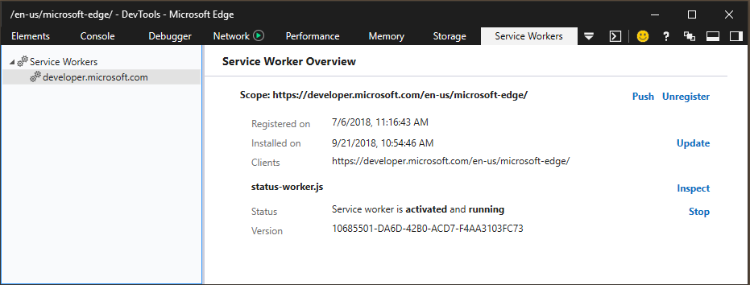

# Служебные сценарии

Панель **** "Сотрудники-службы" имеет средства для управления и отладки сотрудников служб для вашего сайта, чтобы помочь вам:

 - Обзор всех сотрудников служб, связанных с сайтом, и сведения об их области и состоянии
 - **Обновление** и управление **(отрегистрация)** регистрации рабочих служб для заданной области
 - **Push** a test notification
 - **Stop** / **Запуск отдельных** сотрудников служб и
 - **Проверка** выбранного рабочего места службы в отдельном окне отладки



Обратите внимание на следующие вопросы об отладке рабочих служб в Edge DevTools:

 - Отладка сотрудника службы запускает новый экземпляр DevTools отдельно от средств страницы, так как сотрудники службы могут совместно использовать несколько вкладок.
 - Элементы [**и**](./elements.md) [****](./emulation.md) панели эмуляции отсутствуют в отладке рабочего отладка службы, поскольку сотрудники служб работают в фоновом режиме и не управляют напрямую на переднем плане приложения.
 - В настоящее время сетевой трафик для сотрудника службы передается только из экземпляра отладки DevTools для этого рабочего, а не из экземпляра отлада для самой страницы.
 - Чтобы имитировать **push-событие** из DevTools, необходимо ** добавить прослушиватель push-событий в рабочий процесс службы, чтобы наблюдать за его эффектом. В следующем примере пошагово напечатается сообщение "Тестирование push-сообщений от DevTools" в консоли рабочего **консоли службы.**

   ```JavaScript
   self.addEventListener('push', function(event){
       console.log(event.data.text());
   });
   ```

Вот несколько общих моментов, которые необходимо помнить при использовании сотрудников службы.

- **Только HTTPS.** Сотрудники службы не будут работать в HTTP; необходимо использовать ПРОТОКОЛ HTTPS. Однако вы можете зарегистрировать сотрудников служб в `localhost` целях тестирования.

- **Доступ к DOM запрещен.** Как и для веб-работников, доступ к объектной модели страницы не данная. Это означает, что если вам нужно изменить что-либо о странице, необходимо использовать от рабочего сотрудника службы на страницу, чтобы можно было обрабатывать изменения DOM со [`postMessage`](https://developer.mozilla.org/docs/Web/API/Worker/postMessage) страницы.

- **Выполняется отдельно от страницы.** Так как эти сценарии не привязаны к времени существования страницы, важно понимать, что они не имеют одного контекста со страницей. Помимо того, что у них нет доступа к DOM (как было сказано ранее), у них не будет доступа к тем же переменным, которые доступны на странице.

- ***Переопределяет кэш приложений.*** Кэш приложений будет игнорироваться при использовании сотрудников службы. API Service Worker предназначен для того, чтобы полностью вытеснить кэш приложений, предоставляя более детализированный контроль веб-разработчику.

  - **Сценарий не может быть в CDN.** Файл JavaScript для рабочего сотрудника службы не может быть включен в сеть распространения содержимого (CDN), он должен быть в том же домене, что и страница. Однако при этом можно импортировать сценарии из CDN.

- **Может быть завершен в любое время.** Рабочие службы должны быть кратковременны и их жизненный срок связан с событиями. В частности, у сотрудников служб есть ограничение по времени, в течение которого они должны завершить выполнение обработчиков событий. В других случаях браузер или операционная система могут завершить работу службы, которая влияет на потребление батареи, ЦП или памяти. В любом случае избегайте использования глобальных переменных в скрипте рабочего сценария службы, если для последующего обрабатываемого события используется другой рабочий экземпляр службы.

- **Разрешены только асинхронные запросы.** Синхронный XHR здесь не разрешен! Не является localStorage, поэтому лучше использовать IndexedDB и новый API кэша, описанные выше.

- **Область действия рабочего сотрудника службы — 1:1.** В области может быть только один рабочий сотрудник службы. Это означает, что при попытке зарегистрировать другого сотрудника службы для области, в которую уже есть рабочий сотрудник службы, этот рабочий работник будет обновлен.
