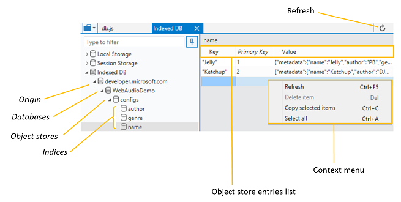

# Хранилище

Панель хранения **используется** для проверки и управления различными локально кэшными данными, в том числе:

 - [Пары ключ-значение](#local-and-session-storage-managers) для веб-хранилища *(локальное* хранилище и хранилище сеансов) **
 - [Индексные структурированные данные](#indexeddb-manager) баз данных
 - [Файлы cookie](#cookies-list) для домена
 - [Кэш](#cache-manager) (пары запросов и ответов) для отладки рабочих служб

Разйдите любую из этих категорий и щелкните ее, чтобы открыть вкладку диспетчера ресурсов.

## Локальные диспетчеры хранилища и диспетчеры хранилища сеансов

Используйте *локальный диспетчер хранилища и* *диспетчер хранилища сеансов* для проверки и управления веб-хранилищем для вашей страницы. 

В **папках "Локальное** хранилище" и [**](./debugger.md#resource-picker) "Хранилище сеансов" в панели выбора ресурсов панели хранения отображается список источника страницы. **** При выборе одного из этих кадров открывается редактируемая таблица текущих пар ключ-значение, задаваемых с помощью [Window.localStorage](https://developer.mozilla.org/docs/Web/API/Window/localStorage) или  [Window.sessionStorage](https://developer.mozilla.org/docs/Web/API/Window/sessionStorage)соответственно (и/или задаваемых непосредственно из списка хранилища DevTools).

На *вкладке "Локальное* хранилище" *и "Хранилище* сеансов" можно:

 - **Обновите** () список хранения, чтобы увидеть текущий набор пар "ключ-значение" для `Ctrl+F5` данного  домена. (При обновлении скрипта список не обновляется автоматически.)
 - **Имитация достижения предельного хранилища для** веб-хранилища Microsoft Edge. У каждого домена и поддомена есть собственная область хранения, но существует комбинированное ограничение:
    - **Поддомены:** до 5 МБ пространства
    - **Домены:** до 10 МБ пространства
    - **Всего для всех доменов:** до 50 МБ пространства

   Хранилище сеанса очищается, как только закрывается последняя вкладка браузера, ссылаясь на источник. Локальные записи хранения сохраняются неопределенное время до тех пор, пока страница не будет очищена программным путем или вручную пользователем:

   **Параметры**  >  **Очистка данных браузера**  >  **Файлы cookie и сохраненные данные веб-сайта**

### Список хранилищ

Из *таблицы списка хранилища* вы можете:

 - **Проверьте и отсортировать** пары "ключ-значение", щелкнув имя столбца в таблице.
 - **Изменить** ключ *и* *значение существующей* записи, щелкнув ячейку.
 - **Delete** ( `Del` ) an entry from the right-click context menu option, Delete *item*.
 - **Добавьте** новую пару ключ-значение, щелкнув пустую строку в нижней части таблицы.

### Ярлыки

| Действие              | Установленное напрямую доверие      |
|:--------------------|:--------------|
| Обновить             | `Ctrl` + `F5` |
| Удалить элемент         | `Del`         |
| Копирование выбранных элементов | `Ctrl` + `C`  |
| Выделить все          | `Ctrl` + `A`  |

## Диспетчер IndexedDB

Вкладка **IndexedDB** используется для проверки структурированных данных, которые хранятся локально на клиентских компьютерах, и управления ими. В частности, можно проверить, отсортировать и обновить хранилища объектов и индексы, а также удалить отдельные записи значения ключа.

> [!TIP]
> Вы можете использовать нашу [демонстрацию Audio Mixer](https://developer.microsoft.com/microsoft-edge/testdrive/demos/audiomixer/) для тестирования диспетчера *IndexedDB* в Microsoft Edge DevTools.

Чтобы удалить все данные IndexedDB, хранимые для текущего пользователя в Microsoft Edge, используйте меню *параметров* Microsoft Edge:

**...** >  **Параметры**  >  **Очистка данных браузера**  >  **Файлы cookie и сохраненные данные веб-сайта**

В **папке IndexedDB** в средстве [**](./debugger.md#resource-picker) "Выбор ресурсов" отладщика отображается список источников ресурсов, загруженных страницей. Все базы данных IndexedDB (IDB) будут указаны в источниках вместе с их хранилищами объектов. 

### Панель инструментов IndexedDB

На панели *инструментов IndexedDB* можно:

 - **Обновить** ( `Ctrl+F5` ), чтобы увидеть текущие записи в хранилище объектов или индексе базы данных. Диспетчер IndexedDB не обновляется автоматически при внесении изменений в базу данных.

### Список записей в хранилище объектов

Из *таблицы "Хранилище объектов"* или *"Индекс"* можно:

 - **Проверьте и отсортировать** пары "ключ-значение", щелкнув любое имя столбца в таблице.
 - **Refresh** ( `Ctrl+F5` )
 - **Удаление элемента** ( `Del` ) для удаления выбранной записи в хранилище объектов или индексе. Это также можно сделать в  контекстное меню правой кнопкой мыши *"Удалить элемент".*
 - **Скопируйте выбранные элементы** ( ), чтобы скопировать `Ctrl+C` выбранный элемент в буфер обмена. Это также можно сделать в  контекстное меню правой кнопкой мыши, *скопируйте выбранный элемент.*
 - **Выберите все** `Ctrl+A` () для выбора всех записей в хранилище объектов или индексе. Это также можно сделать в  контекстное меню правой кнопкой мыши, *выберите все.*

Столбцы в хранилище *объектов или* таблице *индекса* можно сортировать:

Столбец | Описание
:------------ | :-------------
Раздел | Имя пары "ключ-значение" (то же, что *и первичный*ключ) при итерации над хранилищем объектов; Имя ключа индекса (текущий ключ курсора) при итерации по индексу
Первичный ключ | Имя пары "ключ-значение" (подробнее о ключах [IDB](https://developer.mozilla.org/docs/Web/API/IndexedDB_API/Using_IndexedDB#Structuring_the_database)см. в веб-документы *MDN)*
Значение | Значение пары "ключ-значение"

Ознакомьтесь *с веб-документы MDN,* чтобы узнать больше о понятиях [и использовании IndexedDB.](https://developer.mozilla.org/docs/Web/API/IndexedDB_API)

### Контекстное меню

Помимо панели инструментов [ *IndexedDB,* ](#indexeddb-toolbar)вы также можете управлять своими данными в хранилищах объектов или индексах с помощью контекстного меню правой кнопки мыши и/или сочетания [клавиш.](#shortcuts) ****

### Ярлыки

Действие | Установленное напрямую доверие
:------------ | :-------------
Обновить | `Ctrl` + `F5`
Удаление пары "ключ-значение" | `Del`
Копирование выбранных элементов | `Ctrl` + `C`
Выделить все | `Ctrl` + `A`

## Диспетчер файлов cookie

Используйте диспетчер *файлов cookie для* проверки файлов cookie для данного домена и управления ими. 

В **папке cookie** в средстве [**](./debugger.md#resource-picker) "Выбор ресурсов" отладщика отображается список источников ресурсов, загруженных страницей. При выборе одного из этих кадров открывается таблица, представляющая текущие файлы cookie, установленные либо с помощью HTTP-загона, либо с помощью скрипта [Document.cookie.](https://developer.mozilla.org/docs/Web/API/Document/cookie) 

На панели *инструментов вкладки "Файлы* cookie" можно:

 - **Обновите** () список файлов cookie, чтобы увидеть текущий набор `Ctrl+F5` файлов cookie для данного домена.  (Список не обновляется автоматически.)
 - **Удалите все файлы cookie** ( `Ctrl+Shift+Del` ) (сеанс и постоянный) для пути к текущей странице.
 - **Удалите все файлы cookie сеанса** `Ctrl+Del` () для пути к текущей странице.

Чтобы полностью очистить список *файлов cookie,* может потребоваться очистить все файлы **cookie** для домена с панели инструментов [**панели**](./network.md#toolbar) "Сеть".

### Список файлов cookie

Из *таблицы списка cookie можно:*

 - **Проверьте и отсортировать** файлы cookie, щелкнув любое имя столбца в таблице.
 - **Изменить** имя *и* *значение существующего* файла cookie, щелкнув ячейку.
 - **Delete** ( `Del` ) a cookie from the right-click context [menu](#context-menu) option, *Delete cookie*.
 - **Добавьте** новый файл cookie сеанса для данного *домена или* пути, щелкнув пустую строку в нижней части таблицы. Это работает только для файлов cookie сеанса; постоянные файлы cookie (с определенными датами истечения срока действия) должны устанавливаться с помощью традиционных методов. Значения *Domain* и *Path* заполняются автоматически в соответствии с расположением страницы.

Столбцы списка *cookie можно сортировать:*

Столбец | Описание
:------------ | :-------------
Name | Имя файла cookie
Значение | Значение файла cookie
Домен | Имя хоста файла cookie (может быть пустым)
Путь | URL-путь для файла cookie (может быть пустым)
Срок действия истекает | Максимальное время существования файла cookie в качестве даты и времени HTTP. Если нет `Expires` или `Max-Age` не было установлено, запись считается файлом cookie *сеанса.*
Только HTTP | Указывает, установлен ли файл cookie с директивой, указывая, что он `HttpOnly` недоступен из JavaScript
Защита | Указывает, был ли файл cookie установлен с помощью директивы, указывая, что он будет отправлен на сервер только из запроса с использованием `Secure` протокола SSL и HTTPS.

Дополнительные сведения о свойствах файлов cookie см. в справочнике [по set-cookie веб-документы](https://developer.mozilla.org/docs/Web/HTTP/Headers/Set-Cookie) **MDN.**

### Контекстное меню

Помимо панели инструментов вкладок *"Файлы* cookie", вы также можете **** управлять своими файлами cookie из контекстного меню правой кнопкой мыши и/или с помощью сочетания [клавиш.](#shortcuts)

### Ярлыки

| Действие                     | Установленное напрямую доверие                 |
|:---------------------------|:-------------------------|
| Обновить                    | `Ctrl` + `F5`            |
| Удаление файла cookie              | `Del`                    |
| Удаление всех файлов cookie         | `Ctrl` + `Shift` + `Del` |
| Удаление всех файлов cookie сеанса | `Ctrl` + `Del`           |
| Копирование выбранных элементов        | `Ctrl` + `C`             |
| Выделить все                 | `Ctrl` + `A`             |

### Диспетчер кэша

Если щелкнуть определенную запись кэша, **** откроется диспетчер кэша рабочих служб, где можно ** проверить и при желании удалить записи кэша *(пары* ключ-значение запроса и ответа):

### Ярлыки

#### Диспетчер кэша

| Действие              | Установленное напрямую доверие      |
|:--------------------|:--------------|
| Обновить             | `Ctrl` + `F5` |
| Удалить элемент         | `Del`         |
| Копирование выбранных элементов | `Ctrl` + `C`  |
| Выделить все          | `Ctrl` + `A`  |
