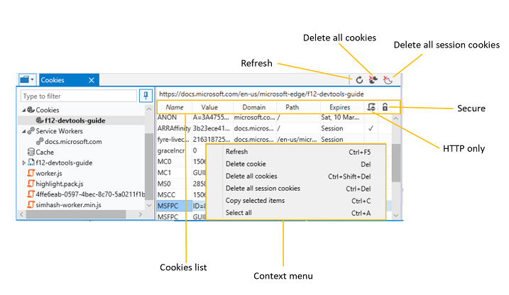

# ХранилищеStorage

Панель хранения **используется** для проверки и управления различными локально кэшными данными, в том числе:Use the **Storage** panel to inspect and manage various locally cached data, including:

 - [Пары ключ-значение](#local-and-session-storage-managers) для веб-хранилища *(локальное* хранилище и хранилище сеансов) \*\*[Web storage](#local-and-session-storage-managers) (*Local* and *Session* storage) key/values pairs
 - [Индексные структурированные данные](#indexeddb-manager) баз данных[Indexed DB](#indexeddb-manager) structured data
 - [Файлы cookie](#cookies-list) для домена[Cookies](#cookies-list) for the domain
 - [Кэш](#cache-manager) (пары запросов и ответов) для отладки рабочих служб[Cache](#cache-manager) (request/response pairs) for service worker debugging

Разйдите любую из этих категорий и щелкните ее, чтобы открыть вкладку диспетчера ресурсов.Expand any of those categories and click on a child entry to open its resource manager tab.

## Локальные диспетчеры хранилища и диспетчеры хранилища сеансовLocal and Session storage managers

Используйте *локальный диспетчер хранилища и* *диспетчер хранилища сеансов* для проверки и управления веб-хранилищем для вашей страницы.Use the *Local Storage manager* and *Session Storage manager* to inspect and manage the web storage for  your page. 

В **папках "Локальное** хранилище" и [\*\*](./debugger.md#resource-picker) "Хранилище сеансов" в панели выбора ресурсов панели хранения отображается список источника страницы. \*\*\*\*The **Local Storage** and **Session Storage** folders inside the Storage panel's [*Resource picker*](./debugger.md#resource-picker) display a list of origins for the page. При выборе одного из этих кадров открывается редактируемая таблица текущих пар ключ-значение, задаваемых с помощью [Window.localStorage](https://developer.mozilla.org/docs/Web/API/Window/localStorage) или  [Window.sessionStorage](https://developer.mozilla.org/docs/Web/API/Window/sessionStorage)соответственно (и/или задаваемых непосредственно из списка хранилища DevTools).Selecting one of these frames opens up an editable table of the current key/value pairs set via [Window.localStorage](https://developer.mozilla.org/docs/Web/API/Window/localStorage) or [Window.sessionStorage](https://developer.mozilla.org/docs/Web/API/Window/sessionStorage), respectively (and/or set directly from the  DevTools [Storage list](#storage-list)).

На *вкладке "Локальное* хранилище" *и "Хранилище* сеансов" можно:From the *Local Storage* and *Session Storage* tabs you can:

 - **Обновите** () список хранения, чтобы увидеть текущий набор пар "ключ-значение" для `Ctrl+F5` данного  домена.**Refresh** (`Ctrl+F5`) the [storage list](#cookies-list) to see the current set of key/values pairs for the given domain. (При обновлении скрипта список не обновляется автоматически.)(The list does not auto-refresh upon script updates.)
 - **Имитация достижения предельного хранилища для** веб-хранилища Microsoft Edge.**Simulate reaching the storage limit** for Microsoft Edge web storage. У каждого домена и поддомена есть собственная область хранения, но существует комбинированное ограничение:Each domain and subdomain has its own storage area, however there is a combined limit:
    - **Поддомены:** до 5 МБ пространства**Subdomains:** up to 5 MBs of space
    - **Домены:** до 10 МБ пространства**Domains:** up to 10 MBs of space
    - **Всего для всех доменов:** до 50 МБ пространства**Total for all domains:** up to 50 MBs of space

   Хранилище сеанса очищается, как только закрывается последняя вкладка браузера, ссылаясь на источник.Session storage is cleared as soon as the last browser tab referencing its origin is closed. Локальные записи хранения сохраняются неопределенное время до тех пор, пока страница не будет очищена программным путем или вручную пользователем:Local storage entries persist indefinitely until cleared programmatically by the page or manually by the user:

   **Параметры**  >  **Очистка данных браузера**  >  **Файлы cookie и сохраненные данные веб-сайта****Settings** > **Clear browsing data** > **Cookies and saved website data**

### Список хранилищStorage list

Из *таблицы списка хранилища* вы можете:From the *Storage list* table you can:

 - **Проверьте и отсортировать** пары "ключ-значение", щелкнув имя столбца в таблице.**Inspect and sort** your key/value pairs by clicking on either column name in the table.
 - **Изменить** ключ *и* *значение существующей* записи, щелкнув ячейку.**Edit** the *Key* and *Value* of an existing entry by clicking in the cell.
 - **Delete** ( `Del` ) an entry from the right-click context menu option, Delete *item*.**Delete** (`Del`) an entry from the right-click context menu option, *Delete item*.
 - **Добавьте** новую пару ключ-значение, щелкнув пустую строку в нижней части таблицы.**Add** a new key/value pair by clicking on the empty row at the bottom of the table.

### ЯрлыкиShortcuts

| ДействиеAction              | Установленное напрямую довериеShortcut      |
|:--------------------|:--------------|
| ОбновитьRefresh             | `Ctrl` + `F5` |
| Удалить элементDelete item         | `Del`         |
| Копирование выбранных элементовCopy selected items | `Ctrl` + `C`  |
| Выделить всеSelect all          | `Ctrl` + `A`  |

## Диспетчер IndexedDBIndexedDB manager

Вкладка **IndexedDB** используется для проверки структурированных данных, которые хранятся локально на клиентских компьютерах, и управления ими.Use the **IndexedDB** tab to inspect and manage the structured data stored locally on a client machine. В частности, можно проверить, отсортировать и обновить хранилища объектов и индексы, а также удалить отдельные записи значения ключа.Specifically, you can inspect/sort and refresh your object stores and indices, and also delete individual key-value entries.

> [!TIP]
> Вы можете использовать нашу [демонстрацию Audio Mixer](https://developer.microsoft.com/microsoft-edge/testdrive/demos/audiomixer/) для тестирования диспетчера *IndexedDB* в Microsoft Edge DevTools.You can use our [Audio Mixer](https://developer.microsoft.com/microsoft-edge/testdrive/demos/audiomixer/) demo to test drive the *IndexedDB manager* in Microsoft Edge DevTools.

Чтобы удалить все данные IndexedDB, хранимые для текущего пользователя в Microsoft Edge, используйте меню *параметров* Microsoft Edge:To delete all the IndexedDB data stored for the current user in Microsoft Edge, use the Microsoft Edge *Settings* menu:

**...** >  **Параметры**  >  **Очистка данных браузера**  >  **Файлы cookie и сохраненные данные веб-сайта****...** > **Settings** > **Clear browsing data** > **Cookies and saved website data**

В **папке IndexedDB** в средстве [\*\*](./debugger.md#resource-picker) "Выбор ресурсов" отладщика отображается список источников ресурсов, загруженных страницей.The **IndexedDB** folder inside the Debugger's [*Resource picker*](./debugger.md#resource-picker) displays a list of origins from the resources loaded by the page. Все базы данных IndexedDB (IDB) будут указаны в источниках вместе с их хранилищами объектов.Any IndexedDB (IDB) databases will be listed under the origin, along with their object stores. 

### Панель инструментов IndexedDBIndexedDB Toolbar

На панели *инструментов IndexedDB* можно:From the *IndexedDB* toolbar you can:

 - **Обновить** ( `Ctrl+F5` ), чтобы увидеть текущие записи в хранилище объектов или индексе базы данных.**Refresh** (`Ctrl+F5`) to see the current entries in the object store or index of your database. Диспетчер IndexedDB не обновляется автоматически при внесении изменений в базу данных.The IndexedDB manager does not auto-refresh when changes are made to your database.

### Список записей в хранилище объектовObject store entries list

Из *таблицы "Хранилище объектов"* или *"Индекс"* можно:From the *Object store* or *Index* table you can:

 - **Проверьте и отсортировать** пары "ключ-значение", щелкнув любое имя столбца в таблице.**Inspect and sort** your key-value pairs by clicking on any column name in the table.
 - **Refresh** ( `Ctrl+F5` )**Refresh** (`Ctrl+F5`)
 - **Удаление элемента** ( `Del` ) для удаления выбранной записи в хранилище объектов или индексе.**Delete item** (`Del`) to remove the selected entry in your object store or index. Это также можно сделать в  контекстное меню правой кнопкой мыши *"Удалить элемент".*You can also do this from the right-click [context menu](#context-menu) option, *Delete item*.
 - **Скопируйте выбранные элементы** ( ), чтобы скопировать `Ctrl+C` выбранный элемент в буфер обмена.**Copy selected items** (`Ctrl+C`) to copy the selected item to your clipboard. Это также можно сделать в  контекстное меню правой кнопкой мыши, *скопируйте выбранный элемент.*You can also do this from the right-click [context menu](#context-menu) option, *Copy selected item*.
 - **Выберите все** `Ctrl+A` () для выбора всех записей в хранилище объектов или индексе.**Select all** (`Ctrl+A`) to select all the entries in your object store or index. Это также можно сделать в  контекстное меню правой кнопкой мыши, *выберите все.*You can also do this from the right-click [context menu](#context-menu) option, *Select all*.

Столбцы в хранилище *объектов или* таблице *индекса* можно сортировать:The columns of the *Object store* or *Index* table are sortable:

СтолбецColumn | ОписаниеDescription
:------------ | :-------------
РазделKey | Имя пары "ключ-значение" (то же, что *и первичный*ключ) при итерации над хранилищем объектов; Имя ключа индекса (текущий ключ курсора) при итерации по индексуName of the key-value pair (same as *Primary Key*) when iterating over an object store; Name of the index key (cursor's current key) when iterating over an index
Первичный ключPrimary Key | Имя пары "ключ-значение" (подробнее о ключах [IDB](https://developer.mozilla.org/docs/Web/API/IndexedDB_API/Using_IndexedDB#Structuring_the_database)см. в веб-документы *MDN)*Name of the key-value pair (see *MDN web docs* for more on IDB [keys](https://developer.mozilla.org/docs/Web/API/IndexedDB_API/Using_IndexedDB#Structuring_the_database))
ЗначениеValue | Значение пары "ключ-значение"Value of the key-value pair

Ознакомьтесь *с веб-документы MDN,* чтобы узнать больше о понятиях [и использовании IndexedDB.](https://developer.mozilla.org/docs/Web/API/IndexedDB_API)Check out *MDN web docs* for more on [IndexedDB concepts and usage](https://developer.mozilla.org/docs/Web/API/IndexedDB_API).

### Контекстное менюContext menu

Помимо панели инструментов [ *IndexedDB,* ](#indexeddb-toolbar)вы также можете управлять своими данными в хранилищах объектов или индексах с помощью контекстного меню правой кнопки мыши и/или сочетания [клавиш.](#shortcuts) \*\*\*\*In addition to the [*IndexedDB* toolbar](#indexeddb-toolbar), you can also manage your data in object stores or indices from the right-click **Context menu** and/or the keyboard [shortcuts](#shortcuts).

### ЯрлыкиShortcuts

ДействиеAction | Установленное напрямую довериеShortcut
:------------ | :-------------
ОбновитьRefresh | `Ctrl` + `F5`
Удаление пары "ключ-значение"Delete key-value pair | `Del`
Копирование выбранных элементовCopy selected items | `Ctrl` + `C`
Выделить всеSelect all | `Ctrl` + `A`

## Диспетчер файлов cookieCookies manager

Используйте диспетчер *файлов cookie для* проверки файлов cookie для данного домена и управления ими.Use the *Cookies manager* to inspect and manage the cookies for the given domain. 

В **папке cookie** в средстве [\*\*](./debugger.md#resource-picker) "Выбор ресурсов" отладщика отображается список источников ресурсов, загруженных страницей.The **Cookies** folder inside the Debugger's [*Resource picker*](./debugger.md#resource-picker) displays a list of origins from the resources loaded by the page. При выборе одного из этих кадров открывается таблица, представляющая текущие файлы cookie, установленные либо с помощью HTTP-загона, либо с помощью скрипта [Document.cookie.](https://developer.mozilla.org/docs/Web/API/Document/cookie) Selecting one of these frames opens up a table representing the current cookies set by either [HTTP](https://developer.mozilla.org/docs/Web/HTTP/Cookies) header or via script with [Document.cookie](https://developer.mozilla.org/docs/Web/API/Document/cookie).

На панели *инструментов вкладки "Файлы* cookie" можно:From the *Cookies* tab toolbar you can:

 - **Обновите** () список файлов cookie, чтобы увидеть текущий набор `Ctrl+F5` файлов cookie для данного домена. **Refresh** (`Ctrl+F5`) the [Cookies list](#cookies-list) to see the current set of cookies for the given domain. (Список не обновляется автоматически.)(The list does not auto-refresh.)
 - **Удалите все файлы cookie** ( `Ctrl+Shift+Del` ) (сеанс и постоянный) для пути к текущей странице.**Delete all cookies** (`Ctrl+Shift+Del`) (session and permanent) for the path of the current page.
 - **Удалите все файлы cookie сеанса** `Ctrl+Del` () для пути к текущей странице.**Delete all session cookies** (`Ctrl+Del`) for the path of the current page.

Чтобы полностью очистить список *файлов cookie,* может потребоваться очистить все файлы **cookie** для домена с панели инструментов [**панели**](./network.md#toolbar) "Сеть".To completely clear your *Cookies list*, you might need to **Clear all cookies for the domain** from the [**Network**](./network.md#toolbar) panel toolbar.

### Список файлов cookieCookies list

Из *таблицы списка cookie можно:*From the *Cookies list* table you can:

 - **Проверьте и отсортировать** файлы cookie, щелкнув любое имя столбца в таблице.**Inspect and sort** your cookies by clicking on any column name in the table.
 - **Изменить** имя *и* *значение существующего* файла cookie, щелкнув ячейку.**Edit** the *Name* and *Value* of an existing cookie by clicking in the cell.
 - **Delete** ( `Del` ) a cookie from the right-click context [menu](#context-menu) option, *Delete cookie*.**Delete** (`Del`) a cookie from the right-click [context menu](#context-menu) option, *Delete cookie*.
 - **Добавьте** новый файл cookie сеанса для данного *домена или* пути, щелкнув пустую строку в нижней части таблицы.**Add** a new session cookie for the given *Domain/Path* by clicking on the empty row at the bottom of the table. Это работает только для файлов cookie сеанса; постоянные файлы cookie (с определенными датами истечения срока действия) должны устанавливаться с помощью традиционных методов.This only works for session cookies; permanent cookies (with specific expiry dates) must be set with traditional methods. Значения *Domain* и *Path* заполняются автоматически в соответствии с расположением страницы.The *Domain* and *Path* values are auto-filled according to the location of the page.

Столбцы списка *cookie можно сортировать:*The columns of the *Cookies list* are sortable:

СтолбецColumn | ОписаниеDescription
:------------ | :-------------
NameName | Имя файла cookieName of the cookie
ЗначениеValue | Значение файла cookieValue of the cookie
ДоменDomain | Имя хоста файла cookie (может быть пустым)Host name of the cookie (may be empty)
ПутьPath | URL-путь для файла cookie (может быть пустым)URL path for the cookie (may be empty)
Срок действия истекаетExpires | Максимальное время существования файла cookie в качестве даты и времени HTTP.Maximum lifetime of the cookie as an HTTP-date timestamp. Если нет `Expires` или `Max-Age` не было установлено, запись считается файлом cookie *сеанса.*If no `Expires` or `Max-Age` was set, the entry is considered a *Session* cookie.
Только HTTPHTTP only | Указывает, установлен ли файл cookie с директивой, указывая, что он `HttpOnly` недоступен из JavaScriptIndicates if the cookie was set with `HttpOnly` directive, indicating that it is inaccessible from JavaScript
ЗащитаSecure | Указывает, был ли файл cookie установлен с помощью директивы, указывая, что он будет отправлен на сервер только из запроса с использованием `Secure` протокола SSL и HTTPS.Indicates if the cookie was set with the `Secure` directive, indicating it will only be sent to the server from a request using SSL and the HTTPS protocol.

Дополнительные сведения о свойствах файлов cookie см. в справочнике [по set-cookie веб-документы](https://developer.mozilla.org/docs/Web/HTTP/Headers/Set-Cookie) **MDN.**See the **MDN web docs** [Set-Cookie](https://developer.mozilla.org/docs/Web/HTTP/Headers/Set-Cookie) reference for further details on cookie properties.

### Контекстное менюContext menu

Помимо панели инструментов вкладок *"Файлы* cookie", вы также можете \*\*\*\* управлять своими файлами cookie из контекстного меню правой кнопкой мыши и/или с помощью сочетания [клавиш.](#shortcuts)In addition to the *Cookies* tab [toolbar](#cookies-manager), you can also manage your cookies from the right-click **Context menu** and/or the keyboard [shortcuts](#shortcuts).

### ЯрлыкиShortcuts

| ДействиеAction                     | Установленное напрямую довериеShortcut                 |
|:---------------------------|:-------------------------|
| ОбновитьRefresh                    | `Ctrl` + `F5`            |
| Удаление файла cookieDelete cookie              | `Del`                    |
| Удаление всех файлов cookieDelete all cookies         | `Ctrl` + `Shift` + `Del` |
| Удаление всех файлов cookie сеансаDelete all session cookies | `Ctrl` + `Del`           |
| Копирование выбранных элементовCopy selected items        | `Ctrl` + `C`             |
| Выделить всеSelect all                 | `Ctrl` + `A`             |

### Диспетчер кэшаCache manager

Если щелкнуть определенную запись кэша, \*\*\*\* откроется диспетчер кэша рабочих служб, где можно \*\* проверить и при желании удалить записи кэша *(пары* ключ-значение запроса и ответа):Clicking on a specific cache entry will open up the service worker **Cache** manager, where you can inspect and optionally delete cache entries (*Request* and *Response* key/value pairs):

### ЯрлыкиShortcuts

#### Диспетчер кэшаCache manager

| ДействиеAction              | Установленное напрямую довериеShortcut      |
|:--------------------|:--------------|
| ОбновитьRefresh             | `Ctrl` + `F5` |
| Удалить элементDelete item         | `Del`         |
| Копирование выбранных элементовCopy selected items | `Ctrl` + `C`  |
| Выделить всеSelect all          | `Ctrl` + `A`  |
