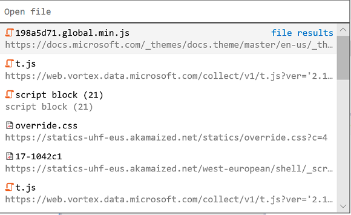

# Средства разработчика в последнем обновлении для Windows 10 (EdgeHTML 18)DevTools in the latest Windows 10 update (EdgeHTML 18)

Последнее обновление Microsoft Edge DevTools добавляет ряд удобных функций как в пользовательский интерфейс, так [\*\*](#service-workers-panel) и на первый  план, включая новые выделенные панели для сотрудников службы и [*хранилища,*](#storage-panel)средства поиска исходных файлов в отладке и новые домены протокола [Edge DevTools](#edge-devtools-protocol-updates) для отладки стилей и макетов и консольных API.The latest update to Microsoft Edge DevTools adds a number of conveniences both to the UI and under the hood, including new dedicated panels for [*Service Workers*](#service-workers-panel) and [*Storage*](#storage-panel), source [file search](#source-file-search-tools) tools in the Debugger, and new [Edge DevTools Protocol domains](#edge-devtools-protocol-updates) for style/layout debugging and console APIs.

Ниже представлены последние функции Microsoft Edge DevTools, доступные в обновлении Windows 10 за октябрь [2018](/windows/uwp/whats-new/windows-10-build-17763) г.[(EdgeHTML 18).](https://aka.ms/devguide_edgehtml_18)Here are the latest Microsoft Edge DevTools features available now in the [Windows 10 October 2018 Update](/windows/uwp/whats-new/windows-10-build-17763) ([EdgeHTML 18](https://aka.ms/devguide_edgehtml_18)). Кроме того, мы исправили ряд ошибок с доступностью, надежностью и производительностью, чтобы улучшить основы!In addition to all this, we’ve also fixed a number of accessibility, reliability, and performance bugs to improve fundamentals!

## Приложение DevToolsDevTools app

Мы обновили приложение Microsoft [Edge DevTools Preview.](./index.md#microsoft-store-app)We've updated the standalone [Microsoft Edge DevTools Preview app](./index.md#microsoft-store-app). Последний выпуск включает удаленный доступ отладки к основным [\*\*\*\*](./debugger.md)funtionality в отладке, элементах [**(для**](./elements.md) операций только для чтения) и [**панелях**](./console.md) консоли.The latest release includes remote debugging access to core funtionality in the [**Debugger**](./debugger.md), [**Elements**](./elements.md) (for read-only operations), and [**Console**](./console.md) panels.

## Панель "Рабочие службы"Service Workers panel

Теперь существует специальная [\*\*\*\*](./service-workers.md) панель "Сотрудники-службы" для проверки, управления и отладки сотрудников службы сайта.There's now a dedicated [**Service Workers**](./service-workers.md) panel for inspecting, managing, and debugging your site's service workers. Это обеспечивает те же функциональные \*\* возможности, что и в панели отладки (теперь с менее переполненным пользовательским интерфейсом)..This provides the same functionality as was previously in the *Debugger* panel (now with a less-crowded UI!).

## Панель храненияStorage panel

Мы также переместили все локальные инспекторы хранилища *(local and Sesion Storage, IndexedDB, Cookies, Cache)* ранее в отладке на собственную выделенную панель [**хранения.**](./storage.md) \*\*We've also moved all the local storage inspectors (*Local and Sesion Storage, IndexedDB, Cookies, Cache*) previously in the *Debugger* to their own dedicated [**Storage**](./storage.md) panel.

## Средства поиска исходных файловSource file search tools

Теперь [**в отладке**](./debugger.md) есть области [поиска исходных](./debugger.md#file-search) файлов.The [**Debugger**](./debugger.md) now has a [source file search](./debugger.md#file-search) pane. Откройте его с помощью команды *"Найти в* файлах" (), если у вас есть определенная строка кода, который вы пытаетесь найти `Ctrl` + `Shift` + `F` в источнике.Open it with the *Find in files* command (`Ctrl`+`Shift`+`F`) when you have a specific string of code you're trying to find in the source. Панель инструментов предоставляет различные параметры поиска, включая регулярные выражения.The toolbar provides different search options, including regular expressions. 

Вы также можете быстро открыть любой загруженный исходный файл с помощью *команды "Открыть* `Ctrl` + `P` файл" ().You can also quickly open any loaded source file with the *Open file* (`Ctrl`+`P`) command.

## Обновления протокола Edge DevToolsEdge DevTools Protocol updates

Версия [0.2](../devtools-protocol/0.2/index.md) протокола DevTools предоставляет новые домены для отладки стиля и макета (только для чтения) и консольных API, а также основные функции отладки скриптов, введенные в версии [0.1.](../devtools-protocol/0.1/index.md)[Version 0.2](../devtools-protocol/0.2/index.md) of the DevTools Protocol provides new domains for style and layout (read-only) debugging and console APIs, in addition to the core script debugging functionality introduced in [Version 0.1](../devtools-protocol/0.1/index.md). В пользовательском интерфейсе Edge DevTools это преобразуется в функциональные возможности, доступные в элементах [**(для**](../devtools-guide/elements.md) операций только для [**чтения),**](../devtools-guide/console.md) панелях консоли и [\*\*\*\*](../devtools-guide/debugger.md) отладки.In the Edge DevTools UI, this translates to functionality available in the [**Elements**](../devtools-guide/elements.md) (for read-only operations), [**Console**](../devtools-guide/console.md) and [**Debugger**](../devtools-guide/debugger.md) panels.
