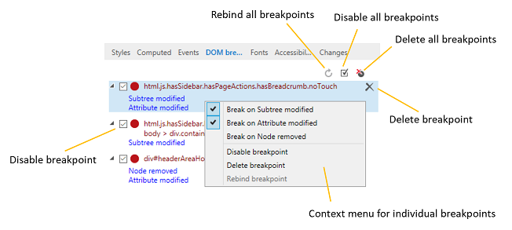
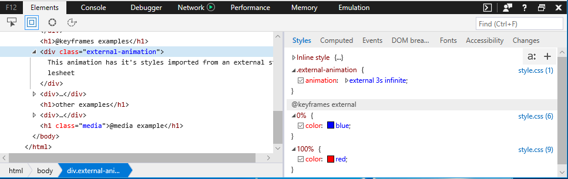
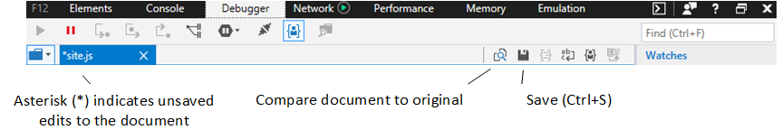

# DevTools в Windows 10 Fall Creators Update (EdgeHTML 16)

В этом выпуске мы начали основные усилия по рефакторингу DevTools для повышения надежности и производительности, а также добавили ряд новых функций, которые можно начать использовать уже сегодня! 

Вот функции Microsoft Edge DevTools, которые поставляются с [Windows 10 Fall Creators Update](/windows/uwp/whats-new/windows-10-build-16299) ([EdgeHTML 16).](https://aka.ms/devguide_edgehtml_16)

## Прослушиватели событий предка 

Теперь **в области** "События" добавлена возможность просмотра прослушивателей событий, зарегистрированных на любом предке выбранного элемента (на панели **"Элементы"),** в дополнение к прослушивателям самого элемента. Кроме того, теперь вы можете сгруппить отображение прослушиватель событий по *событиям* или *элементам.* 

## Точки останова модификации DOM

Теперь вы можете установить точки останова изменения изменения doM, чтобы вламывать отладить каждый раз, когда изменяется выбранный узел элемента. На панели **элементов** щелкните rt-щелкните любой элемент в представлении дерева DOM и выберите один или несколько из следующих элементов:

 - Разрыв на узле удален
 - Break on Subtree modified
 - Изменение приорвать атрибут

Вы можете управлять своими точками останова в **doM** на панелях **элементов** или **отладки.**

## Поддержка CSS при правиле

Правила CSS "at" (@) теперь представлены среди других объявлений **** правил CSS в области стилей, включая правила анимации (в настоящее время ограничены только для чтения), запросы функций и `@keyframes` `@supports` `@media` запросы.

## Области шрифтов CSS

Правила CSS теперь имеют собственную выделенную области шрифтов, которая отображает, откуда загружается шрифт `@font-face` *(локальный* или сетевой) **** и сколько символов его использует. ** Если шрифт загружен из сети, DevTools отобразит правило, которое импортирует его вместе с псевдонимом и типом шрифта.

## Поддержка псевдоэлементов CSS

Теперь **в** области стилей псевдоэлементы группироваться под собственными заголовками, и их содержимое больше не отображается как перекрестное.

**До:**
 

**После:**
 

## Улучшения консоли

Панель **консоли** получила отрегулятивную UX-технологию для улучшения качества использования и более быстрого и более простого использования Intellisense.

**До:** 

**После:** 

Мы также добавили эти улучшения:

 -  Используется `Shift + Enter` для добавления дополнительной строки в команду перед ее выполнением. `Enter` (Ранее была кнопка *переключателя "Переключиться на* многостроковой" или "однострочная".)

 - Поддерживаются следующие новые API:
    - [ **Метод console.table(**_object_*_)_* ](../console/console-api.md#organizing-log-output)
    - [ **Команда getEventListeners(**_object_*_)_* ](../console/command-line.md#event-listeners)
    - [ **команда keys(object)**__*__* ](../console/command-line.md#object-inspection)
    - [ **команда values(object)**__*__* ](../console/command-line.md#object-inspection)
    - [ **$x(**_xpath expression_*_)_* ](../console/command-line.md#dom-selectors) selector

 - Теперь поддерживается параметр форматирования [**%c()**](../console/console-api.md#logging-custom-messages)

## Улучшения отладки

Помимо набора новых функций для отладки сотрудников [службы PWA](#progressive-web-app-debugging)и кэша, отладители добавили эти функции:

### Консолидированная отладка общих ресурсов

Даже если на ресурс, например файл, загруженный из CDN, в коде несколько раз ссылается, DevTools теперь предоставляет один экземпляр отладки для этого файла, где можно установить общие точки останова, которые будут побиты независимо от того, на что ссылается этот файл. (Ранее каждая ссылка на сценарий рассматривалась как уникальный ресурс, сопозначалась с отдельным набором точек останова.)

### Live edit JavaScript with *Edit-on-idle*

Теперь вы можете редактировать JavaScript в режиме live во время сеанса отладки. Эта функция была экспериментальной (за флагом) в предыдущем [выпуске](https://blogs.windows.com/buildingapps/2017/04/05/windows-10-creators-update-creators-update-sdk-released/#MMhK2OdcrR12Vi6u.97) *(Windows 10 Creators Update),* а теперь является постоянной функцией. Просто выберите любой файл **** скрипта на панели отладки, отредактировать, а затем нажмите кнопку **"Сохранить"** (или ) для проверки изменений при следующем запуске `Ctrl+S` этого раздела кода. 

 

Нажмите **кнопку "Сравнить документ с исходным",** чтобы просмотреть изменения.

 

Помните о следующих ограничениях:

- Редактирование сценариев работает только во внешних *JS-файлах* (и не `<script>` внедрено в *HTML)*
- Изменения сохраняются в памяти и очищаются при повторной загрузке документа, поэтому вы не сможете запускать изменения в обработке, например `DOMContentLoaded`
- В настоящее время не существует **** способа (например, параметр "Сохранить как"), чтобы сохранить изменения на диске из DevTools

## Ярлыки

Теперь можно запустить DevTools на последней просматриваемой панели () или непосредственно в консоли ( ), как и в других `Ctrl+Shift+I` `Ctrl+Shift+J` основных браузерах.

## Постепенная отладка веб-приложений

Протестировать экспериментальную поддержку для progressive Web Apps (PWAs) в Microsoft **** Edge и DevTools, выбрав параметр "Включить сотрудников службы" (и перезапустив `about:flags` Microsoft Edge). Если на сайте **** используются рабочие работники и/или **API** кэша, **** будут заполняться записи в панели отладки для каждого источника аналогично работе веб-хранилища и проверки файлов cookie.

Если щелкнуть определенную запись рабочего **** сотрудника службы, откроется "Обзор рабочего сотрудника службы", где можно управлять регистрацией рабочих служб для данной области и принудительно использовать тестовую push-уведомление. Вы также можете **остановить запуск**отдельных сотрудников служб и проверить их в отдельном окне / **** отладки: ****

Обратите внимание на следующие вопросы об отладке рабочих служб:

 - Отладка сотрудника службы запускает новый экземпляр DevTools отдельно от средств страницы, так как сотрудники службы могут совместно использовать несколько вкладок. 
 - Элементы [и](../elements.md)  панели эмуляции отсутствуют в отладке рабочего отладка службы, поскольку сотрудники службы работают в фоновом режиме и не управляют напрямую на переднем плане приложения.
 - В настоящее время сетевой трафик для сотрудника службы передается только из экземпляра отладки DevTools для этого рабочего, а не из центрального экземпляра самой страницы.

Если щелкнуть определенную запись кэша, откроется диспетчер кэша, где можно проверить и ** при желании удалить записи кэша *(пары* ключ-значение запроса и ответа). ****
