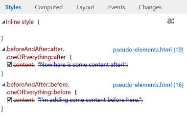
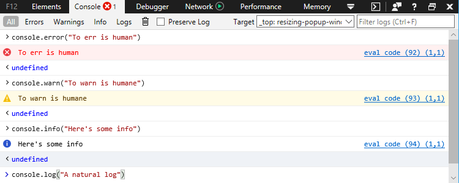

# DevTools в Windows 10 Fall Creators Update (EdgeHTML 16)DevTools in the Windows 10 Fall Creators Update (EdgeHTML 16)

В этом выпуске мы начали основные усилия по рефакторингу DevTools для повышения надежности и производительности, а также добавили ряд новых функций, которые можно начать использовать уже сегодня!With this release we started a major DevTools refactoring effort for improved robustness and performance, and also added a bunch of new features you can start using today! 

Вот функции Microsoft Edge DevTools, которые поставляются с [Windows 10 Fall Creators Update](/windows/uwp/whats-new/windows-10-build-16299) ([EdgeHTML 16).](https://aka.ms/devguide_edgehtml_16)Here are the Microsoft Edge DevTools features that shipped with the [Windows 10 Fall Creators Update](/windows/uwp/whats-new/windows-10-build-16299) ([EdgeHTML 16](https://aka.ms/devguide_edgehtml_16)).

## Прослушиватели событий предкаAncestor event listeners 

Теперь **в области** "События" добавлена возможность просмотра прослушивателей событий, зарегистрированных на любом предке выбранного элемента (на панели **"Элементы"),** в дополнение к прослушивателям самого элемента.The **Events** pane now adds the option to view event listeners registered on any ancestor of the currently selected element (in the **Elements** panel), in addition to those on the element itself. Кроме того, теперь вы можете сгруппить отображение прослушиватель событий по *событиям* или *элементам.*Additionally, you can now group the event listener display by either *Event* or *Element*. 

## Точки останова модификации DOMDOM mutation breakpoints

Теперь вы можете установить точки останова изменения изменения doM, чтобы вламывать отладить каждый раз, когда изменяется выбранный узел элемента.You can now set DOM mutation breakpoints to break into the Debugger whenever a selected element node changes. На панели **элементов** щелкните rt-щелкните любой элемент в представлении дерева DOM и выберите один или несколько из следующих элементов:From the **Elements** panel, rt-click on any element in the DOM tree view and select one or more of the following:

 - Разрыв на узле удаленBreak on Node removed
 - Break on Subtree modifiedBreak on Subtree modified
 - Изменение приорвать атрибутBreak on Attribute modified

Вы можете управлять своими точками останова в **doM** на панелях **элементов** или **отладки.**You can manage your mutation breakpoints from the **DOM breakpoints** pane in the **Elements** or **Debugger** panels.

## Поддержка CSS при правилеCSS at-rule support

Правила CSS "at" (@) теперь представлены среди других объявлений \*\*\*\* правил CSS в области стилей, включая правила анимации (в настоящее время ограничены только для чтения), запросы функций и `@keyframes` `@supports` `@media` запросы.CSS "at" (@) rules are now represented among other CSS rule declarations on the **Styles** pane, including animation `@keyframes` rules (currently limited to read-only), `@supports` feature queries, and `@media` queries.

## Области шрифтов CSSCSS fonts pane

Правила CSS теперь имеют собственную выделенную области шрифтов, которая отображает, откуда загружается шрифт `@font-face` *(локальный* или сетевой) \*\*\*\* и сколько символов его использует. \*\*CSS `@font-face` rules now have their own dedicated **Fonts** pane that displays where the font is loaded from (*Local* or *Network*) and how many characters are using it. Если шрифт загружен из сети, DevTools отобразит правило, которое импортирует его вместе с псевдонимом и типом шрифта.If a font is loaded from the network,  DevTools will display the rule that imported it along with its alias and font type.

## Поддержка псевдоэлементов CSSCSS pseudo-element support

Теперь **в** области стилей псевдоэлементы группироваться под собственными заголовками, и их содержимое больше не отображается как перекрестное.The **Styles** pane now groups pseudo-elements under their own headings and no longer displays their content as crossed out.

**До:Before:**
 

**После:After:**
 

## Улучшения консолиConsole improvements

Панель **консоли** получила отрегулятивную UX-технологию для улучшения качества использования и более быстрого и более простого использования Intellisense.The **Console** panel got a UX overhaul for improved usability and a faster, richer Intellisense experience.

**До:** 

**После:** 
![ Новая консоль**After:**

Мы также добавили эти улучшения:We also added these improvements:

 -  Используется `Shift + Enter` для добавления дополнительной строки в команду перед ее выполнением. `Enter`Use `Shift + Enter` to add an additional line to a command before executing it with `Enter`. (Ранее была кнопка *переключателя "Переключиться на* многостроковой" или "однострочная".)(Formerly there was a *Switch to multiline/single-line mode* toggle button.)

 - Поддерживаются следующие новые API:The following new APIs are supported:
    - [ **Метод console.table(**_object_*_)_* ](../console/console-api.md#organizing-log-output)[**console.table(**_object_*_)_*](../console/console-api.md#organizing-log-output) method
    - [ **Команда getEventListeners(**_object_*_)_* ](../console/command-line.md#event-listeners)[**getEventListeners(**_object_*_)_*](../console/command-line.md#event-listeners) command
    - [ **команда keys(object)**__\*__\* ](../console/command-line.md#object-inspection)[**keys(**_object_*_)_*](../console/command-line.md#object-inspection) command
    - [ **команда values(object)**__\*__\* ](../console/command-line.md#object-inspection)[**values(**_object_*_)_*](../console/command-line.md#object-inspection) command
    - [ **$x(**_xpath expression_*_)_* ](../console/command-line.md#dom-selectors) selector[**$x(**_xpath expression_*_)_*](../console/command-line.md#dom-selectors) selector

 - Теперь поддерживается параметр форматирования [**%c()**](../console/console-api.md#logging-custom-messages)The [**%c()**](../console/console-api.md#logging-custom-messages) formatting parameter is now supported

## Улучшения отладкиDebugging improvements

Помимо набора новых функций для отладки сотрудников [службы PWA](#progressive-web-app-debugging)и кэша, отладители добавили эти функции:In addition to a suite of new features for debugging your [PWA service workers and cache](#progressive-web-app-debugging), the Debugger added these features:

### Консолидированная отладка общих ресурсовConsolidated debugging for shared resources

Даже если на ресурс, например файл, загруженный из CDN, в коде несколько раз ссылается, DevTools теперь предоставляет один экземпляр отладки для этого файла, где можно установить общие точки останова, которые будут побиты независимо от того, на что ссылается этот файл.Even when a resource, such as a file loaded from CDN, is referenced multiple times throughout your code,  DevTools will now provide a single debugging instance for that file where you can then set common breakpoints which will be hit regardless of where that file is referenced. (Ранее каждая ссылка на сценарий рассматривалась как уникальный ресурс, сопозначалась с отдельным набором точек останова.)(Previously each script reference was considered a unique resource would map to a separate set of breakpoints.)

### Live edit JavaScript with *Edit-on-idle*Live edit JavaScript with *Edit-on-idle*

Теперь вы можете редактировать JavaScript в режиме live во время сеанса отладки.You can now edit your JavaScript live during a debugging session. Эта функция была экспериментальной (за флагом) в предыдущем [выпуске](https://blogs.windows.com/buildingapps/2017/04/05/windows-10-creators-update-creators-update-sdk-released/#MMhK2OdcrR12Vi6u.97) *(Windows 10 Creators Update),* а теперь является постоянной функцией.This feature was experimentally available (behind a flag) in the [previous](https://blogs.windows.com/buildingapps/2017/04/05/windows-10-creators-update-creators-update-sdk-released/#MMhK2OdcrR12Vi6u.97) (*Windows 10 Creators Update*) release and now its a permanent feature. Просто выберите любой файл \*\*\*\* скрипта на панели отладки, отредактировать, а затем нажмите кнопку **"Сохранить"** (или ) для проверки изменений при следующем запуске `Ctrl+S` этого раздела кода.Simply select any script file from the **Debugger** panel, edit, then click **Save** (or `Ctrl+S`) to test your changes next time that section of code runs. 

 

Нажмите **кнопку "Сравнить документ с исходным",** чтобы просмотреть изменения.Click the **Compare document to original** button to view the diff of what you changed.

 

Помните о следующих ограничениях:Please be aware of the following constraints:

- Редактирование сценариев работает только во внешних *JS-файлах* (и не `<script>` внедрено в *HTML)*Script editing only works in external *.js* files (and not embedded `<script>` within *.html*)
- Изменения сохраняются в памяти и очищаются при повторной загрузке документа, поэтому вы не сможете запускать изменения в обработке, например `DOMContentLoaded`Edits are saved in memory and flushed when the document is reloaded, thus you won’t be able to run edits inside a `DOMContentLoaded` handler, for example
- В настоящее время не существует \*\*\*\* способа (например, параметр "Сохранить как"), чтобы сохранить изменения на диске из DevToolsCurrently there’s no way (such as a **Save As** option) to save your edits to disk from  DevTools

## ЯрлыкиShortcuts

Теперь можно запустить DevTools на последней просматриваемой панели () или непосредственно в консоли ( ), как и в других `Ctrl+Shift+I` `Ctrl+Shift+J` основных браузерах.You can now launch DevTools to the last viewed panel (`Ctrl+Shift+I`) or directly to the Console (`Ctrl+Shift+J`) just like you would on other major browsers.

## Постепенная отладка веб-приложенийProgressive Web App debugging

Протестировать экспериментальную поддержку для progressive Web Apps (PWAs) в Microsoft \*\*\*\* Edge и DevTools, выбрав параметр "Включить сотрудников службы" (и перезапустив `about:flags` Microsoft Edge).Test out the experimental support for Progressive Web Apps (PWAs) in Microsoft Edge and  DevTools by selecting the **Enable service workers** option from `about:flags` (and restarting Microsoft Edge). Если на сайте \*\*\*\* используются рабочие работники и/или **API** кэша, \*\*\*\* будут заполняться записи в панели отладки для каждого источника аналогично работе веб-хранилища и проверки файлов cookie.If a site makes use of **Service Workers** and/or the **Cache** API,  will populate entries in the **Debugger** panel for each origin, similar to how web storage and cookie inspection work.

Если щелкнуть определенную запись рабочего \*\*\*\* сотрудника службы, откроется "Обзор рабочего сотрудника службы", где можно управлять регистрацией рабочих служб для данной области и принудительно использовать тестовую push-уведомление.Clicking on a specific service worker entry will open up the **Service Worker Overview**, where you can manage the service worker registration for the given scope and force a test push notification. Вы также можете **остановить запуск**отдельных сотрудников служб и проверить их в отдельном окне / \*\*\*\* отладки: \*\*\*\*You can also **Stop**/**Start** individual service workers and **Inspect** them from a separate debugger window:

Обратите внимание на следующие вопросы об отладке рабочих служб:Please note the following about service worker debugging:

 - Отладка сотрудника службы запускает новый экземпляр DevTools отдельно от средств страницы, так как сотрудники службы могут совместно использовать несколько вкладок.Debugging a service worker will launch a new instance of the DevTools separate from the page's tools because service workers can be shared across multiple tabs. 
 - Элементы [и](../elements.md)  панели эмуляции отсутствуют в отладке рабочего отладка службы, поскольку сотрудники службы работают в фоновом режиме и не управляют напрямую на переднем плане приложения.The [Elements](../elements.md) and [Emulation](../emulation.md) panels are absent from the service worker debugger, given that service workers run in the background and do not directly control the front-end of your app.
 - В настоящее время сетевой трафик для сотрудника службы передается только из экземпляра отладки DevTools для этого рабочего, а не из центрального экземпляра самой страницы.Currently network traffic for a service worker is only reported from the DevTools debugging instance for that worker, and not from the central instance for the page itself.

Если щелкнуть определенную запись кэша, откроется диспетчер кэша, где можно проверить и \*\* при желании удалить записи кэша *(пары* ключ-значение запроса и ответа). \*\*\*\*Clicking on a specific cache entry will open up the **Cache** manager, where you can inspect and optionally delete cache entries (*Request* and *Response* key/value pairs).
