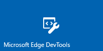

# DevTools в обновлении Windows 10 за апрель 2018 г. (EdgeHTML 17)DevTools in the Windows 10 April 2018 update (EdgeHTML 17)

Выпуск EdgeHTML 17 DevTools включает два способа: как традиционные средства браузера () для Microsoft Edge и предварительный просмотр в качестве автономного приложения `F12` [для Windows 10](#microsoft-edge-devtools-app-preview) из Microsoft Store!The EdgeHTML 17 release of the DevTools ships in two ways: as the traditional in-browser (`F12`) tools for Microsoft Edge, and previewing as a standalone [Windows 10 app](#microsoft-edge-devtools-app-preview) from the Microsoft Store!

Инструменты были обновлены с помощью ряда основных функций, включая базовую поддержку удаленной отладки [(через](../index.md#remote-debugging) новый протокол [DevTools),](#devtools-protocol)функции отладки [PWA,](#pwa-debugging)управление кэша [IndexedDB,](#indexeddb-inspection)вертикальную док-станцию и т. д. The tools have been updated with a number of major features, including basic support for [remote debugging](../index.md#remote-debugging) (via our new [DevTools Protocol](#devtools-protocol)), [PWA debugging features](#pwa-debugging), [IndexedDB cache management](#indexeddb-inspection), [vertical docking](#docking-to-the-right-in-microsoft-edge) and more! Мы также продолжали общие усилия по [рефакторингу,](./edgehtml-16.md) запущенные в последнем выпуске в рамках текущих инвестиций в производительность и надежность.We also continued the overall [refactoring effort](./edgehtml-16.md) started last release as part of ongoing investments in performance and reliability.

Ниже представлены последние функции Microsoft Edge DevTools, которые были представлены в обновлении Windows 10 за апрель [2018 г.](/windows/uwp/whats-new/windows-10-build-17134) [(EdgeHTML 17).](https://aka.ms/devguide_edgehtml_17)Here are the latest Microsoft Edge DevTools features that shipped in the [Windows 10 April 2018 Update](/windows/uwp/whats-new/windows-10-build-17134) ([EdgeHTML 17](https://aka.ms/devguide_edgehtml_17)).

## Предварительная версия приложения Microsoft Edge DevToolsMicrosoft Edge DevTools app preview

 

Теперь [Microsoft Edge DevTools](https://www.microsoft.com/store/p/microsoft-edge-devtools-preview/9mzbfrmz0mnj) доступен для предварительного просмотра в качестве автономных приложений для Windows 10 из Microsoft Store.The [Microsoft Edge DevTools](https://www.microsoft.com/store/p/microsoft-edge-devtools-preview/9mzbfrmz0mnj) are now available for preview as a standalone Windows 10 app from the Microsoft Store. В версии из магазина предусмотрена панель *средства выбора* для подключения к открытым локальным и удаленным конечным объектам страницы и макету с вкладками для удобного переключения между экземплярами Средств разработчика.With the store version comes a *chooser* panel for attaching to open local and remote page targets and a tabbed layout for easy switching between DevTools instances. Кроме того, только приложение DevTools позволяет выполнять отладку веб-контента в приложениях \(например, надстройки для Office, Кортаны, веб-view [EdgeHTML](../../hosting/webview/index.md)и установленных Windows [PWAs\).](../../progressive-web-apps/windows-features.md)Also exclusive to the DevTools app is the ability to debug web content in apps \(such as add-ins for Office, Cortana, EdgeHTML [webview](../../hosting/webview/index.md), and [Windows-installed PWAs](../../progressive-web-apps/windows-features.md)\).

Edge DevTools также по-прежнему доступны ( `F12` ) из браузера (без панели выбора).The Edge DevTools are also still available (`F12`) from within the browser (without the chooser panel).

Отделение DevTools от браузера предоставляет указанные здесь преимущества UX и архитектуры.Decoupling the DevTools from the browser provides these UX and architectural advantages:

- DevTools работают в отдельной песочнице контейнера приложения от Microsoft Edge, обеспечивая лучшую надежность для обоих этих приложений.The DevTools run in a separate app container sandbox from Microsoft Edge, providing better reliability for both.
- Приложение обеспечивает простое переключение между активными вкладками экземпляра DevTools (вместо переключения между открытыми вкладками Microsoft Edge)The app provides easy switching between active DevTools instance tabs (rather than having to switch between open Microsoft Edge tabs)
- Мы можем инструментарий *браузера EdgeHTML* и открыть его в более крупной экосистеме devtools с [помощью кросс-браузерных API.](https://github.com/WICG/devtools-protocol/)We're able to instrument the *EdgeHTML* browser engine and open it to the larger devtools ecosystem with [cross-browser APIs](https://github.com/WICG/devtools-protocol/).
- Мы можем погрузить обновления DevTools независимо от цикла выпуска Windows (и EdgeHTML).We can ship DevTools updates independently from the Windows (and EdgeHTML) release cycle.

Ознакомьтесь с *руководством DevTools,* чтобы узнать больше о локальной и удаленной отладке с помощью [приложения DevTools.](../index.md)Check out the *DevTools guide* for more on [local and remote debugging using the DevTools app](../index.md).

## Протокол DevToolsDevTools Protocol

Средства разработчика могут использовать [**протокол Microsoft Edge DevTools для**](../../devtools-protocol/index.md) проверки и отладки браузера Microsoft Edge.Developer tools can use the [**Microsoft Edge DevTools Protocol**](../../devtools-protocol/index.md) to inspect and debug the Microsoft Edge browser. Он предоставляет набор методов и событий,  которые организованы в различные домены инструментирования обдвижка EdgeHTML.It provides a set of methods and events that are organized into different [Domains](../../devtools-protocol/0.1/domains/index.md) of EdgeHTML engine instrumentation.

 Клиенты-инструменты могут вызывать эти методы и отслеживать эти события с помощью сообщений веб-socket JSON, которые обмениваются с *сервером DevTools Server,* который находится в Microsoft Edge или на портале [устройств Windows.](/windows/mixed-reality/using-the-windows-device-portal)Tooling clients can call these methods and monitor these events through JSON web socket messages exchanged with the *DevTools Server* hosted by Microsoft Edge or the [Windows Device Portal](/windows/mixed-reality/using-the-windows-device-portal). 
 
 Microsoft Edge DevTools использует  этот протокол, чтобы включить удаленную отладку хост-компьютера, на который запущен Microsoft Edge, из автономного клиента [DevTools,](https://www.microsoft.com/store/p/microsoft-edge-devtools-preview/9mzbfrmz0mnj) доступного из Microsoft Store.Microsoft Edge DevTools uses this protocol to enable [remote debugging](../../devtools-protocol/0.1/clients.md#microsoft-edge-devtools-preview) of a host machine running Microsoft Edge from the [standalone DevTools client](https://www.microsoft.com/store/p/microsoft-edge-devtools-preview/9mzbfrmz0mnj) available from the Microsoft Store. В настоящее время эта поддержка предварительного просмотра ограничена отладка JS другого edge на другом настольном устройстве или ВМ.Currently this preview support is limited to JS debugging of another Edge on another desktop device or VM. Со временем мы добавим поддержку полного набора DevTools для любого экземпляра EdgeHTML на любом устройстве с Windows 10.Over time, we'll add support for the full set of DevTools against any EdgeHTML instance on any Windows 10 device.  
 
 Последние [**сборки Visual Studio Preview**](https://www.visualstudio.com/vs/preview/) (Visual Studio 15.7 Preview 1 или более поздней версии) используют протокол DevTools для запуска и отладки Microsoft Edge (код JavaScript) из IDE Visual Studio любого проекта ASP.NET или .NET Core.The latest [**Visual Studio Preview**](https://www.visualstudio.com/vs/preview/) builds (Visual Studio 15.7 Preview 1 or later) use the DevTools Protocol to enable launching and debugging Microsoft Edge (JavaScript code) from within the Visual Studio IDE of any ASP.NET or .NET Core project.

## Проверка IndexedDBIndexedDB inspection

Этот выпуск [\*\*\*\*](../debugger.md) впервые является диспетчером [IndexedDB](../storage.md#indexeddb-manager) с поддержкой проверки и обновления хранилищ объектов и удаления отдельных записей о значении ключа.New to the [**Debugger**](../debugger.md) this release is an [IndexedDB Manager](../storage.md#indexeddb-manager) with support for inspecting and refreshing your object stores and deleting individual key-value entries. В будущих выпусках ожидается еще больше функциональных возможностей.Expect even more functionality in future releases.

## Отладка PWAPWA debugging

Поддержка отладки прогрессивного веб-приложения (PWAS) теперь включена по умолчанию, предоставляя вкладки инструментов для сотрудников [**служб,**](../service-workers.md) [**API**](../storage.md#cache-manager)кэша и управления [**IndexedDB.**](../storage.md#indexeddb-manager)Support for debugging Progressive Web Apps (PWAs) is now enabled by default, providing tool tabs for [**Service Workers**](../service-workers.md), [**Cache API**](../storage.md#cache-manager), and [**IndexedDB**](../storage.md#indexeddb-manager) management.

Кроме того,  на панели инструментов панели \*\*\*\*"Сеть" есть новая кнопка "Обходить рабочий день службы" для всех сетевых запросов, чтобы отключить зарегистрированных сотрудников службы в качестве сетевых прокси::Additionally, the [Network panel toolbar](../network.md#toolbar) has a new button, **Bypass Service Worker for all network requests**, to toggle on/off your registered service workers as network proxies:

Вы можете отладить PWA в качестве установленного приложения для Windows [\*\*\*\*](../../progressive-web-apps/windows-features.md#debug-your-pwa-edgehtml-as-a-windows-app) [10,](../../progressive-web-apps/windows-features.md) выбрав его в списке локальных целей (вкладка браузера, PWA/веб-просмотр) в выбранном вами приложении [DevTools.](../index.md#microsoft-store-app)You can debug your [PWA as an installed Windows 10 app](../../progressive-web-apps/windows-features.md) by selecting it from the list of [**Local**](../../progressive-web-apps/windows-features.md#debug-your-pwa-edgehtml-as-a-windows-app) targets (browser tab/PWA/webview) in the chooser of the [standalone DevTools app](../index.md#microsoft-store-app).  

## Закрепление справа в Microsoft EdgeDocking to the right in Microsoft Edge

Теперь вы можете пристыковать DevTools справа от отладки в Microsoft Edge, в дополнение к закреплению в нижней части и отстыковке DevTools из окна браузера.You can now dock the DevTools to the right of the page you're debugging from within Microsoft Edge, in addition to docking at the bottom and undocking the DevTools from the browser window. Используйте для циклиза между нижней док-станцией, правой док-станцией и положением отстыковки или значками в правом верхнем углу `Ctrl+Shift+D` DevTools: \*\*\*\* \*\*\*\* \*\*\*\*Use `Ctrl+Shift+D` to cycle between the **Dock Bottom**, **Dock Right**, and **Undock** positions, or the icons in the top-right corner of the DevTools:

 
