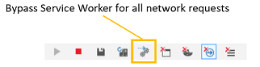

# DevTools в обновлении Windows 10 за апрель 2018 г. (EdgeHTML 17)

Выпуск EdgeHTML 17 DevTools включает два способа: как традиционные средства браузера () для Microsoft Edge и предварительный просмотр в качестве автономного приложения `F12` [для Windows 10](#microsoft-edge-devtools-app-preview) из Microsoft Store!

Инструменты были обновлены с помощью ряда основных функций, включая базовую поддержку удаленной отладки [(через](../index.md#remote-debugging) новый протокол [DevTools),](#devtools-protocol)функции отладки [PWA,](#pwa-debugging)управление кэша [IndexedDB,](#indexeddb-inspection)вертикальную док-станцию и т. д.  Мы также продолжали общие усилия по [рефакторингу,](./edgehtml-16.md) запущенные в последнем выпуске в рамках текущих инвестиций в производительность и надежность.

Ниже представлены последние функции Microsoft Edge DevTools, которые были представлены в обновлении Windows 10 за апрель [2018 г.](/windows/uwp/whats-new/windows-10-build-17134) [(EdgeHTML 17).](https://aka.ms/devguide_edgehtml_17)

## Предварительная версия приложения Microsoft Edge DevTools

 

Теперь [Microsoft Edge DevTools](https://www.microsoft.com/store/p/microsoft-edge-devtools-preview/9mzbfrmz0mnj) доступен для предварительного просмотра в качестве автономных приложений для Windows 10 из Microsoft Store. В версии из магазина предусмотрена панель *средства выбора* для подключения к открытым локальным и удаленным конечным объектам страницы и макету с вкладками для удобного переключения между экземплярами Средств разработчика. Кроме того, только приложение DevTools позволяет выполнять отладку веб-контента в приложениях \(например, надстройки для Office, Кортаны, веб-view [EdgeHTML](../../hosting/webview/index.md)и установленных Windows [PWAs\).](../../progressive-web-apps/windows-features.md)

Edge DevTools также по-прежнему доступны ( `F12` ) из браузера (без панели выбора).

Отделение DevTools от браузера предоставляет указанные здесь преимущества UX и архитектуры.

- DevTools работают в отдельной песочнице контейнера приложения от Microsoft Edge, обеспечивая лучшую надежность для обоих этих приложений.
- Приложение обеспечивает простое переключение между активными вкладками экземпляра DevTools (вместо переключения между открытыми вкладками Microsoft Edge)
- Мы можем инструментарий *браузера EdgeHTML* и открыть его в более крупной экосистеме devtools с [помощью кросс-браузерных API.](https://github.com/WICG/devtools-protocol/)
- Мы можем погрузить обновления DevTools независимо от цикла выпуска Windows (и EdgeHTML).

Ознакомьтесь с *руководством DevTools,* чтобы узнать больше о локальной и удаленной отладке с помощью [приложения DevTools.](../index.md)

## Протокол DevTools

Средства разработчика могут использовать [**протокол Microsoft Edge DevTools для**](../../devtools-protocol/index.md) проверки и отладки браузера Microsoft Edge. Он предоставляет набор методов и событий,  которые организованы в различные домены инструментирования обдвижка EdgeHTML.

 Клиенты-инструменты могут вызывать эти методы и отслеживать эти события с помощью сообщений веб-socket JSON, которые обмениваются с *сервером DevTools Server,* который находится в Microsoft Edge или на портале [устройств Windows.](/windows/mixed-reality/using-the-windows-device-portal) 
 
 Microsoft Edge DevTools использует  этот протокол, чтобы включить удаленную отладку хост-компьютера, на который запущен Microsoft Edge, из автономного клиента [DevTools,](https://www.microsoft.com/store/p/microsoft-edge-devtools-preview/9mzbfrmz0mnj) доступного из Microsoft Store. В настоящее время эта поддержка предварительного просмотра ограничена отладка JS другого edge на другом настольном устройстве или ВМ. Со временем мы добавим поддержку полного набора DevTools для любого экземпляра EdgeHTML на любом устройстве с Windows 10.  
 
 Последние [**сборки Visual Studio Preview**](https://www.visualstudio.com/vs/preview/) (Visual Studio 15.7 Preview 1 или более поздней версии) используют протокол DevTools для запуска и отладки Microsoft Edge (код JavaScript) из IDE Visual Studio любого проекта ASP.NET или .NET Core.

## Проверка IndexedDB

Этот выпуск [****](../debugger.md) впервые является диспетчером [IndexedDB](../storage.md#indexeddb-manager) с поддержкой проверки и обновления хранилищ объектов и удаления отдельных записей о значении ключа. В будущих выпусках ожидается еще больше функциональных возможностей.

## Отладка PWA

Поддержка отладки прогрессивного веб-приложения (PWAS) теперь включена по умолчанию, предоставляя вкладки инструментов для сотрудников [**служб,**](../service-workers.md) [**API**](../storage.md#cache-manager)кэша и управления [**IndexedDB.**](../storage.md#indexeddb-manager)

Кроме того,  на панели инструментов панели ****"Сеть" есть новая кнопка "Обходить рабочий день службы" для всех сетевых запросов, чтобы отключить зарегистрированных сотрудников службы в качестве сетевых прокси::

Вы можете отладить PWA в качестве установленного приложения для Windows [****](../../progressive-web-apps/windows-features.md#debug-your-pwa-edgehtml-as-a-windows-app) [10,](../../progressive-web-apps/windows-features.md) выбрав его в списке локальных целей (вкладка браузера, PWA/веб-просмотр) в выбранном вами приложении [DevTools.](../index.md#microsoft-store-app)  

## Закрепление справа в Microsoft Edge

Теперь вы можете пристыковать DevTools справа от отладки в Microsoft Edge, в дополнение к закреплению в нижней части и отстыковке DevTools из окна браузера. Используйте для циклиза между нижней док-станцией, правой док-станцией и положением отстыковки или значками в правом верхнем углу `Ctrl+Shift+D` DevTools: **** **** ****

 
