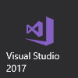

# Клиенты Microsoft Edge DevTools версии 0.2 (EdgeHTML)  

> [!NOTE]
> Версия 0.2 протокола Microsoft Edge DevTools работает только в сборках Windows 10 с обновлением за октябрь [2018](/windows/uwp/whats-new/windows-10-build-17763) г. и более поздних версий [Windows Insider Preview.](https://insider.windows.com/en-us/getting-started/)  

**Протокол DevTools 0.2** поддерживает следующие клиенты инструментов.

[ ](#microsoft-edge-devtools-preview) Microsoft [ ](#visual-studio-code) [ ](#microsoft-visual-studio)

## Предварительный просмотр средств разработчика в Microsoft Edge

Вы можете использовать приложение [**Microsoft Edge DevTools Preview**](https://www.microsoft.com/store/p/microsoft-edge-devtools-preview/9mzbfrmz0mnj?activetab=pivot%3aoverviewtab) для Windows 10 из Microsoft Store для удаленной отладки хост-устройства под управлением Microsoft Edge[(EdgeHTML 17](../../dev-guide/index.md) или более поздней версии).

Версия 0.2 протокола DevTools предоставляет новые домены для отладки стилей и макета и консольных API, а также основные функции отладки сценариев, введенные в версии 0.1. В пользовательском интерфейсе Edge DevTools это преобразуется в [****](../../devtools-guide/console.md) функциональные возможности, доступные на панелях [**"Элементы",**](../../devtools-guide/elements.md)"Консоль" и [**"Отладка".**](../../devtools-guide/debugger.md) В настоящее время удаленная отладка Microsoft Edge ограничена настольными компьютерами, а поддержка других устройств с Windows 10 будет поддерживаться в будущих выпусках.

Вот как настроить удаленную отладку с помощью приложения Microsoft Edge DevTools Preview. Протокол DevTools версии 0.2 требует обновления Windows 10 за октябрь [2018](/windows/uwp/whats-new/windows-10-build-17763) г. или более поздней сборки Windows Insider Preview на хост-компьютере (отладке). Приложение Edge DevTools Preview (используется на компьютере отладчика) будет работать в Windows 10 версии 16299 (Windows 10 Fall Creators Update, 10/2017) или более новой версии.

**На хост-компьютере (отладке) ...**

1. Если вы в сети Wi-Fi, убедитесь, что сеть помечена как **"Домен"** или **"Частная".** Это можно проверить, открыв приложение Защитник Windows Security [**Center,**](/windows/security/threat-protection/windows-defender-security-center/windows-defender-security-center) **** щелкнув брандмауэр & защиты сети и ** проверив, указана ли ваша сеть как сеть домена или частная *сеть.* 

    Если он указан *как* **** общедоступный, перейдите в & Сети параметров Wi-Fi в Интернете, щелкните сеть и перейдите к кнопке "Сетевой профиль" в  >  ****  >  **** ** **"Частное".**

2. Откройте панель **управления "Для разработчиков"** в ** *параметрах* Windows (найдите разработчика и щелкните *"Использовать функции разработчика")* и: 

    а. Перегуют в **режиме разработчика.** При этом будет *устанавливаться* пакет режима разработчика, включающий удаленные инструменты для настольных компьютеров.

    б. [**Включите**](/windows/uwp/debug-test-perf/device-portal) портал устройств**(включите удаленную диагностику по подключениям к локальной сети) и обнаружение устройств **(** сделайте устройство видимым для USB-подключений и*локальной сети).*

    в. **Включит проверку подлинности** и включит имя пользователя или пароль.

    г. Обратите внимание на IP-адрес компьютера и порт подключения (50443).

3. Откройте в Microsoft Edge вкладки, которые нужно отлалать с клиентского компьютера.

**На компьютере клиента (отладчике) ...**

1.  Установка и запуск автономных приложений [Microsoft Edge DevTools Preview](https://www.microsoft.com/store/p/microsoft-edge-devtools-preview/9mzbfrmz0mnj?activetab=pivot%3aoverviewtab) из Microsoft Store.

2. Откройте **удаленную панель** и введите сетевое расположение (URL-адрес и порт) хост-компьютера и нажмите кнопку **"Подключиться".**

3. **Установите** сертификат хост-компьютера из диалогового окно "Неверная сертификация". **

4. Укавите имя пользователя или пароль, назначенные для проверки подлинности на портале устройств.

5. *Удаленная* панель загрузит список целевых объектов страницы для отладки на хост-компьютере. Выберите один из них, чтобы начать отладку.

6. Используйте **кнопку** "Обновить", чтобы обновить и перезагрузить список целевых объектов удаленных страниц на хост-компьютере. Нажмите **кнопку** "Отключить", чтобы вернуться к экрану подключения к удаленному устройству и подключиться к другому хосту. **

## Visual Studio Code

С помощью [расширения Debugger for Edge](https://marketplace.visualstudio.com/items?itemName=msjsdiag.debugger-for-edge) VS Code можно отладить сценарий, работающий в Microsoft Edge непосредственно в Visual Studio Code. Расширение требует обслуживания веб-приложения с localhost, которое можно начать с командной строки или [задачи.](https://code.visualstudio.com/docs/editor/tasks)

Для начала сделайте следующее:

1. Установите расширение [Debugger for Edge](https://marketplace.visualstudio.com/items?itemName=msjsdiag.debugger-for-edge) VS Code.

2. Перезапустите VS Code, откройте папку, содержащую проект, который вы хотите отлажать, и установите точки останова в коде.

3. Настройте задачу [запуска](https://code.visualstudio.com/docs/editor/debugging#_launch-configurations) localhost, чтобы открыть нужную страницу проекта: **отлаживка добавления**  >  **конфигурации...** Например:

    ```json
    {
        "version": "0.2.0",
        "configurations": [

            {
                "name": "Launch localhost",
                "type": "edge",
                "request": "launch",
                "url": "http://localhost/mypage.html",
                "webRoot": "${workspaceFolder}/wwwroot"
            }
        ]
    }
    ```

    [*Использование отлада имеет*](https://github.com/Microsoft/vscode-edge-debug2#using-the-debugger) большее количество параметров конфигурации запуска. 

4. Запустите сервер на localhost и нажмите кнопку **"Начать** отладку "Play" или `F5` запустите Microsoft Edge. При попадании точки останова вы разберется в VS Code и сможете дополнительно проверить и пошагово проверить код.

Подробнее: документация по [VS Code - Debugger for Microsoft Edge.](https://github.com/Microsoft/vscode-edge-debug2#----vs-code---debugger-for-microsoft-edge--)

## Microsoft Visual Studio

С помощью [**последней**](https://www.visualstudio.com) версии Visual Studio (Visual Studio 15.8 или более поздней), запущенной в Центре обновления Windows 10 за октябрь [2018](/windows/uwp/whats-new/windows-10-build-17763)г., вы можете запустить и отлалать Microsoft Edge из IDE в любом проекте ASP.NET или .NET Core.

Вот как настроить отладку Microsoft Edge с помощью Visual Studio:

1.  Установите и запустите последнюю [**версию Visual Studio**](https://www.visualstudio.com/) (Visual Studio 15.8 или более поздней версии).

2. Откройте существующий проект ASP.NET или .NET Core или создайте **новый проект...** с помощью одного из шаблонов **Visual C#** .NET.

3. В **обозревателе**решений проекта откройте файлы JavaScript, которые нужно отлалать, и установите точки останова в IDE так же, как с серверным кодом.

4. Нажмите, `F5` чтобы запустить Microsoft Edge, на сервере DevTools Server. При наступии точки останова вы разберется в Visual Studio сможете дополнительно проверить код и пошаговую проверку кода.
