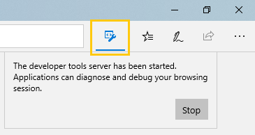

# <span data-ttu-id="de52f-103">Протокол средств разработчика в Microsoft Edge (EdgeHTML)</span><span class="sxs-lookup"><span data-stu-id="de52f-103">Microsoft Edge (EdgeHTML) DevTools Protocol</span></span>

> [!NOTE]
> <span data-ttu-id="de52f-104">Протокол Microsoft Edge (EdgeHTML) DevTools работает только в Обновлениях Windows 10 за апрель [2018](https://blogs.windows.com/windowsexperience/2018/04/30/how-to-get-the-windows-10-april-2018-update/#5VXkQMU41CJzZPER.97) г. и более поздних сборках.</span><span class="sxs-lookup"><span data-stu-id="de52f-104">The Microsoft Edge (EdgeHTML) DevTools Protocol works only on [Windows 10 April 2018 Update](https://blogs.windows.com/windowsexperience/2018/04/30/how-to-get-the-windows-10-april-2018-update/#5VXkQMU41CJzZPER.97) and later builds.</span></span>

<span data-ttu-id="de52f-105">Средства разработчика могут использовать **протокол Microsoft Edge (EdgeHTML) DevTools для** проверки и отладки браузера Microsoft Edge (EdgeHTML).</span><span class="sxs-lookup"><span data-stu-id="de52f-105">Developer tools can use the **Microsoft Edge (EdgeHTML) DevTools Protocol** to inspect and debug the Microsoft Edge (EdgeHTML) browser.</span></span> <span data-ttu-id="de52f-106">Он предоставляет набор методов и событий, [](0.2/domains/index.md) которые организованы в различные домены инструментирования обдвижка EdgeHTML.</span><span class="sxs-lookup"><span data-stu-id="de52f-106">It provides a set of methods and events that are organized into different [Domains](0.2/domains/index.md) of EdgeHTML engine instrumentation.</span></span>

 <span data-ttu-id="de52f-107">Клиенты-инструменты могут вызывать эти методы и отслеживать эти события с помощью сообщений веб-socket JSON, которые обмениваются с *сервером DevTools Server,* который находится в Microsoft Edge (EdgeHTML) или на портале устройств Windows.</span><span class="sxs-lookup"><span data-stu-id="de52f-107">Tooling clients can call these methods and monitor these events through JSON web socket messages exchanged with the *DevTools Server* hosted by Microsoft Edge (EdgeHTML) or the Windows Device Portal.</span></span> <span data-ttu-id="de52f-108">Microsoft Edge (EdgeHTML) DevTools использует [](0.2/clients.md#microsoft-edge-devtools-preview) этот протокол, чтобы включить удаленную отладку хост-компьютера с Microsoft Edge (EdgeHTML) с помощью автономного клиента DevTools, доступного из [Microsoft Store.](https://www.microsoft.com/store/p/microsoft-edge-devtools-preview/9mzbfrmz0mnj)</span><span class="sxs-lookup"><span data-stu-id="de52f-108">Microsoft Edge (EdgeHTML) DevTools uses this protocol to enable [remote debugging](0.2/clients.md#microsoft-edge-devtools-preview) of a host machine running Microsoft Edge (EdgeHTML) from the standalone DevTools client available from the [Microsoft Store](https://www.microsoft.com/store/p/microsoft-edge-devtools-preview/9mzbfrmz0mnj).</span></span>

<span data-ttu-id="de52f-109">Протокол Microsoft Edge (EdgeHTML) DevTools разработан для тесного согласования с протоколом Chrome DevTools (см. [W3C WICG для протоколов DevTools),](https://github.com/WICG/devtools-protocol/)хотя в этом выпуске имеются известные пробелы в отношении обеспечения связи.</span><span class="sxs-lookup"><span data-stu-id="de52f-109">The Microsoft Edge (EdgeHTML) DevTools Protocol is designed to align closely with the Chrome DevTools Protocol (see the [W3C WICG for DevTools Protocols](https://github.com/WICG/devtools-protocol/)), though there are known interoperability gaps in this release.</span></span>

## <span data-ttu-id="de52f-110">Использование протокола</span><span class="sxs-lookup"><span data-stu-id="de52f-110">Using the protocol</span></span>

<span data-ttu-id="de52f-111">Вот как присоединить настраиваемый клиент инструментов к серверу DevTools в Microsoft Edge (EdgeHTML).</span><span class="sxs-lookup"><span data-stu-id="de52f-111">Here's how to attach a custom tooling client to the DevTools Server in Microsoft Edge (EdgeHTML).</span></span> <span data-ttu-id="de52f-112">Если [вы](0.2/clients.md#microsoft-edge-devtools-preview) используете Microsoft Edge DevTools в качестве клиента, см. инструкции по удаленной отладке.</span><span class="sxs-lookup"><span data-stu-id="de52f-112">See the [remote debugging](0.2/clients.md#microsoft-edge-devtools-preview) instructions if you're using Microsoft Edge DevTools as your client.</span></span>

1. <span data-ttu-id="de52f-113">Запустите Microsoft Edge (EdgeHTML) с открытым портом удаленной отладки, указав URL-адрес, который вы хотите открыть.</span><span class="sxs-lookup"><span data-stu-id="de52f-113">Launch Microsoft Edge (EdgeHTML) with the remote debugging port open, specifying the URL you wish to open.</span></span> <span data-ttu-id="de52f-114">Например:</span><span class="sxs-lookup"><span data-stu-id="de52f-114">For example:</span></span>

    ```shell
    MicrosoftEdge.exe --devtools-server-port 9222 https://www.bing.com
    ```

    <span data-ttu-id="de52f-115">Если Edge уже запущен, параметр URL является необязательным.</span><span class="sxs-lookup"><span data-stu-id="de52f-115">If Edge is already launched, the URL parameter is optional.</span></span> <span data-ttu-id="de52f-116">Рядом с адресной стойкой браузера появится кнопка, которая указывает, что сервер средств **разработчика** запущен:</span><span class="sxs-lookup"><span data-stu-id="de52f-116">A button will appear next to the browser address bar to indicate the **Developer tools server** has started:</span></span>

     

2. <span data-ttu-id="de52f-118">Используйте эту [конечную точку HTTP](0.2/http.md) для получения списка подключенных конечных объектов страницы:</span><span class="sxs-lookup"><span data-stu-id="de52f-118">Use this [HTTP endpoint](0.2/http.md) to get a list of attachable page targets:</span></span>

    ```http
    http://localhost:9222/json/list
    ```

3. <span data-ttu-id="de52f-119">Подключите к списку нужной страницы, чтобы выдать дополнительные команды протокола и получать сообщения о событиях через сервер `webSocketDebuggerUrl` socket [](0.2/domains/index.md) devtools.</span><span class="sxs-lookup"><span data-stu-id="de52f-119">Connect to the listed `webSocketDebuggerUrl` of the desired page to issue further [protocol commands](0.2/domains/index.md) and receive event messages through the devtools socket server.</span></span>

## <span data-ttu-id="de52f-120">Состояние и отзывы</span><span class="sxs-lookup"><span data-stu-id="de52f-120">Status and feedback</span></span>

<span data-ttu-id="de52f-121">Версия [0.2](0.2/index.md) протокола DevTools предоставляет новые домены для отладки стилей и макета (только для чтения) и консольных API, а также основные функции отладки скриптов, введенные в версии [0.1.](0.1/index.md)</span><span class="sxs-lookup"><span data-stu-id="de52f-121">[Version 0.2](0.2/index.md) of the DevTools Protocol provides new domains for style and layout (read-only) debugging and console APIs, in addition to the core script debugging functionality introduced in [Version 0.1](0.1/index.md).</span></span> <span data-ttu-id="de52f-122">В пользовательском интерфейсе Microsoft Edge DevTools это преобразуется в [\*\*\*\*](../devtools-guide/console.md) функциональные возможности, доступные в панелях [**"Элементы",**](../devtools-guide/elements.md)"Консоль" и [**"Отладка".**](../devtools-guide/debugger.md)</span><span class="sxs-lookup"><span data-stu-id="de52f-122">In the Microsoft Edge DevTools UI, this translates to functionality available in the [**Elements**](../devtools-guide/elements.md), [**Console**](../devtools-guide/console.md) and [**Debugger**](../devtools-guide/debugger.md) panels.</span></span>

<span data-ttu-id="de52f-123">Благодарим за попытку протокола Edge DevTools!</span><span class="sxs-lookup"><span data-stu-id="de52f-123">Thanks for trying the Edge DevTools Protocol!</span></span> <span data-ttu-id="de52f-124">Мы будем будем слышать ваши отзывы по:</span><span class="sxs-lookup"><span data-stu-id="de52f-124">We'd love to hear your feedback at:</span></span>

 - <span data-ttu-id="de52f-125">[**Microsoft Edge Developer UserVoice**](https://wpdev.uservoice.com/forums/257854-microsoft-edge-developer?category_id=84475): идеи и запросы функций DevTools</span><span class="sxs-lookup"><span data-stu-id="de52f-125">[**Microsoft Edge Developer UserVoice**](https://wpdev.uservoice.com/forums/257854-microsoft-edge-developer?category_id=84475): DevTools feature ideas and requests</span></span>

 - <span data-ttu-id="de52f-126">[**Отслеживание проблем EdgeHTML**](https://developer.microsoft.com/microsoft-edge/platform/issues/): ошибки и проблемы платформы Protocol, DevTools и EdgeHTML</span><span class="sxs-lookup"><span data-stu-id="de52f-126">[**EdgeHTML Issue Tracker**](https://developer.microsoft.com/microsoft-edge/platform/issues/): Protocol, DevTools, and EdgeHTML platform bugs and issues</span></span>

 - <span data-ttu-id="de52f-127">[**Microsoft Edge DevTools Feedback Hub**](feedback-hub:?referrer=microsoftEdge&tabID=2&newFeedback=true&ContextId=344): проблемы протокола и DevTools и предложения через приложение Центр отзывов</span><span class="sxs-lookup"><span data-stu-id="de52f-127">[**Microsoft Edge DevTools Feedback Hub**](feedback-hub:?referrer=microsoftEdge&tabID=2&newFeedback=true&ContextId=344): Protocol and DevTools problems and suggestions through the Feedback Hub app</span></span>

## <span data-ttu-id="de52f-128">Вопросы и ответы</span><span class="sxs-lookup"><span data-stu-id="de52f-128">FAQ</span></span>

#### <span data-ttu-id="de52f-129">Могут ли несколько клиентов подключаться к одному серверу DevTools?</span><span class="sxs-lookup"><span data-stu-id="de52f-129">Can multiple clients connect to the same DevTools Server?</span></span>
<span data-ttu-id="de52f-130">Нет, не одновременно, когда клиенты отладки.</span><span class="sxs-lookup"><span data-stu-id="de52f-130">No, not simultaneously when the clients are debugging.</span></span> <span data-ttu-id="de52f-131">Последний клиент для подключения начнется с предыдущего.</span><span class="sxs-lookup"><span data-stu-id="de52f-131">The last client to connect will kick off the previous one.</span></span> <span data-ttu-id="de52f-132">В будущем, когда будут поддерживаться дополнительные средства, они, скорее всего, будут поддерживать одновременные клиентские подключения.</span><span class="sxs-lookup"><span data-stu-id="de52f-132">In the future when additional tools are supported, those will likely support simultaneous client connections.</span></span>

#### <span data-ttu-id="de52f-133">Нужно ли использовать 9222 в качестве порта Сервера DevTools?</span><span class="sxs-lookup"><span data-stu-id="de52f-133">Do I have to use 9222 as the DevTools Server port?</span></span>
<span data-ttu-id="de52f-134">Нет.</span><span class="sxs-lookup"><span data-stu-id="de52f-134">No.</span></span> <span data-ttu-id="de52f-135">Вы можете указать любой порт, но не забудьте выбрать порт, который еще не используется.</span><span class="sxs-lookup"><span data-stu-id="de52f-135">You can specify any port, though be sure to pick one that isn't already in use.</span></span> <span data-ttu-id="de52f-136">Порт 9222 для удаленной отладки используется соглашением.</span><span class="sxs-lookup"><span data-stu-id="de52f-136">Port 9222 for remote debugging is used by convention.</span></span>

#### <span data-ttu-id="de52f-137">Как подключить пользовательский клиент инструментов к Microsoft Edge (EdgeHTML) с сервером DevTools Server?</span><span class="sxs-lookup"><span data-stu-id="de52f-137">How do I connect my custom tooling client to Microsoft Edge (EdgeHTML) running the DevTools Server?</span></span>
<span data-ttu-id="de52f-138">Инструкции [*по подключению*](#using-the-protocol) к Microsoft Edge (EdgeHTML), запущенные на локальном компьютере, см. в инструкциях по протоколу, которые были указаны выше.</span><span class="sxs-lookup"><span data-stu-id="de52f-138">See [*Using the protocol*](#using-the-protocol) instructions above for attaching to Microsoft Edge (EdgeHTML) running on the local machine.</span></span> <span data-ttu-id="de52f-139">Если вы хотите поддерживать удаленную отладку, вам потребуется разработать рабочий процесс пользователя для установки SSL-сертификата хост-компьютера на клиенте, например с диалогом установки, как использует [Microsoft Edge DevTools Preview.](./0.2/clients.md#microsoft-edge-devtools-preview)</span><span class="sxs-lookup"><span data-stu-id="de52f-139">If you're looking to support remote debugging, you'll need to devise a user workflow for installing the host machine's SSL certificate on the client, for example with an install dialog as [Microsoft Edge DevTools Preview](./0.2/clients.md#microsoft-edge-devtools-preview) uses.</span></span>

#### <span data-ttu-id="de52f-140">If I'm remote debugging using Edge DevTools, do I need to start the host browser process with *--devtools-server-port* cmd line switch?</span><span class="sxs-lookup"><span data-stu-id="de52f-140">If I'm remote debugging using Edge DevTools, do I need to start the host browser process with *--devtools-server-port* cmd line switch?</span></span> 
<span data-ttu-id="de52f-141">Нет.</span><span class="sxs-lookup"><span data-stu-id="de52f-141">No.</span></span> <span data-ttu-id="de52f-142">При настройке удаленной отладки с помощью [Microsoft Edge DevTools Preview](./0.2/clients.md#microsoft-edge-devtools-preview)параметр командной строки не требуется для запуска `--devtools-server-port` Edge.</span><span class="sxs-lookup"><span data-stu-id="de52f-142">If you're setting up [remote debugging using Microsoft Edge DevTools Preview](./0.2/clients.md#microsoft-edge-devtools-preview), the `--devtools-server-port` command line switch is not necessary for starting Edge.</span></span> <span data-ttu-id="de52f-143">В этом случае на портале *устройств* с Windows сервер DevTools размещен от имени браузера.</span><span class="sxs-lookup"><span data-stu-id="de52f-143">In this case, Windows *Device Portal* is hosting the DevTools Server on behalf of the browser.</span></span>

#### <span data-ttu-id="de52f-144">Можно ли использовать протокол Edge DevTools для удаленной отладки WWAHost.exe или веб-приложения?</span><span class="sxs-lookup"><span data-stu-id="de52f-144">Can I use the Edge DevTools Protocol to remotely debug a WWAHost.exe or webview process?</span></span>
<span data-ttu-id="de52f-145">В настоящее время протокол Edge DevTools поддерживает только вкладки браузера.</span><span class="sxs-lookup"><span data-stu-id="de52f-145">The Edge DevTools Protocol currently supports only browser tabs.</span></span> <span data-ttu-id="de52f-146">WWAHost.exe и процессов веб-просмотров не поддерживаются.</span><span class="sxs-lookup"><span data-stu-id="de52f-146">WWAHost.exe and webview processes are not supported.</span></span>
