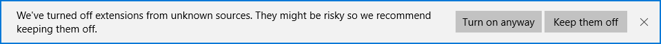
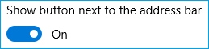

# Добавление, перемещение и удаление расширений для Microsoft Edge  

[!INCLUDE [deprecation-note](../includes/deprecation-note.md)]  

Служба поддержки Microsoft Edge для расширений была представлена в **Юбилейном обновлении Windows 10**.  Если вы разрабатываете и хотите загрузить расширение Microsoft Edge или если оно у вас уже есть и вы хотите его удалить, ознакомьтесь с приведенными ниже инструкциями.  
Кроме того, в этой статье рассказано о том, как изменить расположение значка расширения в браузере.  

## Добавление расширения  

1.  Откройте Microsoft Edge и `about:flags` введите в адресную планку.  
1.  Установите флажок в пункте **Разрешить функции для разработчиков расширения**.  
    
      
    
    > [!NOTE]
    > Если у вас нет юбилейного обновления Windows10 или более поздней версии, этот параметр будет недоступен.  
    
1.  Нажмите **Другие (...)**, чтобы открыть меню.  
    
      
    
1.  В меню щелкните пункт **Расширения**.  
    
1.  Нажмите кнопку **Отправить расширение**.  
    
      
    
1.  Перейдите в папку вашего расширения и нажмите кнопку  **Выбрать папку**.  
    
      
    
    > [!NOTE]
    > Если при отправке расширения появляется сообщение об ошибке, см. статью [Устранение неполадок](../troubleshooting.md).  
    
**Готово! Теперь вы увидите ваше расширение в списке в области расширений Microsoft Edge.**  

  

> [!NOTE]
> Неподписанные расширения автоматически отключаются при последующих запусках Microsoft Edge.  Когда браузер вступает в состояние ожидания \(примерно через 10 секунд бездействия\) в нижней части окна будет видно следующее уведомление.   уведомление, чтобы включить неподписаные расширения, нажмите **кнопку Включить в любом случае**.  

## Перемещение кнопки расширения  

В зависимости от параметров вашего расширения оно может отобразиться в меню **Другие (...)**.  

  

Если вы хотите для удобства переместить кнопку из этого меню, выполните следующие действия.  

1.  Щелкните кнопку расширения правой кнопкой мыши.  
1.  Нажмите кнопку **Показывать кнопку рядом с адресной строкой**.  
    
      
    
Это можно сделать также на странице "Сведения о расширении".  

1.  Щелкните кнопку расширения.  
1.  Поставьте переключатель **Показывать кнопку рядом с адресной строкой** в положение "Вкл.".  
    
      
    
> [!NOTE]
> Эту кнопку в любое время можно вернуть обратно в меню **Другие (...)**, щелкнув ее правой кнопкой мыши и отменив выбор элемента **Показывать рядом с адресной строкой**, или поставив в положение "Выкл." переключатель **Показывать кнопку рядом с адресной строкой** на странице сведений о расширении.  

## Удаление расширения  

1.  Откройте Microsoft Edge.  
1.  Нажмите **Другие (...)**, чтобы открыть меню.  
1.  В меню щелкните пункт **Расширения**.  
1.  Щелкните правой кнопкой мыши расширение, которое вы хотите удалить, и выберите **Удалить** или выделите расширение и нажмите кнопку **Удалить**.  
    
      
    
**Расширение должно исчезнуть из списка в Microsoft Edge.**  
