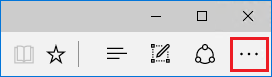

# Отладка расширенийDebugging extensions  

[!INCLUDE [deprecation-note](../includes/deprecation-note.md)]  

Отламывка расширений в Microsoft Edge, можно с помощью средств разработчика F12.You can debug your extensions in Microsoft Edge by using F12 Developer Tools.  

Следующее видео проходит через багги Расширение Microsoft Edge, хотя каждый сценарий отладки и исправления его по пути.The following video goes through a buggy Microsoft Edge extension, walking though each debugging scenario and fixing it up along the way.  Дополнительные сведения см. в пошаговом инструкции ниже.See the step-by-step instructions below for more info.  

> [!VIDEO https://channel9.msdn.com/Blogs/One-Dev-Minute/Debugging-Microsoft-Edge-Extensions/player]  

> [!NOTE]
> Чтобы использовать отладку расширения с помощью F12, сначала необходимо включить функции разработчика в about:flags.In order to take advantage of extension debugging with F12, you must first turn on developer features in about:flags.  Дополнительные [сведения](./adding-and-removing-extensions.md) о том, как это сделать, см. в добавлении и удалении расширений.See [Adding and removing extensions](./adding-and-removing-extensions.md) for details on how to do this.  

## Отладка фонового сценарияBackground script debugging  

Чтобы начать отладку фонового сценария расширения:To start debugging the background script of your extension:  

1.  Нажмите **кнопку Дополнительные (...)** с **последующими расширениями,** чтобы перейти в области расширения.Click on **More (...)** followed by **Extensions** to go into the extension pane.  
    
      
    
1.  Щелкните расширение, которое необходимо отлажать.Click on the extension that you want to debug.  
1.  Щелкните **ссылку Фоновая** страница, чтобы привести F12 для фонового процесса.Click on the **Background page** link to bring up F12 for the background process.  
    
      
    
1.  Выберите **вкладку Debugger** в F12.Select the **Debugger** tab in F12.  
1.  Перейдите к фоновому сценарию расширения и выберите его.Navigate to and select your extension's background script.  
1.  Поместите точки разлада для отладки, щелкнув слева от номера строки кода.Place breakpoints for debugging by clicking to the left of the source code line number.  
    
      
    
1.  Выберите **вкладку Консоли** и выполните `location.reload()` команду.Select the **Console** tab and execute the `location.reload()` command.  При этом будет повторно выполняться фоновый сценарий, что позволит выполнить выполнение кода.This will re-execute the background script, allowing you to step through your code.  
    
      
    
## Отладка скрипта контентаContent script debugging  

Чтобы начать отладку сценария контента вашего расширения:To start debugging the content script of your extension:  

1.  Запустите F12, переходя на кнопку **More (...)** и выбрав средства разработчика **F12,** или нажав `F12` на клавиатуру.Launch F12 by either navigating to the **More (...)** button and selecting **F12 Developer Tools** or by pressing `F12` on your keyboard.  
1.  Перейдите к сценарию контента расширения и выберите его.Navigate to and select your extension's content script.  Сценарии контента для расширений, запущенных в настоящее время, будут показаны в разных папках для каждого расширения.Content scripts for extensions currently running will be depicted by a different folder for each extension.  
    
    > [!NOTE]
    > Будут отображаться только сценарии содержимого.Only running content scripts will appear.  
    
1.  Поместите точки разлада для отладки, щелкнув слева от номера строки кода.Place breakpoints for debugging by clicking to the left of the source code line number.  
    
      
    
1.  Обновите вкладку браузера, чтобы начать шаг, хотя код.Refresh the browser tab to begin stepping though your code.  
    
## Отладка страницы расширенияExtension page debugging  

Существует два метода, которые можно использовать для доступа к исходным кодам страницы расширения для отладки.There are two methods that can be used for accessing the source code of your extension page for debugging.  Один метод применяется к различным страницам, а другой работает только для всплывающих страниц.One method applies to a variety of pages while the other only works for popup pages.  

### Отладка любой страницы расширенияDebugging any extension page  

Следующий метод работает для всех страниц расширения, таких как страница параметры и всплывающие всплывающие ок.The following method works for all extension pages like the options page and popups:  

1.  Щелкните правой кнопкой мыши на фоне страницы.Right-click on the background of your page.  
1.  Выберите **источник Представления**.Select **View source**.  
    
      
    
1.  Как только откроется F12, разбей точки в файле, который нужно отламыть.Once F12 opens, place breakpoints within the file you want to debug.  
    
      
    
1.  Выберите **вкладку Консоли** и выполните `location.reload()` команду.Select the **Console** tab and execute the command `location.reload()`.  Это позволит повторно выполнить сценарий страницы, что позволит выполнить выполнение кода.This will re-execute the page script, allowing you to step through your code.  
    
      
    
### Отладка страницы расширения всплывающих страницDebugging a popup extension page  

Хотя метод отладки страниц расширения также применяется к всплывающее расширение страниц, следующие шаги наметить другой способ отладки всплывающее:While the method for debugging extension pages also applies to popup extension pages, the following steps outline another way to debug your popup:  

1.  Щелкните правой кнопкой мыши значок расширения.Right-click your extension's icon.  
1.  Выберите **всплывающее всплыва**Select **Inspect popup**.  
    
      
    
1.  Выполните действия 3 и 4 выше, чтобы разместить точки разрыва и перезагрузить всплывающее всплывающее всплывающее помещение.Follow steps 3 and 4 above for placing breakpoints and reloading the popup.  
    