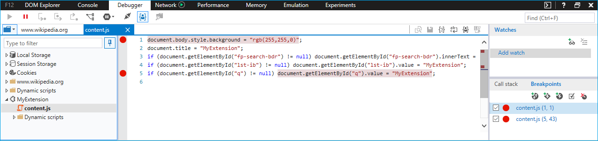

# Отладка расширений  

[!INCLUDE [deprecation-note](../includes/deprecation-note.md)]  

Вы можете отлалать расширения в Microsoft Edge с помощью средств разработчика F12.

В следующем видео приводится нестрогая надстройка Microsoft Edge, которая проходит через каждый сценарий отладки и исправит его по пути. Дополнительные сведения см. в пошаговом пошаговом инструкции ниже.

> [!VIDEO https://channel9.msdn.com/Blogs/One-Dev-Minute/Debugging-Microsoft-Edge-Extensions/player]

> [!NOTE]
> Чтобы воспользоваться преимуществами отладки расширений с помощью F12, необходимо сначала включить функции разработчика в about:flags. Дополнительные [сведения о](./adding-and-removing-extensions.md) том, как это сделать, см. в дополнительных сведениях о добавлении и удалении расширений.

## Отладка фонового сценария
Чтобы начать отладку фонового сценария расширения:

1. Щелкните **"Еще" (...)** и **"Расширения",** чтобы перейти в области расширений.  
 
2. Щелкните расширение, которое нужно отлажать.
3. Щелкните **ссылку на фоновую** страницу, чтобы отвести F12 для фонового процесса.  
 
4. Выберите **вкладку "Отладка"** в F12.
5. Перейдите к фоновому сценарию расширения и выберите его.
6. Раз поместите точки останова для отладки, щелкнув слева от номера строки кода.  
 
7. Выберите **вкладку "Консоль"** и выполните команду `location.reload()` ". Это позволит повторно выполнить фоновый сценарий, что позволит выполнить пошаговую пошаговую проверку кода.  
 

## Отладка скриптов содержимого
Чтобы начать отладку скрипта содержимого расширения:

1. Запустите F12, нажав кнопку "Еще" **(...)** и выбрав "Средства разработчика **F12"** или нажав клавишу F12.
2. Перейдите к скрипту содержимого расширения и выберите его. Сценарии содержимого для запущенных расширений будут показаны в разных папках для каждого расширения.

    > [!NOTE]
    > Будут отображаться только запущенные сценарии содержимого.

3. Раз поместите точки останова для отладки, щелкнув слева от номера строки кода.  
 
4. Обновите вкладку браузера, чтобы начать пошаговую работу кода.

## Отладка страницы расширения

Существует два метода доступа к исходным кодам страницы расширения для отладки. Один метод применяется к различным страницам, а другой работает только для всплывающих страниц.

### Отладка любой страницы расширения
Следующий метод работает для всех страниц расширений, таких как страница параметров и всплывающие меню:

1. Щелкните правой кнопкой мыши фон страницы.
2. Выберите **"Просмотр источника"**.

   

3. После открытия F12 поместите точки останова в файл, который нужно отлалать.

   
4. Выберите **вкладку "Консоль"** и выполните `location.reload()` команду. При этом сценарий страницы будет повторно выполняться, что позволяет выполнить пошаговую  

   

### Отладка всплываемой страницы расширения
Хотя метод отладки страниц расширений также применяется к всплывающим страницам расширения, в следующих шагах описан другой способ отладки всплывающее представление:

1. Щелкните правой кнопкой мыши значок расширения.
2. Выберите **"Проверить всплывающее всплывающее".**

   
3. Выполните действия 3 и 4 выше, чтобы разместить точки останова и перезагрузить всплывающее.
