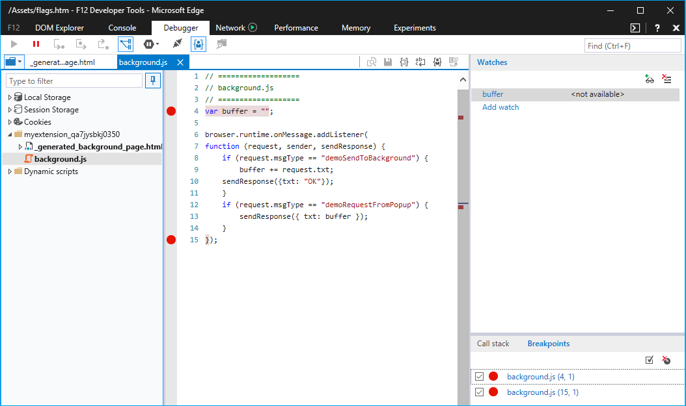
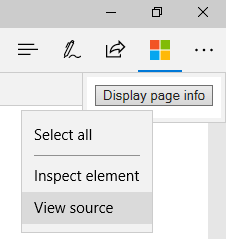
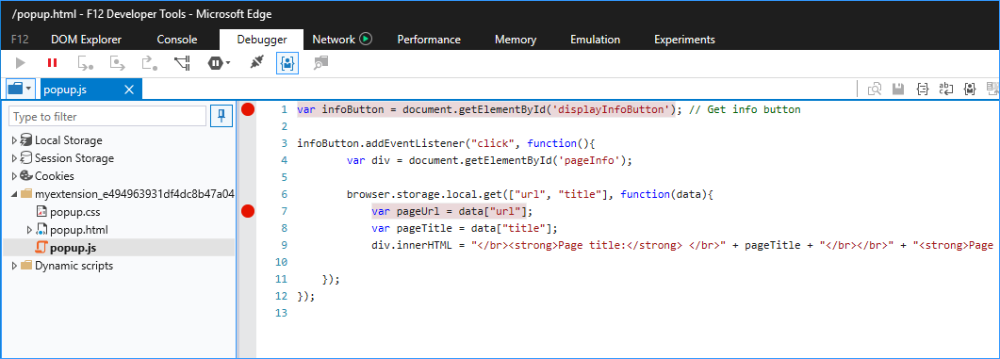

# Отладка расширений  

[!INCLUDE [deprecation-note](../includes/deprecation-note.md)]  

Отламывка расширений в Microsoft Edge, можно с помощью средств разработчика F12.  

Следующее видео проходит через багги Расширение Microsoft Edge, хотя каждый сценарий отладки и исправления его по пути.  Дополнительные сведения см. в пошаговом инструкции ниже.  

> [!VIDEO https://channel9.msdn.com/Blogs/One-Dev-Minute/Debugging-Microsoft-Edge-Extensions/player]  

> [!NOTE]
> Чтобы использовать отладку расширения с помощью F12, сначала необходимо включить функции разработчика в about:flags.  Дополнительные [сведения](./adding-and-removing-extensions.md) о том, как это сделать, см. в добавлении и удалении расширений.  

## Отладка фонового сценария  

Чтобы начать отладку фонового сценария расширения:  

1.  Нажмите **кнопку Дополнительные (...)** с **последующими расширениями,** чтобы перейти в области расширения.  
    
      
    
1.  Щелкните расширение, которое необходимо отлажать.  
1.  Щелкните **ссылку Фоновая** страница, чтобы привести F12 для фонового процесса.  
    
      
    
1.  Выберите **вкладку Debugger** в F12.  
1.  Перейдите к фоновому сценарию расширения и выберите его.  
1.  Поместите точки разлада для отладки, щелкнув слева от номера строки кода.  
    
      
    
1.  Выберите **вкладку Консоли** и выполните `location.reload()` команду.  При этом будет повторно выполняться фоновый сценарий, что позволит выполнить выполнение кода.  
    
      
    
## Отладка скрипта контента  

Чтобы начать отладку сценария контента вашего расширения:  

1.  Запустите F12, переходя на кнопку **More (...)** и выбрав средства разработчика **F12,** или нажав `F12` на клавиатуру.  
1.  Перейдите к сценарию контента расширения и выберите его.  Сценарии контента для расширений, запущенных в настоящее время, будут показаны в разных папках для каждого расширения.  
    
    > [!NOTE]
    > Будут отображаться только сценарии содержимого.  
    
1.  Поместите точки разлада для отладки, щелкнув слева от номера строки кода.  
    
      
    
1.  Обновите вкладку браузера, чтобы начать шаг, хотя код.  
    
## Отладка страницы расширения  

Существует два метода, которые можно использовать для доступа к исходным кодам страницы расширения для отладки.  Один метод применяется к различным страницам, а другой работает только для всплывающих страниц.  

### Отладка любой страницы расширения  

Следующий метод работает для всех страниц расширения, таких как страница параметры и всплывающие всплывающие ок.  

1.  Щелкните правой кнопкой мыши на фоне страницы.  
1.  Выберите **источник Представления**.  
    
      
    
1.  Как только откроется F12, разбей точки в файле, который нужно отламыть.  
    
      
    
1.  Выберите **вкладку Консоли** и выполните `location.reload()` команду.  Это позволит повторно выполнить сценарий страницы, что позволит выполнить выполнение кода.  
    
      
    
### Отладка страницы расширения всплывающих страниц  

Хотя метод отладки страниц расширения также применяется к всплывающее расширение страниц, следующие шаги наметить другой способ отладки всплывающее:  

1.  Щелкните правой кнопкой мыши значок расширения.  
1.  Выберите **всплывающее всплыва**  
    
      
    
1.  Выполните действия 3 и 4 выше, чтобы разместить точки разрыва и перезагрузить всплывающее всплывающее всплывающее помещение.  
    