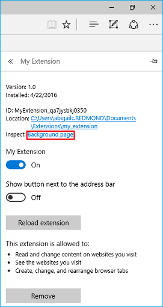
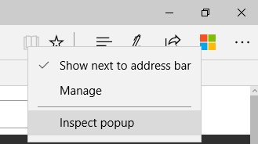

# Отладка расширенийDebugging extensions  

[!INCLUDE [deprecation-note](../includes/deprecation-note.md)]  

Вы можете отлалать расширения в Microsoft Edge с помощью средств разработчика F12.You can debug your extensions in Microsoft Edge by using F12 Developer Tools.

В следующем видео приводится нестрогая надстройка Microsoft Edge, которая проходит через каждый сценарий отладки и исправит его по пути.The following video goes through a buggy Microsoft Edge extension, walking though each debugging scenario and fixing it up along the way. Дополнительные сведения см. в пошаговом пошаговом инструкции ниже.See the step-by-step instructions below for more info.

> [!VIDEO https://channel9.msdn.com/Blogs/One-Dev-Minute/Debugging-Microsoft-Edge-Extensions/player]

> [!NOTE]
> Чтобы воспользоваться преимуществами отладки расширений с помощью F12, необходимо сначала включить функции разработчика в about:flags.In order to take advantage of extension debugging with F12, you must first turn on developer features in about:flags. Дополнительные [сведения о](./adding-and-removing-extensions.md) том, как это сделать, см. в дополнительных сведениях о добавлении и удалении расширений.See [Adding and removing extensions](./adding-and-removing-extensions.md) for details on how to do this.

## Отладка фонового сценарияBackground script debugging
Чтобы начать отладку фонового сценария расширения:To start debugging the background script of your extension:

1. Щелкните **"Еще" (...)** и **"Расширения",** чтобы перейти в области расширений.Click on **More (...)** followed by **Extensions** to go into the extension pane.  
 
2. Щелкните расширение, которое нужно отлажать.Click on the extension that you want to debug.
3. Щелкните **ссылку на фоновую** страницу, чтобы отвести F12 для фонового процесса.Click on the **Background page** link to bring up F12 for the background process.  
 
4. Выберите **вкладку "Отладка"** в F12.Select the **Debugger** tab in F12.
5. Перейдите к фоновому сценарию расширения и выберите его.Navigate to and select your extension's background script.
6. Раз поместите точки останова для отладки, щелкнув слева от номера строки кода.Place breakpoints for debugging by clicking to the left of the source code line number.  
 
7. Выберите **вкладку "Консоль"** и выполните команду `location.reload()` ".Select the **Console** tab and execute the command "`location.reload()`". Это позволит повторно выполнить фоновый сценарий, что позволит выполнить пошаговую пошаговую проверку кода.This will re-execute the background script, allowing you to step through your code.  
 

## Отладка скриптов содержимогоContent script debugging
Чтобы начать отладку скрипта содержимого расширения:To start debugging the content script of your extension:

1. Запустите F12, нажав кнопку "Еще" **(...)** и выбрав "Средства разработчика **F12"** или нажав клавишу F12.Launch F12 by either navigating to the **More (...)** button and selecting **"F12 Developer Tools"** or by pressing F12 on your keyboard.
2. Перейдите к скрипту содержимого расширения и выберите его.Navigate to and select your extension's content script. Сценарии содержимого для запущенных расширений будут показаны в разных папках для каждого расширения.Content scripts for extensions currently running will be depicted by a different folder for each extension.

    > [!NOTE]
    > Будут отображаться только запущенные сценарии содержимого.Only running content scripts will appear.

3. Раз поместите точки останова для отладки, щелкнув слева от номера строки кода.Place breakpoints for debugging by clicking to the left of the source code line number.  
 
4. Обновите вкладку браузера, чтобы начать пошаговую работу кода.Refresh the browser tab to begin stepping though your code.

## Отладка страницы расширенияExtension page debugging

Существует два метода доступа к исходным кодам страницы расширения для отладки.There are two methods that can be used for accessing the source code of your extension page for debugging. Один метод применяется к различным страницам, а другой работает только для всплывающих страниц.One method applies to a variety of pages while the other only works for popup pages.

### Отладка любой страницы расширенияDebugging any extension page
Следующий метод работает для всех страниц расширений, таких как страница параметров и всплывающие меню:The following method works for all extension pages like the options page and popups:

1. Щелкните правой кнопкой мыши фон страницы.Right-click on the background of your page.
2. Выберите **"Просмотр источника"**.Select **"View source"**.

   

3. После открытия F12 поместите точки останова в файл, который нужно отлалать.Once F12 opens, place breakpoints within the file you want to debug.

   
4. Выберите **вкладку "Консоль"** и выполните `location.reload()` команду.Select the **Console** tab and execute the command `location.reload()`. При этом сценарий страницы будет повторно выполняться, что позволяет выполнить пошаговуюThis will re-execute the page script, allowing you to step through your code.  

   

### Отладка всплываемой страницы расширенияDebugging a popup extension page
Хотя метод отладки страниц расширений также применяется к всплывающим страницам расширения, в следующих шагах описан другой способ отладки всплывающее представление:While the method for debugging extension pages also applies to popup extension pages, the following steps outline another way to debug your popup:

1. Щелкните правой кнопкой мыши значок расширения.Right-click your extension's icon.
2. Выберите **"Проверить всплывающее всплывающее".**Select **"Inspect popup"**.

   
3. Выполните действия 3 и 4 выше, чтобы разместить точки останова и перезагрузить всплывающее.Follow steps 3 and 4 above for placing breakpoints and reloading the popup.
