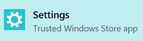

# ИнтернационализацияInternationalization  

[!INCLUDE [deprecation-note](../includes/deprecation-note.md)]  

Чтобы ваше расширение было доступно множеству разных людей, важно иметь в виду другие страны.In order to make your extension accessible to a variety of different people, it is important to develop with other countries in mind. Расширения Microsoft Edge позволяют добавлять в расширения разные языковые строки, чтобы их язык можно было легко изменить.Microsoft Edge extensions allows you to add different language strings to your extensions so that their language can easily be changed.

Дополнительные сведения о международной глобализации расширения можно узнать в руководстве по международной глобализации MDN.For more information on internationalizing your extension, check out MDN's [Internationalization guide](https://developer.mozilla.org/Add-ons/WebExtensions/Internationalization).

## Тестирование языковTesting languages

Чтобы протестировать языковые строки, сначала необходимо установить язык отображения Windows для языка, для который нужно протестировать.To test your language strings, you first need to set the Windows display language to the language that you want to test for.

Чтобы изменить язык отображения Windows, выполните следующие действия.Follow the steps below to change the Windows display language:

1. Откройте приложение "Параметры".Open the Settings app.

   
2. Выберите "Время & языка".Select "Time & language".
3. Выберите "Язык & региона".Select "Region & language".
4. Выберите "+ Добавить язык", чтобы добавить язык в список возможных языков.Select "+ Add a language" to add the language to the list of possible languages.
5. Выберите язык из списка "Языки", который нужно протестировать.Choose the language from the "Languages" list that you want to test.
6. Выберите кнопку "По умолчанию" (может потребоваться перезапустить компьютер).Select the "Set as default" button (you may need to restart your PC).
7. Откройте Microsoft Edge и убедитесь, что строки, определенные для этого региональных точки, отображаются ожидаемым.Open Microsoft Edge and verify that the strings defined for the locale appear as expected.

С помощью свойства [NavigatorLanguage.language](https://developer.mozilla.org/docs/Web/API/NavigatorLanguage/language) можно проверить правильность языка, который Microsoft Edge определил как язык отображения Windows.By using the [NavigatorLanguage.language](https://developer.mozilla.org/docs/Web/API/NavigatorLanguage/language) property, you can verify that the language Microsoft Edge has determined to be the Windows display language is correct.

Нажмите кнопку в CodePen ниже, чтобы увидеть язык отображения браузера.Click the button in the CodePen below to see the display language of your browser.

<iframe height='300' scrolling='no' title='Получить региональные органыGet locale' src='//codepen.io/MSEdgeDev/embed/VaRWwR/?height=300&theme-id=23761&default-tab=result&embed-version=2&editable=true' frameborder='no' allowtransparency='true' allowfullscreen='true' style='width: 100%;'>См. <a href='https://codepen.io/MSEdgeDev/pen/VaRWwR/'> локаль получения </a> пера msEdgeDev (  @MSEdgeDev) на  CodePen.See the Pen <a href='https://codepen.io/MSEdgeDev/pen/VaRWwR/'>Get locale</a>by MSEdgeDev (<a href='http://codepen.io/MSEdgeDev'>@MSEdgeDev</a>) on <a href='http://codepen.io'>CodePen</a>.
</iframe>
