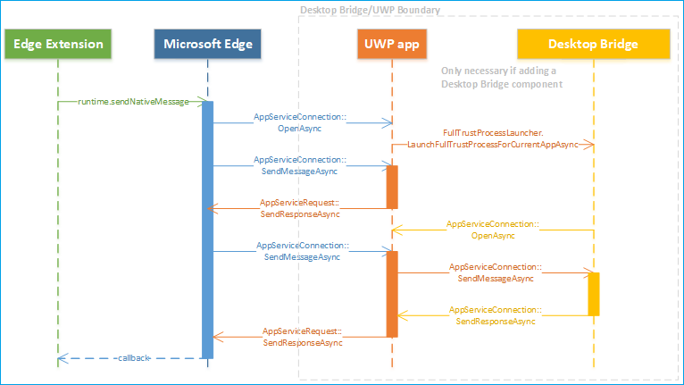
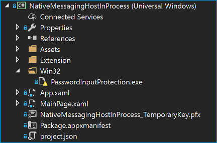

# Native messaging in Microsoft Edge  

[!INCLUDE [deprecation-note](../includes/deprecation-note.md)]  

## Общие сведения об архитектуре системы обмена сообщениями

С помощью Обновления Windows 10 Creators Update расширения Microsoft Edge могут использовать средства обмена сообщениями для взаимодействия с сопутствующим приложением универсальной платформы Windows (UWP).  На высоком уровне расширения Microsoft Edge используют те же API для сообщений, что и расширения Chrome и Firefox. Однако нативный хост обмена сообщениями необходимо реализовать с помощью универсальной платформы Windows.

> [!NOTE]
> Метод, описанный ниже (подключение к приложению UWP через AppService), — единственный поддерживаемый механизм для обеспечения связи между расширениями Microsoft Edge и компонентами. Дополнительные [сведения](#adding-a-desktop-bridge-component) о том, как включить связь с устаревшими компонентами Win32, см. в разделе "Добавление компонента моста для классических компьютеров" этого руководства. 

 Архитектура системы обмена сообщениями в Microsoft Edge использует существующий API в качестве инфраструктуры взаимодействия между процессами [`AppService`](https://msdn.microsoft.com/library/windows/apps/windows.applicationmodel.appservice.aspx) (IPC). Приложения UWP используют `AppService` API для связи друг с другом. Поэтому расширения Microsoft Edge теперь могут взаимодействовать с приложениями UWP.



### Когда и когда не использовать тивную систему обмена сообщениями

Собственный обмен сообщениями добавляет новый уровень в расширение. Реализуя приложение-компаньон UWP для расширения, вы сможете получить следующие возможности:

* Синхронизируются данные (например, учетные данные) с сопутствующим приложением UWP.
* Реализация более сложных алгоритмов шифрования и расшифровки, недоступных в веб-API.
* Доступ к ресурсам, недоступным через веб-API, например аппаратные или USB-устройства

Существует несколько случаев, когда из-за ограничений безопасности или политики нельзя использовать сообщения нативных сообщений:

* Изменение параметров пользователя в Microsoft Edge или Windows, например изменение браузера по умолчанию или поставщика поиска.
* Действия, нарушающие политики Microsoft Store для приложений и расширений.
* Передача данных в удаленную конечную точку через нативный хост сообщений.
* Разрешить другим приложениям скачивать содержимое, меняющее поведение расширения.

## Демонстрационные примеры

Чтобы узнать, как выглядит расширение microsoft Edge с сопутствующим приложением UWP и мостом для классических приложений, ознакомьтесь с примерами [SecureInput](https://github.com/MicrosoftEdge/MicrosoftEdge-Extensions-Demos/tree/master/SecureInput) и [DigitalSigning (C++)](https://github.com/MicrosoftEdge/MicrosoftEdge-Extensions-Demos/tree/master/DigitalSigning) на GitHub.

### Принцип работы

Компонент расширения Microsoft Edge в примере использует скрипт содержимого для определения того, когда пользователь введет данные, которые должны быть зашифрованы. Расширение сообщает об этом компоненту моста для классических приложений посредством обмена сообщениями. Когда пользователь будет готов отправить данные, расширение возвратит зашифрованное значение обратно на веб-сайт.

> [!NOTE]
> Этот пример будет работать только на веб-странице, которая использует настраиваемые события для связи со скриптом содержимого расширения. Пример папки включает [HTML-файл](https://github.com/MicrosoftEdge/MicrosoftEdge-Extensions-Demos/blob/master/SecureInput/SecureInput.html) для проверки расширения.

В этом примере приложение UWP используется для перенаправки ответов из моста для классических приложений в Microsoft Edge, который затем отправляется в расширение Microsoft Edge с помощью вызова. Хотя в этом примере в основном приложении работает основной хост обмена сообщениями, он также может работать как фоновая задача. Для переключения между ними необходимо изменить фоновый сценарий расширения, изменив строку внутри на `port = browser.runtime.connectNative("NativeMessagingHostInProcessService");` `"NativeMessagingHostOutOfProcess"` .

## Реализация Chrome и Microsoft Edge

В то время как Chrome использует API передачи сообщений для своих расширений для связи с приложениями, Microsoft Edge использует API, который теперь позволяет расширениям Microsoft Edge и [`AppService`](https://msdn.microsoft.com/library/windows/apps/windows.applicationmodel.appservice.aspx) приложениям UWP взаимодействовать.

В этом разделе подробно различия между тем, как Chrome и Microsoft Edge обрабатывают реализацию сообщений.

### Манифест регистрации и хоста
Чтобы ваше приложение распозналось расширением как собственный хост обмена сообщениями, его необходимо зарегистрировать.

Для [регистрации нативных хостов](https://developer.chrome.com/extensions/nativeMessaging) сообщений Chrome ваше приложение должно установить файл манифеста в любом месте файловой системы Windows, который определяет конфигурацию нативного хоста обмена сообщениями.

В следующем примере JSON можно настроить файл config:

```json
{
   "name": "com.my_company.my_application",
   "description": "My Application",
   "path": "C:\\ProgramFiles\\MyApplication\\chrome_native_messaging_host.exe",
   "type": "stdio",
   "allowed_origins": [
      "chrome-extension://knldjmfmopnpolahpmmgbagdohdnhkik/"
    ]
}
```  

Чтобы установить этот файл, приложению потребуется:

1.  Зарегистрируйте файл манифеста в предварительно определенном расположении в реестре, который определяет конфигурацию хоста:
    -   ```text
        HKEY_LOCAL_MACHINE\SOFTWARE\Google\Chrome\NativeMessagingHosts\com.my_company.my_application
        ```  
        
        или
        
    -   ```text
        HKEY_CURRENT_USER\SOFTWARE\Google\Chrome\NativeMessagingHosts\com.my_company.my_application
        ```  
        
2.  Установите для этого ключа значение по умолчанию, указав полный путь к файлу манифеста, например 
    
    ```text
    [HKEY_CURRENT_USER\Software\Google\Chrome\NativeMessagingHosts\com.my_company.my_application] @="C:\\path\\to\\nmh-manifest.json"
    ```  
    
Для Microsoft Edge, чтобы зарегистрировать (собственный хост обмена сообщениями), необходимо включить приложение-компаньон UWP в тот же пакет, что и расширение, и указать расширение AppService в файле [`AppService`](https://msdn.microsoft.com/library/windows/apps/windows.applicationmodel.appservice.aspx) [](https://msdn.microsoft.com/windows/uwp/launch-resume/how-to-create-and-consume-an-app-service) `Package.appxmanifest` проекта. Вы можете настроить атрибуты `EntryPoint` `Name` и атрибуты:

```xml
...
<Applications>    
    <Application Id="App"         
        <Extensions>        
            <uap:Extension Category="windows.appService" EntryPoint="MyAppService.Inventory">          
            <uap:AppService Name="com.microsoft.inventory"/>        
            </uap:Extension>      
        </Extensions>      
        ...    
    </Application>
</Applications>
```


Кроме того, необходимо установить, какие расширения могут подключаться к службе. Так как Microsoft Edge не имеет эквивалентного свойства манифеста в AppxManifest, оно должно быть определено и принудительно применено приложением UWP во время `"allowed_origins"` работы. Так как Microsoft Edge будет устанавливать подключение от имени расширения, приложение может найти имя семейства пакетов вызываемого, чтобы определить, подключается ли microsoft Edge для управления или проверки подлинности вызываемого. Например: 

```csharp
protected async override void
OnBackgroundActivated(BackgroundActivatedEventArgs args)
{
    IBackgroundTaskInstance taskInstance = args.TaskInstance;
    if (taskInstance.TriggerDetails is AppServiceTriggerDetails)
    {
        AppServiceTriggerDetails appService = taskInstance.TriggerDetails as AppServiceTriggerDetails;
        if (appService.CallerPackageFamilyName == EdgePFN)
        {
            // Establish the connection
        }
        else
        {
            // Reject the connection
        }
    }
}
```  

### Отправка сообщений

Чтобы приложение и расширение взаимодействовали друг с другом, сообщения необходимо отправлять в них и от них.

Расширения Chrome инициируют сообщение с помощью API для доставки сообщения на свой хост [`runtime.sendNativeMessage`](https://developer.mozilla.org/Add-ons/WebExtensions/API/runtime/sendNativeMessage) с помощью несохраняемого канала. 

```javascript
chrome.runtime.sendNativeMessage(string application, object message, function responseCallback)
```  

Первый параметр — это имя нативного хоста, который Chrome ищет в реестре для манифеста. Манифест указывает EXE-расширение, которое Chrome запустит в песочнице, а сообщение отправляется с помощью std i/o. Расширения также могут устанавливать постоянный канал с помощью API, который принимает имя нативного хоста `runtime.connectNative` в качестве единственного параметра. 

Microsoft Edge использует ту же конструкцию, что и API сообщений chrome, чтобы разрешить расширениям Microsoft Edge указывать, к какой службе приложений подключаться. Первый параметр указывает `runtime.sendNativeMessage` имя службы приложения. В разделе ["Регистрация и манифест](#registration-and-host-manifest) хоста" это `"com.microsoft.inventory"` . Платформа расширения Microsoft Edge ограничивает нативный хост обмена сообщениями приложением UWP, упакованным в то же AppX, что и расширение. Это устраняет все риски безопасности, связанные с вредоносными атаками, которые пытаются подключить Microsoft Edge к другому имени семейства пакетов путем изменения записей манифеста. 

Это означает, что Microsoft Edge будет использовать то же имя семейства пакетов, что и расширение, в дополнение к имени, указанному в API, для уникальной идентификации поставщика `AppService` службы приложения.  

> [!NOTE]
> Это будет непросто преобразовать с помощью расширения [Microsoft Edge набор средств.](./porting-chrome-extensions.md) Все расширения, в которых указывается разрешение, будут помечены как требующие ручного `"nativeMessaging"` преобразования для этого компонента.

### Протокол связи

Протокол связи для обмена сообщениями определяет формат сообщений перед отправкой.

Chrome запускает каждый исходный хост сообщений в отдельном процессе и взаимодействует с ним с помощью стандартного ввода и стандартных выходных данных. Для отправки сообщений в обоих направлениях используется один и тот же формат: каждое сообщение сериализуется с использованием JSON, UTF-8 закодировано и предшествует 32-битной длине сообщения в порядке нативных битов.

Для Microsoft Edge платформа будет использовать фоновую задачу или основное приложение, которое реализует службу приложений. При запуске будет вызван `Run` метод фоновой задачи:  

```csharp
public void Run(IBackgroundTaskInstance taskInstance)    
{
    this.backgroundTaskDeferral = taskInstance.GetDeferral();
    // Get a deferral so that the service isn't terminated.
    taskInstance.Canceled += OnTaskCanceled;
    // Associate a cancellation handler with the background task.
    // Retrieve the app service connection and set up a listener for incoming app service requests.
    var details = taskInstance.TriggerDetails as AppServiceTriggerDetails;
    appServiceconnection = details.AppServiceConnection;
    appServiceconnection.RequestReceived += OnRequestReceived;
}
```  

Когда расширение отправляет сообщение вашему приложению UWP, [`onRequestReceived`](https://msdn.microsoft.com/library/windows/apps/windows.applicationmodel.appservice.appserviceconnection.requestreceived) вызывается событие. Это сообщение в формате JSON затем будет в виде строки в первую пару KeyValue [`ValueSet`](https://msdn.microsoft.com/library/windows/apps/dn636131) объекта. :

```csharp
private async void OnRequestReceived(
AppServiceConnection sender,
AppServiceRequestReceivedEventArgs args)
{
    ...
}
```  

Когда ваше приложение UWP отправляет ответ на расширение, объект будет [`KeyValuePair`](https://msdn.microsoft.com/library/windows/apps/5tbh8a42) `ValueSet` добавлен. Microsoft Edge игнорирует это свойство, но содержит допустимую `Key` `Value` строку JSON.

### Callback

Для ответных вызовов Chrome использует функцию ответного вызова для обработки любого асинхронного ответа от [`runtime.sendNativeMessage`](https://developer.mozilla.org/Add-ons/WebExtensions/API/runtime/sendNativeMessage) отправки сообщения.

Microsoft Edge использует метод объекта, чтобы позволить приложению [`AppServiceRequest`](https://msdn.microsoft.com/library/windows/apps/windows.applicationmodel.appservice.appservicerequest) отправлять объект обратно в [`SendResponseAsync`](https://msdn.microsoft.com/library/windows/apps/windows.applicationmodel.appservice.appservicerequest.sendresponseasync) [`ValueSet`](https://msdn.microsoft.com/library/windows/apps/dn636131) расширение.


### Ограничение на размер сообщения
Для сообщений, которые отправляются между расширением и приложением, для Chrome и Microsoft Edge накладываются различные ограничения на размер сообщений.

Chrome имеет следующие ограничения на размер сообщений:
-   Ограничение одного сообщения от ведущего приложения системы обмена сообщениями: 1 МБ
-   Ограничение на одно сообщение, отправленное на нативный хост обмена сообщениями: 4 ГБ
    
Для Microsoft Edge, хотя размер сообщений не ограничивается (зависит от памяти), Microsoft Edge защищает себя от неправильного поведения приложений, налагая следующие ограничения на размер `AppService` сообщений:
-   Ограничение одного сообщения от приложения UWP до расширения: 1 МБ
-   Ограничение одного сообщения от расширения до приложения UWP: 100 МБ
    
### Native messaging connections

Существует два типа подключений для нативных сообщений; постоянный и постоянный.
**Постоянное** подключение — это подключение, которое работает до тех пор, пока порт не будет уничтожен. Постоянное **подключение** — это подключение, которое открывается по одному сообщению и закрывается после доставки.

#### Постоянные правила

Для Chrome постоянное подключение создается путем создания порта обмена сообщениями с использованием [`runtime.connectNative`](https://developer.mozilla.org/Add-ons/WebExtensions/API/runtime/connectNative) . После создания порта Chrome запускает процесс ведущего приложения системы обмена сообщениями, который продолжает работать до тех пор, пока порт не будет уничтожен.

Для Microsoft Edge после создания порта обмена сообщениями с помощью Microsoft Edge запускает и продолжает его работу до тех пор, пока `runtime.connectNative` [`AppServiceConnection`](https://msdn.microsoft.com/library/windows/apps/windows.applicationmodel.appservice.appserviceconnection) порт не будет уничтожен. В следующем фрагменте кода показано, как устанавливается постоянное подключение из приложения UWP. 

```csharp
this.inventoryService = new AppServiceConnection();  
// Here, we use the app service name provided via the runtime.connectNative API  
this.inventoryService.AppServiceName = "com.microsoft.inventory";  
// Use the same Package Family Name as the extension package
this.inventoryService.PackageFamilyName = "replace with the Package Family Name";  
var status = await
this.inventoryService.OpenAsync();
```  

#### Несохраняемая

Когда сообщение отправляется с помощью Chrome, не создавая порт обмена сообщениями, Chrome запускает новый процесс ведущего приложения системы обмена сообщениями для [`runtime.sendNativeMessage`](https://developer.mozilla.org/Add-ons/WebExtensions/API/runtime/sendNativeMessage) каждого сообщения. Первое сообщение, сгенерированное процессом ведущего сообщения, обрабатывается как ответ на исходный запрос, а все остальные сообщения после его игнорирования.

Microsoft Edge прервает подключение после того, как будет получен ответ каждого сообщения. В следующем фрагменте кода показано постоянное соединение, которое устанавливается с таким подключением, которое затем будет прервано в приложении UWP после того, как запрос был получен и сохранен в качестве `AppServiceConnection` [`AppServiceResponse`](https://msdn.microsoft.com/library/windows/apps/windows.applicationmodel.appservice.appserviceresponse) .

```csharp
using (var connection = new AppServiceConnection())
{    
    //Set up a new app service connection
    connection.AppServiceName = "com.microsoft.randomnumbergenerator";
    connection.PackageFamilyName = "Microsoft.SDKSamples.AppServicesProvider.CS_8wekyb3d8bbwe";
    AppServiceConnectionStatus status = await connection.OpenAsync();
    AppServiceResponse response = await connection.SendMessageAsync(inputs);
}
```  

### Разрешение

Чтобы разрешить использование сообщений в вашем расширении, для Chrome и Microsoft Edge необходимо объявить разрешение `"nativeMessaging"` в `manifest.json` файле.

## Услуги для приложений
В этом разделе подробное влияние служб приложений на производительность и память системы обмена сообщениями в Microsoft Edge.

### Производительность

Службы приложений "спонсируется" приложением переднего плана, которое вызывает их в целях обмена сообщениями Microsoft Edge. Это означает, что службы приложений могут работать, пока работает Microsoft Edge.

В отношении задержки службы приложений используют именованые конвейеры, которые после начального подключения позволяют двум приложениям напрямую взаимодействовать. Этот метод связи создает низкую задержку. Устройства с медленными ЦП будут испытывать некоторые начальные задержки после запуска процесса, в котором размещена служба приложения (около 80 мс для запуска фоновой задачи на некоторых устройствах). После запуска производительность на медленных устройствах ЦП должна быть хорошей. 

### Память
Память, выделенная для службы приложений, выходит из квоты, выделенной для Microsoft Edge. Это означает, что если Microsoft Edge запускает слишком много служб приложений, существует вероятность того, что у них не будет памяти. Стандартные ограничения памяти фоновой задачи применяются в службах приложений. Например, на устройстве с размером 512 МБ фоновая задача службы приложения не может быть больше 16 МБ. Это число по мере масштабирования устройств.

## Создание расширения с помощью нативных сообщений

Чтобы протестировать собственный обмен сообщениями, расширению необходимо имя семейства пакетов. Microsoft Edge использует его для определения идентификатора ведущего сообщения, что означает, что расширение должно быть упаковано. 

Чтобы создать расширение с помощью системы обмена сообщениями в Visual Studio:

1.  Создайте проект UWP в Visual Studio.
2.  [Добавьте `AppService` в приложение UWP.](https://msdn.microsoft.com/windows/uwp/launch-resume/how-to-create-and-consume-an-app-service)
    -   При желании вы можете настроить [ `AppService` его для](https://msdn.microsoft.com/windows/uwp/launch-resume/convert-app-service-in-process) основного приложения, а не в качестве фоновой задачи на данном этапе.
3.  Создайте и протестировать проект UWP.
    -   При желании можно добавить компонент [моста для классических компьютеров.](#adding-a-desktop-bridge-component)
4.  Создайте расширение Microsoft Edge, использующее средства обмена сообщениями для взаимодействия с приложением-компаньоном UWP. Файлы расширения можно добавить в папку с именем `Extension` в проекте UWP. Все файлы под этой папкой, включая вложенные папки, должны иметь свои свойства, настроенные таким `Build Action=Content` образом. `Copy to Output Directory=Copy Always` Убедитесь, что эти свойства также `manifest.json` настроены.
5.  Измените файл в проекте, включив метаданные расширения, и преобразуйте его в приложение `package.manifest.xml` без headless, `AppListEntry="none"` добавив:
    
    ```xml
    <Package
    xmlns="http://schemas.microsoft.com/appx/manifest/foundation/windows10" 
    xmlns:rescap="http://schemas.microsoft.com/appx/manifest/foundation/windows10/restrictedcapabilities" 
    xmlns:mp="http://schemas.microsoft.com/appx/2014/phone/manifest" 
    xmlns:uap="http://schemas.microsoft.com/appx/manifest/uap/windows10" 
    xmlns:uap3="http://schemas.microsoft.com/appx/manifest/uap/windows10/3"
    IgnorableNamespaces="uap uap3 mp rescap build" 
    xmlns:build="http://schemas.microsoft.com/developer/appx/2015/build">

    <Dependencies>
        <TargetDeviceFamily Name="Windows.Desktop" MinVersion="10.0.15063.0" MaxVersionTested="10.0.15063.0" />
    </Dependencies>

       <Application Id="App" Executable="$targetnametoken$.exe" EntryPoint="NativeMessagingHostInProcess.App">
          <uap:VisualElements AppListEntry="none"
            DisplayName="SecureInput"
            Square150x150Logo="Assets\Square150x150Logo.png"
            Square44x44Logo="Assets\Square44x44Logo.png"
            Description="NativeMessagingHostInProcess"
            BackgroundColor="transparent">
          </uap:VisualElements>
          <Extensions>
            <uap3:Extension Category="windows.appExtension">
                <uap3:AppExtension
                    Name="com.microsoft.edge.extension"
                    Id="EdgeExtension"
                    PublicFolder="Extension"
                    DisplayName="ms-resource:DisplayName">
                </uap3:AppExtension>
            </uap3:Extension>
          </Extensions>
    </Application>
    ```
    
6.  Используйте `AppService` имя, настроенное для UWP, в личных API обмена сообщениями.
7.  Сборка [и развертывание](#deploying) проекта UWP (с дополнительным компонентом моста для классических компьютеров).
8.  [Упаковка](#packaging) вашего расширения системы обмена сообщениями после его готовности к отправке в Магазин
    
> [!NOTE]
> В разделе ["Демонстрации"](#demos) можно привести пример полного расширения системы обмена сообщениями.

## Добавление компонента моста для классических компьютеров 
Если вы хотите добавить в пакет компонент моста для классических компьютеров, вам потребуется создать и построить проект Win32 в Visual Studio. Сведения о том, как преобразовать приложение win32 в UWP, см. в переносе приложений в [Windows 10 через мост для классических приложений.](/windows/uwp/porting/desktop-to-uwp-root) Выполнив Visual Studio, вы можете добавить исполняемый пакет Win32 в пакет, выполнив следующие действия.

1.  Добавьте проект Win32 в то же решение, что и проект UWP. 
2.  Установите проект Win32 в качестве зависимого проекта для проекта UWP:
    
    
    
3.  Создайте `Win32` папку в проекте UWP. Скопируйте необходимые для проекта `Win32` binaries в эту папку. Настройте свойства всех binaries таким `Build Action=Content` образом, что и `Copy to Output Directory=Copy Always` .
    
    
    
4.  Измените файл проекта UWP, чтобы скопировать все необходимые для проекта файлы в эту папку с помощью `Win32` команды события PostBuild. Это гарантирует, что обновленные binaries будут копироваться в папку при каждом перестроенном решении.
    
    ```xml
    <Target Name="AfterBuild">
    <Copy SourceFiles="..\PasswordInputProtection\bin\$(Configuration)\PasswordInputProtection.exe" DestinationFolder="win32" />
    <Copy SourceFiles="..\PasswordInputProtection\bin\$(Configuration)\PasswordInputProtection.exe.config" DestinationFolder="win32" />
    <Copy SourceFiles="..\PasswordInputProtection\bin\$(Configuration)\PasswordInputProtection.pdb" DestinationFolder="win32" />
    </Target>
    ```
    
5.  `package.manifest.xml`Измените, добавив элемент в `<desktop:Extension>` `<Extensions>` элемент:
    
    ```xml
    <Extensions>
    <desktop:Extension Category="windows.fullTrustProcess"Executable="Win32\PasswordInputProtection.exe"
    xmlns:desktop="http://schemas.microsoft.com/appx/manifest/desktop/windows10" />
    </Extensions>
    ```
    
## Развертывание
Настроив проект UWP (и, при желании, проект Win32), как описано выше, вы можете развернуть решение с помощью Visual Studio.


После правильного развертывания решения вы увидите расширение в Microsoft Edge.


## Создание пакетов

> [!NOTE]
> Отправка расширения Microsoft Edge в Microsoft Store в настоящее время является ограниченной возможностью. [Прося нам](https://aka.ms/extension-request) свои запросы на участие в Microsoft Store, мы будем учесть, что вы будете обновляться в будущем.

Вы можете создать пакет Магазина для отправки в Центр разработчиков Для Windows с помощью встроенных Visual Studio функций:


## Отладка
Инструкции по отладки зависят от того, какой компонент вы хотите протестировать:

### Отладка расширения
После развертывания решения расширение будет установлено в Microsoft Edge. Сведения о [](./debugging-extensions.md) том, как отладить расширение, можно найти в руководстве по отладки.


### Отладка приложения UWP
Приложение UWP запускается, когда расширение пытается подключиться к ней с помощью [нативных API обмена сообщениями.](https://developer.mozilla.org/Add-ons/WebExtensions/API/runtime/connectNative) Отламка приложения UWP потребуется только после начала процесса. Это можно настроить на странице свойств проекта:

1.  В Visual Studio щелкните правой кнопкой мыши проект приложения UWP
2.  Выбор свойств
3.  Проверьте "Не запускать, а отлалать мой код при его запуске"
    
    
    
В Visual Studio теперь можно установить точки останова в коде, в котором нужно отладить, а затем запустить отладок, нажав F5. После взаимодействия с расширением для подключения к приложению UWP Visual Studio автоматически подключаться к процессу.

### Отладка моста для классических компьютеров
Несмотря на то [](https://msdn.microsoft.com/windows/uwp/porting/desktop-to-uwp-debug) что существуют различные методы отладки моста для классических приложений (преобразованное приложение Win32), единственным применимым вариантом для этих сценариев является вариант PLMDebug. Вы также можете добавить код отладки в функцию запуска, чтобы выполнить ожидание определенного времени, позволяя прикрепить Visual Studio к процессу.
