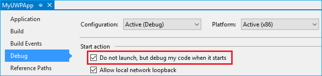

# <span data-ttu-id="2f119-104">Native messaging in Microsoft Edge</span><span class="sxs-lookup"><span data-stu-id="2f119-104">Native messaging in Microsoft Edge</span></span>  

[!INCLUDE [deprecation-note](../includes/deprecation-note.md)]  

## <span data-ttu-id="2f119-105">Общие сведения об архитектуре системы обмена сообщениями</span><span class="sxs-lookup"><span data-stu-id="2f119-105">Native messaging architecture overview</span></span>

<span data-ttu-id="2f119-106">С помощью Обновления Windows 10 Creators Update расширения Microsoft Edge могут использовать средства обмена сообщениями для взаимодействия с сопутствующим приложением универсальной платформы Windows (UWP).</span><span class="sxs-lookup"><span data-stu-id="2f119-106">With the Windows 10 Creators Update, Microsoft Edge extensions are able to use native messaging to communicate with a companion Universal Windows Platform (UWP) app.</span></span>  <span data-ttu-id="2f119-107">На высоком уровне расширения Microsoft Edge используют те же API для сообщений, что и расширения Chrome и Firefox.</span><span class="sxs-lookup"><span data-stu-id="2f119-107">At a high level, Microsoft Edge extensions use the same APIs for native messaging as Chrome and Firefox extensions.</span></span> <span data-ttu-id="2f119-108">Однако нативный хост обмена сообщениями необходимо реализовать с помощью универсальной платформы Windows.</span><span class="sxs-lookup"><span data-stu-id="2f119-108">However, the native messaging host will need to be implemented using the Universal Windows Platform.</span></span>

> [!NOTE]
> <span data-ttu-id="2f119-109">Метод, описанный ниже (подключение к приложению UWP через AppService), — единственный поддерживаемый механизм для обеспечения связи между расширениями Microsoft Edge и компонентами.</span><span class="sxs-lookup"><span data-stu-id="2f119-109">The method outlined below (connecting to a UWP app via AppService) is the only supported mechanism for enabling communication between Microsoft Edge extensions and native components.</span></span> <span data-ttu-id="2f119-110">Дополнительные [сведения](#adding-a-desktop-bridge-component) о том, как включить связь с устаревшими компонентами Win32, см. в разделе "Добавление компонента моста для классических компьютеров" этого руководства.</span><span class="sxs-lookup"><span data-stu-id="2f119-110">Please see the [Adding a Desktop Bridge component](#adding-a-desktop-bridge-component) section of this guide for more information on how to enable communication with legacy Win32 components.</span></span> 

 <span data-ttu-id="2f119-111">Архитектура системы обмена сообщениями в Microsoft Edge использует существующий API в качестве инфраструктуры взаимодействия между процессами [`AppService`](https://msdn.microsoft.com/library/windows/apps/windows.applicationmodel.appservice.aspx) (IPC).</span><span class="sxs-lookup"><span data-stu-id="2f119-111">Microsoft Edge's native messaging architecture leverages the existing [`AppService`](https://msdn.microsoft.com/library/windows/apps/windows.applicationmodel.appservice.aspx) API as the underlying inter-process communication (IPC) infrastructure.</span></span> <span data-ttu-id="2f119-112">Приложения UWP используют `AppService` API для связи друг с другом.</span><span class="sxs-lookup"><span data-stu-id="2f119-112">UWP apps use the `AppService` API to communicate with one another.</span></span> <span data-ttu-id="2f119-113">Поэтому расширения Microsoft Edge теперь могут взаимодействовать с приложениями UWP.</span><span class="sxs-lookup"><span data-stu-id="2f119-113">Because of this, Microsoft Edge extensions can now communicate with UWP apps.</span></span>


### <span data-ttu-id="2f119-115">Когда и когда не использовать тивную систему обмена сообщениями</span><span class="sxs-lookup"><span data-stu-id="2f119-115">When and when not to use native messaging</span></span>

<span data-ttu-id="2f119-116">Собственный обмен сообщениями добавляет новый уровень в расширение.</span><span class="sxs-lookup"><span data-stu-id="2f119-116">Native messaging adds a whole new layer to your extension.</span></span> <span data-ttu-id="2f119-117">Реализуя приложение-компаньон UWP для расширения, вы сможете получить следующие возможности:</span><span class="sxs-lookup"><span data-stu-id="2f119-117">By implementing a UWP companion app for your extension, the following possibilities become available to you:</span></span>

* <span data-ttu-id="2f119-118">Синхронизируются данные (например, учетные данные) с сопутствующим приложением UWP.</span><span class="sxs-lookup"><span data-stu-id="2f119-118">Synchronize data (e.g. credentials) with a companion UWP app.</span></span>
* <span data-ttu-id="2f119-119">Реализация более сложных алгоритмов шифрования и расшифровки, недоступных в веб-API.</span><span class="sxs-lookup"><span data-stu-id="2f119-119">Implement stronger encryption/decryption algorithms not available in web APIs.</span></span>
* <span data-ttu-id="2f119-120">Доступ к ресурсам, недоступным через веб-API, например аппаратные или USB-устройства</span><span class="sxs-lookup"><span data-stu-id="2f119-120">Access resources that are not accessible through web APIs, e.g. hardware or USB devices</span></span>

<span data-ttu-id="2f119-121">Существует несколько случаев, когда из-за ограничений безопасности или политики нельзя использовать сообщения нативных сообщений:</span><span class="sxs-lookup"><span data-stu-id="2f119-121">There are a few instances where native messaging can't be used due to security or policy restrictions:</span></span>

* <span data-ttu-id="2f119-122">Изменение параметров пользователя в Microsoft Edge или Windows, например изменение браузера по умолчанию или поставщика поиска.</span><span class="sxs-lookup"><span data-stu-id="2f119-122">Modifying user settings in either Microsoft Edge or Windows, e.g. changing the default browser or search provider.</span></span>
* <span data-ttu-id="2f119-123">Действия, нарушающие политики Microsoft Store для приложений и расширений.</span><span class="sxs-lookup"><span data-stu-id="2f119-123">Actions that violate Microsoft Store policies for both apps and extensions.</span></span>
* <span data-ttu-id="2f119-124">Передача данных в удаленную конечную точку через нативный хост сообщений.</span><span class="sxs-lookup"><span data-stu-id="2f119-124">Transferring data to remote endpoint via native message host.</span></span>
* <span data-ttu-id="2f119-125">Разрешить другим приложениям скачивать содержимое, меняющее поведение расширения.</span><span class="sxs-lookup"><span data-stu-id="2f119-125">Allowing other apps to download content that changes extension behavior.</span></span>

## <span data-ttu-id="2f119-126">Демонстрационные примеры</span><span class="sxs-lookup"><span data-stu-id="2f119-126">Demos</span></span>

<span data-ttu-id="2f119-127">Чтобы узнать, как выглядит расширение microsoft Edge с сопутствующим приложением UWP и мостом для классических приложений, ознакомьтесь с примерами [SecureInput](https://github.com/MicrosoftEdge/MicrosoftEdge-Extensions-Demos/tree/master/SecureInput) и [DigitalSigning (C++)](https://github.com/MicrosoftEdge/MicrosoftEdge-Extensions-Demos/tree/master/DigitalSigning) на GitHub.</span><span class="sxs-lookup"><span data-stu-id="2f119-127">To get a feel for what an Microsoft Edge native messaging extension that has both a companion UWP app and a Desktop Bridge looks like, check out the [SecureInput](https://github.com/MicrosoftEdge/MicrosoftEdge-Extensions-Demos/tree/master/SecureInput) and [DigitalSigning (C++)](https://github.com/MicrosoftEdge/MicrosoftEdge-Extensions-Demos/tree/master/DigitalSigning) examples on GitHub.</span></span>

### <span data-ttu-id="2f119-128">Принцип работы</span><span class="sxs-lookup"><span data-stu-id="2f119-128">How it works</span></span>

<span data-ttu-id="2f119-129">Компонент расширения Microsoft Edge в примере использует скрипт содержимого для определения того, когда пользователь введет данные, которые должны быть зашифрованы.</span><span class="sxs-lookup"><span data-stu-id="2f119-129">The Microsoft Edge extension component of the sample uses its content script to detect when a user is typing in information that should be encrypted.</span></span> <span data-ttu-id="2f119-130">Расширение сообщает об этом компоненту моста для классических приложений посредством обмена сообщениями.</span><span class="sxs-lookup"><span data-stu-id="2f119-130">The extension communicates this to the Desktop Bridge component via native messaging.</span></span> <span data-ttu-id="2f119-131">Когда пользователь будет готов отправить данные, расширение возвратит зашифрованное значение обратно на веб-сайт.</span><span class="sxs-lookup"><span data-stu-id="2f119-131">When the user is ready to submit the data, the extension will return an encrypted value back to the website.</span></span>

> [!NOTE]
> <span data-ttu-id="2f119-132">Этот пример будет работать только на веб-странице, которая использует настраиваемые события для связи со скриптом содержимого расширения.</span><span class="sxs-lookup"><span data-stu-id="2f119-132">This sample will only work on a webpage that uses custom events to communicate with the extension's content script.</span></span> <span data-ttu-id="2f119-133">Пример папки включает [HTML-файл](https://github.com/MicrosoftEdge/MicrosoftEdge-Extensions-Demos/blob/master/SecureInput/SecureInput.html) для проверки расширения.</span><span class="sxs-lookup"><span data-stu-id="2f119-133">The sample folder includes a [.html file](https://github.com/MicrosoftEdge/MicrosoftEdge-Extensions-Demos/blob/master/SecureInput/SecureInput.html) to test the extension with.</span></span>

<span data-ttu-id="2f119-134">В этом примере приложение UWP используется для перенаправки ответов из моста для классических приложений в Microsoft Edge, который затем отправляется в расширение Microsoft Edge с помощью вызова.</span><span class="sxs-lookup"><span data-stu-id="2f119-134">In this example, the UWP app is used to pass responses from the Desktop Bridge to Microsoft Edge, which then gets sent to the Microsoft Edge extension via callback.</span></span> <span data-ttu-id="2f119-135">Хотя в этом примере в основном приложении работает основной хост обмена сообщениями, он также может работать как фоновая задача.</span><span class="sxs-lookup"><span data-stu-id="2f119-135">While this example has the native messaging host run in the main app, it's also able to run as a background task.</span></span> <span data-ttu-id="2f119-136">Для переключения между ними необходимо изменить фоновый сценарий расширения, изменив строку внутри на `port = browser.runtime.connectNative("NativeMessagingHostInProcessService");` `"NativeMessagingHostOutOfProcess"` .</span><span class="sxs-lookup"><span data-stu-id="2f119-136">Switching between the two requires editing the extension's background script, changing the string within `port = browser.runtime.connectNative("NativeMessagingHostInProcessService");` to `"NativeMessagingHostOutOfProcess"`.</span></span>

## <span data-ttu-id="2f119-137">Реализация Chrome и Microsoft Edge</span><span class="sxs-lookup"><span data-stu-id="2f119-137">Chrome vs Microsoft Edge implementation</span></span>

<span data-ttu-id="2f119-138">В то время как Chrome использует API передачи сообщений для своих расширений для связи с приложениями, Microsoft Edge использует API, который теперь позволяет расширениям Microsoft Edge и [`AppService`](https://msdn.microsoft.com/library/windows/apps/windows.applicationmodel.appservice.aspx) приложениям UWP взаимодействовать.</span><span class="sxs-lookup"><span data-stu-id="2f119-138">While Chrome goes the route of using message passing APIs for their extensions to communicate with apps, Microsoft Edge utilizes the [`AppService`](https://msdn.microsoft.com/library/windows/apps/windows.applicationmodel.appservice.aspx) API which now enables Microsoft Edge extensions and UWP apps to communicate.</span></span>

<span data-ttu-id="2f119-139">В этом разделе подробно различия между тем, как Chrome и Microsoft Edge обрабатывают реализацию сообщений.</span><span class="sxs-lookup"><span data-stu-id="2f119-139">This section details the differences between how Chrome and Microsoft Edge handle native messaging implementation.</span></span>

### <span data-ttu-id="2f119-140">Манифест регистрации и хоста</span><span class="sxs-lookup"><span data-stu-id="2f119-140">Registration and host manifest</span></span>
<span data-ttu-id="2f119-141">Чтобы ваше приложение распозналось расширением как собственный хост обмена сообщениями, его необходимо зарегистрировать.</span><span class="sxs-lookup"><span data-stu-id="2f119-141">In order for your app to be recognized by your extension as a native messaging host, it will need to be registered.</span></span>

<span data-ttu-id="2f119-142">Для [регистрации нативных хостов](https://developer.chrome.com/extensions/nativeMessaging) сообщений Chrome ваше приложение должно установить файл манифеста в любом месте файловой системы Windows, который определяет конфигурацию нативного хоста обмена сообщениями.</span><span class="sxs-lookup"><span data-stu-id="2f119-142">For [Chrome native messaging](https://developer.chrome.com/extensions/nativeMessaging) host registration, your app needs to install a manifest file anywhere in the Windows file system that defines the native messaging host configuration.</span></span>

<span data-ttu-id="2f119-143">В следующем примере JSON можно настроить файл config:</span><span class="sxs-lookup"><span data-stu-id="2f119-143">The following JSON is an example of how the config file can be set up:</span></span>

```json
{
   "name": "com.my_company.my_application",
   "description": "My Application",
   "path": "C:\\ProgramFiles\\MyApplication\\chrome_native_messaging_host.exe",
   "type": "stdio",
   "allowed_origins": [
      "chrome-extension://knldjmfmopnpolahpmmgbagdohdnhkik/"
    ]
}
```  

<span data-ttu-id="2f119-144">Чтобы установить этот файл, приложению потребуется:</span><span class="sxs-lookup"><span data-stu-id="2f119-144">To install this file, the app would need to:</span></span>

1.  <span data-ttu-id="2f119-145">Зарегистрируйте файл манифеста в предварительно определенном расположении в реестре, который определяет конфигурацию хоста:</span><span class="sxs-lookup"><span data-stu-id="2f119-145">Register the manifest file in a predefined location in the registry that defines the host configuration:</span></span>
    -   ```text
        HKEY_LOCAL_MACHINE\SOFTWARE\Google\Chrome\NativeMessagingHosts\com.my_company.my_application
        ```  
        
        <span data-ttu-id="2f119-146">или</span><span class="sxs-lookup"><span data-stu-id="2f119-146">or</span></span>
        
    -   ```text
        HKEY_CURRENT_USER\SOFTWARE\Google\Chrome\NativeMessagingHosts\com.my_company.my_application
        ```  
        
2.  <span data-ttu-id="2f119-147">Установите для этого ключа значение по умолчанию, указав полный путь к файлу манифеста, например</span><span class="sxs-lookup"><span data-stu-id="2f119-147">Set the default value of that key to the full path to the manifest file, e.g.</span></span> 
    
    ```text
    [HKEY_CURRENT_USER\Software\Google\Chrome\NativeMessagingHosts\com.my_company.my_application] @="C:\\path\\to\\nmh-manifest.json"
    ```  
    
<span data-ttu-id="2f119-148">Для Microsoft Edge, чтобы зарегистрировать (собственный хост обмена сообщениями), необходимо включить приложение-компаньон UWP в тот же пакет, что и расширение, и указать расширение AppService в файле [`AppService`](https://msdn.microsoft.com/library/windows/apps/windows.applicationmodel.appservice.aspx) [](https://msdn.microsoft.com/windows/uwp/launch-resume/how-to-create-and-consume-an-app-service) `Package.appxmanifest` проекта.</span><span class="sxs-lookup"><span data-stu-id="2f119-148">For Microsoft Edge, in order to register an [`AppService`](https://msdn.microsoft.com/library/windows/apps/windows.applicationmodel.appservice.aspx)(native messaging host) you'll need to include the UWP companion app in the same package as your extension and specify the [AppService extension](https://msdn.microsoft.com/windows/uwp/launch-resume/how-to-create-and-consume-an-app-service) in your project's `Package.appxmanifest` file.</span></span> <span data-ttu-id="2f119-149">Вы можете настроить атрибуты `EntryPoint` `Name` и атрибуты:</span><span class="sxs-lookup"><span data-stu-id="2f119-149">The `EntryPoint` and `Name` attributes can be configured by you:</span></span>

```xml
...
<Applications>    
    <Application Id="App"         
        <Extensions>        
            <uap:Extension Category="windows.appService" EntryPoint="MyAppService.Inventory">          
            <uap:AppService Name="com.microsoft.inventory"/>        
            </uap:Extension>      
        </Extensions>      
        ...    
    </Application>
</Applications>
```


<span data-ttu-id="2f119-150">Кроме того, необходимо установить, какие расширения могут подключаться к службе.</span><span class="sxs-lookup"><span data-stu-id="2f119-150">You'll also need to set which extension(s) are allowed to connect to the service.</span></span> <span data-ttu-id="2f119-151">Так как Microsoft Edge не имеет эквивалентного свойства манифеста в AppxManifest, оно должно быть определено и принудительно применено приложением UWP во время `"allowed_origins"` работы.</span><span class="sxs-lookup"><span data-stu-id="2f119-151">Because Microsoft Edge doesn't have an equivalent `"allowed_origins"` manifest property in its AppxManifest, this will need to be determined and enforced at runtime by your UWP app.</span></span> <span data-ttu-id="2f119-152">Так как Microsoft Edge будет устанавливать подключение от имени расширения, приложение может найти имя семейства пакетов вызываемого, чтобы определить, подключается ли microsoft Edge для управления или проверки подлинности вызываемого.</span><span class="sxs-lookup"><span data-stu-id="2f119-152">Since Microsoft Edge will be establishing the connection on behalf of the extension, the app can look up the caller's Package Family Name to determine if they're being connected by Microsoft Edge to control or authenticate the caller.</span></span> <span data-ttu-id="2f119-153">Например:</span><span class="sxs-lookup"><span data-stu-id="2f119-153">E.g.</span></span> 

```csharp
protected async override void
OnBackgroundActivated(BackgroundActivatedEventArgs args)
{
    IBackgroundTaskInstance taskInstance = args.TaskInstance;
    if (taskInstance.TriggerDetails is AppServiceTriggerDetails)
    {
        AppServiceTriggerDetails appService = taskInstance.TriggerDetails as AppServiceTriggerDetails;
        if (appService.CallerPackageFamilyName == EdgePFN)
        {
            // Establish the connection
        }
        else
        {
            // Reject the connection
        }
    }
}
```  

### <span data-ttu-id="2f119-154">Отправка сообщений</span><span class="sxs-lookup"><span data-stu-id="2f119-154">Message sending</span></span>

<span data-ttu-id="2f119-155">Чтобы приложение и расширение взаимодействовали друг с другом, сообщения необходимо отправлять в них и от них.</span><span class="sxs-lookup"><span data-stu-id="2f119-155">For an app and an extension to communicate with one another, messages need to be sent to and from them.</span></span>

<span data-ttu-id="2f119-156">Расширения Chrome инициируют сообщение с помощью API для доставки сообщения на свой хост [`runtime.sendNativeMessage`](https://developer.mozilla.org/Add-ons/WebExtensions/API/runtime/sendNativeMessage) с помощью несохраняемого канала.</span><span class="sxs-lookup"><span data-stu-id="2f119-156">Chrome extensions initiate a message using the [`runtime.sendNativeMessage`](https://developer.mozilla.org/Add-ons/WebExtensions/API/runtime/sendNativeMessage) API to deliver a message to the native host using a non-persistent channel.</span></span> 

```javascript
chrome.runtime.sendNativeMessage(string application, object message, function responseCallback)
```  

<span data-ttu-id="2f119-157">Первый параметр — это имя нативного хоста, который Chrome ищет в реестре для манифеста.</span><span class="sxs-lookup"><span data-stu-id="2f119-157">The first parameter is the name of the native host, which Chrome looks up in the registry for the manifest.</span></span> <span data-ttu-id="2f119-158">Манифест указывает EXE-расширение, которое Chrome запустит в песочнице, а сообщение отправляется с помощью std i/o.</span><span class="sxs-lookup"><span data-stu-id="2f119-158">The manifest specifies the .exe that Chrome will launch in a sandbox, and the message is sent using std i/o.</span></span> <span data-ttu-id="2f119-159">Расширения также могут устанавливать постоянный канал с помощью API, который принимает имя нативного хоста `runtime.connectNative` в качестве единственного параметра.</span><span class="sxs-lookup"><span data-stu-id="2f119-159">Extensions can also establish a persistent channel using the `runtime.connectNative` API, which takes the name of the native host as the only parameter.</span></span> 

<span data-ttu-id="2f119-160">Microsoft Edge использует ту же конструкцию, что и API сообщений chrome, чтобы разрешить расширениям Microsoft Edge указывать, к какой службе приложений подключаться.</span><span class="sxs-lookup"><span data-stu-id="2f119-160">Microsoft Edge uses the same construct as Chrome's native messaging API to allow Microsoft Edge extensions to specify which app service to connect to.</span></span> <span data-ttu-id="2f119-161">Первый параметр указывает `runtime.sendNativeMessage` имя службы приложения.</span><span class="sxs-lookup"><span data-stu-id="2f119-161">The first parameter in `runtime.sendNativeMessage` specifies the app service name.</span></span> <span data-ttu-id="2f119-162">В разделе ["Регистрация и манифест](#registration-and-host-manifest) хоста" это `"com.microsoft.inventory"` .</span><span class="sxs-lookup"><span data-stu-id="2f119-162">In the [Registration and host manifest](#registration-and-host-manifest) section, this is `"com.microsoft.inventory"`.</span></span> <span data-ttu-id="2f119-163">Платформа расширения Microsoft Edge ограничивает нативный хост обмена сообщениями приложением UWP, упакованным в то же AppX, что и расширение.</span><span class="sxs-lookup"><span data-stu-id="2f119-163">The Microsoft Edge extension platform restricts the native messaging host to being a UWP app that is packaged in the same AppX as the extension.</span></span> <span data-ttu-id="2f119-164">Это устраняет все риски безопасности, связанные с вредоносными атаками, которые пытаются подключить Microsoft Edge к другому имени семейства пакетов путем изменения записей манифеста.</span><span class="sxs-lookup"><span data-stu-id="2f119-164">This mitigates any security risks associated with malicious attacks that try to connect Microsoft Edge with another Package Family Name by tampering with manifest entries.</span></span> 

<span data-ttu-id="2f119-165">Это означает, что Microsoft Edge будет использовать то же имя семейства пакетов, что и расширение, в дополнение к имени, указанному в API, для уникальной идентификации поставщика `AppService` службы приложения.</span><span class="sxs-lookup"><span data-stu-id="2f119-165">This means that Microsoft Edge will use the same Package Family Name as the extension, in addition to the `AppService` name specified in the API, to uniquely identify the provider of the app service.</span></span>  

> [!NOTE]
> <span data-ttu-id="2f119-166">Это будет непросто преобразовать с помощью расширения [Microsoft Edge набор средств.](./porting-chrome-extensions.md)</span><span class="sxs-lookup"><span data-stu-id="2f119-166">This will not be easily converted by the [Microsoft Edge Extension Toolkit](./porting-chrome-extensions.md).</span></span> <span data-ttu-id="2f119-167">Все расширения, в которых указывается разрешение, будут помечены как требующие ручного `"nativeMessaging"` преобразования для этого компонента.</span><span class="sxs-lookup"><span data-stu-id="2f119-167">Any extensions that specifies the `"nativeMessaging"` permission will be flagged as requiring manual conversion for this component.</span></span>

### <span data-ttu-id="2f119-168">Протокол связи</span><span class="sxs-lookup"><span data-stu-id="2f119-168">Communication protocol</span></span>

<span data-ttu-id="2f119-169">Протокол связи для обмена сообщениями определяет формат сообщений перед отправкой.</span><span class="sxs-lookup"><span data-stu-id="2f119-169">Communication protocol for native messaging determines how messages are formatted before sending.</span></span>

<span data-ttu-id="2f119-170">Chrome запускает каждый исходный хост сообщений в отдельном процессе и взаимодействует с ним с помощью стандартного ввода и стандартных выходных данных.</span><span class="sxs-lookup"><span data-stu-id="2f119-170">Chrome starts each native messaging host in a separate process and communicates with it using standard input and standard output.</span></span> <span data-ttu-id="2f119-171">Для отправки сообщений в обоих направлениях используется один и тот же формат: каждое сообщение сериализуется с использованием JSON, UTF-8 закодировано и предшествует 32-битной длине сообщения в порядке нативных битов.</span><span class="sxs-lookup"><span data-stu-id="2f119-171">The same format is used to send messages in both directions: each message is serialized using JSON, UTF-8 encoded and is preceded with 32-bit message length in native byte order.</span></span>

<span data-ttu-id="2f119-172">Для Microsoft Edge платформа будет использовать фоновую задачу или основное приложение, которое реализует службу приложений.</span><span class="sxs-lookup"><span data-stu-id="2f119-172">For Microsoft Edge, the background task/main app that implements the app service will be started by the platform.</span></span> <span data-ttu-id="2f119-173">При запуске будет вызван `Run` метод фоновой задачи:</span><span class="sxs-lookup"><span data-stu-id="2f119-173">On startup, the background task's `Run` method will be invoked:</span></span>  

```csharp
public void Run(IBackgroundTaskInstance taskInstance)    
{
    this.backgroundTaskDeferral = taskInstance.GetDeferral();
    // Get a deferral so that the service isn't terminated.
    taskInstance.Canceled += OnTaskCanceled;
    // Associate a cancellation handler with the background task.
    // Retrieve the app service connection and set up a listener for incoming app service requests.
    var details = taskInstance.TriggerDetails as AppServiceTriggerDetails;
    appServiceconnection = details.AppServiceConnection;
    appServiceconnection.RequestReceived += OnRequestReceived;
}
```  

<span data-ttu-id="2f119-174">Когда расширение отправляет сообщение вашему приложению UWP, [`onRequestReceived`](https://msdn.microsoft.com/library/windows/apps/windows.applicationmodel.appservice.appserviceconnection.requestreceived) вызывается событие.</span><span class="sxs-lookup"><span data-stu-id="2f119-174">When your extension sends a message to your UWP app, the [`onRequestReceived`](https://msdn.microsoft.com/library/windows/apps/windows.applicationmodel.appservice.appserviceconnection.requestreceived) event will be raised.</span></span> <span data-ttu-id="2f119-175">Это сообщение в формате JSON затем будет в виде строки в первую пару KeyValue [`ValueSet`](https://msdn.microsoft.com/library/windows/apps/dn636131) объекта.</span><span class="sxs-lookup"><span data-stu-id="2f119-175">This JSON formatted message will then be stringified into the first KeyValue pair of a [`ValueSet`](https://msdn.microsoft.com/library/windows/apps/dn636131) object.</span></span> <span data-ttu-id="2f119-176">:</span><span class="sxs-lookup"><span data-stu-id="2f119-176">:</span></span>

```csharp
private async void OnRequestReceived(
AppServiceConnection sender,
AppServiceRequestReceivedEventArgs args)
{
    ...
}
```  

<span data-ttu-id="2f119-177">Когда ваше приложение UWP отправляет ответ на расширение, объект будет [`KeyValuePair`](https://msdn.microsoft.com/library/windows/apps/5tbh8a42) `ValueSet` добавлен.</span><span class="sxs-lookup"><span data-stu-id="2f119-177">When your UWP app sends a response back to your extension, a [`KeyValuePair`](https://msdn.microsoft.com/library/windows/apps/5tbh8a42) will be added to the `ValueSet` object.</span></span> <span data-ttu-id="2f119-178">Microsoft Edge игнорирует это свойство, но содержит допустимую `Key` `Value` строку JSON.</span><span class="sxs-lookup"><span data-stu-id="2f119-178">The `Key` property will be ignored by Microsoft Edge, but the `Value` property will contain a valid JSON string.</span></span>

### <span data-ttu-id="2f119-179">Callback</span><span class="sxs-lookup"><span data-stu-id="2f119-179">Callback</span></span>

<span data-ttu-id="2f119-180">Для ответных вызовов Chrome использует функцию ответного вызова для обработки любого асинхронного ответа от [`runtime.sendNativeMessage`](https://developer.mozilla.org/Add-ons/WebExtensions/API/runtime/sendNativeMessage) отправки сообщения.</span><span class="sxs-lookup"><span data-stu-id="2f119-180">For callbacks, Chrome uses [`runtime.sendNativeMessage`](https://developer.mozilla.org/Add-ons/WebExtensions/API/runtime/sendNativeMessage) which allows a callback function to handle any asynchronous response from sending a message.</span></span>

<span data-ttu-id="2f119-181">Microsoft Edge использует метод объекта, чтобы позволить приложению [`AppServiceRequest`](https://msdn.microsoft.com/library/windows/apps/windows.applicationmodel.appservice.appservicerequest) отправлять объект обратно в [`SendResponseAsync`](https://msdn.microsoft.com/library/windows/apps/windows.applicationmodel.appservice.appservicerequest.sendresponseasync) [`ValueSet`](https://msdn.microsoft.com/library/windows/apps/dn636131) расширение.</span><span class="sxs-lookup"><span data-stu-id="2f119-181">Microsoft Edge uses the [`AppServiceRequest`](https://msdn.microsoft.com/library/windows/apps/windows.applicationmodel.appservice.appservicerequest) object's [`SendResponseAsync`](https://msdn.microsoft.com/library/windows/apps/windows.applicationmodel.appservice.appservicerequest.sendresponseasync) method to let the app send a [`ValueSet`](https://msdn.microsoft.com/library/windows/apps/dn636131) object back to the extension.</span></span>


### <span data-ttu-id="2f119-182">Ограничение на размер сообщения</span><span class="sxs-lookup"><span data-stu-id="2f119-182">Message size limit</span></span>
<span data-ttu-id="2f119-183">Для сообщений, которые отправляются между расширением и приложением, для Chrome и Microsoft Edge накладываются различные ограничения на размер сообщений.</span><span class="sxs-lookup"><span data-stu-id="2f119-183">Messages that are sent back and forth between an extension and an app have different message size limitations in place for Chrome and Microsoft Edge.</span></span>

<span data-ttu-id="2f119-184">Chrome имеет следующие ограничения на размер сообщений:</span><span class="sxs-lookup"><span data-stu-id="2f119-184">Chrome has the following message size limitations:</span></span>
-   <span data-ttu-id="2f119-185">Ограничение одного сообщения от ведущего приложения системы обмена сообщениями: 1 МБ</span><span class="sxs-lookup"><span data-stu-id="2f119-185">Single message limit from native messaging host: 1 MB</span></span>
-   <span data-ttu-id="2f119-186">Ограничение на одно сообщение, отправленное на нативный хост обмена сообщениями: 4 ГБ</span><span class="sxs-lookup"><span data-stu-id="2f119-186">Single message limit sent to native messaging host: 4 GB</span></span>
    
<span data-ttu-id="2f119-187">Для Microsoft Edge, хотя размер сообщений не ограничивается (зависит от памяти), Microsoft Edge защищает себя от неправильного поведения приложений, налагая следующие ограничения на размер `AppService` сообщений:</span><span class="sxs-lookup"><span data-stu-id="2f119-187">For Microsoft Edge, while `AppService` has no limit on message size (dependent on memory), Microsoft Edge protects itself against misbehaving native apps by imposing the following message size limits:</span></span>
-   <span data-ttu-id="2f119-188">Ограничение одного сообщения от приложения UWP до расширения: 1 МБ</span><span class="sxs-lookup"><span data-stu-id="2f119-188">Single message limit from UWP app to extension: 1 MB</span></span>
-   <span data-ttu-id="2f119-189">Ограничение одного сообщения от расширения до приложения UWP: 100 МБ</span><span class="sxs-lookup"><span data-stu-id="2f119-189">Single message limit from extension to UWP app: 100 MB</span></span>
    
### <span data-ttu-id="2f119-190">Native messaging connections</span><span class="sxs-lookup"><span data-stu-id="2f119-190">Native messaging connections</span></span>

<span data-ttu-id="2f119-191">Существует два типа подключений для нативных сообщений; постоянный и постоянный.</span><span class="sxs-lookup"><span data-stu-id="2f119-191">There are two types of connections for native messaging; persistent and non-persistent.</span></span>
<span data-ttu-id="2f119-192">**Постоянное** подключение — это подключение, которое работает до тех пор, пока порт не будет уничтожен.</span><span class="sxs-lookup"><span data-stu-id="2f119-192">A **persistent** connection is a connection that is kept running until the port is destroyed.</span></span> <span data-ttu-id="2f119-193">Постоянное **подключение** — это подключение, которое открывается по одному сообщению и закрывается после доставки.</span><span class="sxs-lookup"><span data-stu-id="2f119-193">A **non-persistent** connection is a connection that is opened for one message at a time and closes after delivery.</span></span>

#### <span data-ttu-id="2f119-194">Постоянные правила</span><span class="sxs-lookup"><span data-stu-id="2f119-194">Persistent</span></span>

<span data-ttu-id="2f119-195">Для Chrome постоянное подключение создается путем создания порта обмена сообщениями с использованием [`runtime.connectNative`](https://developer.mozilla.org/Add-ons/WebExtensions/API/runtime/connectNative) .</span><span class="sxs-lookup"><span data-stu-id="2f119-195">For Chrome, a persistent connection is made by creating a messaging port using [`runtime.connectNative`](https://developer.mozilla.org/Add-ons/WebExtensions/API/runtime/connectNative).</span></span> <span data-ttu-id="2f119-196">После создания порта Chrome запускает процесс ведущего приложения системы обмена сообщениями, который продолжает работать до тех пор, пока порт не будет уничтожен.</span><span class="sxs-lookup"><span data-stu-id="2f119-196">Once the port is made, Chrome starts a native messaging host process that keeps running until the port it destroyed.</span></span>

<span data-ttu-id="2f119-197">Для Microsoft Edge после создания порта обмена сообщениями с помощью Microsoft Edge запускает и продолжает его работу до тех пор, пока `runtime.connectNative` [`AppServiceConnection`](https://msdn.microsoft.com/library/windows/apps/windows.applicationmodel.appservice.appserviceconnection) порт не будет уничтожен.</span><span class="sxs-lookup"><span data-stu-id="2f119-197">For Microsoft Edge, once a messaging port is created using `runtime.connectNative`, Microsoft Edge starts the [`AppServiceConnection`](https://msdn.microsoft.com/library/windows/apps/windows.applicationmodel.appservice.appserviceconnection) and keeps it running until the port is destroyed.</span></span> <span data-ttu-id="2f119-198">В следующем фрагменте кода показано, как устанавливается постоянное подключение из приложения UWP.</span><span class="sxs-lookup"><span data-stu-id="2f119-198">The following snippet shows how a persistent connection is established from within a UWP app.</span></span> 

```csharp
this.inventoryService = new AppServiceConnection();  
// Here, we use the app service name provided via the runtime.connectNative API  
this.inventoryService.AppServiceName = "com.microsoft.inventory";  
// Use the same Package Family Name as the extension package
this.inventoryService.PackageFamilyName = "replace with the Package Family Name";  
var status = await
this.inventoryService.OpenAsync();
```  

#### <span data-ttu-id="2f119-199">Несохраняемая</span><span class="sxs-lookup"><span data-stu-id="2f119-199">Non-persistent</span></span>

<span data-ttu-id="2f119-200">Когда сообщение отправляется с помощью Chrome, не создавая порт обмена сообщениями, Chrome запускает новый процесс ведущего приложения системы обмена сообщениями для [`runtime.sendNativeMessage`](https://developer.mozilla.org/Add-ons/WebExtensions/API/runtime/sendNativeMessage) каждого сообщения.</span><span class="sxs-lookup"><span data-stu-id="2f119-200">When a message is sent using [`runtime.sendNativeMessage`](https://developer.mozilla.org/Add-ons/WebExtensions/API/runtime/sendNativeMessage) in Chrome, without creating a messaging port, Chrome starts a new native messaging host process for each message.</span></span> <span data-ttu-id="2f119-201">Первое сообщение, сгенерированное процессом ведущего сообщения, обрабатывается как ответ на исходный запрос, а все остальные сообщения после его игнорирования.</span><span class="sxs-lookup"><span data-stu-id="2f119-201">The first message generated by the host process is handled as a response to the original request, and all other messages after it are ignored.</span></span>

<span data-ttu-id="2f119-202">Microsoft Edge прервает подключение после того, как будет получен ответ каждого сообщения.</span><span class="sxs-lookup"><span data-stu-id="2f119-202">Microsoft Edge will terminate the connection after every messages' response has been received.</span></span> <span data-ttu-id="2f119-203">В следующем фрагменте кода показано постоянное соединение, которое устанавливается с таким подключением, которое затем будет прервано в приложении UWP после того, как запрос был получен и сохранен в качестве `AppServiceConnection` [`AppServiceResponse`](https://msdn.microsoft.com/library/windows/apps/windows.applicationmodel.appservice.appserviceresponse) .</span><span class="sxs-lookup"><span data-stu-id="2f119-203">The following snippet shows a non-persistent connection that is established with `AppServiceConnection` that will then be terminated within the UWP app after a request has been received and stored as an [`AppServiceResponse`](https://msdn.microsoft.com/library/windows/apps/windows.applicationmodel.appservice.appserviceresponse).</span></span>

```csharp
using (var connection = new AppServiceConnection())
{    
    //Set up a new app service connection
    connection.AppServiceName = "com.microsoft.randomnumbergenerator";
    connection.PackageFamilyName = "Microsoft.SDKSamples.AppServicesProvider.CS_8wekyb3d8bbwe";
    AppServiceConnectionStatus status = await connection.OpenAsync();
    AppServiceResponse response = await connection.SendMessageAsync(inputs);
}
```  

### <span data-ttu-id="2f119-204">Разрешение</span><span class="sxs-lookup"><span data-stu-id="2f119-204">Permission</span></span>

<span data-ttu-id="2f119-205">Чтобы разрешить использование сообщений в вашем расширении, для Chrome и Microsoft Edge необходимо объявить разрешение `"nativeMessaging"` в `manifest.json` файле.</span><span class="sxs-lookup"><span data-stu-id="2f119-205">In order to enable native messaging use with your extension, for both Chrome and Microsoft Edge you'll need to declare the `"nativeMessaging"` permission in you `manifest.json` file.</span></span>

## <span data-ttu-id="2f119-206">Услуги для приложений</span><span class="sxs-lookup"><span data-stu-id="2f119-206">App services</span></span>
<span data-ttu-id="2f119-207">В этом разделе подробное влияние служб приложений на производительность и память системы обмена сообщениями в Microsoft Edge.</span><span class="sxs-lookup"><span data-stu-id="2f119-207">This section details the impact app services has on Microsoft Edge native messaging performance and memory.</span></span>

### <span data-ttu-id="2f119-208">Производительность</span><span class="sxs-lookup"><span data-stu-id="2f119-208">Performance</span></span>

<span data-ttu-id="2f119-209">Службы приложений "спонсируется" приложением переднего плана, которое вызывает их в целях обмена сообщениями Microsoft Edge.</span><span class="sxs-lookup"><span data-stu-id="2f119-209">App services are "sponsored" by the foreground app that calls them which for native messaging purposes is Microsoft Edge.</span></span> <span data-ttu-id="2f119-210">Это означает, что службы приложений могут работать, пока работает Microsoft Edge.</span><span class="sxs-lookup"><span data-stu-id="2f119-210">This means that app services can run as long as Microsoft Edge is running.</span></span>

<span data-ttu-id="2f119-211">В отношении задержки службы приложений используют именованые конвейеры, которые после начального подключения позволяют двум приложениям напрямую взаимодействовать.</span><span class="sxs-lookup"><span data-stu-id="2f119-211">In regards to latency, app services use named pipes that, after initial connection, allow two apps to directly communicate.</span></span> <span data-ttu-id="2f119-212">Этот метод связи создает низкую задержку.</span><span class="sxs-lookup"><span data-stu-id="2f119-212">This method of communication produces low latency.</span></span> <span data-ttu-id="2f119-213">Устройства с медленными ЦП будут испытывать некоторые начальные задержки после запуска процесса, в котором размещена служба приложения (около 80 мс для запуска фоновой задачи на некоторых устройствах).</span><span class="sxs-lookup"><span data-stu-id="2f119-213">Devices with slow CPUs will experience some initial latency after starting up the process that hosts the app service (~80ms to startup the background task on some devices).</span></span> <span data-ttu-id="2f119-214">После запуска производительность на медленных устройствах ЦП должна быть хорошей.</span><span class="sxs-lookup"><span data-stu-id="2f119-214">After start-up, performance on slow CPU devices should be good.</span></span> 

### <span data-ttu-id="2f119-215">Память</span><span class="sxs-lookup"><span data-stu-id="2f119-215">Memory</span></span>
<span data-ttu-id="2f119-216">Память, выделенная для службы приложений, выходит из квоты, выделенной для Microsoft Edge.</span><span class="sxs-lookup"><span data-stu-id="2f119-216">The memory allocated to an app service is taken out of the quota allocated to Microsoft Edge.</span></span> <span data-ttu-id="2f119-217">Это означает, что если Microsoft Edge запускает слишком много служб приложений, существует вероятность того, что у них не будет памяти.</span><span class="sxs-lookup"><span data-stu-id="2f119-217">This means that if Microsoft Edge starts too many app services there is a possibility that they could run out of memory.</span></span> <span data-ttu-id="2f119-218">Стандартные ограничения памяти фоновой задачи применяются в службах приложений.</span><span class="sxs-lookup"><span data-stu-id="2f119-218">The usual background task memory caps are enforced on app services.</span></span> <span data-ttu-id="2f119-219">Например, на устройстве с размером 512 МБ фоновая задача службы приложения не может быть больше 16 МБ.</span><span class="sxs-lookup"><span data-stu-id="2f119-219">For instance, on a 512MB device an app service background task can be no larger than 16MB.</span></span> <span data-ttu-id="2f119-220">Это число по мере масштабирования устройств.</span><span class="sxs-lookup"><span data-stu-id="2f119-220">This number goes up as the devices scale up.</span></span>

## <span data-ttu-id="2f119-221">Создание расширения с помощью нативных сообщений</span><span class="sxs-lookup"><span data-stu-id="2f119-221">Creating an extension with native messaging</span></span>

<span data-ttu-id="2f119-222">Чтобы протестировать собственный обмен сообщениями, расширению необходимо имя семейства пакетов.</span><span class="sxs-lookup"><span data-stu-id="2f119-222">In order to test native messaging, your extension needs a Package Family Name.</span></span> <span data-ttu-id="2f119-223">Microsoft Edge использует его для определения идентификатора ведущего сообщения, что означает, что расширение должно быть упаковано.</span><span class="sxs-lookup"><span data-stu-id="2f119-223">Microsoft Edge uses this to determine the native message host identity, which means your extension should be packaged.</span></span> 

<span data-ttu-id="2f119-224">Чтобы создать расширение с помощью системы обмена сообщениями в Visual Studio:</span><span class="sxs-lookup"><span data-stu-id="2f119-224">To create your extension with native messaging in Visual Studio:</span></span>

1.  <span data-ttu-id="2f119-225">Создайте проект UWP в Visual Studio.</span><span class="sxs-lookup"><span data-stu-id="2f119-225">Create a UWP project in Visual Studio.</span></span>
2.  <span data-ttu-id="2f119-226">[Добавьте `AppService` в приложение UWP.](https://msdn.microsoft.com/windows/uwp/launch-resume/how-to-create-and-consume-an-app-service)</span><span class="sxs-lookup"><span data-stu-id="2f119-226">[Add `AppService` to your UWP app](https://msdn.microsoft.com/windows/uwp/launch-resume/how-to-create-and-consume-an-app-service).</span></span>
    -   <span data-ttu-id="2f119-227">При желании вы можете настроить [ `AppService` его для](https://msdn.microsoft.com/windows/uwp/launch-resume/convert-app-service-in-process) основного приложения, а не в качестве фоновой задачи на данном этапе.</span><span class="sxs-lookup"><span data-stu-id="2f119-227">You can optionally [configure `AppService` to be hosted in the main app](https://msdn.microsoft.com/windows/uwp/launch-resume/convert-app-service-in-process) instead of as a background task at this point.</span></span>
3.  <span data-ttu-id="2f119-228">Создайте и протестировать проект UWP.</span><span class="sxs-lookup"><span data-stu-id="2f119-228">Build and test your UWP project.</span></span>
    -   <span data-ttu-id="2f119-229">При желании можно добавить компонент [моста для классических компьютеров.](#adding-a-desktop-bridge-component)</span><span class="sxs-lookup"><span data-stu-id="2f119-229">You can optionally add a [Desktop Bridge component](#adding-a-desktop-bridge-component).</span></span>
4.  <span data-ttu-id="2f119-230">Создайте расширение Microsoft Edge, использующее средства обмена сообщениями для взаимодействия с приложением-компаньоном UWP.</span><span class="sxs-lookup"><span data-stu-id="2f119-230">Create a Microsoft Edge extension that uses native messaging to communicate with the UWP companion app.</span></span> <span data-ttu-id="2f119-231">Файлы расширения можно добавить в папку с именем `Extension` в проекте UWP.</span><span class="sxs-lookup"><span data-stu-id="2f119-231">The extension files can be added into a folder named `Extension` in the UWP project.</span></span> <span data-ttu-id="2f119-232">Все файлы под этой папкой, включая вложенные папки, должны иметь свои свойства, настроенные таким `Build Action=Content` образом. `Copy to Output Directory=Copy Always`</span><span class="sxs-lookup"><span data-stu-id="2f119-232">All of the files underneath this folder, including subfolders, need to have their properties configured such that `Build Action=Content` and `Copy to Output Directory=Copy Always`.</span></span> <span data-ttu-id="2f119-233">Убедитесь, что эти свойства также `manifest.json` настроены.</span><span class="sxs-lookup"><span data-stu-id="2f119-233">Make sure `manifest.json` is also configured with these properties.</span></span>
5.  <span data-ttu-id="2f119-234">Измените файл в проекте, включив метаданные расширения, и преобразуйте его в приложение `package.manifest.xml` без headless, `AppListEntry="none"` добавив:</span><span class="sxs-lookup"><span data-stu-id="2f119-234">Modify the `package.manifest.xml` file in the project to include extension metadata and convert it to a headless app by adding `AppListEntry="none"`:</span></span>
    
    ```xml
    <Package
    xmlns="http://schemas.microsoft.com/appx/manifest/foundation/windows10" 
    xmlns:rescap="http://schemas.microsoft.com/appx/manifest/foundation/windows10/restrictedcapabilities" 
    xmlns:mp="http://schemas.microsoft.com/appx/2014/phone/manifest" 
    xmlns:uap="http://schemas.microsoft.com/appx/manifest/uap/windows10" 
    xmlns:uap3="http://schemas.microsoft.com/appx/manifest/uap/windows10/3"
    IgnorableNamespaces="uap uap3 mp rescap build" 
    xmlns:build="http://schemas.microsoft.com/developer/appx/2015/build">

    <Dependencies>
        <TargetDeviceFamily Name="Windows.Desktop" MinVersion="10.0.15063.0" MaxVersionTested="10.0.15063.0" />
    </Dependencies>

       <Application Id="App" Executable="$targetnametoken$.exe" EntryPoint="NativeMessagingHostInProcess.App">
          <uap:VisualElements AppListEntry="none"
            DisplayName="SecureInput"
            Square150x150Logo="Assets\Square150x150Logo.png"
            Square44x44Logo="Assets\Square44x44Logo.png"
            Description="NativeMessagingHostInProcess"
            BackgroundColor="transparent">
          </uap:VisualElements>
          <Extensions>
            <uap3:Extension Category="windows.appExtension">
                <uap3:AppExtension
                    Name="com.microsoft.edge.extension"
                    Id="EdgeExtension"
                    PublicFolder="Extension"
                    DisplayName="ms-resource:DisplayName">
                </uap3:AppExtension>
            </uap3:Extension>
          </Extensions>
    </Application>
    ```
    
6.  <span data-ttu-id="2f119-235">Используйте `AppService` имя, настроенное для UWP, в личных API обмена сообщениями.</span><span class="sxs-lookup"><span data-stu-id="2f119-235">Use the `AppService` name configured for the UWP in the native messaging APIs.</span></span>
7.  <span data-ttu-id="2f119-236">Сборка [и развертывание](#deploying) проекта UWP (с дополнительным компонентом моста для классических компьютеров).</span><span class="sxs-lookup"><span data-stu-id="2f119-236">Build and [deploy](#deploying) the UWP project (with the optional Desktop Bridge component).</span></span>
8.  <span data-ttu-id="2f119-237">[Упаковка](#packaging) вашего расширения системы обмена сообщениями после его готовности к отправке в Магазин</span><span class="sxs-lookup"><span data-stu-id="2f119-237">[Package](#packaging) your native messaging extension once it's ready for Store submission</span></span>
    
> [!NOTE]
> <span data-ttu-id="2f119-238">В разделе ["Демонстрации"](#demos) можно привести пример полного расширения системы обмена сообщениями.</span><span class="sxs-lookup"><span data-stu-id="2f119-238">Reference the [Demos](#demos) section for an example of a complete native messaging extension.</span></span>

## <span data-ttu-id="2f119-239">Добавление компонента моста для классических компьютеров</span><span class="sxs-lookup"><span data-stu-id="2f119-239">Adding a Desktop Bridge component</span></span> 
<span data-ttu-id="2f119-240">Если вы хотите добавить в пакет компонент моста для классических компьютеров, вам потребуется создать и построить проект Win32 в Visual Studio.</span><span class="sxs-lookup"><span data-stu-id="2f119-240">If you want to add a Desktop Bridge component to your package, you'll need to create and build your Win32 project in Visual Studio.</span></span> <span data-ttu-id="2f119-241">Сведения о том, как преобразовать приложение win32 в UWP, см. в переносе приложений в [Windows 10 через мост для классических приложений.](/windows/uwp/porting/desktop-to-uwp-root)</span><span class="sxs-lookup"><span data-stu-id="2f119-241">For info on how to convert your win32 app to UWP, see [Porting apps to Windows 10 via Desktop Bridge](/windows/uwp/porting/desktop-to-uwp-root).</span></span> <span data-ttu-id="2f119-242">Выполнив Visual Studio, вы можете добавить исполняемый пакет Win32 в пакет, выполнив следующие действия.</span><span class="sxs-lookup"><span data-stu-id="2f119-242">Once built in Visual Studio, you can add the Win32 executable to the package by doing the following steps:</span></span>

1.  <span data-ttu-id="2f119-243">Добавьте проект Win32 в то же решение, что и проект UWP.</span><span class="sxs-lookup"><span data-stu-id="2f119-243">Add the Win32 project to the same solution as the UWP project.</span></span> 
2.  <span data-ttu-id="2f119-244">Установите проект Win32 в качестве зависимого проекта для проекта UWP:</span><span class="sxs-lookup"><span data-stu-id="2f119-244">Set the Win32 project as a dependent project for the UWP project:</span></span>
    
    
    
3.  <span data-ttu-id="2f119-246">Создайте `Win32` папку в проекте UWP.</span><span class="sxs-lookup"><span data-stu-id="2f119-246">Create a `Win32` folder within the UWP project.</span></span> <span data-ttu-id="2f119-247">Скопируйте необходимые для проекта `Win32` binaries в эту папку.</span><span class="sxs-lookup"><span data-stu-id="2f119-247">Copy the necessary binaries for the `Win32` project to this folder.</span></span> <span data-ttu-id="2f119-248">Настройте свойства всех binaries таким `Build Action=Content` образом, что и `Copy to Output Directory=Copy Always` .</span><span class="sxs-lookup"><span data-stu-id="2f119-248">Configure the properties of all the binaries such that `Build Action=Content` and `Copy to Output Directory=Copy Always`.</span></span>
    
    
    
4.  <span data-ttu-id="2f119-250">Измените файл проекта UWP, чтобы скопировать все необходимые для проекта файлы в эту папку с помощью `Win32` команды события PostBuild.</span><span class="sxs-lookup"><span data-stu-id="2f119-250">Modify the UWP project file to copy all the necessary binaries for the `Win32` project into this folder using PostBuild event command.</span></span> <span data-ttu-id="2f119-251">Это гарантирует, что обновленные binaries будут копироваться в папку при каждом перестроенном решении.</span><span class="sxs-lookup"><span data-stu-id="2f119-251">This ensures that the updated binaries are being copied to the folder every time the solution is rebuilt.</span></span>
    
    ```xml
    <Target Name="AfterBuild">
    <Copy SourceFiles="..\PasswordInputProtection\bin\$(Configuration)\PasswordInputProtection.exe" DestinationFolder="win32" />
    <Copy SourceFiles="..\PasswordInputProtection\bin\$(Configuration)\PasswordInputProtection.exe.config" DestinationFolder="win32" />
    <Copy SourceFiles="..\PasswordInputProtection\bin\$(Configuration)\PasswordInputProtection.pdb" DestinationFolder="win32" />
    </Target>
    ```
    
5.  <span data-ttu-id="2f119-252">`package.manifest.xml`Измените, добавив элемент в `<desktop:Extension>` `<Extensions>` элемент:</span><span class="sxs-lookup"><span data-stu-id="2f119-252">Modify `package.manifest.xml` by adding the `<desktop:Extension>` element to the `<Extensions>` element:</span></span>
    
    ```xml
    <Extensions>
    <desktop:Extension Category="windows.fullTrustProcess"Executable="Win32\PasswordInputProtection.exe"
    xmlns:desktop="http://schemas.microsoft.com/appx/manifest/desktop/windows10" />
    </Extensions>
    ```
    
## <span data-ttu-id="2f119-253">Развертывание</span><span class="sxs-lookup"><span data-stu-id="2f119-253">Deploying</span></span>
<span data-ttu-id="2f119-254">Настроив проект UWP (и, при желании, проект Win32), как описано выше, вы можете развернуть решение с помощью Visual Studio.</span><span class="sxs-lookup"><span data-stu-id="2f119-254">Once you have configured your UWP project (and optionally Win32 project) as outlined above, you are ready to deploy the solution using Visual Studio.</span></span>


<span data-ttu-id="2f119-256">После правильного развертывания решения вы увидите расширение в Microsoft Edge.</span><span class="sxs-lookup"><span data-stu-id="2f119-256">Once the solution is correctly deployed, you should see your extension in Microsoft Edge.</span></span>


## <span data-ttu-id="2f119-258">Создание пакетов</span><span class="sxs-lookup"><span data-stu-id="2f119-258">Packaging</span></span>

> [!NOTE]
> <span data-ttu-id="2f119-259">Отправка расширения Microsoft Edge в Microsoft Store в настоящее время является ограниченной возможностью.</span><span class="sxs-lookup"><span data-stu-id="2f119-259">Submitting a Microsoft Edge extension to the Microsoft Store is currently a restricted capability.</span></span> <span data-ttu-id="2f119-260">[Прося нам](https://aka.ms/extension-request) свои запросы на участие в Microsoft Store, мы будем учесть, что вы будете обновляться в будущем.</span><span class="sxs-lookup"><span data-stu-id="2f119-260">[Reach out to us](https://aka.ms/extension-request) with your requests to be a part of the Microsoft Store, and we'll consider you for a future update.</span></span>

<span data-ttu-id="2f119-261">Вы можете создать пакет Магазина для отправки в Центр разработчиков Для Windows с помощью встроенных Visual Studio функций:</span><span class="sxs-lookup"><span data-stu-id="2f119-261">You can generate a Store package for submission to the Windows Dev Center using built-in Visual Studio functionality:</span></span>


## <span data-ttu-id="2f119-263">Отладка</span><span class="sxs-lookup"><span data-stu-id="2f119-263">Debugging</span></span>
<span data-ttu-id="2f119-264">Инструкции по отладки зависят от того, какой компонент вы хотите протестировать:</span><span class="sxs-lookup"><span data-stu-id="2f119-264">The instructions for debugging vary depending on which component you want to test out:</span></span>

### <span data-ttu-id="2f119-265">Отладка расширения</span><span class="sxs-lookup"><span data-stu-id="2f119-265">Debugging the extension</span></span>
<span data-ttu-id="2f119-266">После развертывания решения расширение будет установлено в Microsoft Edge.</span><span class="sxs-lookup"><span data-stu-id="2f119-266">Once the solution is deployed, the extension will be installed in Microsoft Edge.</span></span> <span data-ttu-id="2f119-267">Сведения о [](./debugging-extensions.md) том, как отладить расширение, можно найти в руководстве по отладки.</span><span class="sxs-lookup"><span data-stu-id="2f119-267">Check out the [Debugging](./debugging-extensions.md) guide for info on how to debug an extension.</span></span>


### <span data-ttu-id="2f119-268">Отладка приложения UWP</span><span class="sxs-lookup"><span data-stu-id="2f119-268">Debugging the UWP app</span></span>
<span data-ttu-id="2f119-269">Приложение UWP запускается, когда расширение пытается подключиться к ней с помощью [нативных API обмена сообщениями.](https://developer.mozilla.org/Add-ons/WebExtensions/API/runtime/connectNative)</span><span class="sxs-lookup"><span data-stu-id="2f119-269">The UWP app will launch when the extension tries to connect to it using [native messaging APIs](https://developer.mozilla.org/Add-ons/WebExtensions/API/runtime/connectNative).</span></span> <span data-ttu-id="2f119-270">Отламка приложения UWP потребуется только после начала процесса.</span><span class="sxs-lookup"><span data-stu-id="2f119-270">You'll need to debug the UWP app only once the process starts.</span></span> <span data-ttu-id="2f119-271">Это можно настроить на странице свойств проекта:</span><span class="sxs-lookup"><span data-stu-id="2f119-271">This can be configured via the project's Property page:</span></span>

1.  <span data-ttu-id="2f119-272">В Visual Studio щелкните правой кнопкой мыши проект приложения UWP</span><span class="sxs-lookup"><span data-stu-id="2f119-272">In Visual Studio, right click your UWP app project</span></span>
2.  <span data-ttu-id="2f119-273">Выбор свойств</span><span class="sxs-lookup"><span data-stu-id="2f119-273">Select Properties</span></span>
3.  <span data-ttu-id="2f119-274">Проверьте "Не запускать, а отлалать мой код при его запуске"</span><span class="sxs-lookup"><span data-stu-id="2f119-274">Check "Do not launch, but debug my code when it starts"</span></span>
    
    
    
<span data-ttu-id="2f119-276">В Visual Studio теперь можно установить точки останова в коде, в котором нужно отладить, а затем запустить отладок, нажав F5.</span><span class="sxs-lookup"><span data-stu-id="2f119-276">In Visual Studio you can now set breakpoints in the code where you want to debug, then launch the debugger by pressing F5.</span></span> <span data-ttu-id="2f119-277">После взаимодействия с расширением для подключения к приложению UWP Visual Studio автоматически подключаться к процессу.</span><span class="sxs-lookup"><span data-stu-id="2f119-277">Once you interact with the extension to connect to the UWP app, Visual Studio will automatically attach to the process.</span></span>

### <span data-ttu-id="2f119-278">Отладка моста для классических компьютеров</span><span class="sxs-lookup"><span data-stu-id="2f119-278">Debugging the Desktop Bridge</span></span>
<span data-ttu-id="2f119-279">Несмотря на то [](https://msdn.microsoft.com/windows/uwp/porting/desktop-to-uwp-debug) что существуют различные методы отладки моста для классических приложений (преобразованное приложение Win32), единственным применимым вариантом для этих сценариев является вариант PLMDebug.</span><span class="sxs-lookup"><span data-stu-id="2f119-279">Even though there are various [methods for debugging a Desktop Bridge](https://msdn.microsoft.com/windows/uwp/porting/desktop-to-uwp-debug) (converted Win32 app), the only one applicable for this scenarios is the PLMDebug option.</span></span> <span data-ttu-id="2f119-280">Вы также можете добавить код отладки в функцию запуска, чтобы выполнить ожидание определенного времени, позволяя прикрепить Visual Studio к процессу.</span><span class="sxs-lookup"><span data-stu-id="2f119-280">You could also add debugging code to the startup function to perform a wait for a specific time, allowing you to attach Visual Studio to the process.</span></span>
