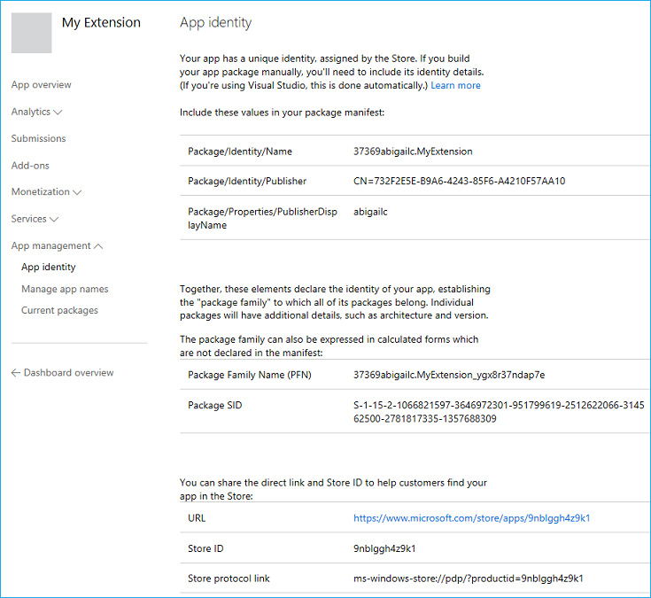
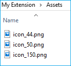

# Создание и тестирование пакета AppX расширения Microsoft Edge  

[!INCLUDE [deprecation-note](../../includes/deprecation-note.md)]  

Расширения Microsoft Edge упакованы как AppX, аналогично тому, как упакованы универсальные приложения для Windows. В юбилейном обновлении Windows 10 для AppX была введена новая схема, которая позволяет AppX включать расширение Microsoft Edge в качестве содержимого.

Если вы уже знаете, как создаются расширения Microsoft Edge AppX, вы можете перейти к использованию [ManifoldJS](./using-manifoldjs-to-package-extensions.md) для упаковки расширения, чтобы узнать, как использовать средство на основе Node.js, чтобы сделать все это за вас!

> [!NOTE]
> Отправка расширения Microsoft Edge в Microsoft Store в настоящее время является ограниченной возможностью. После создания, упаковки и тестирования расширения отправьте запрос на форму отправки [расширения.](https://aka.ms/extension-request)

## Подготовка папки отправки

Чтобы подготовить расширение к отправке, необходимо создать папку со следующей структурой:


В корне папки необходимо включить AppXManifest.xml файла. Этот файл используется для указания содержимого и макета пакета.

У вас также должна быть папка Assets, содержаная ресурсы пользовательского интерфейса, которые будут использоваться в Microsoft Store, и папка Extension, содержаная файлы расширения (сценарии, значки и т. д.).

> [!IMPORTANT]
> Для пакета можно создать другую структуру папок, но структура папок должна соответствовать значениям AppXManifest.

### AppXManifest.xml
Файл AppXManifest — это XML-документ, содержащий сведения, необходимые системе для развертывания, отображения или обновления приложения для Windows. Этот файл также включает удостоверение пакета, возможности и визуальные элементы. Каждый пакет приложения должен включать один файл AppXManifest.

Разработчики могут использовать следующий шаблон для своего AppXManifest.xml файла:

```xml
<?xml version="1.0" encoding="utf-8"?>
<Package
  xmlns="http://schemas.microsoft.com/appx/manifest/foundation/windows10"
  xmlns:uap="http://schemas.microsoft.com/appx/manifest/uap/windows10"
  xmlns:uap3="http://schemas.microsoft.com/appx/manifest/uap/windows10/3"
  IgnorableNamespaces="uap3">

  <Identity
    Name="[REPLACE WITH PACKAGE/IDENTITYNAME]"
    Publisher="[REPLACE WITH PACKAGE/IDENTITY/PUBLISHER]"
    Version="[REPLACE WITH PACKAGE VERSION in the form X.X.X.0]"/>

  <Properties>
    <DisplayName>[REPLACE WITH RESERVED STORE NAME]</DisplayName>
    <PublisherDisplayName>[REPLACE WITH PACKAGE/PROPERTIES/PUBLISHERDISPLAYNAME]</PublisherDisplayName>
    <Logo>[REPLACE WITH RELATIVE PATH TO 50x50 ICON]</Logo>
  </Properties>

  <Dependencies>
    <TargetDeviceFamily Name="Windows.Desktop"
      MinVersion="10.0.14393.0"
      MaxVersionTested="10.0.14800.0" />
  </Dependencies>

  <Resources>
    <Resource Language="en-us"/>
  </Resources>

  <Applications>
    <Application Id="App">
      <uap:VisualElements
        AppListEntry="none"
        DisplayName="[REPLACE WITH RESERVED STORE NAME]"
        Square150x150Logo="[REPLACE WITH RELATIVE PATH TO 150x150 ICON]"
        Square44x44Logo="[REPLACE WITH RELATIVE PATH TO 44x44 ICON]"
        Description="This is the description of the extension"
        BackgroundColor="white">
      </uap:VisualElements>
    <Extensions>
    <uap3:Extension Category="windows.appExtension">
    <uap3:AppExtension Name="com.microsoft.edge.extension"
        Id="EdgeExtension"
        PublicFolder="Extension"
      DisplayName="[REPLACE WITH RESERVED STORE NAME]">
    </uap3:AppExtension>
    </uap3:Extension>
    </Extensions>
 </Application>
</Applications>
</Package>
```  

#### Значения шаблона удостоверения приложения
Зарезервировать имя расширения через Центр разработчиков для Windows, вы сможете найти необходимые сведения об идентификаторе пакета, необходимые для замены следующих значений в AppXManifest.xml: [](./extensions-in-the-windows-dev-center.md#name-reservation)

-   `Name`
-   `Publisher`
-   `DisplayName`
-   `PublisherDisplayName`

Чтобы получить доступ к странице удостоверения приложения, с помощью следующих действий:

1.  Перейдите в [Центр разработчиков для Windows.](https://developer.microsoft.com/windows/)
2.  Во sign in to your developer account.
3.  Перейдите на панель мониторинга.
4.  Выберите имя расширения.
    
    
    
5.  Перейдите на страницу удостоверения приложения, которая находится в разделе управления приложениями (после регистрации приложения).
    
    
    
Теперь можно заполнить шаблон AppXManifest значениями со страницы удостоверения приложения, как указано в шаблоне:

```xml
<Identity
  Name="37369abigailc.MyExtension"
  Publisher="CN=732F2E5E-B9A6-4243-85F6-A4210F57AA10"
  Version="[REPLACE WITH PACKAGE VERSION in the form X.X.X.0]" />

<Properties>
  <DisplayName>My Extension</DisplayName>
  <PublisherDisplayName>abigailc</PublisherDisplayName>
  <Logo>[REPLACE WITH RELATIVE PATH TO 50x50 ICON]</Logo>
</Properties>
```  

#### Значения шаблона манифеста JSON
Некоторые значения в AppXManifest должны соответствовать значениям, определенным в манифесте JSON. Обновите следующие значения в appxmanifest.xml на основе манифеста JSON расширения:

-   `Version` — Это версия, указанная в манифесте JSON расширения. Строка должна соответствовать формату X.X.X.X, где последнее integer должно быть 0. Например: 1.2.3.0
    
    ```xml
    <Identity
         Name="37369abigailc.MyExtension"
         Publisher="CN=732F2E5E-B9A6-4243-85F6-A4210F57AA10"
         Version="1.0.0.0" />
    ```  
    
-   `Description` - Это копия описания в манифесте JSON расширения.
    
    ```xml
    <uap:VisualElements
         AppListEntry="none"
         DisplayName="My Extension"
         Square150x150Logo="[REPLACE WITH RELATIVE PATH TO 150x150 ICON]"
         Square44x44Logo="[REPLACE WITH RELATIVE PATH TO 44x44 ICON]"
         Description="This extension will allow you to quickly print by clicking the browser action."
         BackgroundColor="white">
    </uap:VisualElements>
    ```  
    
### Папка Assets

В папке Assets вам потребуется три разных размера значка. Эти значки будут использоваться в Microsoft Store и пользовательском интерфейсе Windows. Дополнительные сведения об этих значках см. в руководстве [по проектированию.](./../design.md#icons-for-packaging)



После создания необходимых ресурсов пользовательского интерфейса обновим AppXManifest.xml, указав на правильные файлы:

-   44 x 44
    
    ```xml
    Square44x44Logo="Assets/icon_44.png"
    ```  
    
-   50x50
    
    ```xml
    <Logo>Assets/icon_50.png</Logo>
    ```  
    
-   150 x 150
    
    ```xml
    Square150x150Logo="Assets/icon_150.png"
    ```  
    
### Папка расширения
Скопируйте файлы расширения (сохраняя структуру папок) в папку Extension. `manifest.json`Убедитесь, что папка Extension находится в корневой папке.


### Поддержка более одного локаула
Если расширение поддерживает несколько языков, можно настроить пакет AppX со всеми нужными языковыми настройками, чтобы в Microsoft Store появились правильный локализованный значок и описание. Дополнительные [сведения см.](./localizing-extension-packages.md) в дополнительных сведениях о локализации пакетов расширений.

### Создание Appx

Чтобы создать Appx, необходимо найти путь для makeappx. Обычно он находится в следующем расположении, если вы на 64-битной машине.

`C:\Program Files (x86)\Windows Kits\10\bin\x64`

Выполните следующую команду, чтобы создать пакет AppX для расширения:

`[Path to makeappx] makeappx pack /h SHA256 /d [Path to package folder created in #1] /p [Path to the appx file that you want to create]`

После заполнения путей это должно выглядеть так:

`C:\Program Files (x86)\Windows Kits\10\bin\x64>makeappx.exe pack /h SHA256 /d "C:\Extension\My Extension" /p C:\Extension\MyExtension.appx`

### Распаковка Appx
Вам может потребоваться распаковать ранее созданный AppX и использовать его в качестве отправной точки для следующей итерации расширения или подтверждения правильности создания AppX.

Для этого можно выполнить следующую команду, чтобы распаковать пакет AppX расширения Microsoft Edge:

```shell
[Path to makeappx] makeappx unpack /v /p [Path to appx file you want to unpack] /d [Path to the location where you want to create the package folder]
```  

При заполнении должно выглядеть так:

```text
C:\Program Files (x86)\Windows Kits\10\bin\x64>makeappx.exe unpack /v /p "C:\Extension\MyExtension.appx" /d "C:\Extension\My Extension"
```  

## Тестирование пакета AppX

Вы можете протестировать пакет AppX расширения Microsoft Edge, разгрузив его в Microsoft Edge. Загрузка пакета AppX расширения аналогична загрузке неоконтружаемой версии универсального приложения для Windows. Вам потребуется создать сертификат для подписи пакета, а затем добавить пакет в Windows.

### Подпись

Сведения [о процессе](https://msdn.microsoft.com/library/windows/desktop/jj835832.aspx) подписывания и сертификации пакетов см. в сведениях о том, как создать сертификат подписи пакета приложения и как подписать пакет приложения с помощью [SignTool.](https://msdn.microsoft.com/library/windows/desktop/jj835835.aspx)

> [!NOTE]
> Вам не нужно подписывать пакет расширения перед его отправкой в Microsoft Store; Процесс присоединения к Магазину поможет вам это сделать!

После подписывания пакета созданным сертификатом локальный компьютер по-прежнему не доверяет ему при развертывании пакетов приложений, пока не установит его в хранилище доверенных сертификатов на локальном компьютере. Для этого можно использовать Certutil.exe, который поставляется с Windows.

Чтобы установить сертификаты с WindowsCertutil.exe, запустите Cmd.exe от прав администратора и запустите следующую команду:

```shell
Certutil -addStore TrustedPeople MyKey.cer
```  

После того как сертификаты больше не используются, рекомендуется удалить их, выдав следующую команду из командной команды администратора:

```shell
Certutil -delStore TrustedPeople certID
```  

CertID — это серийный номер сертификата. Чтобы определить серийный номер сертификата, запустите следующую команду:

```shell
Certutil -store TrustedPeople
```  

### Развертывание
Вы можете развернуть пакет Microsoft Edge Extension AppX, выдав следующую команду в PowerShell (от учетной записи администратора):

```powershell
Add-AppxPackage [path to AppX]
```  

## Автоматическое тестирование с помощью WebDriver

В юбилейном обновлении вы можете программным способом загрузку расширения в Microsoft Edge с помощью WebDriver, что позволяет автоматически тестировать расширения при запуске Microsoft Edge в режиме WebDriver. Это позволит вам настроить автоматические тесты для любого расширения, которое управляет содержимым на странице, и убедиться, что происходит правильное поведение.

Для загрузки неогрузки расширения для автоматического тестирования необходимо сохранить папку расширения в папке `%LOCALAPPDATA%\Packages\Microsoft.MicrosoftEdge_8wekyb3d8bbwe\LocalState\` . После того как расширение находится в каталоге, необходимо создать объект и добавить в него `LocalState` [`EdgeOptions`](https://seleniumhq.github.io/selenium/docs/api/dotnet/html/T_OpenQA_Selenium_Edge_EdgeOptions.htm) `extensionPaths` возможность. Значение этой возможности — это массив абсолютных путей к расширениям (в каталоге), которые необходимо загрузить на стороне при начале работы Microsoft Edge в режиме `LocalState` WebDriver.

Полный пример расширений [загрузки](https://github.com/scottlow/Ignite2016/blob/master/Ignite%202016%20WebDriver%20Demo/IgniteWebDriverDemo/Program.cs) в Microsoft Edge с помощью WebDriver можно посмотреть в следующем файле C#.
