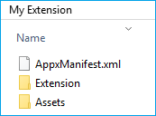
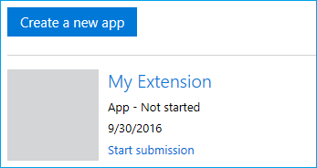
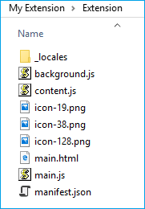

# <span data-ttu-id="d14cc-104">Создание и тестирование пакета AppX расширения Microsoft Edge</span><span class="sxs-lookup"><span data-stu-id="d14cc-104">Creating and testing a Microsoft Edge extension AppX package</span></span>  

[!INCLUDE [deprecation-note](../../includes/deprecation-note.md)]  

<span data-ttu-id="d14cc-105">Расширения Microsoft Edge упакованы как AppX, аналогично тому, как упакованы универсальные приложения для Windows.</span><span class="sxs-lookup"><span data-stu-id="d14cc-105">Microsoft Edge extensions are packaged as AppX, similar to how Universal Windows Apps are packaged.</span></span> <span data-ttu-id="d14cc-106">В юбилейном обновлении Windows 10 для AppX была введена новая схема, которая позволяет AppX включать расширение Microsoft Edge в качестве содержимого.</span><span class="sxs-lookup"><span data-stu-id="d14cc-106">As of Windows 10 Anniversary Update, a new schema has been introduced for AppX that allows an AppX to include a Microsoft Edge extension as its content.</span></span>

<span data-ttu-id="d14cc-107">Если вы уже знаете, как создаются расширения Microsoft Edge AppX, вы можете перейти к использованию [ManifoldJS](./using-manifoldjs-to-package-extensions.md) для упаковки расширения, чтобы узнать, как использовать средство на основе Node.js, чтобы сделать все это за вас!</span><span class="sxs-lookup"><span data-stu-id="d14cc-107">If you already know how Microsoft Edge extension AppXs are created, you can skip to [Using ManifoldJS to package extension](./using-manifoldjs-to-package-extensions.md) to learn how to use a Node.js based tool to do all of this for you!</span></span>

> [!NOTE]
> <span data-ttu-id="d14cc-108">Отправка расширения Microsoft Edge в Microsoft Store в настоящее время является ограниченной возможностью.</span><span class="sxs-lookup"><span data-stu-id="d14cc-108">Submitting a Microsoft Edge extension to the Microsoft Store is currently a restricted capability.</span></span> <span data-ttu-id="d14cc-109">После создания, упаковки и тестирования расширения отправьте запрос на форму отправки [расширения.](https://aka.ms/extension-request)</span><span class="sxs-lookup"><span data-stu-id="d14cc-109">Once you've created, packaged and tested your extension, please submit a request on our [extension submission form](https://aka.ms/extension-request).</span></span>

## <span data-ttu-id="d14cc-110">Подготовка папки отправки</span><span class="sxs-lookup"><span data-stu-id="d14cc-110">Preparing the submission folder</span></span>

<span data-ttu-id="d14cc-111">Чтобы подготовить расширение к отправке, необходимо создать папку со следующей структурой:</span><span class="sxs-lookup"><span data-stu-id="d14cc-111">To prepare your extension for submission, you need to create a folder with the following structure:</span></span>



<span data-ttu-id="d14cc-114">В корне папки необходимо включить AppXManifest.xml файла.</span><span class="sxs-lookup"><span data-stu-id="d14cc-114">At the root of the folder, you should include an AppXManifest.xml file.</span></span> <span data-ttu-id="d14cc-115">Этот файл используется для указания содержимого и макета пакета.</span><span class="sxs-lookup"><span data-stu-id="d14cc-115">This file is used to specify the contents and layout of the package.</span></span>

<span data-ttu-id="d14cc-116">У вас также должна быть папка Assets, содержаная ресурсы пользовательского интерфейса, которые будут использоваться в Microsoft Store, и папка Extension, содержаная файлы расширения (сценарии, значки и т. д.).</span><span class="sxs-lookup"><span data-stu-id="d14cc-116">You should also have an Assets folder which contains the UI assets to be used in the Microsoft Store, and an Extension folder that contains your extension's files (scripts, icons, etc).</span></span>

> [!IMPORTANT]
> <span data-ttu-id="d14cc-117">Для пакета можно создать другую структуру папок, но структура папок должна соответствовать значениям AppXManifest.</span><span class="sxs-lookup"><span data-stu-id="d14cc-117">You can create a different folder structure for your package, but the folder structure must match the AppXManifest values.</span></span>

### <span data-ttu-id="d14cc-118">AppXManifest.xml</span><span class="sxs-lookup"><span data-stu-id="d14cc-118">AppXManifest.xml</span></span>
<span data-ttu-id="d14cc-119">Файл AppXManifest — это XML-документ, содержащий сведения, необходимые системе для развертывания, отображения или обновления приложения для Windows.</span><span class="sxs-lookup"><span data-stu-id="d14cc-119">The AppXManifest file is an XML document that contains info the system needs to deploy, display, or update a Windows app.</span></span> <span data-ttu-id="d14cc-120">Этот файл также включает удостоверение пакета, возможности и визуальные элементы.</span><span class="sxs-lookup"><span data-stu-id="d14cc-120">This file also includes package identity, capabilities, and visual elements.</span></span> <span data-ttu-id="d14cc-121">Каждый пакет приложения должен включать один файл AppXManifest.</span><span class="sxs-lookup"><span data-stu-id="d14cc-121">Every app package must include one AppXManifest file.</span></span>

<span data-ttu-id="d14cc-122">Разработчики могут использовать следующий шаблон для своего AppXManifest.xml файла:</span><span class="sxs-lookup"><span data-stu-id="d14cc-122">Developers can use the following template for their AppXManifest.xml file:</span></span>

```xml
<?xml version="1.0" encoding="utf-8"?>
<Package
  xmlns="http://schemas.microsoft.com/appx/manifest/foundation/windows10"
  xmlns:uap="http://schemas.microsoft.com/appx/manifest/uap/windows10"
  xmlns:uap3="http://schemas.microsoft.com/appx/manifest/uap/windows10/3"
  IgnorableNamespaces="uap3">

  <Identity
    Name="[REPLACE WITH PACKAGE/IDENTITYNAME]"
    Publisher="[REPLACE WITH PACKAGE/IDENTITY/PUBLISHER]"
    Version="[REPLACE WITH PACKAGE VERSION in the form X.X.X.0]"/>

  <Properties>
    <DisplayName>[REPLACE WITH RESERVED STORE NAME]</DisplayName>
    <PublisherDisplayName>[REPLACE WITH PACKAGE/PROPERTIES/PUBLISHERDISPLAYNAME]</PublisherDisplayName>
    <Logo>[REPLACE WITH RELATIVE PATH TO 50x50 ICON]</Logo>
  </Properties>

  <Dependencies>
    <TargetDeviceFamily Name="Windows.Desktop"
      MinVersion="10.0.14393.0"
      MaxVersionTested="10.0.14800.0" />
  </Dependencies>

  <Resources>
    <Resource Language="en-us"/>
  </Resources>

  <Applications>
    <Application Id="App">
      <uap:VisualElements
        AppListEntry="none"
        DisplayName="[REPLACE WITH RESERVED STORE NAME]"
        Square150x150Logo="[REPLACE WITH RELATIVE PATH TO 150x150 ICON]"
        Square44x44Logo="[REPLACE WITH RELATIVE PATH TO 44x44 ICON]"
        Description="This is the description of the extension"
        BackgroundColor="white">
      </uap:VisualElements>
    <Extensions>
    <uap3:Extension Category="windows.appExtension">
    <uap3:AppExtension Name="com.microsoft.edge.extension"
        Id="EdgeExtension"
        PublicFolder="Extension"
      DisplayName="[REPLACE WITH RESERVED STORE NAME]">
    </uap3:AppExtension>
    </uap3:Extension>
    </Extensions>
 </Application>
</Applications>
</Package>
```  

#### <span data-ttu-id="d14cc-123">Значения шаблона удостоверения приложения</span><span class="sxs-lookup"><span data-stu-id="d14cc-123">App identity template values</span></span>
<span data-ttu-id="d14cc-124">Зарезервировать имя расширения через Центр разработчиков для Windows, вы сможете найти необходимые сведения об идентификаторе пакета, необходимые для замены следующих значений в AppXManifest.xml: [](./extensions-in-the-windows-dev-center.md#name-reservation)</span><span class="sxs-lookup"><span data-stu-id="d14cc-124">Once you've [reserved the name of your extension](./extensions-in-the-windows-dev-center.md#name-reservation) through the Windows Dev Center, you'll be able to find the necessary package identity information needed to replace the following values in AppXManifest.xml:</span></span>

-   `Name`
-   `Publisher`
-   `DisplayName`
-   `PublisherDisplayName`

<span data-ttu-id="d14cc-125">Чтобы получить доступ к странице удостоверения приложения, с помощью следующих действий:</span><span class="sxs-lookup"><span data-stu-id="d14cc-125">You can access your App identity page using the following steps:</span></span>

1.  <span data-ttu-id="d14cc-126">Перейдите в [Центр разработчиков для Windows.](https://developer.microsoft.com/windows/)</span><span class="sxs-lookup"><span data-stu-id="d14cc-126">Navigate to [Windows Dev Center](https://developer.microsoft.com/windows/).</span></span>
2.  <span data-ttu-id="d14cc-127">Во sign in to your developer account.</span><span class="sxs-lookup"><span data-stu-id="d14cc-127">Sign in to your developer account.</span></span>
3.  <span data-ttu-id="d14cc-128">Перейдите на панель мониторинга.</span><span class="sxs-lookup"><span data-stu-id="d14cc-128">Navigate to the Dashboard.</span></span>
4.  <span data-ttu-id="d14cc-129">Выберите имя расширения.</span><span class="sxs-lookup"><span data-stu-id="d14cc-129">Select the name of your extension.</span></span>
    
    
    
5.  <span data-ttu-id="d14cc-131">Перейдите на страницу удостоверения приложения, которая находится в разделе управления приложениями (после регистрации приложения).</span><span class="sxs-lookup"><span data-stu-id="d14cc-131">Navigate to the App identity page which is under the App management section (after you've registered your app).</span></span>
    
    
    
<span data-ttu-id="d14cc-133">Теперь можно заполнить шаблон AppXManifest значениями со страницы удостоверения приложения, как указано в шаблоне:</span><span class="sxs-lookup"><span data-stu-id="d14cc-133">You can now populate the AppXManifest template with values from the App identity page, as indicated in the template:</span></span>

```xml
<Identity
  Name="37369abigailc.MyExtension"
  Publisher="CN=732F2E5E-B9A6-4243-85F6-A4210F57AA10"
  Version="[REPLACE WITH PACKAGE VERSION in the form X.X.X.0]" />

<Properties>
  <DisplayName>My Extension</DisplayName>
  <PublisherDisplayName>abigailc</PublisherDisplayName>
  <Logo>[REPLACE WITH RELATIVE PATH TO 50x50 ICON]</Logo>
</Properties>
```  

#### <span data-ttu-id="d14cc-134">Значения шаблона манифеста JSON</span><span class="sxs-lookup"><span data-stu-id="d14cc-134">JSON manifest template values</span></span>
<span data-ttu-id="d14cc-135">Некоторые значения в AppXManifest должны соответствовать значениям, определенным в манифесте JSON.</span><span class="sxs-lookup"><span data-stu-id="d14cc-135">Some values in the AppXManifest need to match those that are defined in the JSON manifest.</span></span> <span data-ttu-id="d14cc-136">Обновите следующие значения в appxmanifest.xml на основе манифеста JSON расширения:</span><span class="sxs-lookup"><span data-stu-id="d14cc-136">Please update the following values in appxmanifest.xml based on your extension JSON manifest:</span></span>

-   `Version` <span data-ttu-id="d14cc-137">— Это версия, указанная в манифесте JSON расширения.</span><span class="sxs-lookup"><span data-stu-id="d14cc-137">- This is the version listed in your extension's JSON manifest.</span></span> <span data-ttu-id="d14cc-138">Строка должна соответствовать формату X.X.X.X, где последнее integer должно быть 0.</span><span class="sxs-lookup"><span data-stu-id="d14cc-138">The string needs to match the X.X.X.X format where the last integer has to be 0.</span></span> <span data-ttu-id="d14cc-139">Например:</span><span class="sxs-lookup"><span data-stu-id="d14cc-139">E.g.</span></span> <span data-ttu-id="d14cc-140">1.2.3.0</span><span class="sxs-lookup"><span data-stu-id="d14cc-140">1.2.3.0</span></span>
    
    ```xml
    <Identity
         Name="37369abigailc.MyExtension"
         Publisher="CN=732F2E5E-B9A6-4243-85F6-A4210F57AA10"
         Version="1.0.0.0" />
    ```  
    
-   `Description` <span data-ttu-id="d14cc-141">- Это копия описания в манифесте JSON расширения.</span><span class="sxs-lookup"><span data-stu-id="d14cc-141">- This is a copy of the description in your extension's JSON manifest.</span></span>
    
    ```xml
    <uap:VisualElements
         AppListEntry="none"
         DisplayName="My Extension"
         Square150x150Logo="[REPLACE WITH RELATIVE PATH TO 150x150 ICON]"
         Square44x44Logo="[REPLACE WITH RELATIVE PATH TO 44x44 ICON]"
         Description="This extension will allow you to quickly print by clicking the browser action."
         BackgroundColor="white">
    </uap:VisualElements>
    ```  
    
### <span data-ttu-id="d14cc-142">Папка Assets</span><span class="sxs-lookup"><span data-stu-id="d14cc-142">Assets folder</span></span>

<span data-ttu-id="d14cc-143">В папке Assets вам потребуется три разных размера значка.</span><span class="sxs-lookup"><span data-stu-id="d14cc-143">Within the Assets folder you will need three different icon sizes.</span></span> <span data-ttu-id="d14cc-144">Эти значки будут использоваться в Microsoft Store и пользовательском интерфейсе Windows.</span><span class="sxs-lookup"><span data-stu-id="d14cc-144">These icons will be used in the Microsoft Store and the Windows UI.</span></span> <span data-ttu-id="d14cc-145">Дополнительные сведения об этих значках см. в руководстве [по проектированию.](./../design.md#icons-for-packaging)</span><span class="sxs-lookup"><span data-stu-id="d14cc-145">For more information on these icons, see the [Design](./../design.md#icons-for-packaging) guide.</span></span>


<span data-ttu-id="d14cc-147">После создания необходимых ресурсов пользовательского интерфейса обновим AppXManifest.xml, указав на правильные файлы:</span><span class="sxs-lookup"><span data-stu-id="d14cc-147">Once you've created the necessary UI assets, update AppXManifest.xml to point to the correct files:</span></span>

-   <span data-ttu-id="d14cc-148">44 x 44</span><span class="sxs-lookup"><span data-stu-id="d14cc-148">44x44</span></span>
    
    ```xml
    Square44x44Logo="Assets/icon_44.png"
    ```  
    
-   <span data-ttu-id="d14cc-149">50x50</span><span class="sxs-lookup"><span data-stu-id="d14cc-149">50x50</span></span>
    
    ```xml
    <Logo>Assets/icon_50.png</Logo>
    ```  
    
-   <span data-ttu-id="d14cc-150">150 x 150</span><span class="sxs-lookup"><span data-stu-id="d14cc-150">150x150</span></span>
    
    ```xml
    Square150x150Logo="Assets/icon_150.png"
    ```  
    
### <span data-ttu-id="d14cc-151">Папка расширения</span><span class="sxs-lookup"><span data-stu-id="d14cc-151">Extension folder</span></span>
<span data-ttu-id="d14cc-152">Скопируйте файлы расширения (сохраняя структуру папок) в папку Extension.</span><span class="sxs-lookup"><span data-stu-id="d14cc-152">Copy your extension files (keeping the folder structure) into the Extension folder.</span></span> <span data-ttu-id="d14cc-153">`manifest.json`Убедитесь, что папка Extension находится в корневой папке.</span><span class="sxs-lookup"><span data-stu-id="d14cc-153">Make sure `manifest.json` is at the root your Extension folder.</span></span>



### <span data-ttu-id="d14cc-155">Поддержка более одного локаула</span><span class="sxs-lookup"><span data-stu-id="d14cc-155">Supporting more than one locale</span></span>
<span data-ttu-id="d14cc-156">Если расширение поддерживает несколько языков, можно настроить пакет AppX со всеми нужными языковыми настройками, чтобы в Microsoft Store появились правильный локализованный значок и описание.</span><span class="sxs-lookup"><span data-stu-id="d14cc-156">If your extension supports more than one language, you may want to configure the AppX package with all the locales that you need so that the correct localized icon and description appear in the Microsoft Store.</span></span> <span data-ttu-id="d14cc-157">Дополнительные [сведения см.](./localizing-extension-packages.md) в дополнительных сведениях о локализации пакетов расширений.</span><span class="sxs-lookup"><span data-stu-id="d14cc-157">See [Localizing extension packages](./localizing-extension-packages.md) for more information.</span></span>

### <span data-ttu-id="d14cc-158">Создание Appx</span><span class="sxs-lookup"><span data-stu-id="d14cc-158">Creating an Appx</span></span>

<span data-ttu-id="d14cc-159">Чтобы создать Appx, необходимо найти путь для makeappx.</span><span class="sxs-lookup"><span data-stu-id="d14cc-159">To create an Appx, you'll need to find the path for makeappx.</span></span> <span data-ttu-id="d14cc-160">Обычно он находится в следующем расположении, если вы на 64-битной машине.</span><span class="sxs-lookup"><span data-stu-id="d14cc-160">This is usually located in the following location if you're on a 64-bit machine.</span></span>

`C:\Program Files (x86)\Windows Kits\10\bin\x64`

<span data-ttu-id="d14cc-161">Выполните следующую команду, чтобы создать пакет AppX для расширения:</span><span class="sxs-lookup"><span data-stu-id="d14cc-161">Execute the following command to create the AppX package for your extension:</span></span>

`[Path to makeappx] makeappx pack /h SHA256 /d [Path to package folder created in #1] /p [Path to the appx file that you want to create]`

<span data-ttu-id="d14cc-162">После заполнения путей это должно выглядеть так:</span><span class="sxs-lookup"><span data-stu-id="d14cc-162">This should look something like this once you've filled in the paths:</span></span>

`C:\Program Files (x86)\Windows Kits\10\bin\x64>makeappx.exe pack /h SHA256 /d "C:\Extension\My Extension" /p C:\Extension\MyExtension.appx`

### <span data-ttu-id="d14cc-163">Распаковка Appx</span><span class="sxs-lookup"><span data-stu-id="d14cc-163">Unpacking an Appx</span></span>
<span data-ttu-id="d14cc-164">Вам может потребоваться распаковать ранее созданный AppX и использовать его в качестве отправной точки для следующей итерации расширения или подтверждения правильности создания AppX.</span><span class="sxs-lookup"><span data-stu-id="d14cc-164">You may want to unpack a previously generated AppX and use it as a starting point for the next iteration of your extension or to confirm that the AppX was created correctly.</span></span>

<span data-ttu-id="d14cc-165">Для этого можно выполнить следующую команду, чтобы распаковать пакет AppX расширения Microsoft Edge:</span><span class="sxs-lookup"><span data-stu-id="d14cc-165">To do this, you can execute the following command to unpack the AppX package of your Microsoft Edge extension:</span></span>

```shell
[Path to makeappx] makeappx unpack /v /p [Path to appx file you want to unpack] /d [Path to the location where you want to create the package folder]
```  

<span data-ttu-id="d14cc-166">При заполнении должно выглядеть так:</span><span class="sxs-lookup"><span data-stu-id="d14cc-166">This should look something like this when filled out:</span></span>

```text
C:\Program Files (x86)\Windows Kits\10\bin\x64>makeappx.exe unpack /v /p "C:\Extension\MyExtension.appx" /d "C:\Extension\My Extension"
```  

## <span data-ttu-id="d14cc-167">Тестирование пакета AppX</span><span class="sxs-lookup"><span data-stu-id="d14cc-167">Testing an AppX package</span></span>

<span data-ttu-id="d14cc-168">Вы можете протестировать пакет AppX расширения Microsoft Edge, разгрузив его в Microsoft Edge.</span><span class="sxs-lookup"><span data-stu-id="d14cc-168">You can test your Microsoft Edge extension AppX package by sideloading it in Microsoft Edge.</span></span> <span data-ttu-id="d14cc-169">Загрузка пакета AppX расширения аналогична загрузке неоконтружаемой версии универсального приложения для Windows.</span><span class="sxs-lookup"><span data-stu-id="d14cc-169">Sideloading the extension AppX package is similar to sideloading a Universal Windows app.</span></span> <span data-ttu-id="d14cc-170">Вам потребуется создать сертификат для подписи пакета, а затем добавить пакет в Windows.</span><span class="sxs-lookup"><span data-stu-id="d14cc-170">You will need to create a certificate for signing the package, and then add the package to Windows.</span></span>

### <span data-ttu-id="d14cc-171">Подпись</span><span class="sxs-lookup"><span data-stu-id="d14cc-171">Signing</span></span>

<span data-ttu-id="d14cc-172">Сведения [о процессе](https://msdn.microsoft.com/library/windows/desktop/jj835832.aspx) подписывания и сертификации пакетов см. в сведениях о том, как создать сертификат подписи пакета приложения и как подписать пакет приложения с помощью [SignTool.](https://msdn.microsoft.com/library/windows/desktop/jj835835.aspx)</span><span class="sxs-lookup"><span data-stu-id="d14cc-172">See [How to create an app package signing certificate](https://msdn.microsoft.com/library/windows/desktop/jj835832.aspx) and [How to sign an app package using SignTool](https://msdn.microsoft.com/library/windows/desktop/jj835835.aspx) for info on the signing and certification process for packages.</span></span>

> [!NOTE]
> <span data-ttu-id="d14cc-173">Вам не нужно подписывать пакет расширения перед его отправкой в Microsoft Store; Процесс присоединения к Магазину поможет вам это сделать!</span><span class="sxs-lookup"><span data-stu-id="d14cc-173">You do not need to sign an extension package before submitting it to the Microsoft Store; the Store ingestion process will take care of that for you!</span></span>

<span data-ttu-id="d14cc-174">После подписывания пакета созданным сертификатом локальный компьютер по-прежнему не доверяет ему при развертывании пакетов приложений, пока не установит его в хранилище доверенных сертификатов на локальном компьютере.</span><span class="sxs-lookup"><span data-stu-id="d14cc-174">After you've signed the package with the certificate that you created, the certificate is still not trusted by the local machine for deployment of app packages until you install it into the trusted certificates store of the local computer.</span></span> <span data-ttu-id="d14cc-175">Для этого можно использовать Certutil.exe, который поставляется с Windows.</span><span class="sxs-lookup"><span data-stu-id="d14cc-175">You can use Certutil.exe, which comes with Windows to do this.</span></span>

<span data-ttu-id="d14cc-176">Чтобы установить сертификаты с WindowsCertutil.exe, запустите Cmd.exe от прав администратора и запустите следующую команду:</span><span class="sxs-lookup"><span data-stu-id="d14cc-176">To install certificates with WindowsCertutil.exe, run Cmd.exe as administrator and run the following command:</span></span>

```shell
Certutil -addStore TrustedPeople MyKey.cer
```  

<span data-ttu-id="d14cc-177">После того как сертификаты больше не используются, рекомендуется удалить их, выдав следующую команду из командной команды администратора:</span><span class="sxs-lookup"><span data-stu-id="d14cc-177">Once the certificates are no longer in use, it is recommended that you remove them by running the following command from an administrator command prompt:</span></span>

```shell
Certutil -delStore TrustedPeople certID
```  

<span data-ttu-id="d14cc-178">CertID — это серийный номер сертификата.</span><span class="sxs-lookup"><span data-stu-id="d14cc-178">The certID is the serial number of the certificate.</span></span> <span data-ttu-id="d14cc-179">Чтобы определить серийный номер сертификата, запустите следующую команду:</span><span class="sxs-lookup"><span data-stu-id="d14cc-179">To determine the certificate serial number, run the following command:</span></span>

```shell
Certutil -store TrustedPeople
```  

### <span data-ttu-id="d14cc-180">Развертывание</span><span class="sxs-lookup"><span data-stu-id="d14cc-180">Deploying</span></span>
<span data-ttu-id="d14cc-181">Вы можете развернуть пакет Microsoft Edge Extension AppX, выдав следующую команду в PowerShell (от учетной записи администратора):</span><span class="sxs-lookup"><span data-stu-id="d14cc-181">You can deploy the Microsoft Edge Extension AppX package by running the following command in PowerShell (as administrator):</span></span>

```powershell
Add-AppxPackage [path to AppX]
```  

## <span data-ttu-id="d14cc-182">Автоматическое тестирование с помощью WebDriver</span><span class="sxs-lookup"><span data-stu-id="d14cc-182">Automated testing with WebDriver</span></span>

<span data-ttu-id="d14cc-183">В юбилейном обновлении вы можете программным способом загрузку расширения в Microsoft Edge с помощью WebDriver, что позволяет автоматически тестировать расширения при запуске Microsoft Edge в режиме WebDriver.</span><span class="sxs-lookup"><span data-stu-id="d14cc-183">As of the Anniversary Update, you can programmatically sideload your extension in Microsoft Edge with WebDriver, enabling automated testing of extensions when Microsoft Edge is launched in WebDriver mode.</span></span> <span data-ttu-id="d14cc-184">Это позволит вам настроить автоматические тесты для любого расширения, которое управляет содержимым на странице, и убедиться, что происходит правильное поведение.</span><span class="sxs-lookup"><span data-stu-id="d14cc-184">This will allow you to set up automated tests for any extension that manipulates content on a page and verify that the correct behavior is exhibited.</span></span>

<span data-ttu-id="d14cc-185">Для загрузки неогрузки расширения для автоматического тестирования необходимо сохранить папку расширения в папке `%LOCALAPPDATA%\Packages\Microsoft.MicrosoftEdge_8wekyb3d8bbwe\LocalState\` .</span><span class="sxs-lookup"><span data-stu-id="d14cc-185">To sideload your extension for automated testing, you'll need to store your extension's folder under `%LOCALAPPDATA%\Packages\Microsoft.MicrosoftEdge_8wekyb3d8bbwe\LocalState\`.</span></span> <span data-ttu-id="d14cc-186">После того как расширение находится в каталоге, необходимо создать объект и добавить в него `LocalState` [`EdgeOptions`](https://seleniumhq.github.io/selenium/docs/api/dotnet/html/T_OpenQA_Selenium_Edge_EdgeOptions.htm) `extensionPaths` возможность.</span><span class="sxs-lookup"><span data-stu-id="d14cc-186">Once your extension is in the `LocalState` directory, you'll need to create an [`EdgeOptions`](https://seleniumhq.github.io/selenium/docs/api/dotnet/html/T_OpenQA_Selenium_Edge_EdgeOptions.htm) object, and add the `extensionPaths` capability to it.</span></span> <span data-ttu-id="d14cc-187">Значение этой возможности — это массив абсолютных путей к расширениям (в каталоге), которые необходимо загрузить на стороне при начале работы Microsoft Edge в режиме `LocalState` WebDriver.</span><span class="sxs-lookup"><span data-stu-id="d14cc-187">The value of this capability is an array of absolute paths to the extensions (in the `LocalState` directory) you wish to have side loaded when Microsoft Edge starts in WebDriver mode.</span></span>

<span data-ttu-id="d14cc-188">Полный пример расширений [загрузки](https://github.com/scottlow/Ignite2016/blob/master/Ignite%202016%20WebDriver%20Demo/IgniteWebDriverDemo/Program.cs) в Microsoft Edge с помощью WebDriver можно посмотреть в следующем файле C#.</span><span class="sxs-lookup"><span data-stu-id="d14cc-188">Check out the following [C# file](https://github.com/scottlow/Ignite2016/blob/master/Ignite%202016%20WebDriver%20Demo/IgniteWebDriverDemo/Program.cs) for a complete sample on side loading extensions in Microsoft Edge with WebDriver.</span></span>
