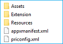
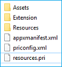

# <a name="localizing-microsoft-edge-extensions-for-windows-and-the-microsoft-store"></a>Локализация расширений Microsoft Edge для Windows и Microsoft Store  

[!INCLUDE [deprecation-note](../../includes/deprecation-note.md)]  

В этом руководстве понаблизовать, как локализовать расширение Microsoft Edge, чтобы оно было готово для нескольких локалов после выпуска.  Чтобы полностью локализовать расширение, необходимо выполнять действия, как для Windows, так и для Microsoft Store.  

Если вы хотите локализовать ресурсы расширения для Microsoft Edge, вы можете узнать, как использовать рамки i18n в руководстве [по интернационализации.](../internationalization.md)  

> [!NOTE]
> Если расширение не поддерживает несколько языков, можно перейти к локализации имени и [описания в Microsoft Store.](#localizing-name-and-description-in-the-microsoft-store)  

## <a name="the-localization-process-overview"></a>Обзор процесса локализации  

Первым шагом к тому, чтобы расширение было доступно широкой аудитории, является настройка [приложения AppxManifest](#configuring-the-appxmanifest) для нескольких языков.  В Microsoft Store пользователи покажут, на каких языках поддерживается расширение.  Некоторые поля в AppxManifest также необходимо изменить, если требуется локализовать имя вашего расширения в пользовательском интерфейсе Windows и [Microsoft Store.](#localizing-extension-resources-for-windows-and-the-microsoft-store)  

После настройки AppxManifest необходимо создать ресурсы [строк JSON](#creating-json-string-resources) для языков, которые были указаны как поддерживаемые.  Для этого необходимо создать файл для каждого языка, в котором в каждом файле есть все строки пользовательского интерфейса `.resjson` этого языка.  

После создания файлов для поддерживаемых языков потребуется создать `.resjson` [файл ресурсов .pri.](#creating-the-resources-file) Это будет создано с помощью файла конфигурации для средства MakePRI, который поставляется с [Windows 10 SDK](https://developer.microsoft.com/windows/downloads/windows-10-sdk).  

> [!NOTE]
> Если вы скачиваете SDK Windows 10 только для использования этого средства, вы можете выбрать только средства подписи Windows SDK для настольных приложений и windows SDK для функций управляемых приложений `MakePri.exe` **UWP,** чтобы сохранить зажигалку загрузки. ****  Средство `MakePri.exe` будет отображаться в подмостки `C:\Program Files (x86)\Windows Kits\10\bin\10.0.17713.0` .  

После отправки расширения последний шаг — локализовать имя и [описание в Microsoft Store.](#localizing-name-and-description-in-the-microsoft-store)  

> [!NOTE]
> Отправка расширения Microsoft Edge в Microsoft Store в настоящее время является ограниченной возможностью.  **Связаться с нами** с вашими запросами на участие в Microsoft Store, и мы рассмотрим вас для будущего обновления.  

## <a name="configuring-the-appxmanifest"></a>Настройка AppXManifest  

Список поддерживаемых языков расширения в Microsoft Store создается на основе его значений AppXManifest.  Этот список задан с помощью `Resource` элемента.  

  

Чтобы указать список языков, поддерживаемых расширением, можно добавить элемент в формате, приведенном ниже \(этот элемент будет поддерживать английский, немецкий и французский языки в `Resource` `Resource` Microsoft Store\):  

```xml
<Resources>
    <Resource Language="en-us"/>
    <Resource Language="de-de"/>
    <Resource Language="fr-fr"/>
</Resources>
```  

Сведения о языках и языковых кодах, поддерживаемых Microsoft Store, см. в веб-сайте [Поддерживаемые](/windows/uwp/publish/supported-languages) языки.  

Чтобы указать локализованные строки для всех общедоступных элементов в AppxManifest, необходимо использовать идентификатор ресурса в формате `ms-resource:<resource id>` .  

Фрагменты ниже делают полный AppxManifest. Следующие значения должны быть извлечены из локализованных файлов ресурсов:  

*   Properties\DisplayName  
*   Свойства\Описание  
*   Свойства\PublisherDisplayName  

```xml
<Properties>
    <DisplayName>ms-resource:DisplayName</DisplayName>
    <Description>ms-resource:Description</Description>
    <Logo>Assets\PackageLogo.png</Logo>
    <PublisherDisplayName>ms-resource:PublisherName</PublisherDisplayName>
</Properties>
```  

*   Applications\Application\VisualElements\DisplayName  
*   Applications\Application\VisualElements\Description  
*   Applications\Application\Extensions\Extension\AppExtension\DisplayName  

```xml
<Applications>
    <Application Id="App">
      <uap:VisualElements
        AppListEntry="none"
            DisplayName="ms-resource:DisplayName"
       Square150x150Logo="Assets\Square150x150Logo.png"
       Square44x44Logo="Assets\Square44x44Logo.png"
            Description="ms-resource:Description"
        BackgroundColor="transparent">
      </uap:VisualElements>
      <Extensions>
      <uap3:Extension Category="windows.appExtension">
        <uap3:AppExtension Name="com.microsoft.edge.extension"
            Id="MicrosoftTranslate"
            PublicFolder="Extension"
            DisplayName="ms-resource:DisplayName">
        </uap3:AppExtension>
      </uap3:Extension>
      </Extensions>
    </Application>
  </Applications>
```  

## <a name="localizing-extension-resources-for-windows-and-the-microsoft-store"></a>Локализация ресурсов расширения для Windows и Microsoft Store  

Теперь, когда приложение AppxManifest настроено на несколько языков, необходимо знать некоторые ключевые различия между локализализаем пользовательского интерфейса в расширении и локализализаем расширения для Windows и Microsoft Store.  

Несмотря на то, что расширения Microsoft Edge не работают вне Microsoft Edge, управление ими может происходить в Windows.  Например, пользователи могут управлять своими расширениями в приложении Параметры:  

  

Имя расширения, отображаемого в приложении Параметры в Windows, происходит от AppXManifest.  Если это значение жестко закодированно на английском языке, английская версия имени будет показываться на устройствах Windows, не в английском языке.  Если брендинг вашего расширения только на английском языке, его можно оставить в жестком коде.  

> [!NOTE]
> Если вы хотите использовать локализованные имена для расширения Microsoft Edge в [](./extensions-in-the-windows-dev-center.md#name-reservation) Windows, убедитесь, что локализованные имена также доступны и зарезервированы перед внесением изменений в файле AppXManifest.  Если имена не зарезервированы, вы получите следующую ошибку при отправке окончательного пакета в Центр разработчиков Windows:  
> 
>   

Инфраструктура локализации на основе i18n, которая определена для расширений JavaScript, применима только в среде Microsoft Edge.  

За пределами Microsoft Edge, в Windows и Microsoft Store, единственная поддерживаемая платформа локализации основана на платформе универсальной платформы Windows (UWP).  

Хотя мы поддерживаем ресурсы на основе JSON для приложений Windows на основе HTML, схема для ресурсов JSON не совпадает с схемой, определенной для расширений JavaScript.  

Ниже ключевых различий в [HTML-приложениях Windows:](/previous-versions/windows/apps/hh465228(v=win.10))  

*   Ресурсы указаны в `.resjson` файлах, а не `.json` в файлах.  
*   Поддерживаемые локали должны быть указаны в файле AppXManifest, при этом первый локаль по умолчанию.  
*   Ресурсы приложений Windows на основе HTML используют следующую схему:  
    
    ```json
    {
        "greeting"              : "Hello",
        "_greeting.comment"     : "A welcome greeting.",

        "farewell"              : "Goodbye",
        "_farewell.comment"     : "A goodbye."
    }
    ```  
    
    Пара имя/значение, обозначаемая подчеркиваемой строкой, — это комментарии для соответствующего ресурса строки.  
*   `.resjson` файлы скомпилироваться в `.pri` файлы, которые должны быть включены во время создания пакета AppX.  
    
### <a name="creating-json-string-resources"></a>Создание ресурсов строкИ JSON  

С помощью настраиваемой системы AppxManifest и различий между выделенными рамками локализации i18n и UWP вы готовы создавать файлы ресурсов.  

Только одна строка ресурса в манифесте применима к пакетам расширения Microsoft Edge.  Строка обычно локализована в расширениях JavaScript и легко может быть соедем с ожидаемой `DisplayName` `.resjson` Windows файлами.  Если предположить, что это единственный ресурс, который вы хотите локализовать, вот пример файла, `.resjson` который необходимо создать:  

```json
{
    "DisplayName"              : "Jigsaw",
    "_DisplayName.comment"     : "Name of extension."
}
```  

ИД ресурса в каждом файле должен соответствовать `.resjson` ID, используемый в AppXManifest.  Используя пример `.resjson` фрагмента выше, соответствующая запись AppXManifest должна быть:  

`DisplayName="ms-resource:DisplayName"`  

Каждый язык, поддерживаемый расширением, должен иметь соответствующий файл ресурсов и размещаться в `.resjson` следующей структуре папок:  

  

### <a name="creating-the-resources-file"></a>Создание файла ресурсов  

После создания всех файлов вы будете готовы создать файл с индексом ресурсов пакета `.resjson` \(PRI\).  Этот файл сохраняет ресурсы для всех поддерживаемых языков.  Для этого можно использовать **средство MakePRI,** которое включено в SDK Windows 10.  

Сначала необходимо создать файл конфигурации.  Это определяет квалификаторы по умолчанию и платформу для ресурсов.  В этом примере сделайте язык по умолчанию `English (US)` и платформу Windows 10.  Для этого создайте `priconfig.xml` файл со следующим содержимым в `[Root folder]` :  

  

```xml
<?xml version="1.0" encoding="UTF-8" standalone="yes"?>
<resources targetOsVersion="10.0.0" majorVersion="1">
    <index root="\" startIndexAt="\">
        <default>
            <qualifier name="Language" value="en-US"/>
            <qualifier name="Contrast" value="standard"/>
            <qualifier name="HomeRegion" value="001"/>
            <qualifier name="TargetSize" value="256"/>
            <qualifier name="LayoutDirection" value="LTR"/>
            <qualifier name="Theme" value="dark"/>
            <qualifier name="AlternateForm" value=""/>
            <qualifier name="DXFeatureLevel" value="DX9"/>
            <qualifier name="Configuration" value=""/>
            <qualifier name="DeviceFamily" value="Universal"/>
            <qualifier name="Custom" value=""/>
        </default>
        <indexer-config type="folder" foldernameAsQualifier="true" filenameAsQualifier="true" qualifierDelimiter="."/>
        <indexer-config type="resw" convertDotsToSlashes="true" initialPath=""/>
        <indexer-config type="resjson" initialPath=""/>
        <indexer-config type="PRI"/>
    </index>
</resources>
```  

Теперь вы можете использовать файл конфигурации и средство MakePRI для создания файла resources.pri.  В этом примере корневое расположение проекта будет `[Root folder]` .  

```cmd
MakePRI new /pr [Root folder] /cf [Root folder]\priconfig.xml /mn [Root folder]\AppxManifest.xml /of [Root folder]\resources.pri /o
```  

Теперь в корневой папке должен быть один файл resources.pri:  

  

## <a name="localizing-name-and-description-in-the-microsoft-store"></a>Локализация имени и описания в Microsoft Store  

После отправки полного локализованного пакета Центр разработчиков Windows обнаружит, что поддерживается несколько языков, и проверит, есть ли соответствующие локализованные имена и описания для каждого из них.  Если какие-либо из локализованных значений отсутствуют, отправка будет заблокирована до тех пор, пока вы не предоставите значения.  

Если вы заинтересованы только в предоставлении локализованного имени и описания для Microsoft Store (а не Windows), вы можете сделать это, за счет хранения всех локализованных имен для [вашего расширения](./extensions-in-the-windows-dev-center.md#name-reservation).  

После того как вы зарезервировали дополнительные локализованные имена, можно создать обновленную отправку.  В разделе описание можно управлять дополнительными языками для списка Microsoft Store:  

  

После выбора управления **дополнительными**языками вы сможете выбрать языки, которые необходимо добавить в список Microsoft Store.  Новый язык будет показываться в качестве **дополнительного языка описания** в разделе **Описание.**  

Вы можете щелкнуть по отдельной ссылке в разделе **Описание,** чтобы предоставить локализованное имя и описание, заметки о выпуске и визуальные активы для каждого языка.  Описание магазина Майкрософт не извлекается из AppXManifest.  Каждое локализованное описание должно быть вписано вручную в Центр разработчиков Windows:  

  

После отправки локализованных описаний и публикации расширения каждый, кто получит доступ к локализованной странице расширения в Microsoft Store, увидит следующий пользовательский интерфейс:  

  

## <a name="appxmanifest-samples"></a>Примеры AppxManifest  

### <a name="non-localized-appxmanifest"></a>Не локализованный AppxManifest  

В следующем примере показан appxManifest, который не локализован и поддерживает только `en-us` локал.  

```xml
<?xml version="1.0" encoding="utf-8"?>
<Package
    xmlns="http://schemas.microsoft.com/appx/manifest/foundation/windows10"
    xmlns:uap="http://schemas.microsoft.com/appx/manifest/uap/windows10"
    xmlns:uap3="http://schemas.microsoft.com/appx/manifest/uap/windows10/3"
    IgnorableNamespaces="uap3">
    <Identity
        Name="63533cct23.Jigsaw"
        Publisher="CN=932A7C4A-0308-4632-9E2F-5931E8F02B7C"
        Version="1.3.0.0" />

    <Properties>
        <DisplayName>Jigsaw</DisplayName>
        <PublisherDisplayName>cct23</PublisherDisplayName>
        <Logo>Assets\icon-50.png</Logo>
    </Properties>

    <Dependencies>
        <TargetDeviceFamily Name="Windows.Desktop" MinVersion="10.0.14393.0" MaxVersionTested="10.0.14800.0" />
    </Dependencies>

    <Resources>
        <Resource Language="en-us" />
    </Resources>

    <Applications>
        <Application Id="App">
            <uap:VisualElements
                AppListEntry="none"
                DisplayName="Jigsaw"
                Square150x150Logo="Assets\icon-150.png"
                Square44x44Logo="Assets\icon-44.png"
                Description="This is a jigsaw puzzle app"
                BackgroundColor="transparent">
            </uap:VisualElements>
            <Extensions>
                <uap3:Extension Category="windows.appExtension">
                    <uap3:AppExtension
                        Name="com.microsoft.edge.extension"
                        Id="EdgeExtension"
                        PublicFolder="Extension"
                        DisplayName="Jigsaw">
                        <uap3:Properties>
                            <Capabilities>
                                <Capability Name="websiteContent"/>
                                <Capability Name="websiteInfo"/>
                                <Capability Name="browserStorage"/>
                            </Capabilities>
                        </uap3:Properties>
                    </uap3:AppExtension>
                </uap3:Extension>
            </Extensions>
        </Application>
    </Applications>
</Package>
```  

#### <a name="localized-appxmanifest"></a>Локализованный AppxManifest  

Этот пример AppxManifest локализован для восьми других локалов, кроме "en-ru". Обратите внимание `ms-resource:<resource id>` на случаи:  

```xml
<?xml version="1.0" encoding="utf-8"?>
<Package
    xmlns="http://schemas.microsoft.com/appx/manifest/foundation/windows10"
    xmlns:uap="http://schemas.microsoft.com/appx/manifest/uap/windows10"
    xmlns:uap3="http://schemas.microsoft.com/appx/manifest/uap/windows10/3"
    IgnorableNamespaces="uap3">
    <Identity
        Name="63533cct23.Jigsaw"
        Publisher="CN=932A7C4A-0308-4632-9E2F-5931E8F02B7C"
        Version="1.3.0.0" />

    <Properties>
        <DisplayName>ms-resource:DisplayName</DisplayName>
        <PublisherDisplayName>cct23</PublisherDisplayName>
        <Logo>Assets\icon-50.png</Logo>
    </Properties>

    <Dependencies>
        <TargetDeviceFamily Name="Windows.Desktop" MinVersion="10.0.14393.0" MaxVersionTested="10.0.14800.0" />
    </Dependencies>

    <Resources>
        <Resource Language="en-us" />
        <Resource Language="de" />
        <Resource Language="en" />
        <Resource Language="en-gb" />
        <Resource Language="es" />
        <Resource Language="fr" />
        <Resource Language="it" />
        <Resource Language="ja" />
        <Resource Language="zh-cn" />
    </Resources>

    <Applications>
        <Application Id="App">
            <uap:VisualElements
                AppListEntry="none"
                DisplayName="ms-resource:DisplayName"
                Square150x150Logo="Assets\icon-150.png"
                Square44x44Logo="Assets\icon-44.png"
                Description="ms-resource:Description"
                BackgroundColor="transparent">
            </uap:VisualElements>
            <Extensions>
                <uap3:Extension Category="windows.appExtension">
                    <uap3:AppExtension
                        Name="com.microsoft.edge.extension"
                        Id="EdgeExtension"
                        PublicFolder="Extension"
                        DisplayName="ms-resource:DisplayName">
                        <uap3:Properties>
                            <Capabilities>
                                <Capability Name="websiteContent"/>
                                <Capability Name="websiteInfo"/>
                                <Capability Name="browserStorage"/>
                            </Capabilities>
                        </uap3:Properties>
                    </uap3:AppExtension>
                </uap3:Extension>
            </Extensions>
        </Application>
    </Applications>
</Package>
```  
