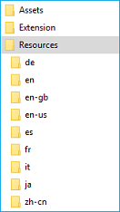

# <span data-ttu-id="dc196-104">Локализация расширений Microsoft Edge для Windows и Microsoft Store</span><span class="sxs-lookup"><span data-stu-id="dc196-104">Localizing Microsoft Edge extensions for Windows and the Microsoft Store</span></span>  

[!INCLUDE [deprecation-note](../../includes/deprecation-note.md)]  

<span data-ttu-id="dc196-105">В этом руководстве поется о том, как локализовать расширение Microsoft Edge, чтобы оно было готово к нескольким региональным службам после выпуска.</span><span class="sxs-lookup"><span data-stu-id="dc196-105">This guide walks through how to localize your Microsoft Edge extension so that it's ready for multiple locales upon release.</span></span> <span data-ttu-id="dc196-106">Чтобы полностью локализовать расширение, необходимо выполнять действия как для Windows, так и для Microsoft Store.</span><span class="sxs-lookup"><span data-stu-id="dc196-106">To fully localize your extension, you'll need to follow the steps for both Windows and the Microsoft Store.</span></span>

<span data-ttu-id="dc196-107">Если вы хотите локализовать ресурсы расширения для Microsoft Edge, вы можете узнать, как использовать i18n framework в руководстве [по международной локализации.](../internationalization.md)</span><span class="sxs-lookup"><span data-stu-id="dc196-107">If you want to localize your extension resources for Microsoft Edge, you can learn how to use the i18n framework in the [Internationalization guide](../internationalization.md).</span></span>


> [!NOTE]
> <span data-ttu-id="dc196-108">Если расширение не поддерживает несколько языков, можно перейти к [локализации](#localizing-name-and-description-in-the-microsoft-store)имени и описания в Microsoft Store.</span><span class="sxs-lookup"><span data-stu-id="dc196-108">If your extension doesn't support multiple languages, you can skip to [Localizing name and description in the Microsoft Store](#localizing-name-and-description-in-the-microsoft-store).</span></span>


## <span data-ttu-id="dc196-109">Обзор процесса локализации</span><span class="sxs-lookup"><span data-stu-id="dc196-109">The localization process overview</span></span>

<span data-ttu-id="dc196-110">Первым шагом к тому, чтобы сделать расширение доступным для широкой аудитории, является настройка [AppxManifest](#configuring-the-appxmanifest) для нескольких языков.</span><span class="sxs-lookup"><span data-stu-id="dc196-110">The first step towards getting your extension available to a wide audience is to [configure its AppxManifest](#configuring-the-appxmanifest) for multiple languages.</span></span> <span data-ttu-id="dc196-111">В Microsoft Store будет покажем пользователям, какие языки поддерживает расширение.</span><span class="sxs-lookup"><span data-stu-id="dc196-111">In the Microsoft Store, this will show users what languages your extension supports.</span></span> <span data-ttu-id="dc196-112">Некоторые поля в AppxManifest также необходимо изменить, если вы хотите локализовать имя расширения в пользовательском интерфейсе Windows и [Microsoft Store.](#localizing-extension-resources-for-windows-and-the-microsoft-store)</span><span class="sxs-lookup"><span data-stu-id="dc196-112">Certain fields in the AppxManifest will also need to be changed if you want the name of your extension to be [localized in the Windows UI and the Microsoft Store](#localizing-extension-resources-for-windows-and-the-microsoft-store).</span></span>


<span data-ttu-id="dc196-113">После настройки AppxManifest необходимо создать строковый ресурс [JSON](#creating-json-string-resources) для языков, которые вы указали как поддерживаемые.</span><span class="sxs-lookup"><span data-stu-id="dc196-113">Once your AppxManifest is configured, you'll need to [create JSON string resources](#creating-json-string-resources) for the languages that you indicated as supported.</span></span> <span data-ttu-id="dc196-114">Для этого необходимо создать resjson-файл для каждого языка, где каждый файл имеет все строки пользовательского интерфейса этого языка.</span><span class="sxs-lookup"><span data-stu-id="dc196-114">This requires creating a .resjson file for each language, where each file has all the UI strings of that language within it.</span></span>


<span data-ttu-id="dc196-115">После создания файлов .resjson для поддерживаемых языков необходимо создать файл ресурсов [.pri.](#creating-the-resources-file)</span><span class="sxs-lookup"><span data-stu-id="dc196-115">After the .resjson files for the supported languages have been made, a [.pri resource file will need to be created](#creating-the-resources-file).</span></span> <span data-ttu-id="dc196-116">Это будет создано с помощью файла конфигурации в средстве **MakePRI,** которое поставляется с [Windows 10 SDK.](https://developer.microsoft.com/windows/downloads/windows-10-sdk)</span><span class="sxs-lookup"><span data-stu-id="dc196-116">This will be created by using a configuration file to the **MakePRI** tool that comes with the [Windows 10 SDK](https://developer.microsoft.com/windows/downloads/windows-10-sdk).</span></span> 

> [!NOTE]
> <span data-ttu-id="dc196-117">Если вы загружаете windows 10 SDK только для использования средства MakePri.exe, вы можете выбрать только функции "Средства подписи Windows SDK для классических приложений" и "Windows SDK для управляемых приложений UWP", чтобы сделать скачивание более светлым.</span><span class="sxs-lookup"><span data-stu-id="dc196-117">If you are only downloading the Windows 10 SDK to use the MakePri.exe tool, you can select only the "Windows SDK Signing Tools for Desktop Apps" and "Windows SDK for UWP Managed Apps" features to keep the download lighter.</span></span> <span data-ttu-id="dc196-118">Средство MakePri.exe будет отображаться во в папках C:\Program Files (x86)\Windows Kits\10\bin\10.0.17713.0.</span><span class="sxs-lookup"><span data-stu-id="dc196-118">The MakePri.exe tool will appear in subfolders of C:\Program Files (x86)\Windows Kits\10\bin\10.0.17713.0.</span></span>


<span data-ttu-id="dc196-119">После отправки расширения необходимо локализовать имя и [описание в Microsoft Store.](#localizing-name-and-description-in-the-microsoft-store)</span><span class="sxs-lookup"><span data-stu-id="dc196-119">Once you've uploaded your extension, the final step is to [localize the name and description in the Microsoft Store](#localizing-name-and-description-in-the-microsoft-store).</span></span>

> [!NOTE]
> <span data-ttu-id="dc196-120">Отправка расширения Microsoft Edge в Microsoft Store в настоящее время является ограниченной возможностью.</span><span class="sxs-lookup"><span data-stu-id="dc196-120">Submitting a Microsoft Edge extension to the Microsoft Store is currently a restricted capability.</span></span> <span data-ttu-id="dc196-121">[Прося нам](https://aka.ms/extension-request) свои запросы на участие в Microsoft Store, мы будем учесть, что вы будете обновляться в будущем.</span><span class="sxs-lookup"><span data-stu-id="dc196-121">[Reach out to us](https://aka.ms/extension-request) with your requests to be a part of the Microsoft Store, and we'll consider you for a future update.</span></span>


## <span data-ttu-id="dc196-122">Настройка AppXManifest</span><span class="sxs-lookup"><span data-stu-id="dc196-122">Configuring the AppXManifest</span></span>

<span data-ttu-id="dc196-123">Список "Поддерживаемые языки" расширения в Microsoft Store создается на основе его значений AppXManifest.</span><span class="sxs-lookup"><span data-stu-id="dc196-123">Your extension's "Supported languages" list in the Microsoft Store is generated based on its AppXManifest values.</span></span> <span data-ttu-id="dc196-124">Этот список указывается с помощью `Resource` элемента.</span><span class="sxs-lookup"><span data-stu-id="dc196-124">This list is specified using the `Resource` element.</span></span>


<span data-ttu-id="dc196-126">Чтобы указать список языков, поддерживаемых расширением, можно добавить элемент в формате, приведенном ниже (этот элемент будет поддерживать английский, немецкий и французский языки в `Resource` `Resource` Microsoft Store):</span><span class="sxs-lookup"><span data-stu-id="dc196-126">To specify the list of languages that are supported by your extension, you can add a `Resource` element in the format seen below (this `Resource` element will show support for English, German, and French in the Microsoft Store):</span></span>

```xml
<Resources>
    <Resource Language="en-us"/>
    <Resource Language="de-de"/>
    <Resource Language="fr-fr"/>
</Resources>
```

<span data-ttu-id="dc196-127">Сведения [о языках](https://msdn.microsoft.com/windows/uwp/publish/supported-languages) и языковых кодах, поддерживаемых Microsoft Store, см. в поддерживаемых языках.</span><span class="sxs-lookup"><span data-stu-id="dc196-127">See [Supported languages](https://msdn.microsoft.com/windows/uwp/publish/supported-languages) for info on the languages/language codes that the Microsoft Store supports.</span></span>


<span data-ttu-id="dc196-128">Чтобы указать локализованные строки для всех общедоступных элементов в AppxManifest, необходимо использовать идентификатор ресурса в формате `ms-resource:<resource id>` .</span><span class="sxs-lookup"><span data-stu-id="dc196-128">In order to specify localized strings for all publicly visible elements in the AppxManifest, you'll have to use a resource identifier in the format of `ms-resource:<resource id>`.</span></span>

<span data-ttu-id="dc196-129">В приведенном ниже фрагменте кода полный AppxManifest.</span><span class="sxs-lookup"><span data-stu-id="dc196-129">The snippets below make a complete AppxManifest.</span></span> <span data-ttu-id="dc196-130">Из локализованных файлов ресурсов должны быть извлечены следующие значения:</span><span class="sxs-lookup"><span data-stu-id="dc196-130">The following values should be retrieved from localized resource files:</span></span>

- <span data-ttu-id="dc196-131">Properties\DisplayName</span><span class="sxs-lookup"><span data-stu-id="dc196-131">Properties\DisplayName</span></span>
- <span data-ttu-id="dc196-132">Properties\Description</span><span class="sxs-lookup"><span data-stu-id="dc196-132">Properties\Description</span></span>
- <span data-ttu-id="dc196-133">Properties\PublisherDisplayName</span><span class="sxs-lookup"><span data-stu-id="dc196-133">Properties\PublisherDisplayName</span></span>


```xml
<Properties>
    <DisplayName>ms-resource:DisplayName</DisplayName>
    <Description>ms-resource:Description</Description>
    <Logo>Assets\PackageLogo.png</Logo>
    <PublisherDisplayName>ms-resource:PublisherName</PublisherDisplayName>
</Properties>
```

- <span data-ttu-id="dc196-134">Applications\Application\VisualElements\DisplayName</span><span class="sxs-lookup"><span data-stu-id="dc196-134">Applications\Application\VisualElements\DisplayName</span></span>
- <span data-ttu-id="dc196-135">Applications\Application\VisualElements\Description</span><span class="sxs-lookup"><span data-stu-id="dc196-135">Applications\Application\VisualElements\Description</span></span>
- <span data-ttu-id="dc196-136">Applications\Application\Extensions\Extension\AppExtension\DisplayName</span><span class="sxs-lookup"><span data-stu-id="dc196-136">Applications\Application\Extensions\Extension\AppExtension\DisplayName</span></span>

```xml
<Applications>
    <Application Id="App">
      <uap:VisualElements
        AppListEntry="none"
            DisplayName="ms-resource:DisplayName"
       Square150x150Logo="Assets\Square150x150Logo.png"
       Square44x44Logo="Assets\Square44x44Logo.png"
            Description="ms-resource:Description"
        BackgroundColor="transparent">
      </uap:VisualElements>
      <Extensions>
      <uap3:Extension Category="windows.appExtension">
        <uap3:AppExtension Name="com.microsoft.edge.extension"
            Id="MicrosoftTranslate"
            PublicFolder="Extension"
            DisplayName="ms-resource:DisplayName">
        </uap3:AppExtension>
      </uap3:Extension>
      </Extensions>
    </Application>
  </Applications>
```


## <span data-ttu-id="dc196-137">Локализация ресурсов расширения для Windows и Microsoft Store</span><span class="sxs-lookup"><span data-stu-id="dc196-137">Localizing extension resources for Windows and the Microsoft Store</span></span>

<span data-ttu-id="dc196-138">Теперь, когда appxManifest настроен для нескольких языков, необходимо знать некоторые основные различия между локализализализав пользовательский интерфейс в расширении и локализацию расширения для Windows и Microsoft Store.</span><span class="sxs-lookup"><span data-stu-id="dc196-138">Now that your AppxManifest is configured for multiple languages, there are some key differences you should know between localizing the UI within your extension and localizing your extension for Windows and the Microsoft Store.</span></span>

<span data-ttu-id="dc196-139">Хотя расширения Microsoft Edge не запускаются за пределами Microsoft Edge, управление ими может происходить в Windows.</span><span class="sxs-lookup"><span data-stu-id="dc196-139">While Microsoft Edge extensions don't run outside of Microsoft Edge, the management of them can occur within Windows.</span></span> <span data-ttu-id="dc196-140">Например, пользователи могут управлять своими расширениями в приложении "Параметры":</span><span class="sxs-lookup"><span data-stu-id="dc196-140">For example, users can manage their extensions in the Settings app:</span></span>


<span data-ttu-id="dc196-142">Имя расширения, отображаемого в приложении "Параметры" в Windows, происходит от AppXManifest.</span><span class="sxs-lookup"><span data-stu-id="dc196-142">The name of the extension that shows up in the Settings app in Windows comes from the AppXManifest.</span></span> <span data-ttu-id="dc196-143">Если это значение жестко закодированное на английском языке, английская версия имени будет отсылаться на устройствах с Windows, не в английском языке.</span><span class="sxs-lookup"><span data-stu-id="dc196-143">If this value is hardcoded in English, the English version of the name will show up on non-English Windows devices.</span></span> <span data-ttu-id="dc196-144">Если фирменая марка вашего расширения только на английском языке, можно оставить ее жестко закодированной.</span><span class="sxs-lookup"><span data-stu-id="dc196-144">If the branding of your extension is English only, it's ok to leave it hardcoded.</span></span>


> [!NOTE]
> <span data-ttu-id="dc196-145">Если вы хотите использовать локализованные имена для расширения Microsoft Edge в [](./extensions-in-the-windows-dev-center.md#name-reservation) Windows, убедитесь, что локализованные имена также доступны и зарезервированы перед внесением изменений в файл AppXManifest.</span><span class="sxs-lookup"><span data-stu-id="dc196-145">If you want to use localized names for your Microsoft Edge Extension in Windows, make sure the localized names are also [available and reserved](./extensions-in-the-windows-dev-center.md#name-reservation) before you make the changes in the AppXManifest file.</span></span> <span data-ttu-id="dc196-146">Если имена не зарезервированы, при отправке окончательного пакета в Центр разработчиков для Windows вы получите следующую ошибку:</span><span class="sxs-lookup"><span data-stu-id="dc196-146">If the names are not reserved, you'll get the following error when you upload the final package to Windows Dev Center:</span></span></br></br>

</br></br>


<span data-ttu-id="dc196-148">Инфраструктура локализации на основе i18n, определяемая для расширений JavaScript, применима только в среде Microsoft Edge.</span><span class="sxs-lookup"><span data-stu-id="dc196-148">The i18n based localization infrastructure that's defined for JavaScript extensions is only applicable within the Microsoft Edge environment.</span></span>

<span data-ttu-id="dc196-149">За пределами Microsoft Edge в Windows и Microsoft Store единственная поддерживаемая платформа локализации основана на платформе локализации универсальной платформы Windows (UWP).</span><span class="sxs-lookup"><span data-stu-id="dc196-149">Outside of Microsoft Edge, within Windows and the Microsoft Store, the only supported localization framework is based on the Universal Windows Platform (UWP) localization framework.</span></span>

<span data-ttu-id="dc196-150">Хотя мы поддерживаем ресурсы на основе JSON для приложений Для Windows на основе HTML, схема ресурсов JSON не соответствует схеме, определенной для расширений JavaScript.</span><span class="sxs-lookup"><span data-stu-id="dc196-150">While we do support JSON based resources for HTML based Windows apps, the schema for the JSON resources doesn't match the one defined for JavaScript extensions.</span></span>


<span data-ttu-id="dc196-151">Ниже ключевых отличий в [приложениях для Windows на основе HTML:](https://msdn.microsoft.com/library/windows/apps/hh465228.aspx)</span><span class="sxs-lookup"><span data-stu-id="dc196-151">The following are the key differences in [HTML based Windows apps](https://msdn.microsoft.com/library/windows/apps/hh465228.aspx):</span></span>
-    <span data-ttu-id="dc196-152">Ресурсы указаны в resjson-файлах вместо JSON-файлов.</span><span class="sxs-lookup"><span data-stu-id="dc196-152">Resources are specified in .resjson files instead of .json files.</span></span>
-    <span data-ttu-id="dc196-153">Поддерживаемые региональные стандарты должны быть указаны в файле AppXManifest, первый из них является региональным стандартом по умолчанию.</span><span class="sxs-lookup"><span data-stu-id="dc196-153">The locales supported should be specified in the AppXManifest file, with the first locale being the default locale.</span></span>
-    <span data-ttu-id="dc196-154">Ресурсы приложений для Windows на основе HTML используют следующую схему:</span><span class="sxs-lookup"><span data-stu-id="dc196-154">HTML based Windows apps resources use the following schema:</span></span>
    ```json
    {
        "greeting"              : "Hello",
        "_greeting.comment"     : "A welcome greeting.",

        "farewell"              : "Goodbye",
        "_farewell.comment"     : "A goodbye."
    }
    ```
    <span data-ttu-id="dc196-155">Пара "имя-значение", обозначаемая подчеркиваемой строкой, — это комментарии к соответствующему строковом ресурсу.</span><span class="sxs-lookup"><span data-stu-id="dc196-155">The name/value pair denoted by an underscore are comments for the corresponding string resource.</span></span>
-    <span data-ttu-id="dc196-156">Resjson-файлы компилются в PRI-файлы, которые необходимо включить во время создания пакета AppX.</span><span class="sxs-lookup"><span data-stu-id="dc196-156">.resjson files are compiled into .pri files which must be included during AppX package creation.</span></span>


### <span data-ttu-id="dc196-157">Создание строки ресурсов JSON</span><span class="sxs-lookup"><span data-stu-id="dc196-157">Creating JSON string resources</span></span>
<span data-ttu-id="dc196-158">Если настроен AppxManifest и выделены различия между i18n и структурами локализации UWP, вы можете создавать файлы ресурсов.</span><span class="sxs-lookup"><span data-stu-id="dc196-158">With a configured AppxManifest in hand and the differences between the i18n and UWP localization frameworks highlighted, you're ready to create your resource files.</span></span>

<span data-ttu-id="dc196-159">Только одна строка ресурса в манифесте применима к пакетам расширений Microsoft Edge.</span><span class="sxs-lookup"><span data-stu-id="dc196-159">Only one resource string in the manifest is applicable to Microsoft Edge extension packages.</span></span> <span data-ttu-id="dc196-160">Строка обычно локализована в расширениях JavaScript и легко соедается с `DisplayName` resjson-файлами, которые ожидает Windows.</span><span class="sxs-lookup"><span data-stu-id="dc196-160">The `DisplayName` string is commonly localized in JavaScript extensions, and can be easily mapped to the .resjson files that Windows expects.</span></span> <span data-ttu-id="dc196-161">Предположим, что это единственный ресурс, который вы хотите локализовать, вот пример resjson-файла, который необходимо создать:</span><span class="sxs-lookup"><span data-stu-id="dc196-161">Assuming that this is the only resource that you would like to localize, here is a sample .resjson file that should be created:</span></span>

```json
{
    "DisplayName"              : "Jigsaw",
    "_DisplayName.comment"     : "Name of extension."
}
```

<span data-ttu-id="dc196-162">ИД ресурса в каждом resjson-файле должен совпадать с ИД, используемым в AppXManifest.</span><span class="sxs-lookup"><span data-stu-id="dc196-162">The resource ID in each .resjson file needs to match the ID used in the AppXManifest.</span></span> <span data-ttu-id="dc196-163">В примере кода .resjson выше соответствующая запись AppXManifest должна быть:</span><span class="sxs-lookup"><span data-stu-id="dc196-163">Using the example .resjson snippet above, the corresponding AppXManifest entry should be:</span></span>

`DisplayName="ms-resource:DisplayName"`

<span data-ttu-id="dc196-164">Каждый язык, поддерживаемый расширением, должен иметь соответствующий файл resources.resjson и размещаться в следующей структуре папок:</span><span class="sxs-lookup"><span data-stu-id="dc196-164">Each language that your extension supports should have a corresponding resources.resjson file and be placed in the following folder structure:</span></span>




### <span data-ttu-id="dc196-166">Создание файла ресурсов</span><span class="sxs-lookup"><span data-stu-id="dc196-166">Creating the resources file</span></span>
<span data-ttu-id="dc196-167">После создания всех файлов .resjson вы можете создать файл индекса ресурсов пакета (PRI).</span><span class="sxs-lookup"><span data-stu-id="dc196-167">Once you've created all your .resjson files, you're ready to create your package resource index (PRI) file.</span></span> <span data-ttu-id="dc196-168">В этом файле хранится ресурсы для всех поддерживаемых языков.</span><span class="sxs-lookup"><span data-stu-id="dc196-168">This file stores the resources for all your supported languages.</span></span> <span data-ttu-id="dc196-169">Для этого можно использовать средство **MakePRI,** которое входит в состав Windows 10 SDK.</span><span class="sxs-lookup"><span data-stu-id="dc196-169">To do this you can use the **MakePRI** tool which is included with the Windows 10 SDK.</span></span>


<span data-ttu-id="dc196-170">Сначала необходимо создать файл конфигурации.</span><span class="sxs-lookup"><span data-stu-id="dc196-170">First you'll need to create the configuration file.</span></span> <span data-ttu-id="dc196-171">Это определяет квалификаторы по умолчанию и платформу для ресурсов.</span><span class="sxs-lookup"><span data-stu-id="dc196-171">This defines the default qualifiers and platform for the resources.</span></span> <span data-ttu-id="dc196-172">В этом примере сделайте языком по умолчанию английский (США) и платформу Windows 10.</span><span class="sxs-lookup"><span data-stu-id="dc196-172">For this example, make the default language English (US) and the platform Windows 10.</span></span> <span data-ttu-id="dc196-173">Для этого создайте файл priconfig.xml со следующим содержимым в [корневой папке]:</span><span class="sxs-lookup"><span data-stu-id="dc196-173">To do this, create a priconfig.xml file with the following content in the [Root folder]:</span></span>


```xml
<?xml version="1.0" encoding="UTF-8" standalone="yes"?>
<resources targetOsVersion="10.0.0" majorVersion="1">
    <index root="\" startIndexAt="\">
        <default>
            <qualifier name="Language" value="en-US"/>
            <qualifier name="Contrast" value="standard"/>
            <qualifier name="HomeRegion" value="001"/>
            <qualifier name="TargetSize" value="256"/>
            <qualifier name="LayoutDirection" value="LTR"/>
            <qualifier name="Theme" value="dark"/>
            <qualifier name="AlternateForm" value=""/>
            <qualifier name="DXFeatureLevel" value="DX9"/>
            <qualifier name="Configuration" value=""/>
            <qualifier name="DeviceFamily" value="Universal"/>
            <qualifier name="Custom" value=""/>
        </default>
        <indexer-config type="folder" foldernameAsQualifier="true" filenameAsQualifier="true" qualifierDelimiter="."/>
        <indexer-config type="resw" convertDotsToSlashes="true" initialPath=""/>
        <indexer-config type="resjson" initialPath=""/>
        <indexer-config type="PRI"/>
    </index>
</resources>
```

<span data-ttu-id="dc196-175">Теперь можно использовать файл конфигурации и средство MakePRI для создания файла resources.pri.</span><span class="sxs-lookup"><span data-stu-id="dc196-175">Now you can use the configuration file and the MakePRI tool to create the resources.pri file.</span></span> <span data-ttu-id="dc196-176">В этом примере корневым расположением проекта будет [Корневая папка].</span><span class="sxs-lookup"><span data-stu-id="dc196-176">For this example, the root location for the project will be [Root folder].</span></span>


```cmd
MakePRI new /pr [Root folder] /cf [Root folder]\priconfig.xml /mn [Root folder]\AppxManifest.xml /of [Root folder]\resources.pri /o
```

<span data-ttu-id="dc196-177">Теперь в корневой папке должен быть один файл resources.pri:</span><span class="sxs-lookup"><span data-stu-id="dc196-177">You should now have one resources.pri file in your root folder:</span></span>


## <span data-ttu-id="dc196-179">Локализация имени и описания в Microsoft Store</span><span class="sxs-lookup"><span data-stu-id="dc196-179">Localizing name and description in the Microsoft Store</span></span>

<span data-ttu-id="dc196-180">После отправки полного локализованного пакета Центр разработчиков для Windows обнаружит, что поддерживается несколько языков, и проверит, есть ли у вас соответствующие локализованные имена и описания для каждого из них.</span><span class="sxs-lookup"><span data-stu-id="dc196-180">Once you try to upload your complete, localized package, the Windows Dev Center will detect that more than one language is supported and check that you have corresponding localized names and descriptions for each.</span></span> <span data-ttu-id="dc196-181">Если какие-либо из локализованных значений отсутствуют, отправка будет заблокирована, пока вы не предоставите значения.</span><span class="sxs-lookup"><span data-stu-id="dc196-181">If any of the localized values are missing, your submission will be blocked until you provide the values.</span></span>

<span data-ttu-id="dc196-182">Если вы хотите предоставить только локализованное имя и описание для Microsoft Store (а не Windows), вы можете сделать это, засвидев все локализованные имена для [расширения.](./extensions-in-the-windows-dev-center.md#name-reservation)</span><span class="sxs-lookup"><span data-stu-id="dc196-182">If you are only interested in providing a localized name and description for the Microsoft Store (and not Windows), you can do so by [reserving all the localized names for your extension](./extensions-in-the-windows-dev-center.md#name-reservation).</span></span>


<span data-ttu-id="dc196-183">Зарезервировать дополнительные локализованные имена можно создать обновленную отправку.</span><span class="sxs-lookup"><span data-stu-id="dc196-183">Once you've reserved additional localized names, you can create an updated submission.</span></span> <span data-ttu-id="dc196-184">В разделе описания можно управлять дополнительными языками для описания в Microsoft Store:</span><span class="sxs-lookup"><span data-stu-id="dc196-184">In the description section you can manage additional languages for your Microsoft Store listing:</span></span>


<span data-ttu-id="dc196-186">Выбрав "Управление дополнительными языками", вы сможете выбрать языки, которые вы хотите добавить в описание в Microsoft Store.</span><span class="sxs-lookup"><span data-stu-id="dc196-186">Once you've selected "Manage additional languages", you'll get to select which languages you want to add to your Microsoft Store listing.</span></span> <span data-ttu-id="dc196-187">Новый язык будет показываться как "Дополнительный язык описания" в разделе "Описание".</span><span class="sxs-lookup"><span data-stu-id="dc196-187">The new language will show up as 'Additional description language' in the "Description" section.</span></span>

<span data-ttu-id="dc196-188">Вы можете щелкнуть по отдельной ссылке в разделе "Описание", чтобы предоставить локализованное имя и описание, заметки о выпуске и визуальные ресурсы для каждого языка.</span><span class="sxs-lookup"><span data-stu-id="dc196-188">You can click on the individual link in the "Description" section to provide a localized name and description, release notes, and visual assets for each language.</span></span> <span data-ttu-id="dc196-189">Описание Microsoft Store не извлекается из AppXManifest.</span><span class="sxs-lookup"><span data-stu-id="dc196-189">The description for the Microsoft Store is not extracted from the AppXManifest.</span></span> <span data-ttu-id="dc196-190">Каждое локализованное описание необходимо введть вручную в Центре разработчиков для Windows:</span><span class="sxs-lookup"><span data-stu-id="dc196-190">Each localized description needs to be manually entered in the Windows Dev Center:</span></span>


<span data-ttu-id="dc196-192">После отправки локализованных описаний и публикации расширения все, кто имеет доступ к локализованной странице расширения в Microsoft Store, увидят следующий пользовательский интерфейс:</span><span class="sxs-lookup"><span data-stu-id="dc196-192">Once the localized descriptions are submitted and the extension is published, anyone accessing a localized page of the extension in the Microsoft Store will see the following UI:</span></span>


 

## <span data-ttu-id="dc196-194">Примеры AppxManifest</span><span class="sxs-lookup"><span data-stu-id="dc196-194">AppxManifest samples</span></span>

### <span data-ttu-id="dc196-195">Не локализованный AppxManifest</span><span class="sxs-lookup"><span data-stu-id="dc196-195">Non-localized AppxManifest</span></span>
<span data-ttu-id="dc196-196">В следующем примере показан appxManifest, который не локализован и поддерживает только локаль en-us.</span><span class="sxs-lookup"><span data-stu-id="dc196-196">The following example shows an AppxManifest that isn't localized, and only supports the "en-us" locale.</span></span>


```xml
<?xml version="1.0" encoding="utf-8"?>
<Package
    xmlns="http://schemas.microsoft.com/appx/manifest/foundation/windows10"
    xmlns:uap="http://schemas.microsoft.com/appx/manifest/uap/windows10"
    xmlns:uap3="http://schemas.microsoft.com/appx/manifest/uap/windows10/3"
    IgnorableNamespaces="uap3">
    <Identity
        Name="63533cct23.Jigsaw"
        Publisher="CN=932A7C4A-0308-4632-9E2F-5931E8F02B7C"
        Version="1.3.0.0" />

    <Properties>
        <DisplayName>Jigsaw</DisplayName>
        <PublisherDisplayName>cct23</PublisherDisplayName>
        <Logo>Assets\icon-50.png</Logo>
    </Properties>

    <Dependencies>
        <TargetDeviceFamily Name="Windows.Desktop" MinVersion="10.0.14393.0" MaxVersionTested="10.0.14800.0" />
    </Dependencies>

    <Resources>
        <Resource Language="en-us" />
    </Resources>

    <Applications>
        <Application Id="App">
            <uap:VisualElements
                AppListEntry="none"
                DisplayName="Jigsaw"
                Square150x150Logo="Assets\icon-150.png"
                Square44x44Logo="Assets\icon-44.png"
                Description="This is a jigsaw puzzle app"
                BackgroundColor="transparent">
            </uap:VisualElements>
            <Extensions>
                <uap3:Extension Category="windows.appExtension">
                    <uap3:AppExtension
                        Name="com.microsoft.edge.extension"
                        Id="EdgeExtension"
                        PublicFolder="Extension"
                        DisplayName="Jigsaw">
                        <uap3:Properties>
                            <Capabilities>
                                <Capability Name="websiteContent"/>
                                <Capability Name="websiteInfo"/>
                                <Capability Name="browserStorage"/>
                            </Capabilities>
                        </uap3:Properties>
                    </uap3:AppExtension>
                </uap3:Extension>
            </Extensions>
        </Application>
    </Applications>
</Package>
```


#### <span data-ttu-id="dc196-197">Локализованный AppxManifest</span><span class="sxs-lookup"><span data-stu-id="dc196-197">Localized AppxManifest</span></span>
<span data-ttu-id="dc196-198">Этот пример AppxManifest локализован для восьми других региональных es, кроме "en-us".</span><span class="sxs-lookup"><span data-stu-id="dc196-198">This AppxManifest sample is localized for eight other locales besides "en-us".</span></span> <span data-ttu-id="dc196-199">Обратите внимание `ms-resource:<resource id>` на такие случаи:</span><span class="sxs-lookup"><span data-stu-id="dc196-199">Notice the `ms-resource:<resource id>` occurrences:</span></span>


```xml
<?xml version="1.0" encoding="utf-8"?>
<Package
    xmlns="http://schemas.microsoft.com/appx/manifest/foundation/windows10"
    xmlns:uap="http://schemas.microsoft.com/appx/manifest/uap/windows10"
    xmlns:uap3="http://schemas.microsoft.com/appx/manifest/uap/windows10/3"
    IgnorableNamespaces="uap3">
    <Identity
        Name="63533cct23.Jigsaw"
        Publisher="CN=932A7C4A-0308-4632-9E2F-5931E8F02B7C"
        Version="1.3.0.0" />

    <Properties>
        <DisplayName>ms-resource:DisplayName</DisplayName>
        <PublisherDisplayName>cct23</PublisherDisplayName>
        <Logo>Assets\icon-50.png</Logo>
    </Properties>

    <Dependencies>
        <TargetDeviceFamily Name="Windows.Desktop" MinVersion="10.0.14393.0" MaxVersionTested="10.0.14800.0" />
    </Dependencies>

    <Resources>
        <Resource Language="en-us" />
        <Resource Language="de" />
        <Resource Language="en" />
        <Resource Language="en-gb" />
        <Resource Language="es" />
        <Resource Language="fr" />
        <Resource Language="it" />
        <Resource Language="ja" />
        <Resource Language="zh-cn" />
    </Resources>

    <Applications>
        <Application Id="App">
            <uap:VisualElements
                AppListEntry="none"
                DisplayName="ms-resource:DisplayName"
                Square150x150Logo="Assets\icon-150.png"
                Square44x44Logo="Assets\icon-44.png"
                Description="ms-resource:Description"
                BackgroundColor="transparent">
            </uap:VisualElements>
            <Extensions>
                <uap3:Extension Category="windows.appExtension">
                    <uap3:AppExtension
                        Name="com.microsoft.edge.extension"
                        Id="EdgeExtension"
                        PublicFolder="Extension"
                        DisplayName="ms-resource:DisplayName">
                        <uap3:Properties>
                            <Capabilities>
                                <Capability Name="websiteContent"/>
                                <Capability Name="websiteInfo"/>
                                <Capability Name="browserStorage"/>
                            </Capabilities>
                        </uap3:Properties>
                    </uap3:AppExtension>
                </uap3:Extension>
            </Extensions>
        </Application>
    </Applications>
</Package>
```
