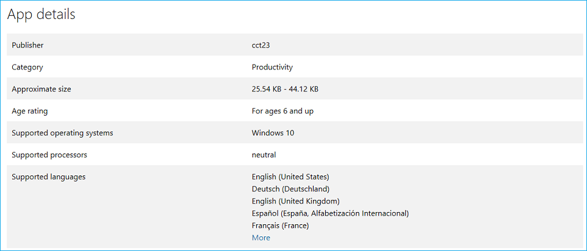
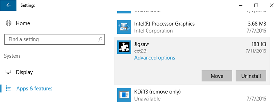

# Локализация расширений Microsoft Edge для Windows и Microsoft Store  

[!INCLUDE [deprecation-note](../../includes/deprecation-note.md)]  

В этом руководстве поется о том, как локализовать расширение Microsoft Edge, чтобы оно было готово к нескольким региональным службам после выпуска. Чтобы полностью локализовать расширение, необходимо выполнять действия как для Windows, так и для Microsoft Store.

Если вы хотите локализовать ресурсы расширения для Microsoft Edge, вы можете узнать, как использовать i18n framework в руководстве [по международной локализации.](../internationalization.md)


> [!NOTE]
> Если расширение не поддерживает несколько языков, можно перейти к [локализации](#localizing-name-and-description-in-the-microsoft-store)имени и описания в Microsoft Store.


## Обзор процесса локализации

Первым шагом к тому, чтобы сделать расширение доступным для широкой аудитории, является настройка [AppxManifest](#configuring-the-appxmanifest) для нескольких языков. В Microsoft Store будет покажем пользователям, какие языки поддерживает расширение. Некоторые поля в AppxManifest также необходимо изменить, если вы хотите локализовать имя расширения в пользовательском интерфейсе Windows и [Microsoft Store.](#localizing-extension-resources-for-windows-and-the-microsoft-store)


После настройки AppxManifest необходимо создать строковый ресурс [JSON](#creating-json-string-resources) для языков, которые вы указали как поддерживаемые. Для этого необходимо создать resjson-файл для каждого языка, где каждый файл имеет все строки пользовательского интерфейса этого языка.


После создания файлов .resjson для поддерживаемых языков необходимо создать файл ресурсов [.pri.](#creating-the-resources-file) Это будет создано с помощью файла конфигурации в средстве **MakePRI,** которое поставляется с [Windows 10 SDK.](https://developer.microsoft.com/windows/downloads/windows-10-sdk) 

> [!NOTE]
> Если вы загружаете windows 10 SDK только для использования средства MakePri.exe, вы можете выбрать только функции "Средства подписи Windows SDK для классических приложений" и "Windows SDK для управляемых приложений UWP", чтобы сделать скачивание более светлым. Средство MakePri.exe будет отображаться во в папках C:\Program Files (x86)\Windows Kits\10\bin\10.0.17713.0.


После отправки расширения необходимо локализовать имя и [описание в Microsoft Store.](#localizing-name-and-description-in-the-microsoft-store)

> [!NOTE]
> Отправка расширения Microsoft Edge в Microsoft Store в настоящее время является ограниченной возможностью. [Прося нам](https://aka.ms/extension-request) свои запросы на участие в Microsoft Store, мы будем учесть, что вы будете обновляться в будущем.


## Настройка AppXManifest

Список "Поддерживаемые языки" расширения в Microsoft Store создается на основе его значений AppXManifest. Этот список указывается с помощью `Resource` элемента.




Чтобы указать список языков, поддерживаемых расширением, можно добавить элемент в формате, приведенном ниже (этот элемент будет поддерживать английский, немецкий и французский языки в `Resource` `Resource` Microsoft Store):

```xml
<Resources>
    <Resource Language="en-us"/>
    <Resource Language="de-de"/>
    <Resource Language="fr-fr"/>
</Resources>
```

Сведения [о языках](https://msdn.microsoft.com/windows/uwp/publish/supported-languages) и языковых кодах, поддерживаемых Microsoft Store, см. в поддерживаемых языках.


Чтобы указать локализованные строки для всех общедоступных элементов в AppxManifest, необходимо использовать идентификатор ресурса в формате `ms-resource:<resource id>` .

В приведенном ниже фрагменте кода полный AppxManifest. Из локализованных файлов ресурсов должны быть извлечены следующие значения:

- Properties\DisplayName
- Properties\Description
- Properties\PublisherDisplayName


```xml
<Properties>
    <DisplayName>ms-resource:DisplayName</DisplayName>
    <Description>ms-resource:Description</Description>
    <Logo>Assets\PackageLogo.png</Logo>
    <PublisherDisplayName>ms-resource:PublisherName</PublisherDisplayName>
</Properties>
```

- Applications\Application\VisualElements\DisplayName
- Applications\Application\VisualElements\Description
- Applications\Application\Extensions\Extension\AppExtension\DisplayName

```xml
<Applications>
    <Application Id="App">
      <uap:VisualElements
        AppListEntry="none"
            DisplayName="ms-resource:DisplayName"
       Square150x150Logo="Assets\Square150x150Logo.png"
       Square44x44Logo="Assets\Square44x44Logo.png"
            Description="ms-resource:Description"
        BackgroundColor="transparent">
      </uap:VisualElements>
      <Extensions>
      <uap3:Extension Category="windows.appExtension">
        <uap3:AppExtension Name="com.microsoft.edge.extension"
            Id="MicrosoftTranslate"
            PublicFolder="Extension"
            DisplayName="ms-resource:DisplayName">
        </uap3:AppExtension>
      </uap3:Extension>
      </Extensions>
    </Application>
  </Applications>
```


## Локализация ресурсов расширения для Windows и Microsoft Store

Теперь, когда appxManifest настроен для нескольких языков, необходимо знать некоторые основные различия между локализализализав пользовательский интерфейс в расширении и локализацию расширения для Windows и Microsoft Store.

Хотя расширения Microsoft Edge не запускаются за пределами Microsoft Edge, управление ими может происходить в Windows. Например, пользователи могут управлять своими расширениями в приложении "Параметры":





Имя расширения, отображаемого в приложении "Параметры" в Windows, происходит от AppXManifest. Если это значение жестко закодированное на английском языке, английская версия имени будет отсылаться на устройствах с Windows, не в английском языке. Если фирменая марка вашего расширения только на английском языке, можно оставить ее жестко закодированной.


> [!NOTE]
> Если вы хотите использовать локализованные имена для расширения Microsoft Edge в [](./extensions-in-the-windows-dev-center.md#name-reservation) Windows, убедитесь, что локализованные имена также доступны и зарезервированы перед внесением изменений в файл AppXManifest. Если имена не зарезервированы, при отправке окончательного пакета в Центр разработчиков для Windows вы получите следующую ошибку:</br></br>

</br></br>


Инфраструктура локализации на основе i18n, определяемая для расширений JavaScript, применима только в среде Microsoft Edge.

За пределами Microsoft Edge в Windows и Microsoft Store единственная поддерживаемая платформа локализации основана на платформе локализации универсальной платформы Windows (UWP).

Хотя мы поддерживаем ресурсы на основе JSON для приложений Для Windows на основе HTML, схема ресурсов JSON не соответствует схеме, определенной для расширений JavaScript.


Ниже ключевых отличий в [приложениях для Windows на основе HTML:](https://msdn.microsoft.com/library/windows/apps/hh465228.aspx)
-    Ресурсы указаны в resjson-файлах вместо JSON-файлов.
-    Поддерживаемые региональные стандарты должны быть указаны в файле AppXManifest, первый из них является региональным стандартом по умолчанию.
-    Ресурсы приложений для Windows на основе HTML используют следующую схему:
    ```json
    {
        "greeting"              : "Hello",
        "_greeting.comment"     : "A welcome greeting.",

        "farewell"              : "Goodbye",
        "_farewell.comment"     : "A goodbye."
    }
    ```
    Пара "имя-значение", обозначаемая подчеркиваемой строкой, — это комментарии к соответствующему строковом ресурсу.
-    Resjson-файлы компилются в PRI-файлы, которые необходимо включить во время создания пакета AppX.


### Создание строки ресурсов JSON
Если настроен AppxManifest и выделены различия между i18n и структурами локализации UWP, вы можете создавать файлы ресурсов.

Только одна строка ресурса в манифесте применима к пакетам расширений Microsoft Edge. Строка обычно локализована в расширениях JavaScript и легко соедается с `DisplayName` resjson-файлами, которые ожидает Windows. Предположим, что это единственный ресурс, который вы хотите локализовать, вот пример resjson-файла, который необходимо создать:

```json
{
    "DisplayName"              : "Jigsaw",
    "_DisplayName.comment"     : "Name of extension."
}
```

ИД ресурса в каждом resjson-файле должен совпадать с ИД, используемым в AppXManifest. В примере кода .resjson выше соответствующая запись AppXManifest должна быть:

`DisplayName="ms-resource:DisplayName"`

Каждый язык, поддерживаемый расширением, должен иметь соответствующий файл resources.resjson и размещаться в следующей структуре папок:


### Создание файла ресурсов
После создания всех файлов .resjson вы можете создать файл индекса ресурсов пакета (PRI). В этом файле хранится ресурсы для всех поддерживаемых языков. Для этого можно использовать средство **MakePRI,** которое входит в состав Windows 10 SDK.


Сначала необходимо создать файл конфигурации. Это определяет квалификаторы по умолчанию и платформу для ресурсов. В этом примере сделайте языком по умолчанию английский (США) и платформу Windows 10. Для этого создайте файл priconfig.xml со следующим содержимым в [корневой папке]:


```xml
<?xml version="1.0" encoding="UTF-8" standalone="yes"?>
<resources targetOsVersion="10.0.0" majorVersion="1">
    <index root="\" startIndexAt="\">
        <default>
            <qualifier name="Language" value="en-US"/>
            <qualifier name="Contrast" value="standard"/>
            <qualifier name="HomeRegion" value="001"/>
            <qualifier name="TargetSize" value="256"/>
            <qualifier name="LayoutDirection" value="LTR"/>
            <qualifier name="Theme" value="dark"/>
            <qualifier name="AlternateForm" value=""/>
            <qualifier name="DXFeatureLevel" value="DX9"/>
            <qualifier name="Configuration" value=""/>
            <qualifier name="DeviceFamily" value="Universal"/>
            <qualifier name="Custom" value=""/>
        </default>
        <indexer-config type="folder" foldernameAsQualifier="true" filenameAsQualifier="true" qualifierDelimiter="."/>
        <indexer-config type="resw" convertDotsToSlashes="true" initialPath=""/>
        <indexer-config type="resjson" initialPath=""/>
        <indexer-config type="PRI"/>
    </index>
</resources>
```

Теперь можно использовать файл конфигурации и средство MakePRI для создания файла resources.pri. В этом примере корневым расположением проекта будет [Корневая папка].


```cmd
MakePRI new /pr [Root folder] /cf [Root folder]\priconfig.xml /mn [Root folder]\AppxManifest.xml /of [Root folder]\resources.pri /o
```

Теперь в корневой папке должен быть один файл resources.pri:


## Локализация имени и описания в Microsoft Store

После отправки полного локализованного пакета Центр разработчиков для Windows обнаружит, что поддерживается несколько языков, и проверит, есть ли у вас соответствующие локализованные имена и описания для каждого из них. Если какие-либо из локализованных значений отсутствуют, отправка будет заблокирована, пока вы не предоставите значения.

Если вы хотите предоставить только локализованное имя и описание для Microsoft Store (а не Windows), вы можете сделать это, засвидев все локализованные имена для [расширения.](./extensions-in-the-windows-dev-center.md#name-reservation)


Зарезервировать дополнительные локализованные имена можно создать обновленную отправку. В разделе описания можно управлять дополнительными языками для описания в Microsoft Store:


Выбрав "Управление дополнительными языками", вы сможете выбрать языки, которые вы хотите добавить в описание в Microsoft Store. Новый язык будет показываться как "Дополнительный язык описания" в разделе "Описание".

Вы можете щелкнуть по отдельной ссылке в разделе "Описание", чтобы предоставить локализованное имя и описание, заметки о выпуске и визуальные ресурсы для каждого языка. Описание Microsoft Store не извлекается из AppXManifest. Каждое локализованное описание необходимо введть вручную в Центре разработчиков для Windows:


После отправки локализованных описаний и публикации расширения все, кто имеет доступ к локализованной странице расширения в Microsoft Store, увидят следующий пользовательский интерфейс:


 

## Примеры AppxManifest

### Не локализованный AppxManifest
В следующем примере показан appxManifest, который не локализован и поддерживает только локаль en-us.


```xml
<?xml version="1.0" encoding="utf-8"?>
<Package
    xmlns="http://schemas.microsoft.com/appx/manifest/foundation/windows10"
    xmlns:uap="http://schemas.microsoft.com/appx/manifest/uap/windows10"
    xmlns:uap3="http://schemas.microsoft.com/appx/manifest/uap/windows10/3"
    IgnorableNamespaces="uap3">
    <Identity
        Name="63533cct23.Jigsaw"
        Publisher="CN=932A7C4A-0308-4632-9E2F-5931E8F02B7C"
        Version="1.3.0.0" />

    <Properties>
        <DisplayName>Jigsaw</DisplayName>
        <PublisherDisplayName>cct23</PublisherDisplayName>
        <Logo>Assets\icon-50.png</Logo>
    </Properties>

    <Dependencies>
        <TargetDeviceFamily Name="Windows.Desktop" MinVersion="10.0.14393.0" MaxVersionTested="10.0.14800.0" />
    </Dependencies>

    <Resources>
        <Resource Language="en-us" />
    </Resources>

    <Applications>
        <Application Id="App">
            <uap:VisualElements
                AppListEntry="none"
                DisplayName="Jigsaw"
                Square150x150Logo="Assets\icon-150.png"
                Square44x44Logo="Assets\icon-44.png"
                Description="This is a jigsaw puzzle app"
                BackgroundColor="transparent">
            </uap:VisualElements>
            <Extensions>
                <uap3:Extension Category="windows.appExtension">
                    <uap3:AppExtension
                        Name="com.microsoft.edge.extension"
                        Id="EdgeExtension"
                        PublicFolder="Extension"
                        DisplayName="Jigsaw">
                        <uap3:Properties>
                            <Capabilities>
                                <Capability Name="websiteContent"/>
                                <Capability Name="websiteInfo"/>
                                <Capability Name="browserStorage"/>
                            </Capabilities>
                        </uap3:Properties>
                    </uap3:AppExtension>
                </uap3:Extension>
            </Extensions>
        </Application>
    </Applications>
</Package>
```


#### Локализованный AppxManifest
Этот пример AppxManifest локализован для восьми других региональных es, кроме "en-us". Обратите внимание `ms-resource:<resource id>` на такие случаи:


```xml
<?xml version="1.0" encoding="utf-8"?>
<Package
    xmlns="http://schemas.microsoft.com/appx/manifest/foundation/windows10"
    xmlns:uap="http://schemas.microsoft.com/appx/manifest/uap/windows10"
    xmlns:uap3="http://schemas.microsoft.com/appx/manifest/uap/windows10/3"
    IgnorableNamespaces="uap3">
    <Identity
        Name="63533cct23.Jigsaw"
        Publisher="CN=932A7C4A-0308-4632-9E2F-5931E8F02B7C"
        Version="1.3.0.0" />

    <Properties>
        <DisplayName>ms-resource:DisplayName</DisplayName>
        <PublisherDisplayName>cct23</PublisherDisplayName>
        <Logo>Assets\icon-50.png</Logo>
    </Properties>

    <Dependencies>
        <TargetDeviceFamily Name="Windows.Desktop" MinVersion="10.0.14393.0" MaxVersionTested="10.0.14800.0" />
    </Dependencies>

    <Resources>
        <Resource Language="en-us" />
        <Resource Language="de" />
        <Resource Language="en" />
        <Resource Language="en-gb" />
        <Resource Language="es" />
        <Resource Language="fr" />
        <Resource Language="it" />
        <Resource Language="ja" />
        <Resource Language="zh-cn" />
    </Resources>

    <Applications>
        <Application Id="App">
            <uap:VisualElements
                AppListEntry="none"
                DisplayName="ms-resource:DisplayName"
                Square150x150Logo="Assets\icon-150.png"
                Square44x44Logo="Assets\icon-44.png"
                Description="ms-resource:Description"
                BackgroundColor="transparent">
            </uap:VisualElements>
            <Extensions>
                <uap3:Extension Category="windows.appExtension">
                    <uap3:AppExtension
                        Name="com.microsoft.edge.extension"
                        Id="EdgeExtension"
                        PublicFolder="Extension"
                        DisplayName="ms-resource:DisplayName">
                        <uap3:Properties>
                            <Capabilities>
                                <Capability Name="websiteContent"/>
                                <Capability Name="websiteInfo"/>
                                <Capability Name="browserStorage"/>
                            </Capabilities>
                        </uap3:Properties>
                    </uap3:AppExtension>
                </uap3:Extension>
            </Extensions>
        </Application>
    </Applications>
</Package>
```
