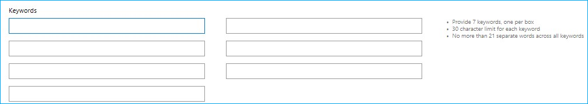

# <a name="tips-and-tricks"></a><span data-ttu-id="68df2-104">Советы и рекомендации</span><span class="sxs-lookup"><span data-stu-id="68df2-104">Tips and tricks</span></span>  

[!INCLUDE [deprecation-note](includes/deprecation-note.md)]  

<span data-ttu-id="68df2-105">Независимо от того, работаете ли вы в настоящее время над расширением Microsoft Edge или уже опубликовали его, вам могут пригодиться следующие советы и рекомендации.</span><span class="sxs-lookup"><span data-stu-id="68df2-105">Whether you're currently working on a Microsoft Edge extension or have already published one, the following tips and tricks might come in handy.</span></span>  

## <a name="get-a-direct-link-to-your-extension-in-the-microsoft-store"></a><span data-ttu-id="68df2-106">Получите прямую ссылку на расширение в Microsoft Store</span><span class="sxs-lookup"><span data-stu-id="68df2-106">Get a direct link to your extension in the Microsoft Store</span></span>  

<span data-ttu-id="68df2-107">На панели мониторинга Центра разработчиков Windows можно найти прямую ссылку на расширение в Microsoft Store.</span><span class="sxs-lookup"><span data-stu-id="68df2-107">In the Windows Dev Center dashboard, you can find a direct link to your extension in the Microsoft Store.</span></span>  <span data-ttu-id="68df2-108">Эта ссылка может быть полезна для рекламы и общего доступа к расширению.</span><span class="sxs-lookup"><span data-stu-id="68df2-108">This link can be useful for advertising and sharing out your extension.</span></span>  

<span data-ttu-id="68df2-109">После входа в Центр разработчиков Windows и навигации по расширению через панель мониторинга на странице удостоверения приложения вы найдете ссылку в строке ссылки протокола **Магазина:**</span><span class="sxs-lookup"><span data-stu-id="68df2-109">After logging in to the Windows Dev Center and navigating to your extension through the dashboard, on the App identity page you’ll find the link in the **Store protocol link** row:</span></span>  

  
 
## <a name="make-sure-youre-following-the-microsoft-store-policy"></a><span data-ttu-id="68df2-111">Убедитесь, что вы следуете политике Microsoft Store</span><span class="sxs-lookup"><span data-stu-id="68df2-111">Make sure you’re following the Microsoft Store Policy</span></span>  

<span data-ttu-id="68df2-112">При создании расширения убедитесь, что вы помните о рекомендациях по отправке в Microsoft Store, которые выделены в [политике Microsoft Store.](/windows/uwp/publish/store-policies)</span><span class="sxs-lookup"><span data-stu-id="68df2-112">When creating your extension, make sure you keep in mind the guidelines for submitting to the Microsoft Store highlighted in the [Microsoft Store Policy](/windows/uwp/publish/store-policies).</span></span>  
 
<span data-ttu-id="68df2-113">Расширения Microsoft Edge также имеют дополнительный набор политик, которые следует соблюдать [здесь.](/windows/uwp/publish/store-policies#pol_10_12)</span><span class="sxs-lookup"><span data-stu-id="68df2-113">Microsoft Edge extensions also have an additional set of policies to follow seen [here](/windows/uwp/publish/store-policies#pol_10_12).</span></span>  

## <a name="improve-your-extensions-discoverability-in-the-microsoft-store"></a><span data-ttu-id="68df2-114">Улучшение обнаружения расширения в Microsoft Store</span><span class="sxs-lookup"><span data-stu-id="68df2-114">Improve your extension’s discoverability in the Microsoft Store</span></span>  

<span data-ttu-id="68df2-115">Вы можете добавить ключевые слова в отправку расширения, чтобы повысить ее доступность с помощью поиска.</span><span class="sxs-lookup"><span data-stu-id="68df2-115">You can add keywords to your extension submission to improve its discoverability through searches.</span></span>  <span data-ttu-id="68df2-116">Например, `Microsoft Edge Extensions` и `name of my extension` .</span><span class="sxs-lookup"><span data-stu-id="68df2-116">For example, `Microsoft Edge Extensions` and `name of my extension`.</span></span>  

<span data-ttu-id="68df2-117">Это можно сделать в Центре разработчиков Windows в разделе описание расширения.</span><span class="sxs-lookup"><span data-stu-id="68df2-117">This can be done in the Windows Dev Center under the description section of your extension.</span></span>  <span data-ttu-id="68df2-118">Эти ключевые слова необходимо добавить для каждого языка, поддерживаемого вашим расширением.</span><span class="sxs-lookup"><span data-stu-id="68df2-118">These keywords will need to be added for every language your extension supports.</span></span>  

  

## <a name="automate-your-submission-to-the-microsoft-store"></a><span data-ttu-id="68df2-120">Автоматизация отправки в Microsoft Store</span><span class="sxs-lookup"><span data-stu-id="68df2-120">Automate your submission to the Microsoft Store</span></span>  

<span data-ttu-id="68df2-121">Вы можете автоматизировать и упорядочить отправку в Microsoft Store с помощью нового API отправки Microsoft Store, который позволяет обновлять приложения/игры, надстройки \(покупки в приложении\) и пакетные рейсы через API REST.</span><span class="sxs-lookup"><span data-stu-id="68df2-121">You can automate and streamline your submissions to the Microsoft Store by using the new Microsoft Store Submission API, which allows you to update apps/games, add-ons \(in-app purchases\), and package flights through a REST API.</span></span>  <span data-ttu-id="68df2-122">Ознакомьтесь с [документацией и примерами](/windows/uwp/monetize/create-and-manage-submissions-using-windows-store-services) или используйте расширение [VSTS API отправки](https://github.com/Microsoft/windows-dev-center-vsts-extension) с открытым исходным кодом для начала работы.</span><span class="sxs-lookup"><span data-stu-id="68df2-122">Check out the [documentation and samples](/windows/uwp/monetize/create-and-manage-submissions-using-windows-store-services) or use the open source [Submission API VSTS extension](https://github.com/Microsoft/windows-dev-center-vsts-extension) to get started.</span></span>  

## <a name="use-the-windows-feedback-hub-to-gather-feedbackreviewsfeature-requests"></a><span data-ttu-id="68df2-123">Используйте центр отзывов Windows для сбора отзывов/отзывов и запросов на функции</span><span class="sxs-lookup"><span data-stu-id="68df2-123">Use the Windows Feedback Hub to gather feedback/reviews/feature requests</span></span>  

<span data-ttu-id="68df2-124">Вы можете направлять пользователей в подкатегорию Центра отзывов Windows для расширения, встраив ссылку, которая указывает на нее.</span><span class="sxs-lookup"><span data-stu-id="68df2-124">You can direct users to the Windows Feedback Hub subcategory for your extension by embedding a link that points to it.</span></span>  <span data-ttu-id="68df2-125">Эту ссылку необходимо создать в следующем формате:</span><span class="sxs-lookup"><span data-stu-id="68df2-125">This link will need to be created using the following format:</span></span>  

```text
feedback-hub://?tabid=2&appid=<PFN>!App
```  

<span data-ttu-id="68df2-126">Вам потребуется заменить семейную фамилию `<PFN>` пакета расширения.</span><span class="sxs-lookup"><span data-stu-id="68df2-126">You will need to substitute `<PFN>` with the Package Family Name of you extension.</span></span>  <span data-ttu-id="68df2-127">Это можно найти в разделе **Удостоверение приложения** для расширения в Центре разработчиков Windows.</span><span class="sxs-lookup"><span data-stu-id="68df2-127">This can be found under the **App identity** section for your extension in the Windows Dev Center.</span></span>  

## <a name="check-out-your-ratings-and-reviews"></a><span data-ttu-id="68df2-128">Ознакомьтесь со своими оценками и отзывами</span><span class="sxs-lookup"><span data-stu-id="68df2-128">Check out your ratings and reviews</span></span>  

<span data-ttu-id="68df2-129">Регулярно войдите в систему, чтобы проверить отзывы пользователей и оценки.</span><span class="sxs-lookup"><span data-stu-id="68df2-129">Log in regularly to check your user reviews and ratings.</span></span>  <span data-ttu-id="68df2-130">Хотя приложение UWP будет иметь информацию только на текущем рынке пользователей, вход в Центр разработчиков Windows будет отображать среднюю оценку на всех рынках.</span><span class="sxs-lookup"><span data-stu-id="68df2-130">While the UWP app will only have info on the current user market, logging into the Windows Dev Center will display average rating across all markets.</span></span>  

## <a name="respond-to-user-reviews"></a><span data-ttu-id="68df2-131">Ответы на отзывы пользователей</span><span class="sxs-lookup"><span data-stu-id="68df2-131">Respond to user reviews</span></span>  

<span data-ttu-id="68df2-132">Вы можете отвечать на отзывы пользователей в Microsoft Store с помощью панели мониторинга Центра разработчиков Windows.</span><span class="sxs-lookup"><span data-stu-id="68df2-132">You can respond to user reviews in the Microsoft Store through the Windows Dev Center's dashboard.</span></span>  <span data-ttu-id="68df2-133">Перейдите к расширению и в Analytics выберите **Отзывы**.</span><span class="sxs-lookup"><span data-stu-id="68df2-133">Navigate to your extension and under Analytics select **Reviews**.</span></span>  <span data-ttu-id="68df2-134">Под каждым обзором появится ссылка, которая позволит вам реагировать непосредственно на клиента.</span><span class="sxs-lookup"><span data-stu-id="68df2-134">A link will appear underneath each review that will allow you to respond directly to the customer.</span></span>  <span data-ttu-id="68df2-135">Этот канал связи позволяет предлагать отзывы, разрешения или отправлять благодарность за отзыв!</span><span class="sxs-lookup"><span data-stu-id="68df2-135">This channel of communication enables you to offer feedback, resolutions, or send a thank you for the review!</span></span>  

  
