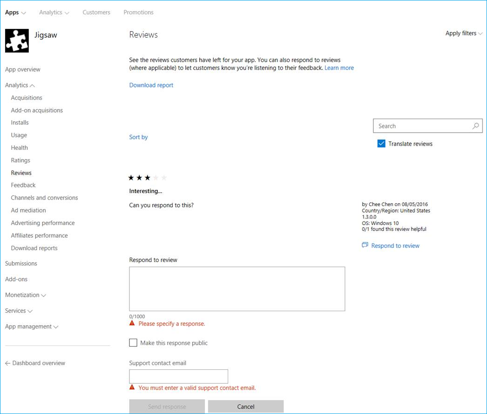

# <a name="tips-and-tricks"></a>Советы и рекомендации  

[!INCLUDE [deprecation-note](includes/deprecation-note.md)]  

Независимо от того, работаете ли вы в настоящее время над расширением Microsoft Edge или уже опубликовали его, вам могут пригодиться следующие советы и рекомендации.  

## <a name="get-a-direct-link-to-your-extension-in-the-microsoft-store"></a>Получите прямую ссылку на расширение в Microsoft Store  

На панели мониторинга Центра разработчиков Windows можно найти прямую ссылку на расширение в Microsoft Store.  Эта ссылка может быть полезна для рекламы и общего доступа к расширению.  

После входа в Центр разработчиков Windows и навигации по расширению через панель мониторинга на странице удостоверения приложения вы найдете ссылку в строке ссылки протокола **Магазина:**  

  
 
## <a name="make-sure-youre-following-the-microsoft-store-policy"></a>Убедитесь, что вы следуете политике Microsoft Store  

При создании расширения убедитесь, что вы помните о рекомендациях по отправке в Microsoft Store, которые выделены в [политике Microsoft Store.](/windows/uwp/publish/store-policies)  
 
Расширения Microsoft Edge также имеют дополнительный набор политик, которые следует соблюдать [здесь.](/windows/uwp/publish/store-policies#pol_10_12)  

## <a name="improve-your-extensions-discoverability-in-the-microsoft-store"></a>Улучшение обнаружения расширения в Microsoft Store  

Вы можете добавить ключевые слова в отправку расширения, чтобы повысить ее доступность с помощью поиска.  Например, `Microsoft Edge Extensions` и `name of my extension` .  

Это можно сделать в Центре разработчиков Windows в разделе описание расширения.  Эти ключевые слова необходимо добавить для каждого языка, поддерживаемого вашим расширением.  

  

## <a name="automate-your-submission-to-the-microsoft-store"></a>Автоматизация отправки в Microsoft Store  

Вы можете автоматизировать и упорядочить отправку в Microsoft Store с помощью нового API отправки Microsoft Store, который позволяет обновлять приложения/игры, надстройки \(покупки в приложении\) и пакетные рейсы через API REST.  Ознакомьтесь с [документацией и примерами](/windows/uwp/monetize/create-and-manage-submissions-using-windows-store-services) или используйте расширение [VSTS API отправки](https://github.com/Microsoft/windows-dev-center-vsts-extension) с открытым исходным кодом для начала работы.  

## <a name="use-the-windows-feedback-hub-to-gather-feedbackreviewsfeature-requests"></a>Используйте центр отзывов Windows для сбора отзывов/отзывов и запросов на функции  

Вы можете направлять пользователей в подкатегорию Центра отзывов Windows для расширения, встраив ссылку, которая указывает на нее.  Эту ссылку необходимо создать в следующем формате:  

```text
feedback-hub://?tabid=2&appid=<PFN>!App
```  

Вам потребуется заменить семейную фамилию `<PFN>` пакета расширения.  Это можно найти в разделе **Удостоверение приложения** для расширения в Центре разработчиков Windows.  

## <a name="check-out-your-ratings-and-reviews"></a>Ознакомьтесь со своими оценками и отзывами  

Регулярно войдите в систему, чтобы проверить отзывы пользователей и оценки.  Хотя приложение UWP будет иметь информацию только на текущем рынке пользователей, вход в Центр разработчиков Windows будет отображать среднюю оценку на всех рынках.  

## <a name="respond-to-user-reviews"></a>Ответы на отзывы пользователей  

Вы можете отвечать на отзывы пользователей в Microsoft Store с помощью панели мониторинга Центра разработчиков Windows.  Перейдите к расширению и в Analytics выберите **Отзывы**.  Под каждым обзором появится ссылка, которая позволит вам реагировать непосредственно на клиента.  Этот канал связи позволяет предлагать отзывы, разрешения или отправлять благодарность за отзыв!  

  
