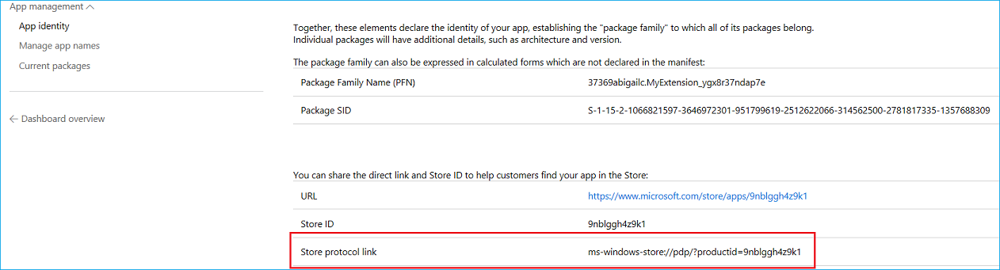

# Советы и рекомендации  

[!INCLUDE [deprecation-note](includes/deprecation-note.md)]  

Независимо от того, работаете ли вы в настоящее время над расширением Microsoft Edge или уже опубликовали его, вам могут пригодиться следующие советы и рекомендации.

## Получите прямую ссылку на расширение в Microsoft Store

На информационной панели Центра разработчиков для Windows можно найти прямую ссылку на расширение в Microsoft Store. Эта ссылка может быть полезна для рекламы и общего доступа к расширению.

После входа в Центр разработчиков Для Windows и переходов к расширению через информационную панель на странице удостоверения приложения вы найдете ссылку в строке ссылки протокола **Магазина:**


 
## Убедитесь, что вы следуете политике Microsoft Store

При создании расширения обязательно помните о рекомендациях по отправке в Microsoft Store, которые выделены в политике [Microsoft Store.](https://msdn.microsoft.com/library/windows/apps/dn764944.aspx) 
 
Расширения Microsoft Edge также имеют дополнительный набор политик, которые следует соблюдать [здесь.](https://msdn.microsoft.com/library/windows/apps/dn764944.aspx#pol_10_12)

## Улучшение возможности обнаружения расширения в Microsoft Store

Вы можете добавить ключевые слова в отправку расширения, чтобы улучшить его обнаружение с помощью поиска. Например, "Расширения Microsoft Edge" и "имя расширения". 

Это можно сделать в Центре разработчиков Windows в разделе описания расширения. Эти ключевые слова необходимо добавить для каждого языка, поддерживаемого расширением.


## Автоматизация отправки в Microsoft Store

Вы можете автоматизировать и оптимизировать отправки в Microsoft Store с помощью нового API отправки в Microsoft Store, который позволяет обновлять приложения и игры, надстройки (покупки из приложения) и пакеты с помощью REST API. Ознакомьтесь с [документацией и примерами или](https://docs.microsoft.com/windows/uwp/monetize/create-and-manage-submissions-using-windows-store-services) воспользуйтесь расширением [VSTS для отправки](https://github.com/Microsoft/windows-dev-center-vsts-extension) с открытым исходным кодом, чтобы начать работу.

## Сбор отзывов, отзывов и запросов функций с помощью Центра отзывов Windows

Вы можете направлять пользователей в подкатегорию Центра отзывов Windows для расширения, встраив ссылку на нее. Эту ссылку необходимо создать в следующем формате: 

```text
feedback-hub://?tabid=2&appid=<PFN>!App
```  

Вам потребуется заменить `<PFN>` имя семейства пакетов расширения. Это можно найти в разделе **удостоверения приложения** для расширения в Центре разработчиков для Windows.

## Ознакомьтесь со своими оценками и отзывами

Регулярно войдите в систему, чтобы проверить отзывы и оценки пользователей. Хотя приложение UWP будет иметь сведения только о текущем пользовательском рынке, при входе в Центр разработчиков Для Windows будет отображаться средняя оценка на всех рынках.

## Ответ на отзывы пользователей

Вы можете отвечать на отзывы пользователей в Microsoft Store с помощью информационной панели Центра разработчиков для Windows. Перейдите к расширению и в области "Аналитика" выберите **"Отзывы".** Под каждым отзывом будет отображаться ссылка, которая позволит вам реагировать непосредственно на клиента. Этот канал общения позволяет вам отправлять отзывы, решения и благодарить вас за отзыв!


